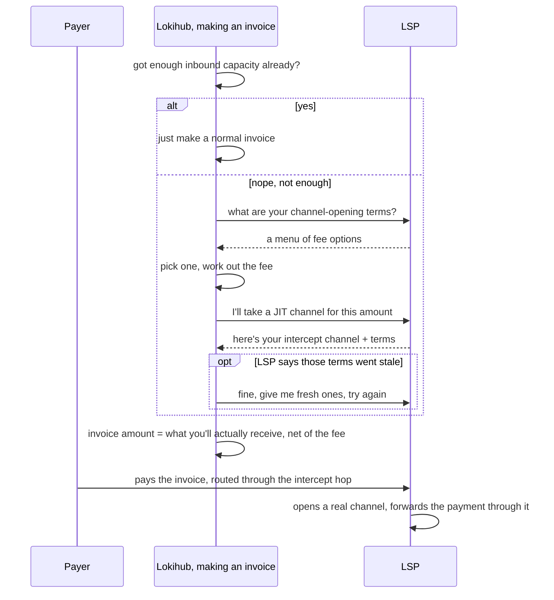

# JIT Payment: opening a channel exactly when you need it, and not a moment before

Here's a Lightning problem nobody loves: you can't get paid without inbound capacity, and inbound capacity
is exactly the thing a brand-new wallet doesn't have. [LSPS2](https://github.com/BitcoinAndLightningLayerSpecs/lsp/blob/main/LSPS2/README.md)
— the LSP spec commonly called "JIT Channels" — is the industry's answer to that, and "JIT Payment" is
just what we call Lokihub's implementation of it. Credit where it's due: the concept, the
intercept-channel trick, the whole mechanism belongs to LSPS2 (also known as bLIP-52) and the LSPs that
speak it — Lokihub didn't invent any of this, it just consumes the spec like any other client would. What
it does: when a payment shows up and there's nowhere for it to land, the LSP opens a channel for it *right
then*, skims a small fee for the trouble, and forwards the rest straight through. The payer never notices
anything unusual happened.

## Why not just pre-open a channel

Because pre-opening means guessing a size before you know what anyone's actually going to send you, and
paying on-chain fees for a channel that might sit mostly empty for months. LSPS2 skips the guessing game:
the LSP hands out a fake "intercept" channel ID as a routing hint, the payer's node routes to it like any
normal hop, and only once that payment actually lands does the LSP open a real channel and push it through.
Nobody has to decide a channel size ahead of time — the first payment decides it.

## The automatic version — this is the one that matters day to day

It's baked straight into ordinary invoice creation. No extra step, no button to press:

The LSP it uses is whatever's marked active over in [Lokihub Services](lokihub-services.md) — specifically
the first one on that list, not a ranked choice. And when that LSP hands back a menu of fee options,
Lokihub just takes the first one offered rather than shopping for the cheapest. That's a fair thing to
want and it isn't built yet — call it an open invitation rather than a finished decision.

## You can also just ask for one directly

Outside of any specific invoice, a wallet owner can trigger a JIT channel buy on demand — handy for topping
up liquidity ahead of time, or picking a specific LSP and fee tier by hand rather than letting the
automatic path choose. The one real difference: ask manually with your own chosen terms, and if the LSP
rejects them as stale, Lokihub doesn't quietly go fetch fresh ones behind your back and retry — you asked
for something specific, so a rejection comes back as a rejection, not a surprise substitution.

## The fee sleight of hand

Here's the part that's easy to get backwards: what the invoice *says* is the net amount — what actually
lands in the new channel after the LSP takes its cut. The fee itself rides along as part of the routing
hint, declared as a normal forwarding fee on that hop. A payer's node just does what it always does — adds
the hop's fee on top of the invoice amount to work out what to actually send. Net amount plus that fee adds
back up to the original figure. From the payer's side, it looks exactly like routing through any ordinary
node that happens to charge for the privilege.

One rough edge worth saying out loud: if the fee ever works out larger than the payment itself, the current
behavior is to just... zero out the invoice amount and log a warning, rather than refusing the request
outright. A tiny payment against a channel whose minimum fee eats the whole thing is a real situation, not
a hypothetical one, and quietly making a zero-amount invoice isn't obviously the right call. Consider that
one an open question rather than a settled answer.

## Related reading

- **[LSP Support](lokihub-lsp.md)** — the bigger picture this is one piece of, alongside LSPS0, LSPS1, and
  the notification side of things.
- **[Lokihub Services](lokihub-services.md)** — where the LSP used here actually gets picked.
- **[Notifications](lokihub-notifications.md)** — a "payment coming in" nudge over this channel
  is what tells the wallet to reconnect to the LSP so a JIT open in progress can actually finish, if it
  wasn't already connected.
- **[NIP-CASH (Cash Hub)](nips/NIP-CASH.md)** — a completely different feature (pre-funded, transferable
  lokicash payouts); no longer even shares the "JIT" name with this document since its rename.
