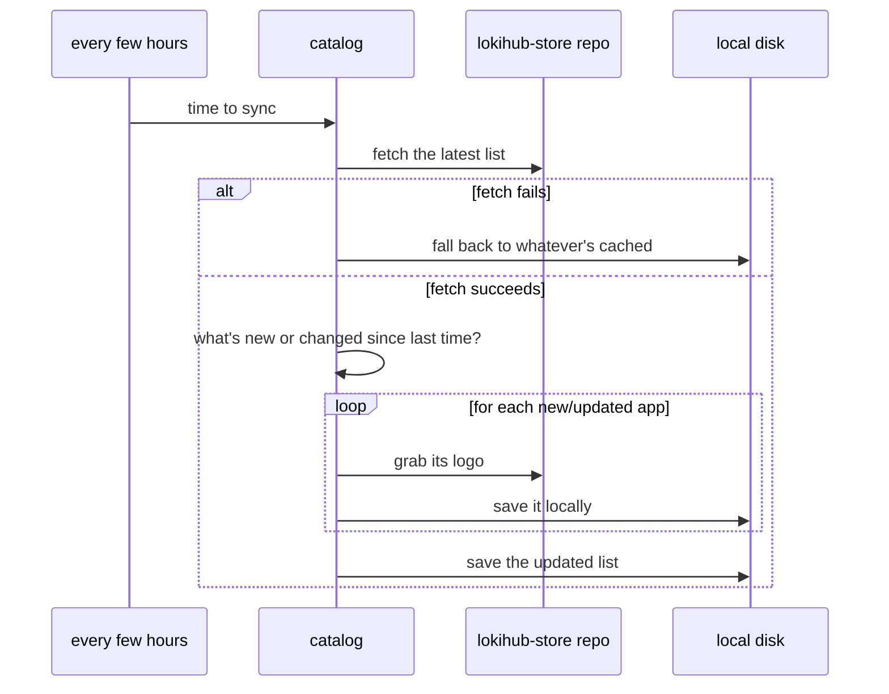

# The App Store: a directory, not an app store

Confusing name, we know. Lokihub's "App Store" isn't a place that installs things — it's a curated list of
third-party apps that know how to talk to a wallet over NWC (Nostr Wallet Connect), with a link out to
wherever you'd actually go get them. Think of it as a phone book for the NWC ecosystem, not a Play Store
clone. Lokihub never runs, downloads, or even peeks inside a single line of the code it's pointing you at.

## The problem it's solving

Picture a brand-new Lokihub user. Wallet's set up, everything works, and... now what? What do they connect
it to? That's the gap. Hard-coding a list of "apps that work with Lokihub" into the frontend technically
solves it, right up until someone builds a great new NWC client and you realize adding it means shipping an
entire new release of Lokihub just to update a list. Nobody wants that.

So instead, the catalog lives in its own place: a small `apps.json` file (plus a folder of logos) kept in
Lokihub's own `lokihub-store` repo, served straight off GitHub's raw-content URLs rather than bundled into
the binary. Same team, same org, just a separate repo that isn't tied to a release cycle — updating it is a
commit, not a version bump. Every install fetches it, caches it locally, and quietly refreshes every few
hours. New app added to the repo? Every Lokihub install picks it up within a few hours, no app update
required. Network's down? No problem, it just falls back to whatever it cached last time and keeps working
exactly as it was. If you're self-hosting and want to point at your own mirror instead of the default repo,
that URL is configurable too.

This isn't a crowdsourced or community-submitted list, worth being clear about that — there's no "suggest
an app" button anywhere in Lokihub itself. It's Lokihub's own curated directory, just published somewhere
that's cheap to update.

## How the syncing actually works

The very first thing Lokihub does on startup is run this sync once, immediately, then it just settles into
its regular rhythm — every six hours or so. A failed fetch never wipes out what's already loaded; it just
means "try again next time." The only moment the on-disk cache actually gets read back in is a genuinely
cold start, no network, nothing in memory yet. Everything each app screen shows the user comes from that
in-memory copy — a snapshot, really, so nothing browsing the list can accidentally mess with the shared
state underneath it.

Each entry only bothers re-downloading its logo when something's actually different — a version bump on an
app that's already known skips the download, no point fetching a picture you already have.

## Browsing it

The frontend groups entries by category, because that's just how you'd expect to browse something like
this. Tap into an app and you get an install guide first — go get the thing from the web, Play Store, App
Store, wherever it lives — and once you've actually installed it, a "finalize" step walks you through
pasting a fresh wallet connection into it. That connection is almost always just an ordinary wallet
connection, the same kind you'd create for any other client.

## The trust tradeoff, plainly stated

The fetch has to happen over HTTPS, full stop. But there's no cryptographic signature on individual
entries, which means the honest answer to "what if that repo, or whoever's serving it, gets compromised" is:
someone could slip in a bad link. Worth being upfront about that instead of pretending it's airtight — the
same applies doubly if you've pointed your own instance at a self-hosted mirror instead of the default. The
saving grace is that this whole feature is presentation only — nothing here touches a wallet's funds or its
NWC permissions. Worst case, a compromised source points someone at a shady download link, which is bad,
but it's not a way to drain anyone's balance.

## Related reading

- **[Lokihub Services](lokihub-services.md)** — the flip side of this: services the wallet itself connects
  *out* to (relays, LSPs, block explorers), rather than apps connecting *in*. Same "small manifest, cached
  locally" trick, completely different catalog.
