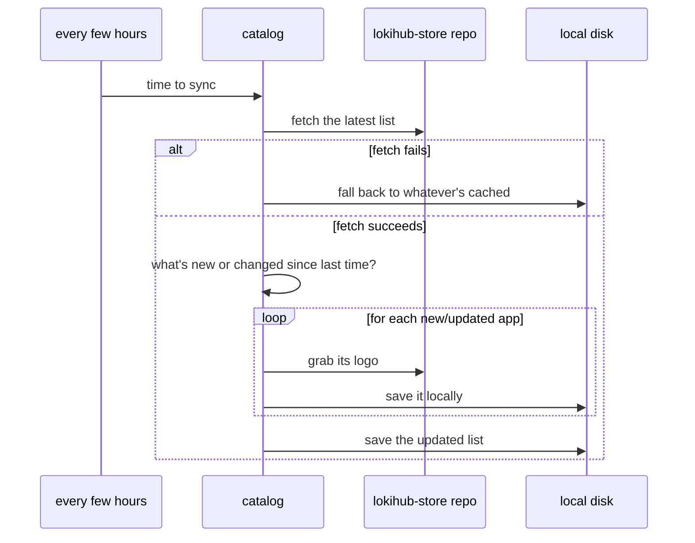

# The App Store: a directory, not an app store

Lokihub's "App Store" isn't a place that installs things — it's a curated list of third-party apps that
know how to talk to a wallet over NWC (Nostr Wallet Connect), with a link out to wherever you'd actually
go get them. Think phone book for the NWC ecosystem, not a Play Store clone. Lokihub never runs,
downloads, or peeks inside a single line of the code it's pointing you at.

## The problem it's solving

A brand-new Lokihub user has a working wallet and nothing to connect it to. Hard-coding a list of "apps
that work with Lokihub" into the frontend solves that, until someone builds a new NWC client and adding
it means shipping a whole new Lokihub release just to update a list.

So the catalog lives in its own place: a small `apps.json` file (plus a folder of logos) kept in
Lokihub's own `lokihub-store` repo, served straight off GitHub's raw-content URLs rather than bundled into
the binary. Updating it is a commit, not a version bump. Every install fetches it, caches it locally, and
refreshes every few hours. A new app added to the repo reaches every Lokihub install within a few hours,
no app update required. If the network is down, it falls back to whatever it cached last time. The source
repo URL is configurable, for self-hosters who want to point at their own mirror.

This isn't a crowdsourced or community-submitted list — there's no "suggest an app" button anywhere in
Lokihub. It's Lokihub's own curated directory, published somewhere that's cheap to update.

## How the syncing works

Lokihub runs this sync once on startup, then every six hours or so. A failed fetch never wipes out what's
already loaded — it just tries again next time. The on-disk cache is only read back in on a cold start
with no network and nothing in memory yet. Everything the app screens show comes from that in-memory
copy, so nothing browsing the list can mutate the shared state underneath it.

Each entry only re-downloads its logo when something's actually changed — a version bump on an app
that's already known skips the download.

## Browsing it

The frontend groups entries by category. Tap into an app and you get an install guide first — go get the
thing from the web, Play Store, App Store, wherever it lives — then a "finalize" step walks you through
pasting a fresh wallet connection into it. That connection is an ordinary wallet connection, the same kind
you'd create for any other client.

## Trust tradeoff

The fetch happens over HTTPS, but there's no cryptographic signature on individual entries: if the repo,
or whoever's serving it, gets compromised, someone could slip in a bad link. That risk is doubled for a
self-hosted mirror. The mitigating factor is that this feature is presentation only — nothing here
touches a wallet's funds or its NWC permissions. Worst case, a compromised source points someone at a bad
download link; it's not a way to drain anyone's balance.

## Related reading

- **[Lokihub Services](lokihub-services.md)** — the flip side of this: services the wallet itself connects
  *out* to (relays, LSPs, block explorers), rather than apps connecting *in*. Same "small manifest, cached
  locally" mechanism, different catalog.
