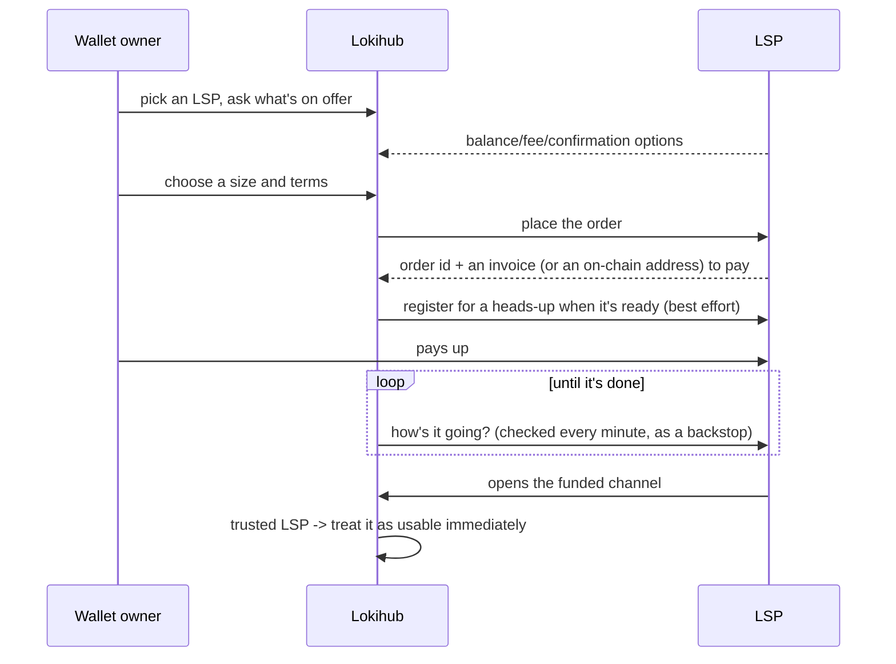

# Four specs, one goal: liquidity without the headache

Lokihub talks to Lightning Service Providers using four different specs —
[LSPS0](https://github.com/BitcoinAndLightningLayerSpecs/lsp/blob/main/LSPS0/README.md),
[LSPS1](https://github.com/BitcoinAndLightningLayerSpecs/lsp/blob/main/LSPS1/README.md),
[LSPS2](https://github.com/BitcoinAndLightningLayerSpecs/lsp/blob/main/LSPS2/README.md), and
[LSPS5](https://github.com/BitcoinAndLightningLayerSpecs/lsp/blob/main/LSPS5/README.md) — all pointed at
the same problem: get a self-hosted node enough usable liquidity without turning its owner into a
routing-node operator. This doc is the map across all four. Two of them (LSPS2 and LSPS5) already have
their own deep-dive write-ups; this is where they fit into the bigger picture.

Worth saying upfront, plainly: Lokihub only speaks the *client* side of all this. It buys liquidity and
notifications from LSPs — it doesn't operate as one itself. There's a bit of leftover code in the repo that
could answer basic LSP-side questions, but nothing ever actually turns it on. Not a hidden feature, just an
unused corner.

## Why four specs instead of one

Discovery, buy-it-now, buy-it-just-in-time, and get-notified are genuinely different problems, each with
its own failure modes — bundling them into one bespoke protocol would've meant reinventing what the spec
authors already figured out. Building on the existing specs instead means any LSP that already speaks them
works with Lokihub with zero custom integration. No waiting around for a specific vendor to build "the
Lokihub thing."

## [LSPS0](https://github.com/BitcoinAndLightningLayerSpecs/lsp/blob/main/LSPS0/README.md) — "what do you even support, and how do I reach you"

The quiet one underneath everything else. It's the shared wire format all the request/response traffic
here rides over — peer-to-peer, over the same Lightning connection, no HTTP involved. The one detail worth
knowing: asking an LSP for its basic info also hands back its Nostr pubkey, which gets cached and reused
later by the notification side of things.

Underneath all four specs sits one more quiet piece: something that just keeps Lokihub peered to whichever
LSPs are marked active, reconnecting every couple of minutes if a link drops. None of what follows works if
that connection isn't up.

## [LSPS1](https://github.com/BitcoinAndLightningLayerSpecs/lsp/blob/main/LSPS1/README.md) — buying a channel on purpose, ahead of time

The deliberate version: pick an LSP, look at what it's willing to sell, order a channel of a specific size,
pay for it, wait for it to show up.

That order sticks around locally until it resolves, so a restart doesn't lose track of it. Right after
placing it, Lokihub also tries registering for a push notification about it — if that registration doesn't
land, the once-a-minute check is still there underneath as the safety net, so nothing actually depends on
it working.

## [LSPS2](https://github.com/BitcoinAndLightningLayerSpecs/lsp/blob/main/LSPS2/README.md) — buying a channel exactly when it's needed

The opposite instinct: don't decide anything ahead of time, let the very first payment force the question,
then let the LSP open whatever channel turns out to actually be needed. This one's wired straight into
ordinary invoice creation — no separate "go buy liquidity" step for the common case. Full story, including
the fee trick that makes it invisible to the payer, lives over in [JIT Payment](jit-payment.md).

## [LSPS5](https://github.com/BitcoinAndLightningLayerSpecs/lsp/blob/main/LSPS5/README.md) — getting a nudge instead of asking over and over

Both the upfront-order flow above and the just-in-time flow benefit from the LSP being able to reach out
proactively — "your order changed," "a payment's about to arrive" — rather than Lokihub polling forever.
That's LSPS5's job, and Lokihub actually implements it two ways: the spec's own HTTP webhook, and a
Nostr-native path it prefers by default. Full story over in
[Notifications](lokihub-notifications.md).

## The trick that makes any of this feel instant

A brand-new Lightning channel is normally unusable until its funding transaction clears a confirmation or
two — fine for something planned weeks ahead, useless for a just-in-time channel that's supposed to
complete a payment *right now*. So Lokihub treats a channel-open request from a trusted, active LSP as
immediately usable, no waiting on confirmations, while anyone else gets the ordinary wait-and-see
treatment. That whitelist check — is this LSP one the wallet owner actually added — is really the same
trust question that shows up everywhere else in this document, just applied to channel-opening instead of
liquidity-buying.

## Related reading

- **[Lokihub Services](lokihub-services.md)** — the one place an LSP gets added and marked active; every
  flow described here reads from it.
- **[JIT Payment](jit-payment.md)** — the full LSPS2 story.
- **[Notifications](lokihub-notifications.md)** — the full LSPS5 story.
- **[NIP-CASH (Cash Hub)](nips/NIP-CASH.md)** — unrelated to any of this; formerly named "JIT Wallet,"
  which collided with the "JIT" in this document's own LSPS2 story before its rename.
