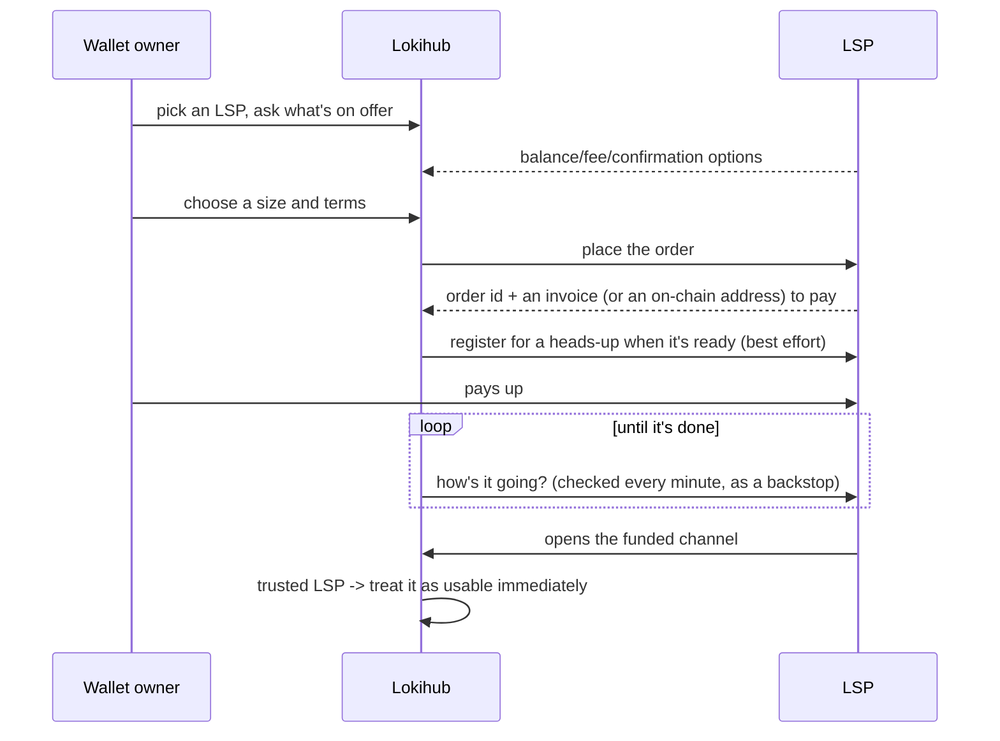

# Four specs, one goal: liquidity without the headache

Lokihub talks to Lightning Service Providers using four specs —
[LSPS0](https://github.com/BitcoinAndLightningLayerSpecs/lsp/blob/main/LSPS0/README.md),
[LSPS1](https://github.com/BitcoinAndLightningLayerSpecs/lsp/blob/main/LSPS1/README.md),
[LSPS2](https://github.com/BitcoinAndLightningLayerSpecs/lsp/blob/main/LSPS2/README.md), and
[LSPS5](https://github.com/BitcoinAndLightningLayerSpecs/lsp/blob/main/LSPS5/README.md) — all aimed at
the same problem: get a self-hosted node enough usable liquidity without turning its owner into a
routing-node operator. This doc maps how all four fit together; LSPS2 and LSPS5 each have their own
deep-dive write-ups.

Lokihub only speaks the *client* side of all this — it buys liquidity and notifications from LSPs, it
doesn't operate as one. There's unused code in the repo that could answer basic LSP-side questions, but
nothing turns it on.

## Why four specs instead of one

Discovery, buy-it-now, buy-it-just-in-time, and get-notified are different problems with different
failure modes — bundling them into one bespoke protocol would mean reinventing what the spec authors
already solved. Building on the existing specs means any LSP that already speaks them works with Lokihub
with zero custom integration.

## [LSPS0](https://github.com/BitcoinAndLightningLayerSpecs/lsp/blob/main/LSPS0/README.md) — capability discovery

The shared wire format all the request/response traffic here rides over — peer-to-peer, over the same
Lightning connection, no HTTP involved. Asking an LSP for its basic info also returns its Nostr pubkey,
which gets cached and reused later by the notification side of things.

Underneath all four specs sits one more piece: something that keeps Lokihub peered to whichever LSPs are
marked active, reconnecting every couple of minutes if a link drops. Nothing below works if that
connection isn't up.

## [LSPS1](https://github.com/BitcoinAndLightningLayerSpecs/lsp/blob/main/LSPS1/README.md) — buying a channel ahead of time

Pick an LSP, look at what it's willing to sell, order a channel of a specific size, pay for it, wait for
it to show up.

The order sticks around locally until it resolves, so a restart doesn't lose track of it. Right after
placing it, Lokihub also tries registering for a push notification about it — if that registration
doesn't land, the once-a-minute check is still there as a safety net.

## [LSPS2](https://github.com/BitcoinAndLightningLayerSpecs/lsp/blob/main/LSPS2/README.md) — buying a channel exactly when it's needed

Don't decide anything ahead of time — let the first payment force the question, then let the LSP open
whatever channel turns out to be needed. This is wired straight into ordinary invoice creation, no
separate "go buy liquidity" step for the common case. Full story, including the fee mechanics, in
[JIT Payment](jit-payment.md).

## [LSPS5](https://github.com/BitcoinAndLightningLayerSpecs/lsp/blob/main/LSPS5/README.md) — getting a nudge instead of asking over and over

Both flows above benefit from the LSP reaching out proactively — "your order changed," "a payment's about
to arrive" — rather than Lokihub polling forever. That's LSPS5's job. Lokihub implements it two ways: the
spec's own HTTP webhook, and a Nostr-native path it prefers by default. Full story in
[Notifications](lokihub-notifications.md).

## The trick that makes any of this feel instant

A brand-new Lightning channel is normally unusable until its funding transaction clears a confirmation or
two — fine for something planned weeks ahead, useless for a just-in-time channel that's supposed to
complete a payment right now. So Lokihub treats a channel-open request from a trusted, active LSP as
immediately usable, no waiting on confirmations, while anyone else gets the ordinary wait-and-see
treatment. That whitelist check — is this LSP one the wallet owner actually added — is the same trust
question that recurs throughout this document, just applied to channel-opening instead of
liquidity-buying.

## Related reading

- **[Lokihub Services](lokihub-services.md)** — the one place an LSP gets added and marked active; every
  flow described here reads from it.
- **[JIT Payment](jit-payment.md)** — the full LSPS2 story.
- **[Notifications](lokihub-notifications.md)** — the full LSPS5 story.
- **[NIP-CASH (Cash Hub)](nips/NIP-CASH.md)** — unrelated to any of this; formerly named "JIT Wallet,"
  which collided with the "JIT" in this document's LSPS2 story before its rename.
