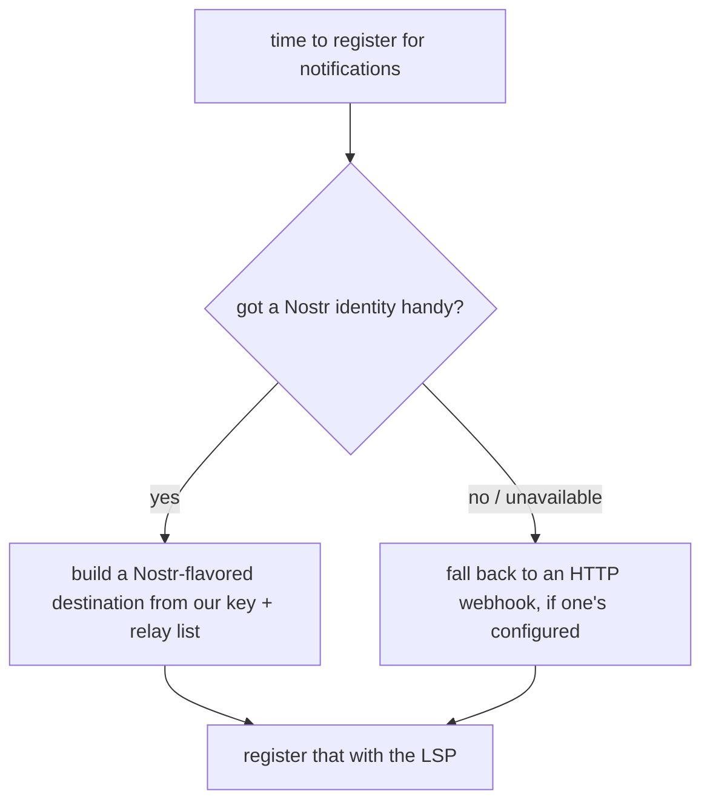
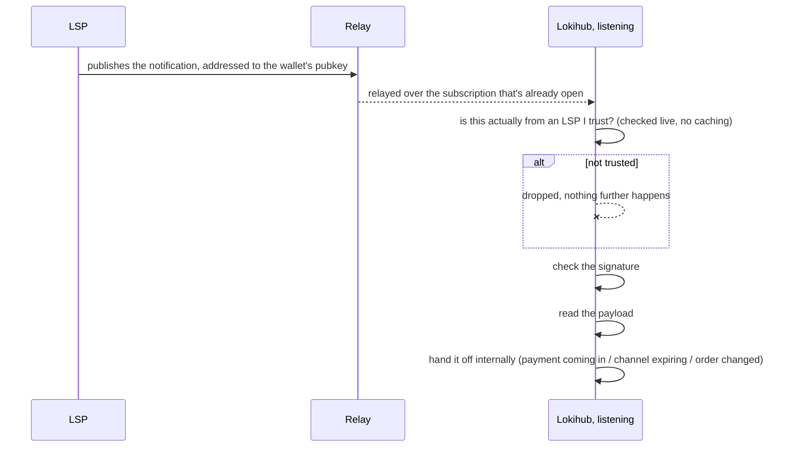

# Getting a nudge over Nostr instead of a webhook

[LSPS5](https://github.com/BitcoinAndLightningLayerSpecs/lsp/blob/main/LSPS5/README.md) is the spec for
how an LSP pokes a client sitting behind no public URL of its own — "a payment's coming in," "your
channel's about to expire," and so on. The spec's own answer is an HTTP webhook the client registers
ahead of time. Lokihub supports that, but by default prefers something else: the LSP publishes the same
notification as a signed Nostr event, addressed to the wallet's own pubkey, over relays the wallet is
already listening on.

## Why, when the webhook already works

A Lokihub instance already has a long-lived Nostr identity and is already sitting on relays listening
for wallet-connect traffic. Standing up a separate HTTP receiver on top of that — its own public URL, TLS,
uptime to babysit — is a lot of plumbing for something the wallet can already do over a connection it's
maintaining regardless. Piggybacking on that means notifications work the same way whether the wallet is
behind a home firewall, running on a phone, or sitting on a VPS with a real domain — no port-forwarding,
no reverse proxy.

## Picking a transport

Nostr is the default whenever there's a Nostr identity to use; HTTP is the fallback otherwise. Lokihub
never registers nothing when an order actually needs notifications.

## How delivery plays out

Untrusted events are dropped before anything else happens to them, so a flood of junk from unknown
pubkeys is cheap to reject rather than something that has to be fully parsed first.

The initial subscribe on startup fetches the last 24 hours of backlog; a reconnect after that doesn't
replay history — it picks up from "now." If a relay connection drops, the wallet backs off a few seconds
and resubscribes, rather than hammering a relay that's having a bad day.

## The trust question, either transport

A signature only proves someone controls a key — it doesn't prove that key belongs to an LSP the wallet
owner actually added. Both transports check the sender against the same registered-LSP list before
acting on anything, on top of verifying the signature.

**Known gap:** for a notification that changes an order's state, the HTTP webhook path additionally
checks that the sender's key matches the LSP that actually owns *that* order — a registered LSP can't
forge a state change for somebody else's order over that transport. The Nostr path doesn't carry the
same check yet: any trusted LSP's signed event is currently accepted regardless of which LSP the order
actually belongs to. Worth closing, since it's the kind of gap that's easy to miss precisely because the
webhook path already got it right.

A relay is never treated as proof of anything — it's a pipe. Every event's signature is checked
independently; nothing about a relay's own behavior is trusted as a stand-in for that.

## If an LSP doesn't speak Nostr

It falls back to the plain HTTP webhook, exactly as LSPS5 defines it. Lokihub probes for Nostr support and
falls back quietly if it's not there.

## Related reading

- **[JIT Payment](jit-payment.md)** — a `payment_incoming` nudge over either transport is what tells the
  wallet to reconnect to the LSP so an in-flight just-in-time channel can actually finish opening.
- **[LSP Support](lokihub-lsp.md)** — the bigger picture this document is one piece of, alongside LSPS0,
  LSPS1, and LSPS2.
