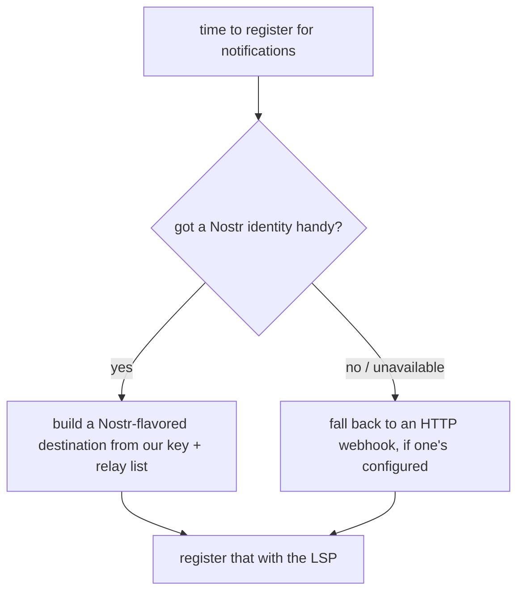
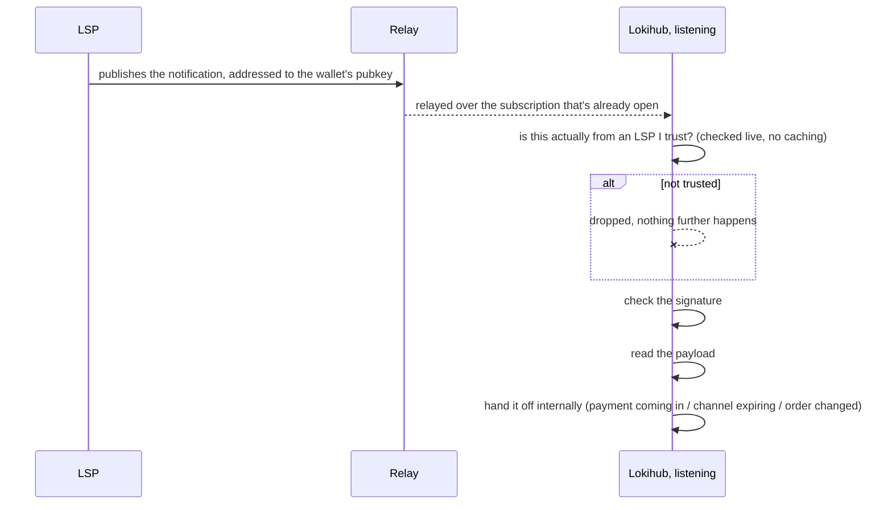

# Getting a nudge over Nostr instead of a webhook

[LSPS5](https://github.com/BitcoinAndLightningLayerSpecs/lsp/blob/main/LSPS5/README.md) is the spec for
how an LSP pokes a client that's sitting behind no public URL of its own — "hey, a
payment's coming in," "hey, your channel's about to expire," that sort of thing. The spec's own answer is
an HTTP webhook the client registers ahead of time. Lokihub does that too, but by default it prefers
something else entirely: the LSP just publishes the same notification as a signed Nostr event, addressed
to the wallet's own pubkey, over relays the wallet's already listening on anyway.

## Why bother, when the webhook already works

Because a Lokihub instance already has a long-lived Nostr identity, and it's already sitting on relays
listening for wallet-connect traffic. Standing up a whole separate HTTP receiver on top of that — its own
public URL, its own TLS, its own uptime to babysit — is a lot of plumbing for something the wallet can
already do for free over a connection it's maintaining regardless. Piggyback on that, and notifications
just work the same way whether the wallet's behind a home firewall, running on someone's phone, or sitting
on a VPS with a real domain name. No port-forwarding, no reverse proxy, nothing extra to keep alive.

## Picking a transport

Nostr's the default whenever there's a Nostr identity to use; HTTP is the fallback otherwise. What Lokihub
never does is quietly register *nothing* when an order actually needs notifications — that's a bug wearing
a fallback's clothes, not a real fallback.

## How delivery actually plays out

Drop untrusted events before doing anything else with them — that's the whole point of checking trust
first. It keeps a flood of junk from unknown pubkeys cheap to reject, rather than something the wallet has
to fully parse before deciding it doesn't care.

If a relay connection drops, the wallet just backs off a few seconds and resubscribes, rather than
hammering a relay that's clearly having a bad day — and it doesn't try to replay a full day's worth of
history on every reconnect, just picks up from "now."

## The trust question, either transport

A signature only ever proves someone controls a key. It doesn't prove that key belongs to an LSP the
wallet owner actually added — so both transports check the sender against the same registered-LSP list
before acting on anything, on top of verifying the signature itself. And for anything that changes an
order's state specifically, there's one more check: does the sender's key match the LSP that actually owns
*that* order? Otherwise one registered LSP could forge a state change for somebody else's order, which
would be a strange kind of chaos nobody needs.

A relay itself is never treated as proof of anything — it's just a pipe. Every event gets its signature
checked independently by the wallet; nothing about a relay's own behavior is trusted as a stand-in for
that.

## What happens if an LSP doesn't speak Nostr

Nothing dramatic — it just falls back to the plain HTTP webhook, exactly as LSPS5 already defines it.
Lokihub can probe for Nostr support and quietly fall back if it's not there. Nobody's notification path
breaks because the other side hasn't caught up yet.

## Related reading

- **[JIT Payment](jit-payment.md)** — a `payment_incoming` nudge over either transport is what tells the
  wallet to reconnect to the LSP so an in-flight just-in-time channel can actually finish opening.
- **[LSP Support](lokihub-lsp.md)** — the bigger picture this document is one piece of, alongside LSPS0,
  LSPS1, and LSPS2.
