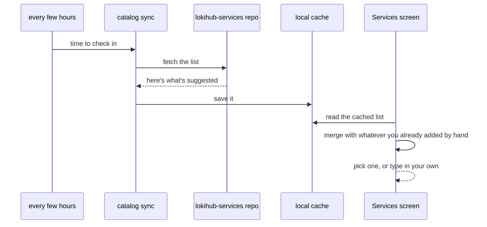

# Services: everywhere else Lokihub looks

A self-hosted Lightning wallet needs somewhere to get liquidity from, somewhere to check on-chain data,
somewhere to do swaps, relays to talk Nostr over. Services is the screen where the wallet owner points
all of that at whatever they trust — their own infrastructure, or one of Lokihub's suggested defaults.
Nothing here moves funds by itself; it's all "where do I look," never "what am I allowed to do."

## Why not just pick one provider

A single hard-coded LSP, or a single hard-coded relay, is a centralization point: what happens when that
provider shuts down or starts misbehaving? A wallet that can only talk to one specific server isn't
really self-hosted, it's hosted somewhere else. So every setting here is independently swappable, nothing
inherits from anything else, and a small built-in default list takes the edge off "which one do I pick"
for a new user.

## What's configurable

| Setting | What it's for |
|---|---|
| Main Nostr relay | where NIP-47 wallet-connect traffic actually flows |
| General relay list | everyday Nostr stuff |
| Search relay | profile and contact-list lookups (Circle Wallet's following checks) |
| LSP(s) | who you buy Lightning liquidity from |
| Block explorer | on-chain data, mempool-style API |
| Swap service | on-chain ⇄ Lightning swaps |
| Messageboard relay (optional) | an experimental nostr-messageboard integration |
| Identity Authorities | who's trusted to vouch for a Cash Hub connection-key claim — see [NIP-CASH](nips/NIP-CASH.md) |

## The built-in defaults list

A few of these — LSPs especially — can also be seeded from a small `services.json` file Lokihub keeps in
its own `lokihub-services` repo, the same pattern the [App Store](lokihub-appstore.md) uses for its
catalog: a separate repo, served over HTTPS, updatable without an app release. Despite the internal name,
it's not a crowdsourced or community-editable list — it's Lokihub's own short list of known-good
defaults, there so a new user doesn't have to hand-type a raw LSP connection string. The source is
configurable too, for pointing at your own mirror.

The merge is additive, always: a default suggestion never overrides something you configured yourself —
it only ever pre-fills a form.

## Where the trust actually lives

Most of the table above is low-stakes from a security standpoint. A relay, a block explorer, a swap URL —
none of them can move a sat on their own, since all they configure is where Lokihub *looks*, never what
it's *authorized to do*. Even LSP connections are just request/response protocols; an LSP has no
unilateral way to reach in and take funds.

The one row with real teeth is Identity Authorities. Trusting one means trusting it to vouch for who's
allowed to claim a slice out of a shared Cash Wallet — see [NIP-CASH](nips/NIP-CASH.md) for what that
hands a counterparty, and why revoking a bad Identity Authority has to take effect immediately, everywhere
it ever vouched for anyone.

## Related reading

- **[App Store](lokihub-appstore.md)** — same "small manifest, cached locally" mechanism, but for apps
  connecting *in* to the wallet rather than services it connects *out* to.
- **[NIP-CASH (Cash Hub)](nips/NIP-CASH.md)** — what the Identity Authority allowlist actually protects.
- **[JIT Payment](jit-payment.md)** — a different "JIT": the LSP row above is where that document's
  just-in-time channel buys get their LSP from.
- **[LSP Support](lokihub-lsp.md)** — the LSP `active` flag configured here is what every LSPS0/1/2/5 flow
  reads from.
