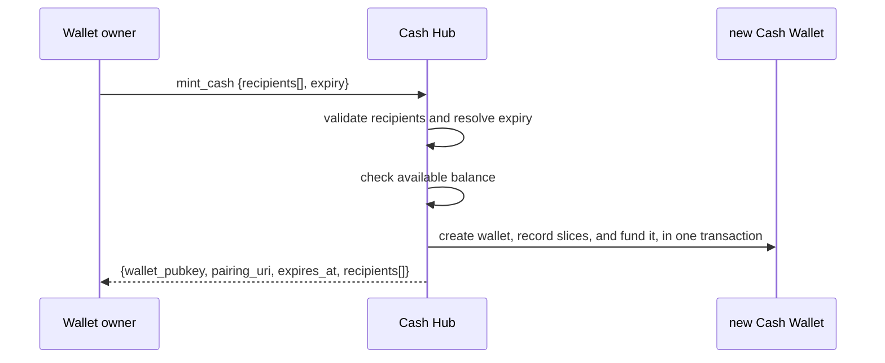
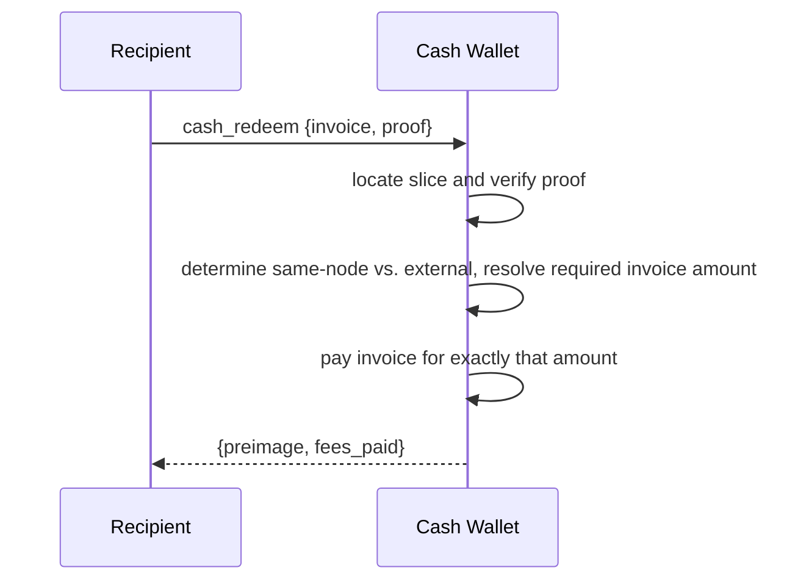
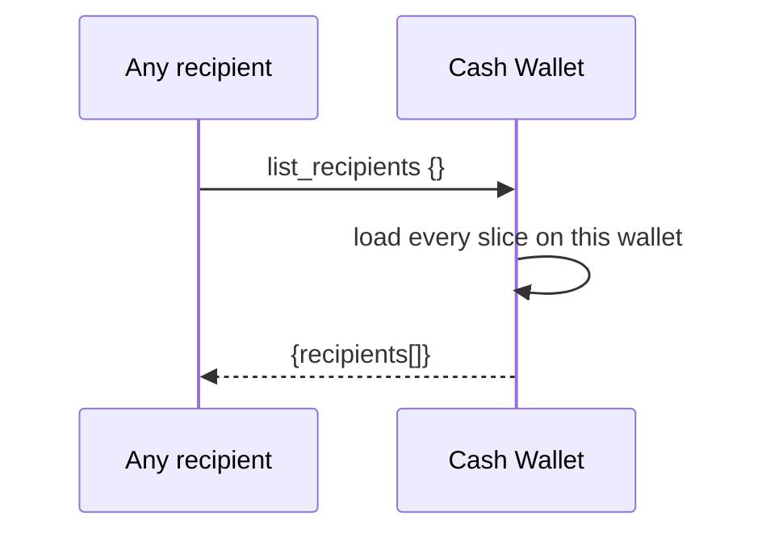
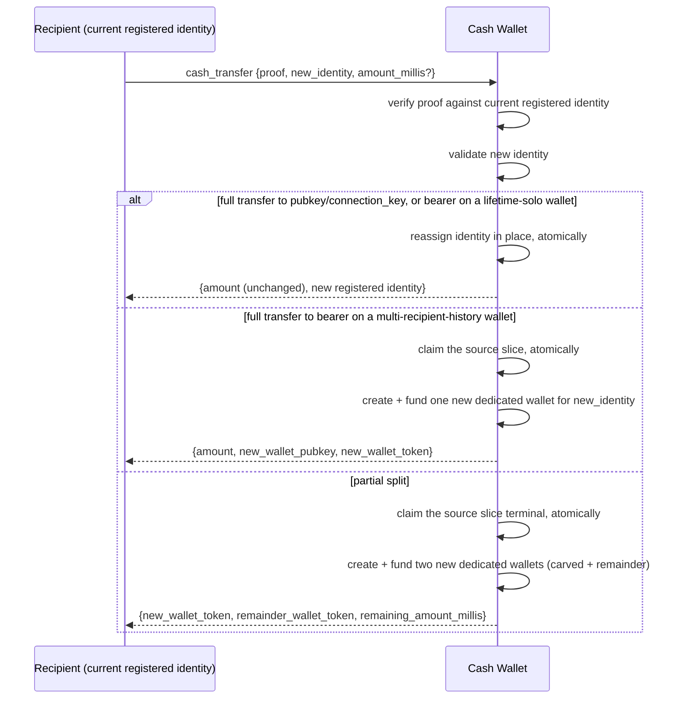
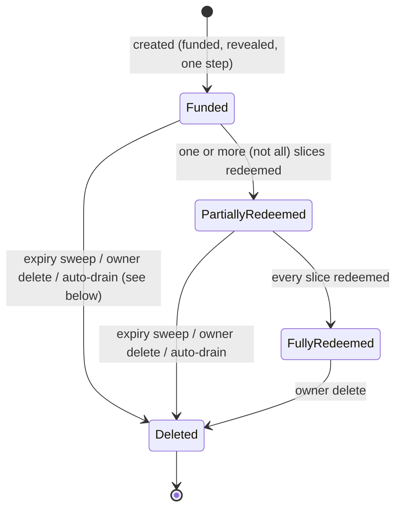
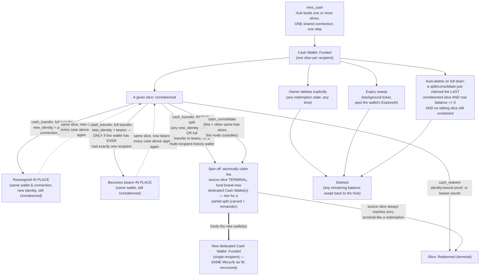

NIP-CASH
========

Cash Hub
--------

`draft` `optional` `nwc`

**Depends on**: NIP-47 (Nostr Wallet Connect)

## Abstract

Cash Hub is a Chaumian ecash system for energy-backed Lightning coins — flokicoin, Bitcoin, and any other
coin this format extends to. It mints **cash tokens**: bech32 strings (`lokicash1...` for flokicoin,
`satscash1...` for Bitcoin) that carry real, spendable value the moment they're minted, as a
specially-scoped NWC connection (§The Cash Token).

Send one the way you'd hand over a bill — in a zap, a chat message, read out loud, even to someone offline
with no wallet set up yet. Redeem it to a Lightning invoice, hand the whole thing on, or split off part of
it while keeping the rest (§Splitting a Slice) — no Lightning hop, no node of the recipient's own required.

A wallet owner can mint cash for a whole named list at once, before anyone's ready to receive — a hackathon
prize list, a group zap, fifty people off a sign-up sheet — and each one redeems whenever they're ready.
Every recipient shares one connection safely because a share can optionally be bound to a specific
identity — a Nostr pubkey, or a web identity vouched for by an Identity Authority — so nobody can grab
someone else's share (§Data Model). A share meant for exactly one recipient can skip the binding and stay a
bare secret instead: ordinary bearer ecash (§Bearer Slices).

## Motivation

Ecash already means mint-once, transfer-before-redemption value: hand a note to someone else with no
Lightning hop, redeemable whenever they're ready. Getting it today means adopting a separate mint protocol
and a separate wallet, outside the tools people already use. NIP-47 already gives Nostr a standard way to
hand out scoped spending access to a wallet — Cash Hub builds ecash's value directly on top of that instead
of beside it, so anything that already speaks NIP-47 can mint, hold, and redeem a cash token.

A bare secret has no address — no way to aim it at someone before they're reachable. §Data Model's identity
binding adds that: mint cash for a named list of recipients today, and let each one redeem it, or move it
on to someone else, once they're online.

## Non-Goals

This document doesn't define membership or eligibility policy. A Cash Hub has no concept of "who's
allowed to be a recipient." Every recipient is named explicitly, at creation time, by the hub owner.

And `cash_transfer` isn't a general-purpose payment or exchange primitive. It moves value between
already-committed slices, never creating value beyond what `mint_cash` already committed, and never
merging two slices back into one — combining is `cash_consolidate`'s job (§Consolidating Tokens), not
`cash_transfer`'s. Neither ever creates value: `cash_consolidate`'s output is exactly the sum of its
inputs, drawn from cash the same node already custodies.

## Terminology

- **cash token**: the NIP-19-style bech32 string a recipient actually holds and redeems — and, informally,
  for a single-recipient wallet, the value it represents, the way "a bill" means both. (A multi-recipient
  wallet's token instead represents shared *access* to a pool containing several recipients' independent
  slices — see the next entry — so the bill analogy is exact only in the single-recipient case.) Its prefix
  names the coin: `lokicash1...` (flokicoin), `satscash1...` (Bitcoin), and so on. See §The Cash Token.
- **Cash Wallet**: the NWC connection a cash token's pairing data decodes to — one connection string, shared
  by every recipient it was created for (or, after a transfer/split, by exactly one recipient — see
  §Splitting a Slice). This is the custody/transport mechanism a cash token rides on, not a separate
  end-user-facing concept: a recipient interacts with "their cash," never with "their wallet."
- **Cash Hub**: the wallet owner's own connection for minting cash tokens. It spends from its own
  balance to fund each one.
- **recipient / slice**: one `(identity, amount)` pair inside a Cash Wallet. A wallet's total funding MUST
  equal the sum of its slices. A slice's identity MAY be reassigned pre-redemption via `cash_transfer`; its
  amount is immutable — a split consumes the slice whole and re-mints fresh wallets rather than rewriting it
  (§Transferring and Splitting a Slice).
- **identity**: an OPTIONAL binding on a slice, checked at redemption instead of trusting mere possession
  of the connection — a raw Nostr `pubkey`, or a `connection_key` (an opaque identifier an Identity
  Authority vouches for, standing in for a Web Identity — a Discord handle, an email, a domain — for a
  recipient not on Nostr yet). A slice left unbound is `bearer` mode (§Bearer Slices): ordinary ecash,
  redeemable by whoever holds its secret.
- **Identity Authority (IA)**: a third party the wallet owner trusts to attest that a `connection_key`
  belongs to a given Nostr pubkey, or to the Web Identity behind it.
- **min_transfer_millis**: a floor, in millis, on how small a piece a split may carve off or leave behind
  (zero = no floor). See §Splitting a Slice.
- **redeem_fee_ppm**: a parts-per-million rate charged on a slice only when `cash_redeem` resolves to an
  external Lightning payment (zero = free). See §The Redeem Fee.
- **millis**: this document's amount unit — one-thousandth of whatever base unit the connection's own coin
  uses for Lightning-payable amounts (milli-satoshi for a Bitcoin-backed Cash Hub, milli-loki for a
  flokicoin-backed one, and so on). Fixed per Cash Hub by which coin it mints for; never mixed within one
  wallet or one call.

Both `min_transfer_millis` and `redeem_fee_ppm` are Hub-level defaults, stamped onto each slice at creation
and thereafter fixed on that slice and inherited unchanged across splits (§The Redeem Fee).

## Methods

| Method | Caller | Scope | Purpose |
|---|---|---|---|
| `mint_cash` | wallet owner, over the Cash Hub connection | `cash_hub` | Fund and mint cash tokens for one or more recipients |
| `cash_redeem` | a recipient, over the Cash Wallet connection | `cash_redeem` | Collect one recipient's exact slice — identity-bound or `bearer` (§Bearer Slices) |
| `cash_transfer` | a recipient, proof-gated against their current registered identity | `cash_transfer` | Reassign an unredeemed slice's identity, or split part of its value off into a new cash token — see §Transferring and Splitting a Slice |
| `cash_consolidate` | a recipient controlling every source slice, proof-gated against each | `cash_consolidate` | Combine several same-hub slices this node custodies into one new cash token — see §Consolidating Tokens |
| `list_recipients` | any holder of the Cash Wallet connection | `cash_redeem` | Read-only roster of every recipient on this wallet, including each slice's redeem fee quote — see §Listing Recipients |

## Data Model

This section describes what a Cash Hub, and the wallets it creates to hold minted cash, MUST be able to
represent. It's not a wire format or a storage schema — how an implementation stores or names this state is
outside this document's scope.

A Cash Hub MUST maintain, for itself:

- a ceiling on the total cash a single Cash Wallet created from it may carry;
- a ceiling on, and default value for, how long a Cash Wallet's cash may remain unredeemed. This ceiling
  MAY instead be "never" (no ceiling at all) — a Hub configured this way imposes no expiry on any cash it
  mints unless the `mint_cash` caller requests one of their own (§Minting Cash);
- a default value for `min_transfer_millis` (§Splitting a Slice), applied to every slice a freshly-minted
  wallet carries. Zero (no floor) is a valid default;
- a default value for `redeem_fee_ppm` (§The Redeem Fee), applied to every slice a freshly-minted wallet
  carries. Zero (free) is a valid default;

For each Cash Wallet it creates, an implementation MUST be able to determine which Hub minted its cash —
§Lifecycle and Deletion needs this for its reclaim behavior.

For each recipient slice, an implementation MUST track:

- the identity type and value (§Terminology) currently registered for this slice;
- the attesting Identity Authority's pubkey, for `connection_key`-mode registered identities;
- the committed amount, fixed for the slice's whole life — a redemption, a split, or a consolidate
  consumes the slice entirely; nothing ever rewrites it to a smaller value in place (§Splitting a Slice);
- whether, and when, the slice has been redeemed;
- this slice's own `min_transfer_millis` floor and `redeem_fee_ppm` rate — fixed when the slice was created,
  from the Hub's default or inherited from the source slice it was split from (§The Redeem Fee);
- whether the slice's value was moved into a brand-new dedicated Cash Wallet, either in full or as part
  of a split, and if so, which one — purely informational (an implementation MAY surface this for an
  operator's own bookkeeping); it does not change how any other guard in this document treats the slice.
  A wallet created this way SHOULD, symmetrically, record which slice it was split from, for the same
  informational purpose, in the reverse direction.

An implementation MUST treat a slice's registered identity as mutable pre-redemption (via an in-place
reassignment), but its committed amount as immutable, exactly as §Transferring and Splitting a Slice
describes.

For a `bearer`-mode slice (§Bearer Slices), the above degenerates: there's no registered identity, only a
secret to verify a redemption against. An implementation MUST be able to verify a presented bearer secret
without persisting it in any form that discloses it — a one-way commitment, not the secret itself.

A Cash Wallet MUST be created, funded, and made usable in one step. Implementations MUST NOT introduce an
intermediate state where the wallet exists but isn't yet funded, or isn't yet reachable by its
recipients. Once created, a Cash Wallet's budget, expiry, and any system-assigned label MUST NOT be
alterable through whatever general-purpose connection-management interface the implementation offers for
other connection types. These values are fixed when the wallet is created.

## Minting Cash



### Request

```jsonc
{
  "recipients": [
    {"identity_type": "pubkey", "identity_value": "<hex pubkey>", "amount_millis": 21000},
    {"identity_type": "connection_key", "identity_value": "abc123", "ia_pubkey": "<hex IA pubkey>", "amount_millis": 5000}
  ],
  "expiry": 86400 // optional, seconds
}
```

A `bearer` recipient MUST instead be the request's only recipient — a bearer slice's wallet is always
single-recipient, never mixed with a `pubkey`/`connection_key` entry or a second `bearer` entry
(§Bearer Slices, §Redemption Metadata):

```jsonc
{
  "recipients": [
    {"identity_type": "bearer", "amount_millis": 3000}
  ]
}
```

- `recipients` — MUST contain at least one entry. Each entry's `identity_type` MUST be `pubkey`,
  `connection_key`, or `bearer`. A `connection_key` entry MUST also carry `ia_pubkey`. A `bearer` entry
  MUST carry neither `identity_value` nor `ia_pubkey` — the Hub generates its secret (§Bearer Slices). A
  `bearer` entry MUST be the request's only entry; a request mixing a `bearer` entry with any other entry
  MUST be rejected in its entirety, not just that one recipient.
- `expiry` — OPTIONAL. If omitted or zero, it MUST default to the Hub's own expiry ceiling (§Data Model) —
  which itself MAY be "never," in which case an omitted/zero `expiry` here produces a Cash Wallet that
  never expires, not an already-expired one. A caller MAY still request its own, finite `expiry` even when
  the Hub's own ceiling is "never"; there is nothing to cap it against in that case, so it MUST be honored
  exactly.
- `mint_signature` — OPTIONAL boolean, default `false`. Opts the issued token into mint provenance
  (§Mint Provenance) — the node signs the wallet's own pubkey and committed amount with its Lightning
  identity key, best-effort: a signing failure is never a reason to fail the mint, it just produces a token
  without the signature.

`min_transfer_millis` is deliberately NOT a request field here — it's a Hub-level setting (§Data Model),
applied uniformly to every recipient of a freshly-minted wallet from the Hub's own current configuration,
not supplied per call. A wallet owner who wants a different floor for one specific payout configures a
separate Cash Hub with its own settings, rather than overriding it per call.

### Response

```jsonc
{
  "wallet_pubkey": "<hex>",
  "pairing_uri": "nostr+walletconnect://...",
  "cash_token": "lokicash1...",
  "expires_at": 1720000000, // omitted entirely if this wallet never expires — see §Data Model, §Minting Cash
  "recipients": [
    {"identity_type": "pubkey", "identity_value": "...", "amount_millis": 21000},
    {"identity_type": "connection_key", "identity_value": "abc123", "amount_millis": 5000}
  ]
}
```

`cash_token` (§The Cash Token) packages the same pairing data as `pairing_uri` — the two MUST
decode to an identical wallet pubkey, secret, and relay set. Either string alone is a fully sufficient
connection credential; a recipient only ever needs one of them, not both.

For the single-`bearer`-recipient request shape above, the response's `recipients` entry instead carries
the generated secret:

```jsonc
{"identity_type": "bearer", "bearer_secret": "<opaque, high-entropy, shown once>", "amount_millis": 3000}
```

A `bearer` recipient's `bearer_secret` appears in this response and nowhere else, ever (§Bearer Slices).

### Processing Algorithm

On receiving `mint_cash`, the Hub MUST, in order:

1. Serialize against any other concurrent `mint_cash` attempt for this same Hub, however many
   interfaces the implementation exposes for issuing this request. Two concurrent requests must never
   both proceed past a stale balance read. A request that can't be serialized MUST be rejected, not
   queued.
2. Validate every recipient. `amount_millis` MUST be strictly positive. The running sum of all recipients'
   amounts MUST be computed with an explicit overflow check, rejecting before an unsigned wraparound can
   occur, and MUST NOT exceed the Hub's own per-wallet funding ceiling (§Data Model). If any recipient is
   `bearer`-mode, `recipients` MUST contain exactly that one entry and no other — reject the entire
   request otherwise (§Bearer Slices, §Redemption Metadata).
3. For each `connection_key`-mode recipient, verify its `ia_pubkey` is on the wallet owner's trusted
   Identity Authority allowlist right now. An untrusted or unknown IA MUST reject the entire request, not
   just that recipient. For each `bearer`-mode recipient, generate its secret now, with enough entropy
   that guessing it is infeasible (§Bearer Slices). A caller-supplied `bearer_secret` at this step MUST be
   rejected — the Hub is the only party that can vouch for the entropy behind it.
4. Resolve `expiry`. If the Hub's own expiry ceiling is "never," an omitted/zero `expiry` here MUST produce
   a Cash Wallet with no expiry at all — never a zero-duration, already-expired one — and any explicit,
   positive `expiry` the caller does supply MUST be honored exactly, since there's no ceiling to check it
   against. Otherwise (the Hub's own ceiling is a real, positive value): if omitted or zero, set it to the
   Hub's own expiry ceiling; otherwise it MUST NOT exceed that ceiling.
5. Verify the Hub's own available balance is at least the sum of all recipients' amounts.
6. Create the Cash Wallet connection, record one slice per recipient — stamping each with the Hub's
   current `min_transfer_millis` and `redeem_fee_ppm` defaults (§Data Model) and a one-way commitment of
   the secret for `bearer`-mode slices, never the secret itself — and perform a single internal transfer
   from the Hub to the new connection for the full sum. This MUST be atomic: a failure at any point after
   this step MUST leave no partial state.
7. Return the pairing connection string and the resolved recipient list, with each `bearer` slice's
   plaintext secret included this one time.

A request that fails any check above MUST be rejected before step 6. No partial wallet, slice, or
transfer is ever observable from a rejected request.

## Redeeming a Slice (`cash_redeem`)

A recipient collects their exact slice by presenting a fresh Lightning invoice over the Cash Wallet
connection, together with proof binding them to the slice they're redeeming.



### Request

```jsonc
{
  "invoice": "lnbc...",
  "proof": { /* binds the caller to this specific slice and this specific invoice;
                the same scheme cash_transfer reuses. exact format out of scope for
                this document. bearer slices use bearer_secret instead — see §Bearer Slices */ }
}
```

- `invoice` — REQUIRED. A fresh Lightning invoice, generated by the recipient at redemption time, for
  exactly the slice's committed amount minus its own `redeem_fee_ppm` cut (§The Redeem Fee) — or for the
  full committed amount, fee-free, whenever the payment resolves to one the Hub's own node is both sending
  and receiving. A slice pays exactly once, in full — there's no partial or repeated redemption. (To
  receive only part of a slice's value without redeeming, see §Splitting a Slice instead — that's a
  different operation from `cash_redeem`, which always resolves the slice's entire current amount in one
  shot.)
- `proof` — REQUIRED for an identity-bound slice. MUST bind the caller to that slice's *current*
  registered identity and to this specific invoice, so a captured proof can't be replayed against a
  different one. For a `connection_key` identity, it MUST also carry, or reference, a currently-trusted
  Identity Authority's attestation (§Terminology). A `bearer` slice replaces `proof` with `bearer_secret`
  (§Bearer Slices).

### Processing Algorithm

On receiving `cash_redeem`, the wallet MUST, in order:

1. Locate the slice this request is redeeming. If none matches, or it's already redeemed, reject.
2. Verify the caller is authorized to redeem it: for an identity-bound slice, verify `proof` against the
   slice's current registered identity, and, for `connection_key` mode, that the attesting Identity
   Authority is still trusted right now — not just at wallet-creation time (§Security Considerations). For
   a `bearer` slice, verify the presented `bearer_secret` (§Bearer Slices).
3. Determine whether this redemption will resolve to a payment the Hub's own node is both sending and
   receiving (§The Redeem Fee) — this determination MUST use the same predicate the wallet's own payment
   path uses internally, not a separate, potentially-divergent check. If so, the required invoice amount
   is the slice's full committed amount and the fee is zero; otherwise it's the slice's committed amount
   minus its own `redeem_fee_ppm` cut. A slice's committed amount is immutable (§Data Model), so this
   value can't shift under a racing operation — but the slice's *claimed* state can, so the amount is
   resolved and paid within the same atomic claim below.
4. Pay `invoice` and mark the slice redeemed, atomically — the claim MUST be first-wins, so a slice a
   concurrent `cash_transfer`/`cash_consolidate` already claimed is rejected here rather than paid twice
   (§Security Considerations). A failure after payment begins MUST NOT leave the slice redeemable a second
   time. If a nonzero fee applies, settle it against the Hub
   (§The Redeem Fee) as part of the same payout's settlement — not as a separate, later operation the
   caller could observe as a distinct step.
5. Return `{preimage, fees_paid}` — `fees_paid` is the recipient's own borne redeem fee (zero for a
   same-node redemption, per §The Redeem Fee), not the real Lightning routing cost, which is never charged
   to the recipient.

A request that fails step 1, 2, or 3 MUST be rejected before step 4.

## The Redeem Fee

A `cash_redeem` MAY carry a fee; `cash_transfer` (§Transferring and Splitting a Slice) MUST NOT.

- **When it applies.** Only when a `cash_redeem` resolves to a real external Lightning payment. A
  redemption the Hub's own node both sends and receives — paid to a Circle Wallet, an isolated Simple
  Subwallet, a standard connection, or another cash_wallet on the same node — is always fee-free, and no
  fee ever applies to `cash_transfer`.
- **How much.** `redeem_fee_ppm` (parts-per-million) times the slice's own committed amount.
- **Who pays.** The redeeming recipient, deducted from their own payout — never charged against another,
  not-yet-redeemed slice. `list_recipients` (§Listing Recipients) quotes the exact fee and net amount up
  front, so a recipient always knows what `cash_redeem` will pay out before they call it.

An implementation MUST decide same-node-ness with the exact same predicate its own payment path uses to
decide whether to skip real Lightning routing — not a second check that could drift from it and either
overcharge a same-node redemption or undercharge a genuinely external one.

A slice's `redeem_fee_ppm` and `min_transfer_millis` (§Splitting a Slice) are both fixed the moment the
slice is created — from the Hub's current default (§Data Model) for a freshly-minted wallet, or inherited
unchanged from the source slice for one produced by a split — and never change afterward, even if the Hub's
default later changes or the slice changes hands via `cash_transfer`. A recipient's economics MUST NOT
shift underneath them because the operator adjusted a setting after the value was committed.

### Why

A redemption spends the operator's real inbound/outbound Lightning capacity — a scarce resource they
provision and pay to maintain. A transfer or split only moves value already committed at `mint_cash` time,
with no Lightning hop, so there's nothing to price. Charging the redeeming recipient's own payout, rather
than the shared wallet, is what stops one recipient's routing cost from ever coming out of another
recipient's committed slice — the flaw an exactly-funded, shared multi-recipient wallet would otherwise
have (§Security Considerations). (`redeem_fee_ppm` reuses the same parts-per-million arithmetic as
`CircleHubConfig`'s per-payment fee, though not its funds-flow.)

**The fairness invariant.** Let `claimed` be the slice's committed amount, `fee` the quoted
`redeem_fee_ppm` cut (zero for a same-node redemption), `net = claimed − fee` the payout, and `real` the
actual Lightning routing cost (also zero, same-node). The payout debits the shared wallet by `net + real`;
a settlement-time reconciliation then moves `delta = fee − real` between the wallet and the Hub, so the
wallet's total debit for the redemption is always:

```
(net + real) + delta = (claimed − fee + real) + (fee − real) = claimed
```

— exactly the redeemed slice, never more, whatever the real routing cost turned out to be. Every other
recipient's not-yet-redeemed slice is untouched. The Hub nets `fee − real` on each external redemption:
revenue when the rate covers cost, an absorbed loss (recorded either way) when it doesn't — never at any
recipient's expense.

## Listing Recipients (`list_recipients`)

Any holder of a Cash Wallet connection MAY call `list_recipients` to see the full roster of recipients it
was created for — a read-only, shared view, matching the transparency model `get_balance` already has on
this same connection type (§Scope Surface), not a caller-scoped one.



### Request

`list_recipients` takes no parameters.

### Response

```jsonc
{
  "recipients": [
    {
      "identity_type": "pubkey",
      "identity_value": "<hex pubkey>",
      "amount_millis": 21000,
      "claimed": false,
      "redeem_fee_millis": 210,
      "net_redeemable_millis": 20790,
      "min_transfer_millis": 1000,
      "expires_at": 1720003600
    },
    {
      "identity_type": "connection_key",
      "identity_value": "abc123",
      "amount_millis": 5000,
      "claimed": true,
      "claimed_at": 1720000000,
      "redeem_fee_millis": 50,
      "net_redeemable_millis": 4950,
      "min_transfer_millis": 1000,
      "expires_at": 1720003600
    }
  ]
}
```

- `recipients` — every slice this wallet was ever created or split into, in no particular guaranteed
  order, including already-claimed ones (`claimed_at` distinguishes them).
- `redeem_fee_millis` / `net_redeemable_millis` — this slice's own `redeem_fee_ppm` (§The Redeem Fee) applied
  to `amount_millis`, and what's left after it. This is necessarily the worst-case quote: `list_recipients`
  has no invoice in hand to know in advance whether a given future `cash_redeem` call will resolve to a
  same-node payment, which stays fee-free regardless of the configured rate. A slice's eventual `cash_redeem`
  MAY pay out more than `net_redeemable_millis` here (the full `amount_millis`, if same-node); it will never
  pay out less. `redeem_fee_millis` is `0` for a slice whose `redeem_fee_ppm` is `0`, for every recipient,
  same-node or not.
- `min_transfer_millis` — this slice's own split floor (§Splitting a Slice), fixed at creation. A recipient
  MUST be able to learn this value here, before attempting a `cash_transfer` split, rather than only from a
  rejected attempt's error text — which also costs a share of the shared `cash_transfer`/`cash_redeem` rate
  limit (§Security Considerations).
- `expires_at` — the wallet's own redemption deadline (§Data Model). Every recipient shares one wallet-level
  deadline, so this value is identical on every row above, not a per-slice figure — it's repeated per
  recipient rather than hoisted to a single top-level field, so a consumer processing one row never needs to
  also parse a separate top-level field. Omitted entirely, never a null/zero timestamp, on a row belonging to
  a wallet that never expires, matching `mint_cash`'s own response convention (§Minting Cash).

### Processing Algorithm

On receiving `list_recipients`, the wallet MUST, in order:

1. Load every slice ever recorded for this wallet, claimed or not.
2. Resolve the wallet's own `expires_at` once (§Data Model) — omitted if the wallet never expires.
3. For each slice, compute `redeem_fee_millis` from that slice's own `redeem_fee_ppm` (never the Hub's
   current default — a slice's rate is fixed at creation, §The Redeem Fee) and `amount_millis`, and
   `net_redeemable_millis` as the difference; include that slice's own `min_transfer_millis` floor unchanged;
   include the wallet's `expires_at` from step 2, identical on every row.
4. Return the full roster. This method MUST NOT be scoped to only the caller's own slice — every recipient
   sees every other recipient's row, identity and amount included (§Privacy Considerations).

## Transferring and Splitting a Slice (`cash_transfer`)

A recipient who hasn't redeemed their slice MAY ask to move some or all of its value on, without ever
touching a Lightning wallet themselves. Two shapes of this exist, unified under one method:

- **Transfer it all** — hand the whole slice to an identity the caller does control (which MAY be
  themselves under a different mode, e.g. converting into `bearer`). No funds move in the Lightning
  sense, and no value is created. Only one thing changes: which identity is authorized to redeem, or
  transfer/split again, that one slice, for the amount it was already funded with.
- **Split off a piece** — like breaking a bill: carve `amount_millis` (less than the slice's current
  total) off for a target identity. The source slice is consumed whole, and its value re-emerges as **two
  brand-new, dedicated Cash Wallets** — one holding the carved-off `amount_millis` for the target, one
  holding the remainder for the caller's own, unchanged identity. Unlike a full transfer, this genuinely
  moves value via internal transfers; unlike the old in-place model, the source slice keeps NO residual
  amount — it becomes terminal exactly like a redemption, and both pieces are reached only through their
  new connections. This is what keeps a wallet's amount immutable for its whole life (§Mint Provenance):
  breaking a bill hands you fresh bills, including for your own change, never a rewritten original.

`new_identity` MAY be `bearer` (§Bearer Slices) as well as `pubkey`/`connection_key`, for either shape.

### Which outcome a request produces

An implementation MUST determine the outcome as follows, in this order:

1. **`amount_millis` is present and less than the slice's current committed amount** → this is a **split**.
   The source slice is consumed whole and its value re-emerges as two brand-new, dedicated wallets
   (§Spinning a Slice Off Into a Dedicated Wallet), regardless of `new_identity`'s type or this wallet's
   recipient history: one holds `amount_millis` for `new_identity`, one holds the remainder for the caller's
   own unchanged identity. There is no in-place outcome for a split, and no residual amount left on the
   source slice.
2. **`amount_millis` is omitted, or equals the slice's current committed amount** → this is a **full
   transfer**. Its outcome depends on `new_identity`'s type:
   - `pubkey` or `connection_key` → reassigned **in place**: same wallet, same connection, only the
     registered identity changes. This is unconditional on the wallet's recipient history — redeeming or
     transferring an identity-bound slice always requires a real signed proof, never just presenting a
     shared secret, so reusing the connection is safe regardless of who else has ever held it.
   - `bearer` → reassigned in place **only if** this wallet has, and has always had, exactly one recipient
     — counting every slice the wallet was ever created or has ever held, not only currently-unclaimed
     ones. Otherwise, this outcome also lands in a brand-new dedicated wallet (§Spinning a Slice Off Into
     a Dedicated Wallet): a bearer redemption's entire proof is
     its raw secret, transmitted in the request body, decryptable by anyone who has ever held this
     connection, claimed or not; handing a bearer note that same connection would hand any former
     co-recipient everything needed to steal it.



### Request

```jsonc
{
  "proof": { /* binds the caller to the slice's *current* registered identity, and to this
                specific new_identity — a proof captured for one target MUST NOT be usable
                against a different one. Omitted entirely when the current identity is
                bearer — see bearer_secret below. Exact format out of scope for this
                document, beyond that binding requirement. */ },
  "bearer_secret": "<opaque>", // in place of `proof`, iff the current identity is bearer
  "new_identity": {"identity_type": "pubkey", "identity_value": "<hex pubkey>"},
  // new_identity MAY instead be
  // {"identity_type": "bearer", "identity_value": "<hex sha256 commitment the caller generated>"}
  // — see §Bearer Slices for why identity_value is required, not server-minted, here.
  "amount_millis": 5000 // OPTIONAL — omit, or equal the slice's current amount, to transfer it
                        // all; a smaller value splits off exactly that much (§Splitting a
                        // Slice above), leaving the remainder behind on this slice
}
```

- `proof` — REQUIRED unless the slice's current identity is `bearer`. A kind-35521 event, MUST authenticate
  the caller as the slice's *current* registered identity, and bind the proof to this specific
  `new_identity` and this specific `amount_millis` — the same anti-redirection requirement `cash_redeem`'s
  proof has toward its invoice (§Redeeming a Slice). A proof captured for one `new_identity` MUST NOT be
  replayable against a different one, MUST NOT be replayable to authorize a different `amount_millis` than
  the one it was signed for, and MUST NOT be reused a second time for the identical
  `new_identity`/`amount_millis` — see §Security Considerations for why this matters more once splitting
  exists. Concretely, the event MUST carry:
  - a `d` tag whose value is the wallet's `WalletPubkey` (same as a claim proof);
  - a `new_identity_hash` tag:
    `sha256(new_identity.identity_type + ":" + new_identity.identity_value + ":" + new_identity.ia_pubkey)`,
    hex-encoded (`identity_value` is `""` for a `bearer` target, since the caller doesn't choose one ahead
    of generating it; `ia_pubkey` is `""` for every target type except `connection_key`). `ia_pubkey` MUST be
    folded into the hash, not just `identity_type`/`identity_value` — omitting it would let a captured proof
    for one `connection_key` target be replayed against the same `identity_value` under a different,
    still-trusted Identity Authority, redirecting who is authoritative to redeem the transferred slice even
    though the connection_key string itself never changed (§Security Considerations);
  - an `amount_millis` tag: the decimal string of the exact amount this request resolves to — an omitted
    request `amount_millis` (a full transfer) MUST still be bound to a concrete number: the slice's live
    full amount at signing time, never a wildcard/unbound value;
  - for `connection_key` mode only, a `connection_key` tag and an `e` tag referencing the accompanying
    `attestation_event`, same as elsewhere.
  The wallet consumes every successfully-verified proof exactly once (tracked by event ID, independent of
  `new_identity`/`amount_millis`) — a proof that failed verification, or whose subsequent operation failed
  and rolled back, is never consumed, so a legitimate caller can always retry with the identical proof.
- `bearer_secret` — REQUIRED in place of `proof`, if and only if the slice's current identity is
  `bearer`. A bearer slice has no identity capable of signing a proof; presenting its secret is the
  entire proof, exactly as it is for `cash_redeem` (§Redeeming a Slice → §Bearer Slices).
- `new_identity` — REQUIRED. `identity_type` of `pubkey`, `connection_key`, or `bearer`. For `pubkey`/
  `connection_key`, same shape as one `recipients[]` entry in `mint_cash` (§Minting Cash), with
  `ia_pubkey` required for `connection_key`. For `bearer`, `identity_value` is REQUIRED
  (a caller-generated `sha256` commitment — see §Bearer Slices) and `ia_pubkey` MUST NOT be present.
- `amount_millis` — OPTIONAL, as described above. When present, MUST be strictly positive and MUST NOT
  exceed the slice's current committed amount.
- `mint_signature` — OPTIONAL boolean, default `false`. Same opt-in as `mint_cash`'s (§Mint Provenance),
  meaningful only when this call spins off a dedicated wallet (a split, or a full transfer to `bearer` on a
  multi-recipient-history wallet) — each spun-off wallet signs independently over its own pubkey and its
  own fixed amount. A harmless no-op on an in-place reassignment, which never mints a new token to sign.

### Response

```jsonc
{
  "amount_millis": 5000,
  "identity_type": "pubkey",
  "identity_value": "..."
  // for an in-place outcome: nothing further — the response above is complete.
  // for a full transfer that spins off ONE new wallet (bearer on a multi-recipient-history
  // wallet), additionally:
  //   "new_wallet_pubkey": "<the new wallet's WalletPubkey, in the clear>",
  //   "new_wallet_token": "<lokicash1... token, NIP-44 encrypted — see below>"
  // for a PARTIAL split, which spins off TWO new wallets, additionally:
  //   "remaining_amount_millis": 15000,   // what the caller keeps, now in its own new wallet
  //   "new_wallet_pubkey":      "<clear>",  "new_wallet_token":      "<encrypted>", // the carved piece -> new_identity (same field names as the single-wallet spin-off above)
  //   "remainder_wallet_pubkey":"<clear>",  "remainder_wallet_token":"<encrypted>"  // the remainder -> caller
}
```

This response MUST NOT ever carry a bearer secret, nor any other secret capable of moving funds, in a
form decryptable by every holder of this connection — `identity_value` here is always either a public
identity or a one-way commitment the caller already supplied, never a value the wallet itself generated.
The `*_wallet_token` fields, present only for a split outcome, are the one exception that looks like it
might violate this, and doesn't: see §Spinning a Slice Off Into a Dedicated Wallet for why they're safe
despite traveling over this same shared connection. See also §Security Considerations.

### Processing Algorithm

On receiving `cash_transfer` for a given slice, the wallet MUST, in order:

1. Verify the caller is authorized to act on the slice: for an identity-bound current identity, verify
   `proof` against it, against this specific `new_identity`, and against this specific `amount_millis`
   (treating an omitted `amount_millis` as bound to "the slice's full current amount," not as unbound); for a
   `bearer` current identity, verify the presented `bearer_secret`. A redeemed slice has no registered
   identity left to act on; `cash_transfer` on a redeemed slice MUST be rejected.
2. Validate `new_identity`: for `pubkey`/`connection_key`, the same rules `mint_cash` applies to
   a recipient entry (§Processing Algorithm) — identity shape, and, for `connection_key` mode, that
   `ia_pubkey` is on the wallet owner's trusted Identity Authority allowlist right now. For `bearer`,
   verify `identity_value` is present and is a well-formed commitment — the implementation MUST NOT
   generate a secret on the wallet's behalf here (§Bearer Slices, §Security Considerations).
3. Resolve `amount_millis` against the slice's current committed amount (read fresh, not from an earlier
   lookup) and determine the outcome per §Which outcome a request produces above. If `amount_millis` is
   present and exceeds the slice's current amount, reject.
4. If the outcome is a partial split, additionally verify `amount_millis` is at least the slice's own
   `min_transfer_millis` (0 = no floor), and that the remainder it would leave behind (current amount
   minus `amount_millis`) is either exactly zero or itself at least `min_transfer_millis` — a split that
   would leave unmovable dust behind MUST be rejected rather than silently allowed (§Splitting a Slice).
5. For an in-place reassignment: atomically transfer the slice. The old registered identity MUST stop
   authorizing `cash_redeem` or `cash_transfer` on this slice from the moment this step completes. The new
   identity becomes the slice's sole registered identity, for the same committed amount, unchanged.
6. For a split: follow §Spinning a Slice Off Into a Dedicated Wallet's own algorithm instead. The source
   slice is claimed **terminal** (exactly like a redemption — its committed amount is never rewritten to a
   smaller value), and its value re-emerges as new dedicated wallets: one wallet of `amount_millis` for a
   full transfer to `bearer`; two wallets (carved `amount_millis` + remainder) for a partial split.
7. Return the slice's resulting amount together with its new registered identity (in-place), or the new
   wallet connection(s) — one for a full-transfer spin-off, two for a partial split — see the Response
   format above and §Spinning a Slice Off Into a Dedicated Wallet.

A request that fails step 1, 2, 3, or 4 MUST be rejected before step 5 or 6. A rejected `cash_transfer`
never leaves a slice partially transferred, partially split, or claimed.

## Spinning a Slice Off Into a Dedicated Wallet

Whenever §Transferring and Splitting a Slice's Processing Algorithm (step 3) determines the outcome is a
split, the source slice is claimed terminal and its value re-emerges as one or two brand-new, dedicated,
single-recipient Cash Wallets, whose connections are delivered to the caller alone:

- a **full transfer to `bearer`** on a wallet whose recipient history rules out an in-place reassignment
  produces **one** new wallet holding the whole amount, for `new_identity`;
- a **partial split** produces **two** new wallets — one holding the carved `amount_millis` for
  `new_identity`, one holding the remainder for the caller's own identity.

```mermaid
sequenceDiagram
    participant Caller as Recipient (current registered identity)
    participant Old as Old Cash Wallet (source)
    participant New as New Cash Wallet(s) (dedicated)

    Caller->>Old: cash_transfer {proof, new_identity, amount_millis?}
    Old->>Old: verify proof; determine split applies
    Old->>Old: atomically claim the source slice TERMINAL
    Old->>New: create + fund via internal transfer(s):<br/>one wallet (full-to-bearer), or two (partial split)
    New-->>Old: lokicash1... token(s) for the new wallet(s)
    Old->>Old: NIP-44 encrypt each token to the caller's own pubkey,<br/>keyed to that new wallet's own keypair
    Old-->>Caller: {carved + (for a split) remainder wallet_pubkey (clear), wallet_token (encrypted)}
```

**Why not just reassign in place, for a bearer target on a shared wallet?** Because the slice's current
connection is shared with every other recipient the wallet has ever had (§Security Considerations), and a
bearer redemption transmits its raw secret in the request body. Reassigning in place would hand every
current and former co-recipient of that connection everything needed to steal the note the moment its
intended recipient tried to redeem it. The only way to give such a slice a genuinely bearer, cash-like
existence is to move it off that connection entirely.

**Why fresh wallets for both pieces of a partial split?** Two reasons. First, the carved-off piece is
going to someone else entirely, so it must never ride the source's possibly-shared connection — that would
reintroduce the bearer-mixing risk above and hand a stale connection to a new party for no benefit.
Second, giving the caller's own remainder a fresh wallet too — rather than decrementing the source in
place — is what makes a wallet's committed amount immutable for its whole life (§Mint Provenance): if the
source could be rewritten to a smaller amount, its mint signature (which commits to that amount) would go
stale, and a racing `cash_redeem` could read a since-shrunk amount. A source that is always claimed whole,
never rewritten, closes both. Breaking a bill hands you fresh bills, including for your own change.

**Funding.** Each new wallet MUST be created as a child of the same Cash Hub the old wallet is already a
child of — not a child of the old wallet — and funded via a single internal transfer of exactly its own
amount, moved out of the old wallet's own balance (not the Hub's). This mirrors `mint_cash`'s own
Hub→Wallet funding transfer (§Processing Algorithm), just with the old Cash Wallet standing in as the
funding source instead of the Hub. A partial split performs two such transfers (carved + remainder), which
together drain the source slice's whole amount.

**Atomicity — a compensating saga, not unconditional two-phase commit.** The source slice MUST be claimed
terminal as a single atomic step **before** any new wallet is created or funded — this is the operation's
commit point. From this instant the old identity can no longer redeem or transfer this slice; its whole
amount is now committed to the new wallet(s). If a LATER step fails after an EARLIER wallet already funded
(e.g., the carved piece succeeded but the remainder failed), the implementation MUST attempt to reverse the
earlier transfer(s) and, once reversal is confirmed, restore the claim so the caller can safely retry — for
a partial split this makes the common case all-or-nothing across BOTH new wallets: the caller normally
never ends up with the carved piece but not the remainder, or vice versa.

The one case this does NOT cover: if the reversal itself fails (a second, independent transfer failure
during rollback — rare, and not caller-controllable), the implementation MUST NOT restore the claim,
because doing so would let the caller believe they hold the slice's full original amount when the wallet
backing it is actually short by whatever didn't come back. Instead, the already-funded wallet from the
earlier, un-reversed step MUST be left intact and undeleted (never silently discarded — it is the only
record of where those funds are) and the source claim MUST stay claimed, terminal, with no usable
replacement, pending operator reconciliation. This is a narrow, explicitly-acknowledged exception to the
"MUST roll back" rule above, not a silent gap: an implementation SHOULD record which wallet holds the
stranded funds durably enough for an operator to find and resolve it without reading logs.

Once every new wallet has been successfully created and funded (the ordinary case), the claim MUST NOT be
rolled back — an implementation MAY record which new wallet(s) the value moved to, for its own bookkeeping
(§Data Model), but this is informational only.

**Delivery — nested encryption, not a new channel.** The new wallet's connection MUST NOT be placed in
this response in a form decryptable by every holder of the old wallet's shared connection — that would
simply relocate the leak this whole mechanism exists to close. Instead, the response carries, for **each**
new wallet (one for a full-to-bearer spin-off, both the carved and the remainder wallet for a partial
split), a matched pair of fields:

- `*_wallet_pubkey` — that new wallet's own `WalletPubkey`, in the clear. A bare pubkey with no
  accompanying secret grants no spending capability by itself (§The Pairing Connection), so exposing it
  unencrypted is safe — it exists purely so the recipient has a pubkey to derive a decryption key against.
- `*_wallet_token` — that new wallet's cash token (`lokicash1...`, §The Cash Token), NIP-44
  encrypted using a **second, inner** encryption layer keyed to (a) the pubkey that authenticated this
  `cash_transfer` call (the value bound by `proof`, i.e. the caller's own real identity — not the shared
  connection's client keypair) and (b) that new wallet's own keypair (the private counterpart of its
  `*_wallet_pubkey`) — not a fresh one-off keypair generated only for this delivery, since the caller
  would have no way to independently learn such a key. This inner layer sits nested inside the response's
  own ordinary outer encryption (§Security Considerations), which every holder of the old wallet's shared
  connection can still decrypt as always — but decrypting the outer layer only reveals the `*_wallet_pubkey`
  (harmless alone) and an opaque ciphertext neither the outer connection's shared key, nor any other
  co-recipient's own privkey, can open. Only the caller's own privkey, paired with that `*_wallet_pubkey`,
  derives the correct inner conversation key. Both tokens of a partial split are delivered to the caller
  this way — the caller keeps the remainder and hands the carved token to its target out of band.

For a `bearer`-current caller (a bearer slice being split, whether into another bearer target or an
identity-bound one), there is no signed `identity_event` to draw a delivery pubkey from — the caller's
"proof" is the bearer secret itself, which carries no pubkey. An implementation MUST NOT deliver any
`*_wallet_token` over the shared connection in this case using any key derivable by another co-holder
of that connection; in practice this case only arises for a `bearer`-current caller acting on a wallet
that structurally can only ever have had one recipient (§Bearer Slices), so the "shared with others" risk
this delivery mechanism defends against does not apply, and the token(s) MAY be delivered in the clear the
same way a freshly-`mint_cash`-minted token is.

An implementation MUST NOT use a bearer redemption's secret-in-body pattern, or any wallet-generated
one-off key, for this delivery step — see §Security Considerations for the general principle this
follows, and the ECDH argument for why it holds.

**Eligibility and limits.** Every new wallet a split produces — the carved piece and, for a partial split,
the remainder alike — inherits its `min_transfer_millis`, `redeem_fee_ppm`, and expiry from the source
slice's own configuration, not from the Hub's current config (which only supplies the default for a wallet
minted directly by `mint_cash`). A split relocates an existing entitlement; it does not grant a fresh one,
shorten it, or lengthen it. This holds even when the old wallet never expires: each new wallet inherits
that same "never" status rather than an arbitrary fallback duration. The inheritance chain holds across any
number of splits: a cash token split from one that was itself split from an original Hub-minted slice
carries the same values its immediate parent had, however many hops back that traces to the original
hub-set default.

## Consolidating Tokens (`cash_consolidate`)

The inverse of a split: combine several unredeemed slices the same node custodies into **one** new cash
token. Like breaking a bill in reverse — hand over a $20, a $5, and three $1s, get back one $25. No value
is created (the result is exactly the sum of its inputs) and no Lightning hop is involved (funding is
internal transfers between wallets this node already holds).

**What can be consolidated together.** Every source MUST be:

- **custodied by this node** — a `cash_wallet` this node itself issued. Custody, not a signature, is the
  gate: a node can only move funds for wallets on its own ledger, so a token another node minted is
  rejected outright (its funds live elsewhere). A mint signature (§Mint Provenance), if present, lets a
  *client* pre-check "these are all the same minter" before calling, but the node's authoritative answer
  comes from its own records;
- **a child of the same Cash Hub** (this revision). Cross-hub consolidation is mechanically possible —
  custody is node-level, not hub-level — but is deferred, because differing hubs raise "whose ceiling,
  whose expiry cap, whose fee/floor" questions a single shared hub avoids;
- **controlled by the caller**, proven per source with a signed proof against each source slice's current
  registered `pubkey` identity (§Transferring and Splitting a Slice), bound to `new_identity` so a captured
  proof can't be redirected. **This revision** does not accept a bearer source — see the `sources` field
  below.

Authorization is per-source, not per-connection: the calling connection's own identity need not match, or
even be among, the sources being consolidated — the calling connection is only an entry point, and each
source's own proof is what actually authorizes moving it. A holder of any `cash_wallet` connection with
`CASH_CONSOLIDATE_SCOPE` MAY consolidate sources it doesn't otherwise hold, as long as it can produce a
valid proof for each one — no different in kind from how a `cash_transfer` proof, once captured, can move
a slice regardless of who's making the call, just applied to N sources at once instead of one. This is
deliberate, not an oversight: requiring the caller to also own one of the sources would add an arbitrary
restriction with no security benefit, since custody (§What can be consolidated together, above) is already
node-level, not connection-level.

```mermaid
sequenceDiagram
    participant Caller as Recipient (controls every source)
    participant Node as Cash Wallets (same hub, this node)
    participant New as New consolidated Cash Wallet

    Caller->>Node: cash_consolidate {sources[], proofs[], new_identity}
    Node->>Node: confirm this node custodies every source, all same hub
    Node->>Node: verify caller controls each source slice
    Node->>Node: sum amounts (overflow-checked); check sum <= hub PerWalletMax
    Node->>Node: atomically claim EVERY source slice terminal
    Node->>New: create one wallet for new_identity, fund via internal transfers summing sources
    New-->>Node: lokicash1... token for the consolidated wallet
    Node-->>Caller: {new_wallet_pubkey (clear), new_wallet_token (encrypted), amount_millis}
```

### Request

```jsonc
{
  "sources": [
    {"wallet_pubkey": "<hex>", "proof": { /* kind-35521, bound to new_identity — §Transferring */ }},
    {"wallet_pubkey": "<hex>", "proof": { /* ditto */ }}
  ],
  "new_identity": {"identity_type": "pubkey", "identity_value": "<hex pubkey>"}
}
```

- `sources` — MUST contain at least two distinct, unredeemed source slices; the same slice MUST NOT appear
  twice, and an implementation MAY cap the total count (this implementation caps at 100, matching
  `mint_cash`'s recipient-batch limit). Each carries a `proof` (identity-bound), same scheme as
  `cash_transfer`. **This revision** accepts only `pubkey`-identified sources; a `connection_key` or
  `bearer` source is rejected. `connection_key` is deferred alongside the cross-hub restriction above,
  since both raise Identity-Authority questions a first cut sidesteps. `bearer` is rejected for a sharper
  reason, not just deferred scope: a bearer source's secret has no signature and no binding to the request
  carrying it — presenting it just *is* the authorization — but unlike `cash_transfer`/`cash_redeem` (which
  always act on the calling connection's own wallet, so a bearer secret only ever transits over its own
  single-recipient wallet's own connection), `cash_consolidate` lets a source name *any* wallet this node
  custodies. Accepting a bearer source here would put that source's secret in plaintext inside a request
  encrypted only under the *calling* connection's shared key — decryptable by every co-recipient of a
  shared calling wallet, none of whom have any claim on that foreign bearer note (see §Security
  Considerations).
- `new_identity` — REQUIRED. **This revision** requires `pubkey` (the merged wallet is owned by, and its
  token delivered encrypted to, that pubkey); `connection_key`/`bearer` targets are deferred, so a request
  naming one is rejected. A future revision MAY widen this to `cash_transfer`'s full
  `pubkey`/`connection_key`/`bearer` shape set.
- `mint_signature` — OPTIONAL boolean, default `false`. Same opt-in as `mint_cash`'s (§Mint Provenance) —
  the merged wallet's own signature attests its own pubkey and its total merged amount, independent of
  whether any source wallet had one.

### Response

```jsonc
{
  "amount_millis": 25000,                       // the sum of every source
  "new_wallet_pubkey": "<clear>",
  "new_wallet_token": "<lokicash1... , NIP-44 nested-encrypted to the caller — §Spinning a Slice Off>",
  "expires_at": 1720000000                      // earliest expiry among the sources; omitted if all never expire
}
```

The token is delivered with the same nested inner encryption a split uses (§Spinning a Slice Off), since
`cash_consolidate` is called over a shared cash_wallet connection too.

### Processing Algorithm

On receiving `cash_consolidate`, the node MUST, in order:

1. Locate every source. Each MUST be a `cash_wallet` this node custodies, unredeemed, and distinct. A source
   this node did not issue, or that is already claimed, MUST reject the whole request.
2. Verify all sources are children of the **same** Cash Hub. Reject otherwise (this revision).
3. Verify the caller controls each source: a valid `proof` against that slice's current registered `pubkey`
   identity (bound to `new_identity`). Any failure rejects the whole request. A `bearer_secret` source MUST
   be rejected (this revision) — see the `sources` field above.
4. Validate `new_identity` exactly as `mint_cash`/`cash_transfer` do, including live IA trust for
   `connection_key`.
5. Sum every source's committed amount with an explicit overflow check, and reject if the sum exceeds the
   shared Hub's own per-wallet ceiling (§Data Model) — the consolidated wallet obeys its Hub's ceiling like
   any other.
6. Resolve the merged terms: expiry is the **earliest** among the sources (never later — a consolidate can
   only shorten, never extend, an entitlement, §Security Considerations); `min_transfer_millis` and
   `redeem_fee_ppm` MUST be identical across all sources — reject on any disagreement (this revision).
7. Atomically: claim **every** source slice terminal, create one new `cash_wallet` for `new_identity` as a
   child of the shared Hub, and fund it via internal transfers summing the sources — a compensating saga,
   not unconditional two-phase commit: a failure partway through MUST reverse every already-completed
   source→new transfer and, once each reversal is confirmed, unclaim that source, leaving no source
   consumed and no wallet created in the ordinary case. If a reversal itself fails (rare, not
   caller-controllable), that specific source's claim MUST NOT be restored — it stays claimed, terminal,
   with no usable replacement — and the new wallet MUST be left intact and undeleted rather than discarded,
   since it is the only record of where that source's funds are; an implementation SHOULD record this
   durably enough for an operator to find and resolve it without reading logs (§Security Considerations).
8. Deliver the consolidated wallet's connection to the caller, nested-encrypted (§Spinning a Slice Off).

A request that fails steps 1–6 MUST be rejected before step 7. A rejected `cash_consolidate` never leaves
any source consumed or partially merged.

## Bearer Slices

A `bearer` slice is ordinary ecash: `identity_type: "bearer"`, no registered identity at all. Whoever
presents its `bearer_secret` over the Cash Wallet connection first MAY redeem it — no Nostr pubkey, no
`connection_key`, no Identity Authority involved. Knowing the secret is both necessary and sufficient to
redeem it, exactly like a Chaumian note. Handing a bearer slice to someone else is simply telling them its
secret, out of band — that handoff isn't a protocol operation at all; it's no different from the wallet
owner choosing who to give the slice to in the first place (§Non-Goals).

Every other slice adds an identity binding on top of that bare-secret baseline: redeeming it also takes
proof of a specific registered identity (§Redeeming a Slice), not just the connection — the protection a Cash
Hub payout needs when the same connection goes out to many recipients at once (§Abstract).

A slice MAY still move into or out of bearer status via `cash_transfer` (§Transferring and Splitting a
Slice) — either wholly (a full transfer) or partially (a split carves a new bearer note off, while the
remainder, if any, stays under the giver's own unchanged identity — that remainder is never itself
bearer). Moving *out* of bearer status presents the current secret as `cash_transfer`'s proof, the same
way `cash_redeem` does. Moving *into* bearer status in place — reassigning the current wallet's connection
to serve a bearer slice — is restricted to a full transfer on a wallet that has **ever** had only one
recipient, not merely one still-unclaimed one, for the reasons §Transferring and Splitting a Slice and
§Spinning a Slice Off Into a Dedicated Wallet both explain. This restriction never strands a
multi-recipient wallet's slice, though: it always has the split path available instead, whether it wants
to move all of its value into a bearer note or just part of it.

Unlike `mint_cash`'s bearer recipient, `cash_transfer`'s bearer target does NOT get a
wallet-generated secret. The caller supplies the commitment themselves — an implementation MUST NOT mint
one and return it in the `cash_transfer` response. This is a deliberate, load-bearing difference from
creation, not an oversight: see §Security Considerations for why.

### Creating a Bearer Slice

A `bearer`-mode entry in `mint_cash`'s `recipients[]` (§Minting Cash) carries no
`identity_value` and no `ia_pubkey` — only an amount. It MUST also be the request's only entry: a bearer
slice's wallet is always single-recipient, never mixed with an identity-bound slice or a second bearer
slice (§Data Model, §Redemption Metadata) — mixing them would let a co-recipient on the same shared
connection decrypt and steal a bearer secret the moment it's used (§Security Considerations). The Hub MUST
generate the slice's `bearer_secret` itself, with enough entropy that guessing it is infeasible; a
caller-supplied secret MUST NOT be accepted, since the caller has no way to prove its entropy. The
response's matching entry MUST carry that `bearer_secret` in plaintext, exactly once (§Minting a Cash
Wallet, Response). There MUST be no way to retrieve a bearer slice's secret again after that response.
Losing it is equivalent to losing the funds — same as losing any bearer ecash note.

### Redeeming a Bearer Slice

`cash_redeem` (§Redeeming a Slice) on a bearer slice replaces `proof` with the secret itself:

```jsonc
{"invoice": "lnbc...", "bearer_secret": "<opaque>"}
```

No Identity Authority check, no signature to verify — presenting the correct secret is the entire proof.
The processing algorithm in §Redeeming a Slice applies unchanged; step 2 becomes a direct secret comparison.

### Security Considerations for Bearer Slices

**The secret MUST NOT be stored in a form that discloses it.** An implementation MUST persist only
something a presented secret can be checked against — a one-way commitment, never the secret itself. A
slice's `identity_value` is public information for `pubkey` and `connection_key` modes; a bearer slice's
secret is the opposite. It *is* the entire security of that slice. Storing it in the clear turns any read
access to that storage into a theft of every unredeemed bearer slice on the Hub.

**A bearer redemption MUST still be atomic and race-safe**, exactly like an identity-bound one (§Redeeming
Funds, step 4). First-redeem-wins is intentional for a bearer slice — that's the whole point — but two
concurrent redemptions against the same secret MUST NOT both succeed.

**Guessing MUST be made infeasible, not just unlikely.** A bearer slice has no signature to forge, so an
attacker's only path is guessing the secret. Sufficient entropy at generation is necessary but not
sufficient on its own; an implementation SHOULD also rate-limit or back off repeated failed
`cash_redeem` attempts against the same wallet, the same way it would for any other credential-guessing
surface.

## The Cash Token (`lokicash1...`, `satscash1...`, ...)

One recognizable string is all a recipient needs — hand it over in a chat message, embed it in a zap, read
it out loud. Under the hood it's the same pairing data as `pairing_uri`, a plain NWC
`nostr+walletconnect://` string, wrapped in a NIP-19-style bech32 identifier: `lokicash1...` for a
flokicoin-backed Cash Wallet, `satscash1...` for a Bitcoin-backed one, and so on for any other coin this
format is extended to.

That convenience is the point, not a side effect. **The token doesn't need to be kept secret.**
`cash_redeem` and `cash_transfer` both check the caller against the slice's registered identity
(§Data Model). Neither trusts mere possession of the string. Two people holding the same cash token
don't have an equal claim on the funds. Only whoever is, or has become via `cash_transfer`, the
registered identity does. That's what lets a cash token sit somewhere many people can see it,
without turning it into a race for whoever acts first.

### Wire Format

A cash-token-family string is a NIP-19-style bech32 string: a human-readable prefix (`lokicash`, `satscash`,
...), the digit `1`, then TLV-encoded pairing data converted from 8-bit to 5-bit groups exactly as NIP-19
does for `nprofile`/`nevent`/`naddr`. Implementations MUST NOT enforce BIP-173's 90-character total-length
limit — the same practice existing `nprofile` encoders already follow, since a wallet pubkey, a secret,
and one or more relay hints routinely add up to more than that.

Each TLV entry is `<type: 1 byte><length: 1 byte><value: length bytes>`, length capped at 255 by the
one-byte length field. The entries:

| Type | Name | Value | Cardinality |
|---|---|---|---|
| `0` | wallet pubkey | 32 raw bytes | exactly one, REQUIRED |
| `1` | relay | a relay URL, ASCII | zero or more, order preserved |
| `2` | secret | 32 raw bytes — the NWC connection secret | exactly one, REQUIRED |
| `3` | identity required | 1 byte, `0` or `1` | zero or one, OPTIONAL |
| `5` | mint signature | a recoverable minter signature (§Mint Provenance) | zero or one, OPTIONAL |
| `6` | attested amount | 8 bytes, big-endian millis — the value the mint signature commits to | zero or one, OPTIONAL |

Type numbers `0` and `1` carry the same meaning NIP-19 already gives them for `nprofile`/`nevent`/`naddr`
(`0` is the token's primary identifier, `1` is a relay hint); types `2`–`3` and `5`–`6` are specific to
this token family. A decoder MUST ignore any TLV entry of an unrecognized type rather than rejecting the
token, so a future field can be added without breaking older decoders — again mirroring NIP-19. Types `3`,
`5`, and `6` are themselves examples of this: a token minted before they existed simply omits them, and a
decoder written before they existed correctly ignores them if present. Type `4` is reserved and MUST NOT be
assigned a new meaning — a decoder ignores it as an unrecognized type on any token that carries it, per the
general rule above. (A future revision MAY add a `min_transfer_millis` hint type following the same
convention; this document doesn't define one, since it's a best-effort hint an implementation MAY choose to
surface via `list_recipients` instead.)

Types `5` and `6` are a matched pair: a token carrying one MUST carry the other, since the signature
commits to the amount and cannot be verified without it. A decoder that finds one without the other MUST
treat the token as carrying no valid provenance (§Mint Provenance) — never as a hard decode failure, since
both are optional.

A decoder MUST reject a token missing either required field (`0` or `2`), carrying a wrong-length value for
any of the typed fields above, or repeating any of them. All are the same class of mistake: they'd
let a caller construct a token that decodes ambiguously, into a connection nobody actually holds, or into
metadata that could mislead a client about how to attempt a call. Truncated or malformed TLV data MUST
also be rejected rather than read out of bounds.

### Redemption Metadata

Type `3` (identity required) is an OPTIONAL hint, not part of the connection credential itself (§The
Pairing Connection needs only types `0`–`2`) — it lets a client decide how to attempt a call without a
relay round-trip first, purely as a convenience:

- **Identity required** (`0` = false, `1` = true) reports whether the wallet currently requires a proof at
  all: `false` means the wallet is a single bearer slice (`cash_redeem`/`cash_transfer` need only its
  secret — no Nostr identity, no signed proof); `true` means every slice the wallet serves is
  identity-bound (a signed proof is required). This is well-defined per wallet, not per slice, because a
  bearer slice's wallet is always single-recipient (§Bearer Slices) — there's never a wallet mixing bearer
  and identity-bound slices for this flag to be ambiguous about.

**This field is a best-effort hint, snapshotted at whatever moment the token was minted or last
re-derived — NOT a live guarantee.** A solo wallet's sole slice can move into or out of bearer status via
`cash_transfer` (§Transferring and Splitting a Slice) after a token describing it was already handed out,
making an earlier token's `identity required` value stale. An implementation that re-derives a token on
demand (§The Pairing Connection) SHOULD recompute it from the wallet's current claim state each time,
rather than caching the value from creation. Regardless: `cash_redeem` and `cash_transfer` remain
authoritatively checked server-side on every call, exactly as `cash_transfer`'s own proof requirement is
(§Security Considerations). A client MUST NOT treat this field as a substitute for a call actually
succeeding or failing — only as a hint for deciding how to construct the attempt in the first place.

### Mint Provenance

A token MAY carry a **mint signature** (TLV type `5`, paired with the **attested amount**, type `6`): a
signature by the minting node's own Lightning identity key, proving offline which node minted the wallet
and for how much. It lets a holder verify a token's origin and denomination, and refuse one from a minter
they don't trust, without contacting anyone.

- **What is signed.** The canonical ASCII string `lokicash-mint:v1:<hrp>:<wallet_pubkey_hex>:<amount_millis>`
  — the token's HRP, wallet pubkey, and committed amount. Binding the amount is only sound because a
  wallet's amount is immutable for its whole life: no operation ever changes it in place (a partial split
  consumes its source and mints fresh wallets rather than decrementing — §Splitting a Slice), so the value
  the signature commits to always matches the wallet it names. Each wallet — freshly minted, split-off, or
  consolidated — carries its own signature over its own pubkey and its own fixed amount, independent of
  whether the wallet it split from or was merged out of had one.
- **The signature is recoverable.** It's a recoverable ECDSA signature over that payload; a verifier
  reconstructs the signer's pubkey from the signature itself, so the minter's pubkey need NOT be carried
  separately in the token. Verification is purely local: recompute the payload from the token's own HRP,
  pubkey (`0`), and attested amount (`6`), recover the signer, and compare it to whichever minter pubkey the
  holder expects or trusts. A type-`5`/`6` pair that doesn't recover to a valid pubkey over its own payload
  MUST be treated as carrying no valid provenance — never as a hard decode failure, since both are optional.
- **Optional by default.** Because it roughly doubles a token's length, a minter SHOULD omit it unless
  portable provenance is wanted; a token without types `5`/`6` is exactly as spendable. The signature is
  provenance only — it is NEVER a spending credential, and its presence or absence changes nothing about
  how `cash_redeem`/`cash_transfer` authorize a call.

**Provenance is not custody.** A mint signature proves who *minted* a token; it does not, by itself, prove
the funds still exist or that any given node can pay them out. Only the node currently custodying a wallet
can redeem or consolidate it, and that node checks its own ledger, not a signature (§Consolidating Tokens).
A client MUST treat the mint signature as a portable origin claim, never as a substitute for a call
succeeding.

This wire format is intentionally the same for every prefix in this cash-token family. This design isn't specific to
flokicoin: the same identity-bound, transferable-and-splittable-before-redemption pattern, and the same
TLV layout, apply to a Cash Wallet holding any energy-backed (proof-of-work) coin — only the bech32
prefix changes. `lokicash1...` names flokicoin behind the wallet; a Bitcoin-backed Cash Wallet would carry
its funds the same way under `satscash1...`. A decoder MUST NOT assume a fixed prefix; it should accept
whichever one a token actually carries and use it to determine which base asset backs the wallet.

## The Pairing Connection

A Cash Wallet's pairing secret MUST be deterministically derived from its own connection identifier. That
lets an implementation expose an endpoint that re-derives and re-displays the connection string on
demand, without ever persisting it.

## Scope Surface

A Cash Wallet connection MUST be granted only:

- `cash_redeem` — the payout method, identity-bound or bearer (§Bearer Slices)
- `cash_transfer` — the proof-gated transfer/split method (§Transferring and Splitting a Slice)
- `cash_consolidate` — the proof-gated combine method (§Consolidating Tokens)
- `list_recipients` — the shared, read-only roster (§Listing Recipients), granted alongside `cash_redeem`
- `get_balance`
- `get_info` (an always-granted handshake method under NIP-47)

A Cash Wallet connection MUST NOT be granted `pay_invoice`, `lookup_invoice`, or `list_transactions`. Any
of these would let one recipient observe or interfere with another recipient on the same connection.
`get_budget` MUST be blocked by an explicit connection-type-specific guard, not just left off the
granted-scope list. Under NIP-47, `get_budget` has no scope of its own. A naive "not-in-scope-list" check
would grant it to any connection holding any permission row at all.

## Lifecycle and Deletion



Display state (Unredeemed / Active / Redeemed) MUST be computed from spend fraction
(`spent = total funded − current balance`), never from a separately-tracked flag. A Cash Wallet is
spend-only, so this is always well-defined. Reassigning a slice's identity in place via `cash_transfer`
doesn't change its redemption state — an unredeemed, reassigned slice is still unredeemed. The wallet
owner MAY delete a Cash Wallet in any redemption state, and any remaining balance MUST be swept back to
the Cash Hub before the connection record is removed.

**Auto-delete on full drain.** An implementation SHOULD delete a Cash Wallet immediately,
without waiting for the expiry sweep, the moment all of the following hold: a `cash_transfer` split has
just fully claimed one of its slices (§Splitting a Slice — the source slice's committed amount reached
zero), no other slice on that same wallet remains unredeemed, and the wallet's own real balance is exactly
zero. This is purely a housekeeping optimization — a wallet left in this state and NOT auto-deleted is
still fully correct, just stale until its natural expiry — so an implementation MAY instead rely solely on
the expiry sweep if it prefers. The three-way check MUST be conservative: a wallet MUST NOT be deleted
while any sibling slice is still unclaimed, even if the balance momentarily appears to allow it, since that
sibling's own future redemption still needs the real funds sitting there.

### Full Lifecycle — All Cases

The state diagram above is the wallet-level summary. The diagram below is the complete picture: every
outcome a single slice can reach, how a split spawns an entirely new Cash Wallet that goes on to have this
same lifecycle recursively, and all three ways a wallet ultimately gets deleted.



Reading this against the sections above: the dotted edges are the two in-place `cash_transfer` outcomes
(§Which outcome a request produces, item 2's `pubkey`/`connection_key` and lifetime-solo-`bearer` cases) —
the slice never leaves its wallet, so the same set of next actions applies again immediately, however many
times a recipient chooses to reassign or convert before eventually redeeming, splitting, or consolidating.
Every other edge consumes the source slice terminally: a split hands off to §Spinning a Slice Off (minting
one or, for a partial split, two fresh wallets), and a consolidate claims this slice alongside its
same-hub siblings to fund one merged wallet (§Consolidating Tokens). The double-lined edge is the one place
this diagram crosses from one Cash Wallet to another — each new wallet re-enters this exact diagram at
`Funded`, independently, with its own expiry, deletion, and further splits/consolidations ahead of it. A
wallet can reach `Deleted` from any point in this diagram — including immediately after `Funded`, if every
recipient's slice is still sitting unclaimed when its expiry sweep runs or the owner deletes it directly.

## Security Considerations

Unless otherwise noted, everything below assumes an identity-bound slice. A bearer slice's redemption is
gated by its secret, not by identity or proof — see §Bearer Slices → Security Considerations for Bearer
Slices for that case.

**Shared bearer connection, and why that's fine.** Every recipient can decrypt every request sent on the
same connection. So can anyone else who later sees the connection, or a cash token derived from it.
That's why neither payout (`cash_redeem`) nor transfer/split (`cash_transfer`) trusts the connection alone.
Both are gated against a slice's registered identity (§Redeeming a Slice, §Transferring and Splitting a
Slice). Holding the connection, or a `lokicash1...` token, is necessary to attempt a call. It's never
sufficient to succeed with one.

**Responses are exactly as shared as requests — a server-generated secret MUST NOT be placed in one.**
The paragraph above is usually read as being about requests, but the shared connection's decryptability is
symmetric: every recipient who can decrypt a request on this connection can equally decrypt every
*response* the wallet ever sends on it, including responses to a different recipient's own call. This is
why a bearer slice's secret is always caller-generated, never wallet-generated-and-returned, at every
entry point that shares this connection: `mint_cash` mints a bearer recipient's cash over the Hub's
own separate, single-owner connection, so returning a fresh secret there is safe — but `cash_transfer`
(§Transferring and Splitting a Slice) is called *over the shared cash_wallet connection itself*, so its
bearer target's `identity_value` MUST be a commitment the caller already generated and kept, never a
secret the implementation mints and hands back in that response. An implementation that generates a
bearer secret at `cash_transfer` time and returns it lets any other current or former holder of the shared
connection — including a recipient who already redeemed their own, unrelated slice — decrypt that response
and redeem the transferred slice before its intended holder ever sees the secret.

**Redeeming doesn't revoke a recipient's hold on the shared connection — "who can still decrypt this
connection's traffic" is a superset of "who still has an unredeemed slice."** This matters for
`cash_transfer`'s bearer-eligibility check specifically: it MUST be evaluated against every recipient the
wallet has **ever** had, not just currently-unclaimed ones. A wallet that started with several recipients, all
but one of whom have since redeemed and moved on, still has every one of those former recipients holding
the same shared connection secret indefinitely — nothing about redeeming rotates or revokes it. A bearer
redeem's proof is its raw secret, transmitted in the request body, which any of those former recipients
can equally decrypt. Checking only currently-unclaimed slices would let the wallet's last remaining
recipient convert it to bearer while former co-recipients are still listening, handing them everything
needed to steal it the moment the note is redeemed.

**A nested inner encryption layer is safe precisely because ECDH is commutative, not because the outer
layer is trusted.** §Spinning a Slice Off Into a Dedicated Wallet's `new_wallet_token` field travels
inside a response every co-recipient of the old connection can already decrypt — the outer layer grants
no additional secrecy by itself. Its security instead comes from a second, independent application of the
same NIP-44 ECDH construction, keyed to a different pair of keys than the outer layer uses: the caller's
own real identity privkey (proven via `proof` earlier in the same call, not the shared connection's client
keypair) and the new wallet's own keypair. `ECDH(pubkey_A, privkey_B) == ECDH(pubkey_B, privkey_A)` for
any keypair — this is what lets the caller derive the correct conversation key from nothing but their own
already-held privkey plus `new_wallet_pubkey`, itself safe to expose in the clear (a bare pubkey grants no
spending capability). A co-recipient who is not the intended caller has neither the caller's privkey nor
the new wallet's own privkey, and cannot derive that same shared secret from the two public values alone
— knowing both `pubkey_A` and `pubkey_B` without either matching private key gives no way to compute
`ECDH(pubkey_A, privkey_B)`. An implementation MUST NOT key this inner layer to the shared connection's
own client keypair (that would just reproduce the exact leak this whole mechanism exists to close), nor
to a freshly generated one-off key with no way to reach the caller (that would make the delivery
undecryptable by anyone, including the intended recipient).

**`cash_transfer`'s proof requirement is load-bearing, not incidental.** An implementation that lets
`cash_transfer` succeed without authenticating the caller against the slice's *current* registered
identity, and against the specific `amount_millis` requested, reopens the exact race the rest of this
document closes: anyone holding the shared connection, or a cash token, could transfer or split a
slice that was never meant for them, or replay a captured proof against a different amount than it was
signed for.

**A slice is consumed whole — a claim's win/lose state is the only race, never its amount.** Because no
operation ever rewrites a slice's committed amount in place (a split consumes the source and re-mints fresh
wallets, §Splitting a Slice; a consolidate claims every source whole), a racing `cash_redeem`,
`cash_transfer`, or `cash_consolidate` can only ever find a slice *already claimed* (reject) — never
silently *shrunk* to a smaller amount than it read a moment earlier. This is by design: it removes the
amount-TOCTOU an in-place-decrement split would otherwise create. The claim itself MUST still be atomic and
first-wins, exactly like a redemption (§Redeeming a Slice, step 4) — two concurrent operations against the
same slice MUST NOT both commit — but the amount a winner acts on is fixed, so it needs no separate
re-verification against a "live" value that can no longer change under it.

**A many-source operation MUST take the conservative bound on every inherited term.** `cash_consolidate` is
the only operation that combines multiple slices, so it is the only place where differing source terms must
be resolved. It MUST never let a caller pick the favorable one: the merged expiry is the **earliest** of
the sources (taking the latest would let an about-to-expire bill ride a far-expiry bill's clock, defeating
the operator's expiry sweep — §Consolidating Tokens), and `min_transfer_millis`/`redeem_fee_ppm` MUST match
across sources rather than silently adopting the loosest. Every future many-source operation MUST follow
the same rule: resolve to the most restrictive bound, never the most permissive.

**A bearer source in a many-source operation leaks its secret to a connection with no claim on it — reject
it, don't just scope it to the caller's own wallet.** "Shared bearer connection, and why that's fine"
(above) holds only because, everywhere else in this document, a bearer secret transits over its *own*
single-recipient wallet's own connection — `cash_transfer`/`cash_redeem` never let a caller name a foreign
`wallet_pubkey`, so the only connection that ever sees a given wallet's bearer secret is that wallet's own.
`cash_consolidate` breaks that pattern by construction: it names *multiple* source wallets from a single
calling connection, and that calling connection can itself be shared by several recipients (§Minting a
Cash Wallet's multi-recipient case). A bearer source's secret would sit in plaintext inside a request
encrypted only under the *calling* connection's shared key — decryptable by every co-recipient of that
calling wallet, none of whom have any claim on the foreign bearer note being named. This isn't fixed by
requiring the bearer source to be the caller's *own* connection: nothing stops that same connection from
also being shared. `cash_consolidate` MUST reject any bearer source outright (§Consolidating Tokens);
any future many-source operation that accepts a bearer source from a *different* wallet than the calling
connection's own inherits the identical leak and MUST reject it for the same reason.

**A compensating-saga rollback whose own reversal fails MUST NOT restore the source claim.** Splitting off
one or two new wallets, or consolidating several into one, both fund the new wallet(s) from an already-
claimed, terminal source, so a failure partway through a multi-wallet operation can't simply "not have
happened" the way a single-step failure can — an earlier wallet may already be funded. The implementation
MUST reverse that funding and, once the reversal is *confirmed*, restore the source claim so the caller can
retry — but if the reversal itself fails, restoring the claim anyway would let the caller believe the
source's real balance is its full original amount when it's actually short by whatever didn't come back:
an over-entitlement, not a safe retry state. The correct response is the opposite of the instinctive one —
leave the claim terminal and the not-fully-reversed wallet undeleted, rather than trying to make the state
look clean. This is a narrow, deliberate exception to the "MUST roll back" atomicity rules in §Splitting a
Slice and §Consolidating Tokens, not a gap in them — see those sections' own Atomicity discussion for the
full mechanism.

**IA revocation MUST be checked live at redemption time, not only at wallet-creation time.** A compromised or
retired Identity Authority needs to be cut off immediately, for every wallet it ever attested for, not
just wallets created after revocation. The same applies to `cash_transfer`'s `new_identity` validation.

**Recipient-sum overflow MUST be guarded explicitly**, with a per-recipient upper bound plus an
overflow-safe running sum. Without this, two large recipient amounts could wrap the sum to a small value.
That would silently bypass the Hub's funding ceiling, while leaving each recipient's own stored slice at
its original, unpayable value.

**Metadata spoofing.** Any internal flag that exempts a Cash payout, or a Cash-internal funding transfer,
from the normal fee-reserve headroom check MUST be stripped from caller-supplied metadata on ordinary
payment methods, before the wallet itself sets it. Otherwise, any connection holding a plain payment scope
could spoof that flag and shave fee-reserve headroom off its own balance and budget checks.

**A split's own internal funding transfer is not exempt from ordinary balance sufficiency, only from the
full-drain rule.** The "spend fully or not at all" rule real Lightning payouts follow (§Redeeming a Slice)
doesn't apply to the internal transfer that funds a spun-off wallet — a split, by definition, often moves
less than the source wallet's whole balance. It MUST still be rejected if the source wallet's real balance
can't actually cover the requested `amount_millis`, exactly like any other payment; only the "must drain
completely" constraint is waived, not ordinary solvency.

**The redeem fee reconciliation MUST run atomically with payout settlement, not as a later, separate
step.** §The Redeem Fee's invariant — a shared wallet's balance decreases by exactly the redeemed slice's
amount, never more — depends on the `delta = fee − real` adjustment landing in the same atomic commit as
the payment being marked settled, for both a synchronous and an asynchronously-settled payment. An
implementation that instead performs this adjustment from the calling redemption handler, after its own
payment call has already returned, reopens a real crash window: a failure between the payment settling and
that second, separate transfer would leave the wallet's balance short by `real` alone, with no fee ever
recovered and no accounting trail explaining the gap — precisely the stranding failure mode this mechanism
exists to close, just moved one step later. The reconciliation belongs at whatever single choke point
already marks a payment settled, covering every path a payment can settle through, not duplicated per
caller.

**A caller MUST NOT be able to influence which fee rate, or how much fee, applies to their own
redemption**, beyond the immutable `redeem_fee_ppm` already fixed on the slice they're redeeming
(§The Redeem Fee). The fee charged is always derived server-side from that stored rate and the slice's own
committed amount at redemption time — never from a caller-supplied field in the `cash_redeem` request
itself. An implementation MUST NOT accept, in any form, a caller-provided override of the fee amount, the
applicable rate, or the same-node determination (§The Redeem Fee) that decides whether a fee applies at
all.

## Privacy Considerations

A Cash Wallet's `pairing_uri` or `lokicash1...` token doesn't reveal which recipient it's meant for, not
from its bytes alone. The wallet owner controls where and how it's shared, including sharing all
recipients' one connection through a single broadcast channel. But sharing a slice's identity through
`cash_transfer`'s `new_identity` parameter, or through a zap or chat message a token rides along with, MAY
correlate an identity to a payout amount for anyone watching that channel. Wallet owners who need
recipients to stay unlinkable from each other, not just from third parties, SHOULD distribute the
connection through channels that don't also reveal who else received it.

A token carrying mint provenance (§Mint Provenance) additionally exposes, in the clear, its **minter node
pubkey** (recoverable from the signature) and its **denomination** (the attested amount, TLV type `6`).
That's inherent to offline provenance — a physical bill's denomination is visible too — but a minter who
doesn't want a token's value or origin legible to everyone who sees the string SHOULD omit the signature;
it is optional, and a token without it is exactly as spendable.

A split's brand-new dedicated wallet is, by construction, never shared with anyone the source wallet's
former recipients could observe — but the amount it was funded with, and the timing of its creation, are
still visible to the Cash Hub operator (who processes the internal funding transfer) and to anyone who can
observe the source wallet's balance change. A recipient splitting off part of a slice for privacy reasons
from the original co-recipients gains real isolation from them; they do not gain isolation from the
operator running the Hub itself, which is true of every operation this document defines, not something
splitting changes.
