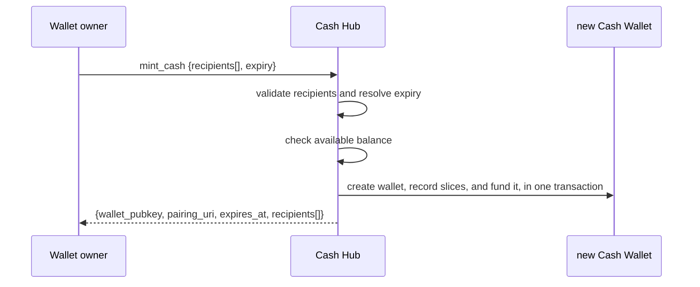
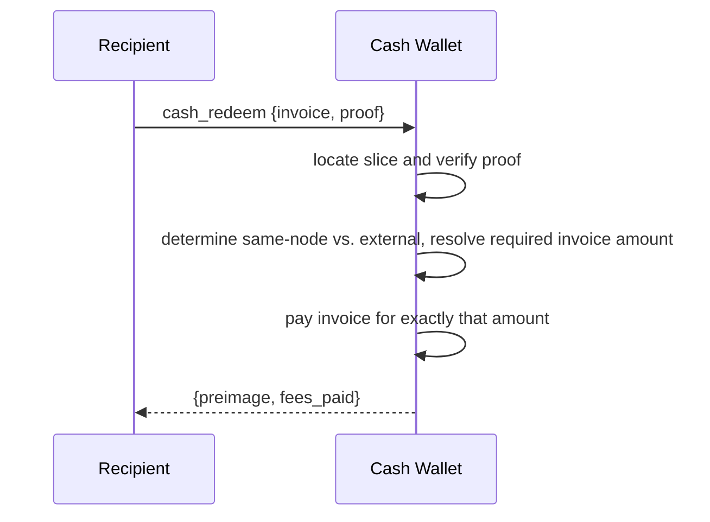
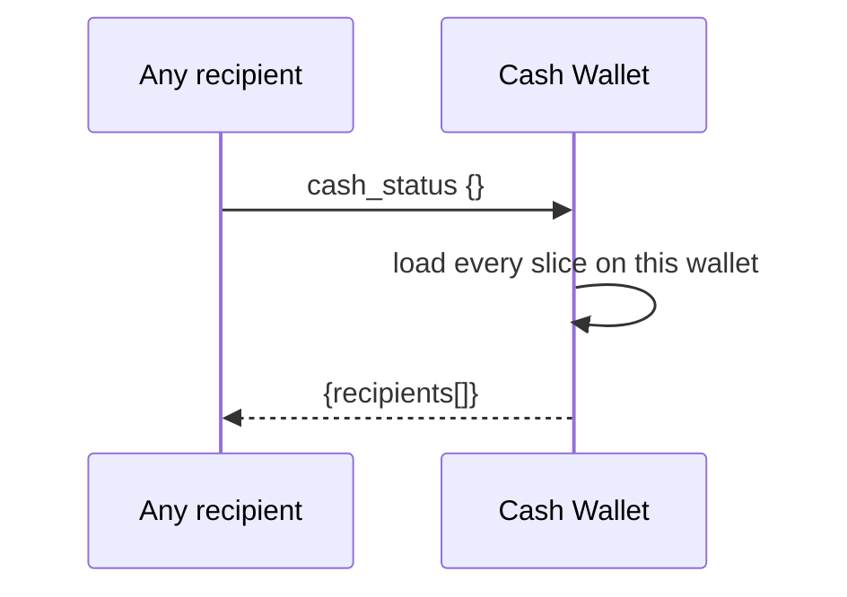
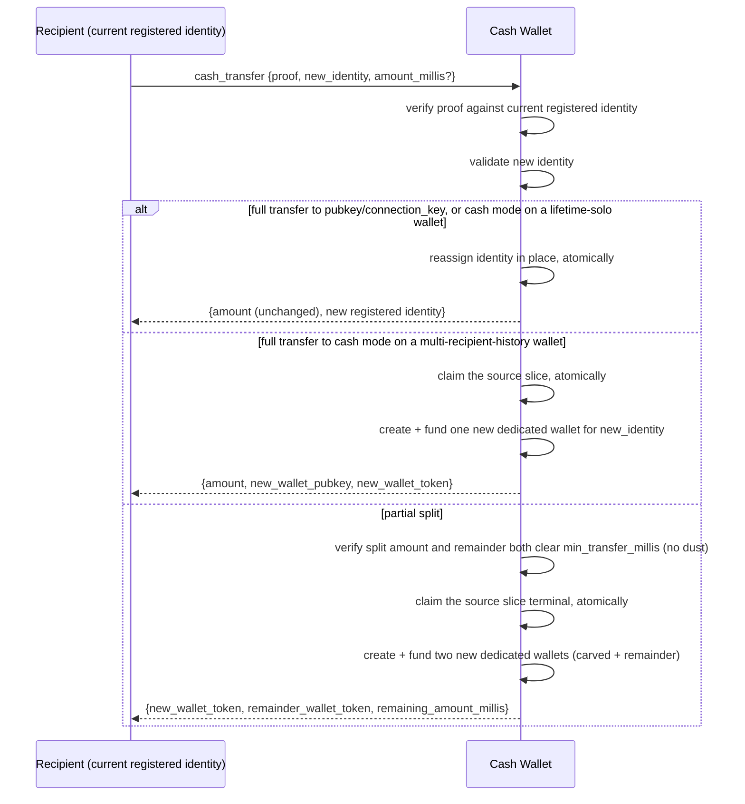
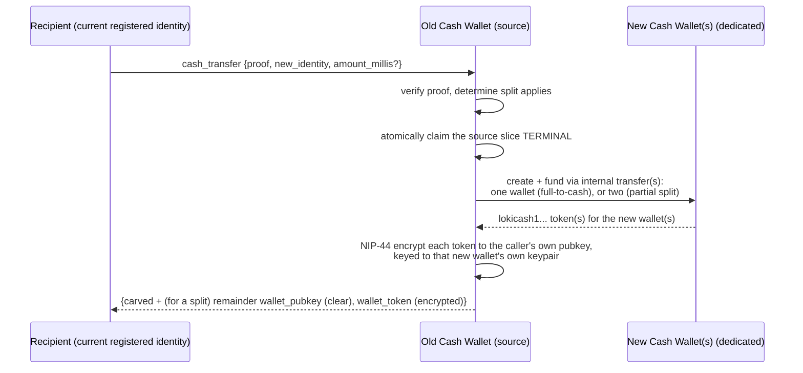
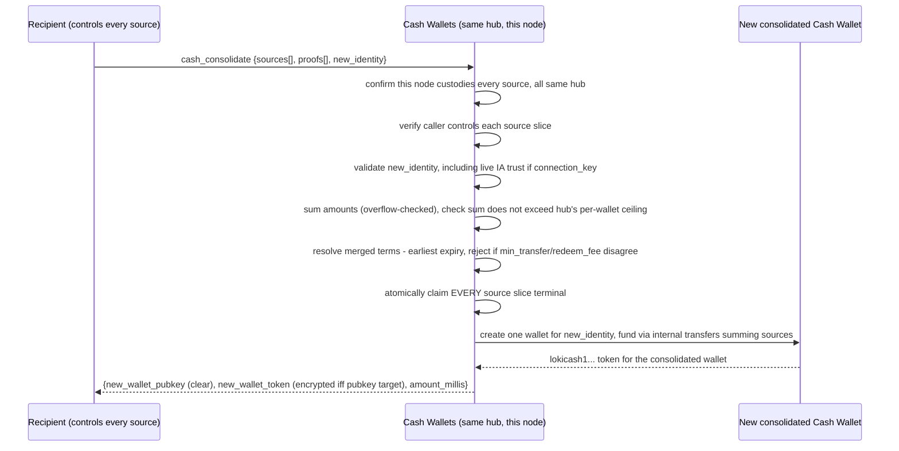
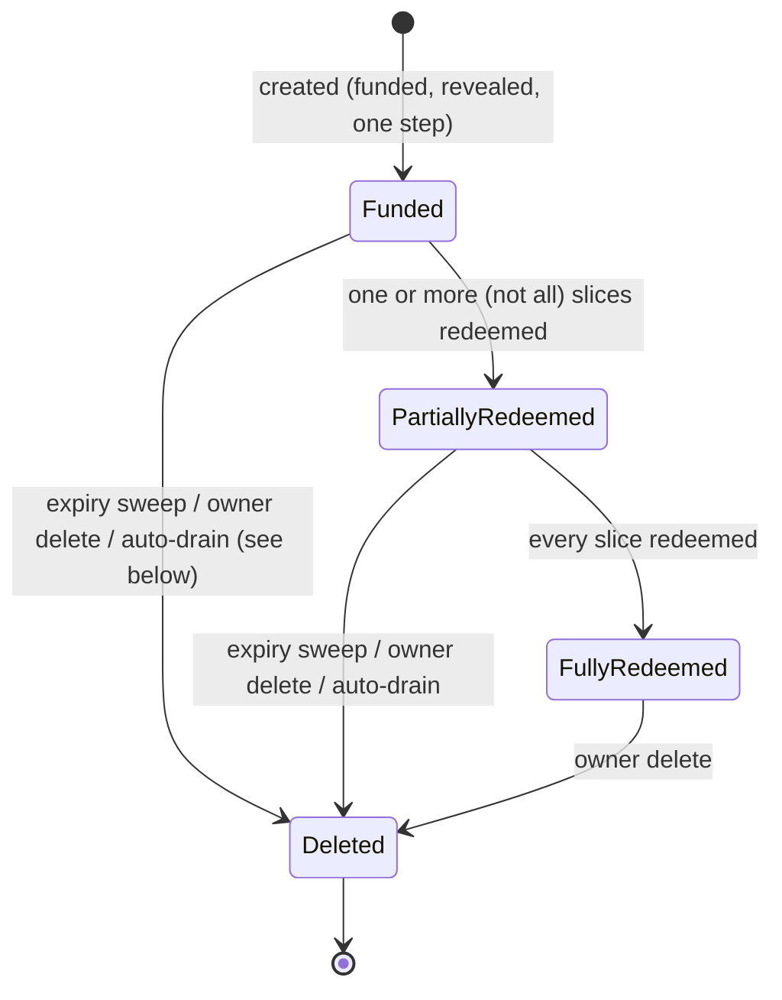
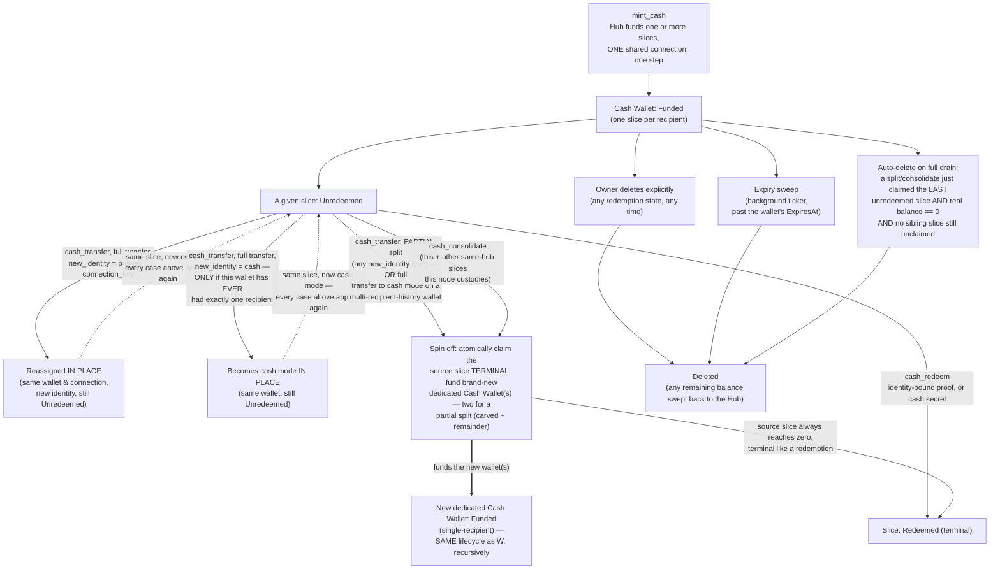

NIP-CASH
========

Cash Hub
--------

`draft` `optional` `nwc`

**Depends on**: NIP-47 (Nostr Wallet Connect)

## Abstract

Cash Hub is a Chaumian ecash system for energy-backed Lightning coins — flokicoin, Bitcoin, and any other
coin this format extends to. It mints **cash tokens**: bech32 strings (`lokicash1...` for flokicoin,
`satscash1...` for Bitcoin) that carry real, spendable value the moment they're minted, as a
specially-scoped NWC connection (§The Cash Token).

Send one the way you'd hand over a bill — in a zap, a chat message, read out loud, even to someone offline
with no wallet set up yet. Redeem it to a Lightning invoice, hand the whole thing on, or split off part of
it while keeping the rest (§Transferring and Splitting a Slice) — no Lightning hop, no node of the recipient's own required.

A wallet owner can mint cash for a whole named list at once, before anyone's ready to receive — a hackathon
prize list, a group zap, fifty people off a sign-up sheet — and each one redeems whenever they're ready.
Every recipient shares one connection safely because a share can optionally be bound to a specific
identity — a Nostr pubkey, or a web identity vouched for by an Identity Authority — so nobody can grab
someone else's share (§Data Model). A share meant for exactly one recipient can skip the binding and stay a
bare secret instead: ordinary cash ecash (§Cash-Mode Slices).

## Motivation

Ecash already means mint-once, transfer-before-redemption value: hand a note to someone else with no
Lightning hop, redeemable whenever they're ready. Getting it today means adopting a separate mint protocol
and a separate wallet, outside the tools people already use. NIP-47 already gives Nostr a standard way to
hand out scoped spending access to a wallet — Cash Hub builds ecash's value directly on top of that instead
of beside it, so anything that already speaks NWC can mint, hold, and redeem a cash token.

A bare secret has no address — no way to aim it at someone before they're reachable. §Data Model's identity
binding adds that: mint cash for a named list of recipients today, and let each one redeem it, or move it
on to someone else, once they're online.

## Non-Goals

This document doesn't define membership or eligibility policy. A Cash Hub has no concept of "who's
allowed to receive cash" — the `mint_cash` caller decides, per call, whether each recipient's share
goes to a named identity (`pubkey` or `connection_key`) or to no one in particular (`cash` mode,
§Cash-Mode Slices) — plain cash, redeemable by whoever holds it. Naming a recipient is never mandatory.

## Terminology

- **cash token**: a bech32 string like `lokicash1...` (flokicoin) or `satscash1...` (Bitcoin) — the
  NIP-19-style credential a recipient holds and redeems. For a single-recipient wallet it doubles as "the
  bill" itself, the way physical cash does; for a multi-recipient wallet it's shared access to a pool of
  several recipients' independent shares instead (see the next entry). See §The Cash Token.
- **Cash Wallet**: the NWC connection a cash token's pairing data decodes to — one connection string, shared
  by every recipient it was created for (or, after a transfer/split, by exactly one recipient — see
  §Transferring and Splitting a Slice). This is the custody/transport mechanism a cash token rides on, not a separate
  end-user-facing concept: a recipient interacts with "their cash," never with "their wallet."
- **Cash Hub**: the wallet owner's own connection for minting cash tokens. It spends from its own
  balance to fund each one.
- **recipient / slice**: one `(identity, amount)` pair inside a Cash Wallet. A wallet's total funding MUST
  equal the sum of its slices. A slice's identity MAY be reassigned pre-redemption via `cash_transfer`; its
  amount is immutable — a split consumes the slice whole and re-mints fresh wallets rather than rewriting it
  (§Transferring and Splitting a Slice).
- **identity**: an OPTIONAL binding on a slice, checked at redemption instead of trusting mere possession
  of the connection — a raw Nostr `pubkey`, or a `connection_key` (an opaque identifier an Identity
  Authority vouches for, standing in for a Web Identity — a Discord handle, an email, a domain — for a
  recipient not on Nostr yet). A slice left unbound is `cash` mode (§Cash-Mode Slices): ordinary ecash,
  redeemable by whoever holds its secret. A `connection_key`'s `identity_value` MUST be computed as
  `hex(SHA256(platform + ":" + externalID))` — the same deterministic formula NIP-IC's `ConnectionKey`
  defines — so two independent implementations deriving a connection_key for the same (platform, externalID)
  pair always agree, and a real NIP-IC-issued attestation's own `d`-tag matches without coordination.
- **cash mode**: the mode a slice is in when it carries no identity binding at all — `identity_type:
  "cash"` on the wire, with its secret carried as `cash_secret`. An earlier revision of this document
  called this mode `bearer`, with the secret field named `bearer_secret`; that spelling is gone.
  Implementations MUST send and accept only `cash`, and MUST reject `bearer` as an unknown identity type.
  The rename is confined to those two names: a cash-mode slice's `identity_value` is still the SHA-256
  commitment of its secret, so tokens and secrets issued under the old spelling stay redeemable across the
  change. See §Cash-Mode Slices.
- **Identity Authority (IA)**: a third party the wallet owner trusts to attest, via a kind-35522 event
  (NIP-IC's own Attestation kind — this document verifies it, it doesn't define it; see §Security
  Considerations), that a `connection_key` belongs to a given Nostr pubkey, or to the Web Identity behind it.
- **min_transfer_millis**: a floor, in millis, on how small a piece a split may carve off or leave behind
  (zero = no floor). See §Transferring and Splitting a Slice.
- **redeem_fee_ppm**: a parts-per-million rate charged on a slice only when `cash_redeem` resolves to an
  external Lightning payment (zero = free). See §The Redeem Fee.
- **millis**: this document's amount unit — one-thousandth of whatever base unit the connection's own coin
  uses for Lightning-payable amounts (milli-satoshi for a Bitcoin-backed Cash Hub, milli-loki for a
  flokicoin-backed one, and so on). Fixed per Cash Hub by which coin it mints for; never mixed within one
  wallet or one call.

Both `min_transfer_millis` and `redeem_fee_ppm` are Hub-level defaults, stamped onto each slice at creation
and thereafter fixed on that slice and inherited unchanged across splits (§The Redeem Fee).

## Methods

| Method | Caller | Scope | Purpose |
|---|---|---|---|
| `mint_cash` | wallet owner, over the Cash Hub connection | `cash_hub` | Fund and mint cash tokens for one or more recipients |
| `cash_redeem` | a recipient, over the Cash Wallet connection | `cash_redeem` | Collect one recipient's exact slice — identity-bound or `cash` (§Cash-Mode Slices) |
| `cash_transfer` | a recipient, proof-gated against their current registered identity | `cash_transfer` | Reassign an unredeemed slice's identity, or split part of its value off into a new cash token — see §Transferring and Splitting a Slice |
| `cash_consolidate` | a recipient controlling every source slice, proof-gated against each | `cash_consolidate` | Combine several same-hub slices this node custodies into one new cash token — see §Consolidating Tokens |
| `cash_status` | any holder of the Cash Wallet connection | `cash_redeem` | The bill's state: the read-only roster of every recipient, including each slice's redeem fee quote, or a tombstone for a destroyed bill — see §Cash Status |

`cash_redeem`, `cash_transfer`, and `cash_consolidate` each take a `proof` (or, for a `cash` slice,
`cash_secret`) authenticating the caller against the slice they're acting on. That proof, when present,
MUST be a **kind-23198** event — this document's own event kind, defined nowhere else. It is single-use,
freshly signed for each call, and never independently published to a relay (it only ever travels embedded
inside an already end-to-end-encrypted NIP-47 request body) — see each method's own Request section for
exactly what it must bind to. Kind 23198 is deliberately not kind 35521: that number belongs to NIP-IC's
own, structurally incompatible, long-lived Identity Connection claim.

## Data Model

This section describes what a Cash Hub, and the wallets it creates to hold minted cash, MUST be able to
represent. It's not a wire format or a storage schema — how an implementation stores or names this state is
outside this document's scope.

A Cash Hub MUST maintain, for itself:

- a ceiling on the total cash a single Cash Wallet created from it may carry;
- a ceiling on, and default value for, how long a Cash Wallet's cash may remain unredeemed. This ceiling
  MAY instead be "never" (no ceiling at all) — a Hub configured this way imposes no expiry on any cash it
  mints unless the `mint_cash` caller requests one of their own (§Minting Cash);
- a default value for `min_transfer_millis` (§Transferring and Splitting a Slice), applied to every slice a freshly-minted
  wallet carries. Zero (no floor) is a valid default;
- a default value for `redeem_fee_ppm` (§The Redeem Fee), applied to every slice a freshly-minted wallet
  carries. Zero (free) is a valid default. It is a parts-per-million rate, so it MUST be bounded at
  1,000,000 — the whole slice. A Hub MUST reject a configured value above that bound rather than clamp it,
  since a silently-clamped fee would misreport what a recipient is about to be charged;
- the retention window for answering about a destroyed bill (§Answering About a Destroyed Bill), in seconds.
  Zero disables tombstones. It MUST be bounded by the same absolute bound the expiry ceiling uses
  (§Minting Cash, `expiry`), for the same representational reason and with the same
  reject-rather-than-clamp requirement;

For each Cash Wallet it creates, an implementation MUST be able to determine which Hub minted its cash —
§Lifecycle and Deletion needs this for its reclaim behavior.

For each recipient slice, an implementation MUST track:

- the identity type and value (§Terminology) currently registered for this slice;
- the attesting Identity Authority's pubkey, for `connection_key`-mode registered identities;
- the committed amount, fixed for the slice's whole life — a redemption, a split, or a consolidate
  consumes the slice entirely; nothing ever rewrites it to a smaller value in place (§Transferring and Splitting a Slice);
- whether, and when, the slice has been redeemed;
- this slice's own `min_transfer_millis` floor and `redeem_fee_ppm` rate — fixed when the slice was created,
  from the Hub's default or inherited from the source slice it was split from (§The Redeem Fee);
- whether the slice's value was moved into a brand-new dedicated Cash Wallet, either in full or as part
  of a split, and if so, which one — purely informational (an implementation MAY surface this for an
  operator's own bookkeeping); it does not change how any other guard in this document treats the slice.
  A wallet created this way SHOULD, symmetrically, record which slice it was split from, for the same
  informational purpose, in the reverse direction.

An implementation MUST treat a slice's registered identity as mutable pre-redemption (via an in-place
reassignment), but its committed amount as immutable, exactly as §Transferring and Splitting a Slice
describes.

For a `cash`-mode slice (§Cash-Mode Slices), the above degenerates: there's no registered identity, only a
secret to verify a redemption against. An implementation MUST be able to verify a presented cash secret
without persisting it in any form that discloses it — a one-way commitment, not the secret itself.

A Cash Wallet MUST be created, funded, and made usable in one step. Implementations MUST NOT introduce an
intermediate state where the wallet exists but isn't yet funded, or isn't yet reachable by its
recipients. Once created, a Cash Wallet's budget, expiry, and any system-assigned label MUST NOT be
alterable through whatever general-purpose connection-management interface the implementation offers for
other connection types. These values are fixed when the wallet is created.

## Minting Cash


```mermaid
sequenceDiagram
    participant Caller as Wallet owner
    participant Hub as Cash Hub
    participant Wallet as new Cash Wallet

    Caller->>Hub: mint_cash {recipients[], expiry}
    Hub->>Hub: validate recipients and resolve expiry
    Hub->>Hub: check available balance
    Hub->>Wallet: create wallet, record slices, and fund it, in one transaction
    Hub-->>Caller: {wallet_pubkey, pairing_uri, expires_at, recipients[]}
```

### Request

```jsonc
{
  "recipients": [
    {"identity_type": "pubkey", "identity_value": "<hex pubkey>", "amount_millis": 21000},
    {"identity_type": "connection_key", "identity_value": "abc123", "ia_pubkey": "<hex IA pubkey>", "amount_millis": 5000}
  ],
  "expiry": 86400 // seconds
}
```

A `cash` recipient MUST instead be the request's only recipient — a cash-mode slice's wallet is always
single-recipient, never mixed with a `pubkey`/`connection_key` entry or a second `cash` entry
(§Cash-Mode Slices, §Redemption Metadata):

```jsonc
{
  "recipients": [
    {"identity_type": "cash", "amount_millis": 3000}
  ]
}
```

- `recipients` — MUST contain at least one entry, and an implementation MAY cap how many (this
  implementation caps at 100; `cash_consolidate` deliberately uses the same limit for its `sources`, so the
  two batch operations stay symmetrical — §Consolidating Tokens). A request over the cap MUST be rejected
  whole, never partially fulfilled: a caller cannot be left guessing which recipients were funded. Each
  entry's `identity_type` MUST be `pubkey`,
  `connection_key`, or `cash`. A `connection_key` entry MUST also carry `ia_pubkey`. A `cash` entry
  MUST carry neither `identity_value` nor `ia_pubkey` — the Hub generates its secret (§Cash-Mode Slices). A
  `cash` entry MUST be the request's only entry; a request mixing a `cash` entry with any other entry
  MUST be rejected in its entirety, not just that one recipient.
- `expiry` — OPTIONAL. If omitted or zero, it MUST default to the Hub's own expiry ceiling (§Data Model) —
  which itself MAY be "never," in which case an omitted/zero `expiry` here produces a Cash Wallet that
  never expires, not an already-expired one. A caller MAY still request its own, finite `expiry` even when
  the Hub's own ceiling is "never"; there is no *Hub-configured* ceiling to cap it against in that case, so
  it MUST be honored exactly up to whatever absolute bound the implementation's own time representation
  imposes. Such a bound is a representational limit, not a policy: it MUST be far beyond any lifetime a
  caller would legitimately request, and a request exceeding it MUST be rejected rather than silently
  clamped. This implementation bounds it at 100 years, sized to stay clear of its nanosecond-resolution
  wraparound.

`min_transfer_millis` is deliberately NOT a request field here — it's a Hub-level setting (§Data Model),
applied uniformly to every recipient of a freshly-minted wallet from the Hub's own current configuration,
not supplied per call. A wallet owner who wants a different floor for one specific payout configures a
separate Cash Hub with its own settings, rather than overriding it per call.

### Response

```jsonc
{
  "wallet_pubkey": "<hex>",
  "pairing_uri": "nostr+walletconnect://...",
  "cash_token": "lokicash1...",
  "expires_at": 1720000000, // omitted entirely if this wallet never expires — see §Data Model and this
                             // section's own Processing Algorithm, step 4
  "recipients": [
    {"identity_type": "pubkey", "identity_value": "...", "amount_millis": 21000},
    {"identity_type": "connection_key", "identity_value": "abc123", "amount_millis": 5000}
  ]
}
```

`cash_token` (§The Cash Token) packages the same pairing data as `pairing_uri` — the two MUST
decode to an identical wallet pubkey, secret, and relay set. Either string alone is a fully sufficient
connection credential; a recipient only ever needs one of them, not both.

**A Hub MUST NOT return an empty `cash_token`.** Token encoding can fail where URI construction cannot —
the mint signature is best-effort and the TLV stream has length limits a long relay URL can exceed — and the
tempting response is to emit `""` and rely on `pairing_uri` still being valid. That is not safe: a client
that prefers the token, or that treats the field's presence as meaning it is usable, receives something that
looks like a credential and is not, with nothing indicating which of the two failed. A Hub that cannot
produce the token MUST either omit the field entirely, so a client's own absent-field path handles it, or
fail the mint. This matters most for a single-`cash` recipient, whose secret is shown exactly once: a
response that silently carries half a credential can lose that value irrecoverably.

For the single-`cash`-recipient request shape above, the response's `recipients` entry instead carries
the generated secret:

```jsonc
{"identity_type": "cash", "cash_secret": "<opaque, high-entropy, shown once>", "amount_millis": 3000}
```

A `cash` recipient's `cash_secret` appears in this response and nowhere else, ever (§Cash-Mode Slices).

#### `idempotency_key`

**OPTIONAL, and any caller that retries SHOULD send one.**

`mint_cash` is the only value-creating method with no replay protection of its own. A
`cash_transfer` or `cash_consolidate` source carries a signed proof whose nonce the Hub burns, so a
resend is refused by construction; `mint_cash`'s parameters are plain identity and amount fields with
nothing unique in them. A caller whose retry logic reads a timeout as "it failed" therefore resends
the same logical request and the Hub mints and funds a **second** wallet.

A timeout does not mean the mint did not happen. The Hub's funding step is complete and durable
before any response is built, so the usual case is a response the caller never saw rather than work
the Hub never did.

The key is scoped to the Hub that received it: two Hubs are two ledgers, and one Hub's key MUST NOT
affect another's. It is opaque to the Hub, which MUST NOT derive meaning from its contents.

**A repeat MUST be refused, not answered with the original result.** This is a deliberate limit
rather than an implementation shortcut: a `cash`-mode mint's secret exists only in the reply the
caller missed, because the Hub keeps a one-way commitment and never the secret (§Cash-Mode Slices),
so there is nothing for it to replay. A Hub MUST NOT store recipients' secrets in order to make
replay possible — that trades a double-mint for a worse exposure. What an `idempotency_key` buys is
that the money is not created twice; recovering a lost `cash_secret` is not something this protocol
can offer, and a caller that cannot tolerate losing one SHOULD mint to a `pubkey` recipient instead.

### Processing Algorithm

On receiving `mint_cash`, the Hub MUST, in order:

1. Serialize against any other concurrent `mint_cash` attempt for this same Hub, however many
   interfaces the implementation exposes for issuing this request. Two concurrent requests must never
   both proceed past a stale balance read. A request that can't be serialized MUST be rejected, not
   queued.
2. Validate every recipient. `amount_millis` MUST be strictly positive. The running sum of all recipients'
   amounts MUST be computed with an explicit overflow check, rejecting before an unsigned wraparound can
   occur, and MUST NOT exceed the Hub's own per-wallet funding ceiling (§Data Model). If any recipient is
   `cash`-mode, `recipients` MUST contain exactly that one entry and no other — reject the entire
   request otherwise (§Cash-Mode Slices, §Redemption Metadata).
3. For each `connection_key`-mode recipient, verify its `ia_pubkey` is on the wallet owner's trusted
   Identity Authority allowlist right now. An untrusted or unknown IA MUST reject the entire request, not
   just that recipient. For each `cash`-mode recipient, generate its secret now, with enough entropy
   that guessing it is infeasible (§Cash-Mode Slices). A caller-supplied `cash_secret` at this step MUST be
   rejected — the Hub is the only party that can vouch for the entropy behind it.
4. Resolve `expiry`. If the Hub's own expiry ceiling is "never," an omitted/zero `expiry` here MUST produce
   a Cash Wallet with no expiry at all — never a zero-duration, already-expired one — and any explicit,
   positive `expiry` the caller does supply MUST be honored exactly, since there's no Hub-configured ceiling
   to check it against, subject only to the implementation's own representational bound (§Minting, `expiry`). Otherwise (the Hub's own ceiling is a real, positive value): if omitted or zero, set it to the
   Hub's own expiry ceiling; otherwise it MUST NOT exceed that ceiling.
5. Verify the Hub's own available balance is at least the sum of all recipients' amounts.
6. If the request carries an `idempotency_key`, and this Hub has already served one with the same
   key, **the Hub MUST refuse rather than mint again**, and SHOULD name the Cash Wallet that key
   already produced. Checked here, after validation and before any state is created: a request that
   was never going to succeed has nothing to be idempotent about, and recording a key for a mint
   that did not happen would lock out the caller's legitimate retry.
7. Create the Cash Wallet connection, record one slice per recipient — stamping each with the Hub's
   current `min_transfer_millis` and `redeem_fee_ppm` defaults (§Data Model) and a one-way commitment of
   the secret for `cash`-mode slices, never the secret itself — and perform a single internal transfer
   from the Hub to the new connection for the full sum. This MUST be atomic: a failure at any point after
   this step MUST leave no partial state. If an `idempotency_key` was supplied, record it against the
   wallet now, in the same atomic step.
8. Return the pairing connection string and the resolved recipient list, with each `cash` slice's
   plaintext secret included this one time.

A request that fails any check above MUST be rejected before step 7. No partial wallet, slice, or
transfer is ever observable from a rejected request.

## Redeeming a Slice (`cash_redeem`)

A recipient collects their exact slice by presenting a fresh Lightning invoice over the Cash Wallet
connection, together with proof binding them to the slice they're redeeming.


```mermaid
sequenceDiagram
    participant Caller as Recipient
    participant Wallet as Cash Wallet

    Caller->>Wallet: cash_redeem {invoice, proof}
    Wallet->>Wallet: locate slice and verify proof
    Wallet->>Wallet: determine same-node vs. external, resolve required invoice amount
    Wallet->>Wallet: pay invoice for exactly that amount
    Wallet-->>Caller: {preimage, fees_paid}
```

### Request

```jsonc
{
  "invoice": "lnbc...",
  "amount": 5000,                  // OPTIONAL — see below
  "identity_type": "pubkey",       // the registered identity the caller is claiming
  "identity_value": "<hex pubkey>",
  "identity_event": "{...}"        // a kind-23198 event, JSON-ENCODED AS A STRING
  // "attestation_event": "{...}"  // connection_key mode only, likewise a JSON string
  // "cash_secret": "<opaque>"     // cash mode instead of the three identity_* fields
}
```

**The proof travels as sibling fields, not as a nested `proof` object.** `identity_event` and
`attestation_event` each carry a complete Nostr event **serialized to a JSON string**, not an embedded
JSON object — a decoder must parse the string's contents as a second step. This is a wire detail an
implementation cannot guess, so it is stated here rather than left to §Methods' own description of the
kind-23198 proof.

- `invoice` — REQUIRED. A fresh Lightning invoice, generated by the recipient at redemption time, for
  exactly the slice's committed amount minus its own `redeem_fee_ppm` cut (§The Redeem Fee) — or for the
  full committed amount, fee-free, whenever the payment resolves to one the Hub's own node is both sending
  and receiving. A slice pays exactly once, in full — there's no partial or repeated redemption. (To
  receive only part of a slice's value without redeeming, see §Transferring and Splitting a Slice instead — that's a
  different operation from `cash_redeem`, which always resolves the slice's entire current amount in one
  shot.)
- `amount` — OPTIONAL. Overrides the amount of an **amountless** invoice. It MUST NOT be used to alter an
  invoice that already carries one, and it never changes what the slice is worth: the resolved amount is
  still checked against the slice's committed amount and its `redeem_fee_ppm` cut exactly as if the invoice
  had named it.
- `identity_type`, `identity_value`, `identity_event` — REQUIRED for an identity-bound slice, and REQUIRED
  together. The kind-23198 `identity_event` MUST bind the caller to that slice's *current* registered
  identity and to this specific invoice, so a captured proof can't be replayed against a different one.
- `attestation_event` — REQUIRED additionally when the slice's identity is `connection_key`: a
  currently-trusted Identity Authority's attestation (§Terminology).
- `cash_secret` — REQUIRED instead of all of the above when the slice's identity is `cash`
  (§Cash-Mode Slices). It is the whole proof, which is why §Cash-Mode Slices requires Hub-generated entropy.

### Processing Algorithm

On receiving `cash_redeem`, the wallet MUST, in order:

1. Locate the slice this request is redeeming. If none matches, or it's already redeemed, reject.
2. Verify the caller is authorized to redeem it: for an identity-bound slice, verify `proof` against the
   slice's current registered identity, and, for `connection_key` mode, that the attesting Identity
   Authority is still trusted right now — not just at wallet-creation time (§Security Considerations). For
   a `cash` slice, verify the presented `cash_secret` (§Cash-Mode Slices).
3. Determine whether this redemption will resolve to a payment the Hub's own node is both sending and
   receiving (§The Redeem Fee) — this determination MUST use the same predicate the wallet's own payment
   path uses internally, not a separate, potentially-divergent check. If so, the required invoice amount
   is the slice's full committed amount and the fee is zero; otherwise it's the slice's committed amount
   minus its own `redeem_fee_ppm` cut. A slice's committed amount is immutable (§Data Model), so this
   value can't shift under a racing operation — but the slice's *claimed* state can, so the amount is
   resolved and paid within the same atomic claim below.
4. Pay `invoice` and mark the slice redeemed, atomically — the claim MUST be first-wins, so a slice a
   concurrent `cash_transfer`/`cash_consolidate` already claimed is rejected here rather than paid twice
   (§Security Considerations). A failure after payment begins MUST NOT leave the slice redeemable a second
   time. If a nonzero fee applies, settle it against the Hub
   (§The Redeem Fee) as part of the same payout's settlement — not as a separate, later operation the
   caller could observe as a distinct step.
5. Return `{preimage, fees_paid}` — `fees_paid` is the recipient's own borne redeem fee (zero for a
   same-node redemption, per §The Redeem Fee), not the real Lightning routing cost, which is never charged
   to the recipient.

A request that fails step 1, 2, or 3 MUST be rejected before step 4.

## The Redeem Fee

A `cash_redeem` MAY carry a fee; `cash_transfer` (§Transferring and Splitting a Slice) MUST NOT.

- **When it applies.** Only when a `cash_redeem` resolves to a real external Lightning payment. A
  redemption the Hub's own node both sends and receives — paid to a Circle Wallet, an isolated Simple
  Subwallet, a standard connection, or another cash_wallet on the same node — is always fee-free, and no
  fee ever applies to `cash_transfer`.
- **How much.** A flat base plus a proportional cut: `redeem_fee_base` plus `redeem_fee_ppm`
  (parts-per-million) times the slice's own committed amount. Either part MAY be zero.
- **Who pays.** The redeeming recipient, deducted from their own payout — never charged against another,
  not-yet-redeemed slice. `cash_status` (§Cash Status) quotes the exact fee and net amount up
  front, so a recipient always knows what `cash_redeem` will pay out before they call it.

The base exists because routing cost does not scale with the payment. A purely proportional fee earns
almost nothing on a small slice while the Hub still pays a full route to deliver it, and that gap comes
out of the Hub's own balance — the Hub subsidising someone else's withdrawal. A base makes the withheld
fee cover the delivery it is withheld for.

**The fee MUST NOT exceed the amount it is charged on, and a Hub MUST refuse a `cash_redeem` whose
payout would be zero** rather than performing it. The two rules are one consequence: once the fee is
capped at the slice, a slice at or below the base quotes a payout of zero, and a zero payout matches
an amountless invoice exactly — so without the refusal the slice is consumed to pay nothing, and the
recipient reads a success. The refusal MUST leave the slice claimable, and SHOULD say that the slice
can still be consolidated with another or redeemed same-node, because both remain true: a slice below
the base fee is not worthless, it is only not independently withdrawable to Lightning.

This is deliberately a redeem-time rule, not a minting rule. Whether a slice can pay out depends on
whether the redemption resolves same-node, which is unknowable when the slice is created, and a Hub
that refused to mint such a slice would block transferring and consolidating it as well.

An implementation MUST decide same-node-ness with the exact same predicate its own payment path uses to
decide whether to skip real Lightning routing — not a second check that could drift from it and either
overcharge a same-node redemption or undercharge a genuinely external one.

A slice's `redeem_fee_ppm` and `min_transfer_millis` (§Transferring and Splitting a Slice) are both fixed the moment the
slice is created — from the Hub's current default (§Data Model) for a freshly-minted wallet, or inherited
unchanged from the source slice for one produced by a split — and never change afterward, even if the Hub's
default later changes or the slice changes hands via `cash_transfer`. A recipient's economics MUST NOT
shift underneath them because the operator adjusted a setting after the value was committed.

### Why

A redemption spends the operator's real inbound/outbound Lightning capacity — a scarce resource they
provision and pay to maintain. A transfer or split only moves value already committed at `mint_cash` time,
with no Lightning hop, so there's nothing to price. Charging the redeeming recipient's own payout, rather
than the shared wallet, is what stops one recipient's routing cost from ever coming out of another
recipient's committed slice — the flaw an exactly-funded, shared multi-recipient wallet would otherwise
have (§Security Considerations).

**The fairness invariant.** The redeeming recipient's payout, plus the Hub's settlement-time
reconciliation, always debits the shared wallet by exactly the redeemed slice's committed amount — never
more, whatever the real routing cost turned out to be — leaving every other recipient's not-yet-redeemed
slice untouched. The Hub nets the difference between the quoted fee and the real routing cost on each
external redemption: revenue when the rate covers cost, an absorbed loss (recorded either way) when it
doesn't — never at any recipient's expense.

## Cash Status (`cash_status`)

Any holder of a Cash Wallet connection MAY call `cash_status` to ask what state the bill is in. It is the
only read method a bill has, and it answers one of two ways: the roster of recipients the bill was created
for — scoped per §Scoping the Roster — or, for a bill the Hub has already destroyed, a tombstone saying so
(§Answering About a Destroyed Bill).

**A shared connection cannot identify its caller.** Every recipient of a bill holds the *same* connection
string (§The Pairing Connection), so nothing derived from the connection alone can tell which recipient is
asking — which is why `cash_status` is served over the private transport only, where each item carries its
own signed proof. Asked with `scope: all`, the roster remains a read-only shared view: every recipient sees
every other recipient's row, matching the transparency model `get_balance` already has on this
same connection type (§Scope Surface). Asked with `scope: mine`, or with no scope at all, it returns only the
calling recipient's own row — a Hub MUST honour that and MUST NOT widen it (§Scoping the Roster).

This paragraph previously ended "an implementation MUST NOT filter it to the caller's own slice", which
contradicted §Scoping the Roster once scoping existed. That sentence was written when a Hub genuinely could
not tell its recipients apart, so filtering was not implementable; the private transport identifies the
caller per item, and the narrow answer became both possible and the default.

### Scoping the Roster

The private transport changes that premise. There, every item carries a kind-23192 proof signed by one
specific recipient's own identity key (§Item Proofs), so a Hub knows exactly who is asking — for the first
time, scoping is possible at all. It also carries a kind-23193 bill proof (§Bill Proofs), which is what
lets a Hub say `NOT_FOUND` to a holder who owns no slice instead of falling silent.

`cash_status` therefore takes an OPTIONAL `scope`:

| value | answer |
|---|---|
| `all` | every recipient's row — the shared roster above |
| `mine` | only the calling recipient's own row |

**Absent means `mine`.** The safe default: a caller who says nothing receives the smallest answer and
learns nothing about their co-recipients. Around 300 bytes rather than 28,500 for a 100-recipient bill,
which also removes the common cause of a reply outgrowing its envelope (§Chunked Replies).

There is no second default to describe, because `cash_status` is served over the private transport only
(§The Private Transport). The standard transport could never have scoped this method — every recipient of a
bill holds the SAME connection string, so a Hub receiving the request there cannot tell one from another and
can only answer everyone or no one — and that is among the reasons it no longer serves it.

A Hub MUST determine "mine" from the item proof's own signer, never from anything the item asserts about
itself. And `mine` is a *view*, not an authorization boundary: it changes what is returned, never what a
caller may do, so a Hub MUST NOT treat having asked for `mine` as narrowing any later call's permissions.

A caller whose item proof verifies but who holds no slice of this bill receives no rows. A Hub MUST NOT
widen to the full roster on no match, which would turn every mismatch into a full disclosure. Where the
caller has also proved possession of the bill — as every item must (§Bill Proofs) — the Hub MUST instead
answer `NOT_FOUND`, which says "this bill is not addressed to you" without describing it.

This method was called `list_recipients` in an earlier revision. That alias is **removed**: everything
before this revision was a release candidate and nothing was minted under it, so no client needs the
compatibility.


```mermaid
sequenceDiagram
    participant Caller as Any recipient
    participant Wallet as Cash Wallet

    Caller->>Wallet: cash_status {}
    Wallet->>Wallet: load every slice on this wallet
    Wallet-->>Caller: {recipients[]}
```

### Request

```jsonc
{
  "scope": "mine"   // OPTIONAL: "all" | "mine". Absent means "mine" on the private
                    // transport and "all" on the standard one — see
                    // Absent means "mine" — see §Scoping the Roster.
}
```

An empty params object is valid and equivalent to omitting `scope`. A Hub MUST
reject a value that is neither `all` nor `mine`.

### Response

```jsonc
{
  "recipients": [
    {
      "identity_type": "pubkey",
      "identity_value": "<hex pubkey>",
      "amount_millis": 21000,
      "claimed": false,
      "redeem_fee_millis": 210,
      "net_redeemable_millis": 20790,
      "min_transfer_millis": 1000,
      "expires_at": 1720003600
    },
    {
      "identity_type": "connection_key",
      "identity_value": "abc123",
      "amount_millis": 5000,
      "claimed": true,
      "claimed_at": 1720000000,
      "redeem_fee_millis": 50,
      "net_redeemable_millis": 4950,
      "min_transfer_millis": 1000,
      "expires_at": 1720003600
    }
  ]
}
```

- `recipients` — every slice this wallet was ever created or split into, in no particular guaranteed
  order, including already-claimed ones (`claimed_at` distinguishes them).
- `redeem_fee_millis` / `net_redeemable_millis` — this slice's own `redeem_fee_ppm` (§The Redeem Fee) applied
  to `amount_millis`, and what's left after it. This is necessarily the worst-case quote: `cash_status`
  has no invoice in hand to know in advance whether a given future `cash_redeem` call will resolve to a
  same-node payment, which stays fee-free regardless of the configured rate. A slice's eventual `cash_redeem`
  MAY pay out more than `net_redeemable_millis` here (the full `amount_millis`, if same-node); it will never
  pay out less. `redeem_fee_millis` is `0` for a slice whose `redeem_fee_ppm` is `0`, for every recipient,
  same-node or not.
- `min_transfer_millis` — this slice's own split floor (§Transferring and Splitting a Slice), fixed at creation. A recipient
  MUST be able to learn this value here, before attempting a `cash_transfer` split, rather than only from a
  rejected attempt's error text — which also costs a share of whatever rate limiting the Hub applies to
  `cash_transfer`/`cash_redeem` (§Cash-Mode Slices requires that exceeding a limit is reported as a distinct
  rate-limit error, while leaving the rates themselves to the implementation).
- `expires_at` — the wallet's own redemption deadline (§Data Model). Every recipient shares one wallet-level
  deadline, so this value is identical on every row above, not a per-slice figure — it's repeated per
  recipient rather than hoisted to a single top-level field, so a consumer processing one row never needs to
  also parse a separate top-level field. Omitted entirely, never a null/zero timestamp, on a row belonging to
  a wallet that never expires, matching `mint_cash`'s own response convention (§Minting Cash).

### Processing Algorithm

On receiving `cash_status` for a bill that still exists, the wallet MUST, in order:

1. Load every slice ever recorded for this wallet, claimed or not.
2. Resolve the wallet's own `expires_at` once (§Data Model) — omitted if the wallet never expires.
3. For each slice, compute `redeem_fee_millis` from that slice's own `redeem_fee_ppm` (never the Hub's
   current default — a slice's rate is fixed at creation, §The Redeem Fee) and `amount_millis`, and
   `net_redeemable_millis` as the difference; include that slice's own `min_transfer_millis` floor unchanged;
   include the wallet's `expires_at` from step 2, identical on every row.
4. Apply `scope` (§Scoping the Roster). Absent means `mine`: only the calling recipient's own row. `all`
   returns every recipient's row, identity and amount included (§Privacy Considerations) — available on
   request, but no longer the default, and no longer the only option.

   This step previously read "MUST NOT be scoped to only the caller's own slice", which was accurate while
   the Hub could not tell its recipients apart: they share one connection string, so the only answers
   available were everyone or no one. The private transport identifies the caller per item, so the smallest
   honest answer became possible and is now the default.

### Answering About a Destroyed Bill

A Hub deletes a bill once nothing is left on it (§Lifecycle and Deletion) and then, by default, answers
nothing about it. That silence is what makes a spent bill indistinguishable from a pubkey the Hub never
served — but it is also indistinguishable from a Hub that is slow, or down, or reached over the wrong
relay. A caller cannot honestly report either: treating the timeout as retryable makes a genuinely spent
bill retry forever, and treating it as "gone" tells someone their funds are lost when the Hub is merely
unreachable. Both failures happen in practice, against bills that are perfectly fine.

A Hub therefore MAY keep answering `cash_status` about a bill it destroyed, for a **retention window** of
its own choosing, with a tombstone in place of the roster:

```jsonc
{
  "error": "spent",              // this bill existed, was spent, and is gone
  "retained_until": 1758800000   // unix seconds; past this the Hub returns to silence
}
```

This gives three outcomes where there were two:

| response | meaning |
|---|---|
| roster | the bill is live |
| `spent` + `retained_until` | definitive — the bill is gone |
| no answer | indeterminate — retry; MUST NOT be reported as spent |

- The window is measured **from the spend, not from the bill's expiry**, so a bill that never expires is
  covered too. Its length is the Hub's choice. A Hub MAY set it to zero, which opts out of tombstones
  entirely: silence from the moment the bill is destroyed. Implementations SHOULD default to a non-zero
  window, since the alternative leaves a holder unable to distinguish "spent" from "unreachable" — this
  implementation defaults to 15 days. Past `retained_until` the Hub returns to silence either way, so a
  tombstone is never wrong — only absent for old bills.
- **The window is inclusive of `retained_until` itself.** A request landing at exactly that instant MUST
  still be answered; only strictly after it does the Hub fall silent. This is stated because it is not
  self-evident from "past `retained_until`", and because the Hub **published that exact timestamp to the
  holder** — answering at the instant you told someone you would is the only reading consistent with
  having quoted it. An implementation that evaluates this boundary in more than one place MUST make those
  places agree: a Hub that admits a request at `retained_until` and then declines to answer it produces
  silence, which is precisely the indeterminate outcome this whole mechanism exists to remove.
- A Hub answering a tombstone MUST verify that the requester holds the bill's own connection. On the
  private transport that is the item's **bill proof** (§Bill Proofs), whose signer MUST equal the pubkey
  derived from the bill's pairing key. **Decryption is not authentication**, and neither is naming a
  wallet pubkey: anyone may generate a key and address a request at a bill, and a Hub that skips this
  check answers anyone — which, since wallet pubkeys are public, turns the Hub into a queryable index of
  every bill it ever issued.

  For a live bill the check is implicit on both transports, because the connection record names the
  authorized pubkey. A destroyed bill has no record left, so it MUST be performed explicitly — and can be,
  without retaining any secret: the archive keeps the bill's identifier, and the pairing key is derived
  deterministically from it (§The Pairing Connection).
- A request naming a pubkey the Hub never served, or one past its retention window, MUST still be met with
  silence.
- Only `cash_status` answers this way. `cash_redeem`, `cash_transfer` and `cash_consolidate` naming a
  destroyed bill MUST remain silent: a status read is a question about existence, where those are attempts
  to move value, and answering them would widen what a past holder of a spent secret can confirm.

**A client MUST NOT report a bill as spent or expired on the strength of a timeout alone**, whether or not
the Hub it is talking to implements this. Silence is indeterminate by construction, and a client that
treats it as definitive will tell users their money is gone during an ordinary outage.

The same applies to an **omission** on the private transport, for the same reason and more sharply: an
omission is information-free by design, so it is the single answer a Hub gives for a bill it does not
hold, a proof that did not verify, a possession proof it could not confirm, and a method it will not
serve. A client MUST NOT resend an omitted `cash_redeem`, `cash_transfer` or `cash_consolidate` blind —
it cannot be told apart from a request that WAS applied and whose reply was lost, so resending may pay
twice. `cash_status` is safe to retry, since it moves nothing.

## Transferring and Splitting a Slice (`cash_transfer`)

A recipient who hasn't redeemed their slice MAY ask to move some or all of its value on, without ever
touching a Lightning wallet themselves. Two shapes of this exist, unified under one method:

- **Transfer it all** — hand the whole slice to an identity the caller does control (which MAY be
  themselves under a different mode, e.g. converting into `cash`). No funds move in the Lightning
  sense, and no value is created. Only one thing changes: which identity is authorized to redeem, or
  transfer/split again, that one slice, for the amount it was already funded with.
- **Split off a piece** — carve `amount_millis` (less than the slice's current
  total) off for a target identity. The source slice is consumed whole, and its value re-emerges as **two
  brand-new, dedicated Cash Wallets** — one holding the carved-off `amount_millis` for the target, one
  holding the remainder for the caller's own, unchanged identity. Unlike a full transfer, this genuinely
  moves value via internal transfers, and the source slice keeps NO residual amount — it becomes terminal
  exactly like a redemption, and both pieces are reached only through their
  new connections — the reason both pieces get fresh wallets rather than an in-place rewrite is
  §Spinning a Slice Off Into a Dedicated Wallet's own concern, not repeated here.

`new_identity` MAY be `cash` (§Cash-Mode Slices) as well as `pubkey`/`connection_key`, for either shape.

### Which outcome a request produces

An implementation MUST determine the outcome as follows, in this order:

1. **`amount_millis` is present and less than the slice's current committed amount** → this is a **split**.
   The source slice is consumed whole and its value re-emerges as two brand-new, dedicated wallets
   (§Spinning a Slice Off Into a Dedicated Wallet), regardless of `new_identity`'s type or this wallet's
   recipient history: one holds `amount_millis` for `new_identity`, one holds the remainder for the caller's
   own unchanged identity. There is no in-place outcome for a split, and no residual amount left on the
   source slice.
2. **`amount_millis` is omitted, or equals the slice's current committed amount** → this is a **full
   transfer**. Its outcome depends on `new_identity`'s type:
   - `pubkey` or `connection_key` → reassigned **in place**: same wallet, same connection, only the
     registered identity changes. This is unconditional on the wallet's recipient history — redeeming or
     transferring an identity-bound slice always requires a real signed proof, never just presenting a
     shared secret, so reusing the connection is safe regardless of who else has ever held it.
   - `cash` → reassigned in place **only if** this wallet has, and has always had, exactly one recipient
     — counting every slice the wallet was ever created or has ever held, not only currently-unclaimed
     ones. Otherwise, this outcome also lands in a brand-new dedicated wallet (§Spinning a Slice Off Into
     a Dedicated Wallet) — see that section's own "Why Not Reassign in Place, for a Cash-Mode Target on a
     Shared Wallet?" for why a multi-recipient-history wallet can't take this shortcut.


```mermaid
sequenceDiagram
    participant Caller as Recipient (current registered identity)
    participant Wallet as Cash Wallet

    Caller->>Wallet: cash_transfer {proof, new_identity, amount_millis?}
    Wallet->>Wallet: verify proof against current registered identity
    Wallet->>Wallet: validate new identity
    alt full transfer to pubkey/connection_key, or cash mode on a lifetime-solo wallet
        Wallet->>Wallet: reassign identity in place, atomically
        Wallet-->>Caller: {amount (unchanged), new registered identity}
    else full transfer to cash mode on a multi-recipient-history wallet
        Wallet->>Wallet: claim the source slice, atomically
        Wallet->>Wallet: create + fund one new dedicated wallet for new_identity
        Wallet-->>Caller: {amount, new_wallet_pubkey, new_wallet_token}
    else partial split
        Wallet->>Wallet: verify split amount and remainder both clear min_transfer_millis (no dust)
        Wallet->>Wallet: claim the source slice terminal, atomically
        Wallet->>Wallet: create + fund two new dedicated wallets (carved + remainder)
        Wallet-->>Caller: {new_wallet_token, remainder_wallet_token, remaining_amount_millis}
    end
```

### Request

```jsonc
{
  // The proof travels as sibling fields, not a nested "proof" object — identical in
  // shape to cash_redeem's (§Redeeming a Slice), and identity_event/attestation_event
  // are likewise complete events JSON-ENCODED AS STRINGS.
  "identity_type": "pubkey",        // the slice's *current* registered identity
  "identity_value": "<hex pubkey>",
  "identity_event": "{...}",        // kind-23198, bound to new_identity AND amount_millis
  // "attestation_event": "{...}",  // connection_key mode only
  // "cash_secret": "<opaque>",     // cash mode instead of the three identity_* fields
  "new_identity": {"identity_type": "pubkey", "identity_value": "<hex pubkey>"},
  // new_identity MAY also carry "ia_pubkey" when identity_type is connection_key.
  // new_identity MAY instead be
  // {"identity_type": "cash", "identity_value": "<hex sha256 commitment the caller generated>"}
  // — see §Cash-Mode Slices for why identity_value is required, not server-minted, here.
  "amount_millis": 5000 // OPTIONAL — omit, or equal the slice's current amount, to transfer it
                        // all; a smaller value splits off exactly that much (§Which outcome a
                        // request produces above). A split consumes the source slice WHOLE: the
                        // remainder is not left behind on it, but re-emerges as its own brand-new
                        // dedicated wallet alongside the carved-off one — see this section's
                        // own "Split off a piece" description above.
}
```

- `identity_type`, `identity_value`, `identity_event` — REQUIRED together unless the slice's current
  identity is `cash`, in which case `cash_secret` replaces all three. The kind-23198 `identity_event`
  MUST authenticate
  the caller as the slice's *current* registered identity, and bind the proof to this specific
  `new_identity` and this specific `amount_millis` — the same anti-redirection requirement `cash_redeem`'s
  proof has toward its invoice (§Redeeming a Slice). A proof captured for one `new_identity` MUST NOT be
  replayable against a different one, MUST NOT be replayable to authorize a different `amount_millis` than
  the one it was signed for, and MUST NOT be reused a second time for the identical
  `new_identity`/`amount_millis` — see §Security Considerations for why this matters more once splitting
  exists. Concretely, the event MUST carry:
  - a `d` tag whose value is the wallet's `WalletPubkey` (same as a claim proof);
  - a `new_identity_hash` tag:
    `sha256(new_identity.identity_type + ":" + new_identity.identity_value + ":" + new_identity.ia_pubkey)`,
    hex-encoded (`identity_value` is `""` for a `cash` target, since the caller doesn't choose one ahead
    of generating it; `ia_pubkey` is `""` for every target type except `connection_key`). `ia_pubkey` MUST be
    folded into the hash, not just `identity_type`/`identity_value` — omitting it would let a captured proof
    for one `connection_key` target be replayed against the same `identity_value` under a different,
    still-trusted Identity Authority, redirecting who is authoritative to redeem the transferred slice even
    though the connection_key string itself never changed (§Security Considerations);
  - an `amount_millis` tag: the decimal string of the exact amount this request resolves to — an omitted
    request `amount_millis` (a full transfer) MUST still be bound to a concrete number: the slice's live
    full amount at signing time, never a wildcard/unbound value;
  - for `connection_key` mode only, a `connection_key` tag and an `e` tag referencing the accompanying
    `attestation_event`, same as elsewhere.
  The wallet consumes every successfully-verified proof exactly once (tracked by event ID, independent of
  `new_identity`/`amount_millis`) — a proof that failed verification, or whose subsequent operation failed
  and rolled back, is never consumed, so a legitimate caller can always retry with the identical proof.
- `cash_secret` — REQUIRED in place of `proof`, if and only if the slice's current identity is
  `cash`. A cash-mode slice has no identity capable of signing a proof; presenting its secret is the
  entire proof, exactly as it is for `cash_redeem` (§Redeeming a Slice → §Cash-Mode Slices).
- `new_identity` — REQUIRED. `identity_type` of `pubkey`, `connection_key`, or `cash`. For `pubkey`/
  `connection_key`, same shape as one `recipients[]` entry in `mint_cash` (§Minting Cash), with
  `ia_pubkey` required for `connection_key`. For `cash`, `identity_value` is REQUIRED
  (a caller-generated `sha256` commitment — see §Cash-Mode Slices) and `ia_pubkey` MUST NOT be present.
- `amount_millis` — OPTIONAL, as described above. When present, MUST be strictly positive and MUST NOT
  exceed the slice's current committed amount.

### Response

```jsonc
{
  "amount_millis": 5000,
  "identity_type": "pubkey",
  "identity_value": "..."
  // for an in-place outcome: nothing further — the response above is complete.
  // for a full transfer that spins off ONE new wallet (cash mode on a multi-recipient-history
  // wallet), additionally:
  //   "new_wallet_pubkey": "<the new wallet's WalletPubkey, in the clear>",
  //   "new_wallet_token": "<lokicash1... token, NIP-44 encrypted — see below>"
  // for a PARTIAL split, which spins off TWO new wallets, additionally:
  //   "remaining_amount_millis": 15000,   // what the caller keeps, now in its own new wallet
  //   "new_wallet_pubkey":      "<clear>",  "new_wallet_token":      "<encrypted>", // the carved piece -> new_identity (same field names as the single-wallet spin-off above)
  //   "remainder_wallet_pubkey":"<clear>",  "remainder_wallet_token":"<encrypted>"  // the remainder -> caller
}
```

This response MUST NOT ever carry a cash secret, nor any other secret capable of moving funds, in a
form decryptable by every holder of this connection — `identity_value` here is always either a public
identity or a one-way commitment the caller already supplied, never a value the wallet itself generated.
The `*_wallet_token` fields, present only for a split outcome, are the one exception that looks like it
might violate this, and doesn't: see §Spinning a Slice Off Into a Dedicated Wallet for why they're safe
despite traveling over this same shared connection. See also §Security Considerations.

### Processing Algorithm

On receiving `cash_transfer` for a given slice, the wallet MUST, in order:

1. Verify the caller is authorized to act on the slice: for an identity-bound current identity, verify
   `proof` against it, against this specific `new_identity`, and against this specific `amount_millis`
   (treating an omitted `amount_millis` as bound to "the slice's full current amount," not as unbound); for a
   `cash` current identity, verify the presented `cash_secret`. A redeemed slice has no registered
   identity left to act on; `cash_transfer` on a redeemed slice MUST be rejected.
2. Validate `new_identity`: for `pubkey`/`connection_key`, the same rules `mint_cash` applies to
   a recipient entry (§Processing Algorithm) — identity shape, and, for `connection_key` mode, that
   `ia_pubkey` is on the wallet owner's trusted Identity Authority allowlist right now. For `cash`,
   verify `identity_value` is present and is a well-formed commitment — the implementation MUST NOT
   generate a secret on the wallet's behalf here (§Cash-Mode Slices, §Security Considerations).
3. Resolve `amount_millis` against the slice's current committed amount (read fresh, not from an earlier
   lookup) and determine the outcome per §Which outcome a request produces above. If `amount_millis` is
   present and exceeds the slice's current amount, reject.
4. If the outcome is a partial split, additionally verify `amount_millis` is at least the slice's own
   `min_transfer_millis` (0 = no floor), and that the remainder it would leave behind (current amount
   minus `amount_millis`) is either exactly zero or itself at least `min_transfer_millis` — a split that
   would leave unmovable dust behind MUST be rejected rather than silently allowed (§Transferring and Splitting a Slice).
5. For an in-place reassignment: atomically transfer the slice. The old registered identity MUST stop
   authorizing `cash_redeem` or `cash_transfer` on this slice from the moment this step completes. The new
   identity becomes the slice's sole registered identity, for the same committed amount, unchanged.
6. For a split: follow §Spinning a Slice Off Into a Dedicated Wallet's own algorithm instead. The source
   slice is claimed **terminal** (exactly like a redemption — its committed amount is never rewritten to a
   smaller value), and its value re-emerges as new dedicated wallets: one wallet of `amount_millis` for a
   full transfer to `cash`; two wallets (carved `amount_millis` + remainder) for a partial split.
7. Return the slice's resulting amount together with its new registered identity (in-place), or the new
   wallet connection(s) — one for a full-transfer spin-off, two for a partial split — see the Response
   format above and §Spinning a Slice Off Into a Dedicated Wallet.

A request that fails step 1, 2, 3, or 4 MUST be rejected before step 5 or 6. A rejected `cash_transfer`
never leaves a slice partially transferred, partially split, or claimed.

## Spinning a Slice Off Into a Dedicated Wallet

Whenever §Transferring and Splitting a Slice's Processing Algorithm (step 3) determines the outcome is a
split, the source slice is claimed terminal and its value re-emerges as one or two brand-new, dedicated,
single-recipient Cash Wallets, whose connections are delivered to the caller alone:

- a **full transfer to `cash`** on a wallet whose recipient history rules out an in-place reassignment
  produces **one** new wallet holding the whole amount, for `new_identity`;
- a **partial split** produces **two** new wallets — one holding the carved `amount_millis` for
  `new_identity`, one holding the remainder for the caller's own identity.


```mermaid
sequenceDiagram
    participant Caller as Recipient (current registered identity)
    participant Old as Old Cash Wallet (source)
    participant New as New Cash Wallet(s) (dedicated)

    Caller->>Old: cash_transfer {proof, new_identity, amount_millis?}
    Old->>Old: verify proof, determine split applies
    Old->>Old: atomically claim the source slice TERMINAL
    Old->>New: create + fund via internal transfer(s):<br/>one wallet (full-to-cash), or two (partial split)
    New-->>Old: lokicash1... token(s) for the new wallet(s)
    Old->>Old: NIP-44 encrypt each token to the caller's own pubkey,<br/>keyed to that new wallet's own keypair
    Old-->>Caller: {carved + (for a split) remainder wallet_pubkey (clear), wallet_token (encrypted)}
```

### Why Not Reassign in Place, for a Cash-Mode Target on a Shared Wallet?

Because the slice's current connection is shared with every other recipient the wallet has ever had
(§Security Considerations), and a cash-mode redemption transmits its raw secret in the request body.
Reassigning in place would hand every
current and former co-recipient of that connection everything needed to steal the note the moment its
intended recipient tried to redeem it. The only way to give such a slice a genuinely cash-like
existence is to move it off that connection entirely.

### Why Fresh Wallets for Both Pieces of a Partial Split?

Two reasons. First, the carved-off piece is
going to someone else entirely, so it must never ride the source's possibly-shared connection — that would
reintroduce the cash-mixing risk above and hand a stale connection to a new party for no benefit.
Second, giving the caller's own remainder a fresh wallet too — rather than decrementing the source in
place — is what makes a wallet's committed amount immutable for its whole life (§Mint Provenance): if the
source could be rewritten to a smaller amount, its mint signature (which commits to that amount) would go
stale, and a racing `cash_redeem` could read a since-shrunk amount. A source that is always claimed whole,
never rewritten, closes both.

### Funding

Each new wallet MUST be created as a child of the same Cash Hub the old wallet is already a
child of — not a child of the old wallet — and funded via a single internal transfer of exactly its own
amount, moved out of the old wallet's own balance (not the Hub's). This mirrors `mint_cash`'s own
Hub→Wallet funding transfer (§Processing Algorithm), just with the old Cash Wallet standing in as the
funding source instead of the Hub. A partial split performs two such transfers (carved + remainder), which
together drain the source slice's whole amount.

### Atomicity — a Compensating Saga, Not Unconditional Two-Phase Commit

The source slice MUST be claimed
terminal as a single atomic step **before** any new wallet is created or funded — this is the operation's
commit point. From this instant the old identity can no longer redeem or transfer this slice; its whole
amount is now committed to the new wallet(s). If a LATER step fails after an EARLIER wallet already funded
(e.g., the carved piece succeeded but the remainder failed), the implementation MUST attempt to reverse the
earlier transfer(s) and, once reversal is confirmed, restore the claim so the caller can safely retry — for
a partial split this makes the common case all-or-nothing across BOTH new wallets: the caller normally
never ends up with the carved piece but not the remainder, or vice versa.

The one case this does NOT cover: if the reversal itself fails (a second, independent transfer failure
during rollback — rare, and not caller-controllable), the implementation MUST NOT restore the claim,
because doing so would let the caller believe they hold the slice's full original amount when the wallet
backing it is actually short by whatever didn't come back. Instead, the already-funded wallet from the
earlier, un-reversed step MUST be left intact and undeleted (never silently discarded — it is the only
record of where those funds are) and the source claim MUST stay claimed, terminal, with no usable
replacement, pending operator reconciliation. This is a narrow, explicitly-acknowledged exception to the
"MUST roll back" rule above, not a silent gap: an implementation SHOULD record which wallet holds the
stranded funds durably enough for an operator to find and resolve it without reading logs.

Once every new wallet has been successfully created and funded (the ordinary case), the claim MUST NOT be
rolled back — an implementation MAY record which new wallet(s) the value moved to, for its own bookkeeping
(§Data Model), but this is informational only.

### Delivery — Nested Encryption, Not a New Channel

The new wallet's connection MUST NOT be placed in
this response in a form decryptable by every holder of the old wallet's shared connection — that would
simply relocate the leak this whole mechanism exists to close. Instead, the response carries, for **each**
new wallet (one for a full-to-cash spin-off, both the carved and the remainder wallet for a partial
split), a matched pair of fields:

- `*_wallet_pubkey` — that new wallet's own `WalletPubkey`, in the clear. A bare pubkey with no
  accompanying secret grants no spending capability by itself (§The Pairing Connection), so exposing it
  unencrypted is safe — it exists purely so the recipient has a pubkey to derive a decryption key against.
- `*_wallet_token` — that new wallet's cash token (`lokicash1...`, §The Cash Token), NIP-44 encrypted
  using a **second, inner** encryption layer keyed to two values:
  - the pubkey that authenticated this `cash_transfer` call (the value bound by `proof`, i.e. the
    caller's own real identity — not the shared connection's client keypair), and
  - that new wallet's own keypair (the private counterpart of its `*_wallet_pubkey`) — not a fresh
    one-off keypair generated only for this delivery, since the caller would have no way to
    independently learn such a key.

  This inner layer sits nested inside the response's own ordinary outer encryption
  (§Security Considerations), which every holder of the old wallet's shared connection can still decrypt
  as always — but decrypting the outer layer only reveals the `*_wallet_pubkey` (harmless alone) and an
  opaque ciphertext neither the outer connection's shared key, nor any other co-recipient's own privkey,
  can open. Only the caller's own privkey, paired with that `*_wallet_pubkey`, derives the correct inner
  conversation key. Both tokens of a partial split are delivered to the caller this way — the caller
  keeps the remainder and hands the carved token to its target out of band.

For a `cash`-current caller (a cash-mode slice being split, whether into another cash-mode target or an
identity-bound one), there is no signed `identity_event` to draw a delivery pubkey from — the caller's
"proof" is the cash secret itself, which carries no pubkey. An implementation MUST NOT deliver any
`*_wallet_token` over the shared connection in this case using any key derivable by another co-holder
of that connection; in practice this case only arises for a `cash`-current caller acting on a wallet
that structurally can only ever have had one recipient (§Cash-Mode Slices), so the "shared with others" risk
this delivery mechanism defends against does not apply, and the token(s) MAY be delivered in the clear the
same way a freshly-`mint_cash`-minted token is.

An implementation MUST NOT use a cash-mode redemption's secret-in-body pattern, or any wallet-generated
one-off key, for this delivery step — see §Security Considerations for the general principle this
follows, and the ECDH argument for why it holds.

### Eligibility and Limits

Every new wallet a split produces — the carved piece and, for a partial split,
the remainder alike — inherits its `min_transfer_millis`, `redeem_fee_ppm`, and expiry from the source
slice's own configuration, not from the Hub's current config (which only supplies the default for a wallet
minted directly by `mint_cash`). A split relocates an existing entitlement; it does not grant a fresh one,
shorten it, or lengthen it. This holds even when the old wallet never expires: each new wallet inherits
that same "never" status rather than an arbitrary fallback duration. The inheritance chain holds across any
number of splits: a cash token split from one that was itself split from an original Hub-minted slice
carries the same values its immediate parent had, however many hops back that traces to the original
hub-set default.

## Consolidating Tokens (`cash_consolidate`)

The inverse of a split: combine several unredeemed slices the same node custodies into **one** new cash
token. No value is created (the result is exactly the sum of its inputs) and no Lightning hop is involved
(funding is internal transfers between wallets this node already holds).

### What Can Be Consolidated Together

Every source MUST be:

- **custodied by this node** — a `cash_wallet` this node itself issued. Custody, not a signature, is the
  gate: a node can only move funds for wallets on its own ledger, so a token another node minted is
  rejected outright (its funds live elsewhere). A mint signature (§Mint Provenance), if present, lets a
  *client* pre-check "these are all the same minter" before calling, but the node's authoritative answer
  comes from its own records;
- **a child of the same Cash Hub** (this revision). Cross-hub consolidation is mechanically possible —
  custody is node-level, not hub-level — but is deferred, because differing hubs raise "whose ceiling,
  whose expiry cap, whose fee/floor" questions a single shared hub avoids;
- **controlled by the caller**, proven per source with a signed proof against each source slice's current
  registered `pubkey` or `connection_key` identity (§Transferring and Splitting a Slice), bound to
  `new_identity` so a captured proof can't be redirected — `connection_key` additionally requires a live IA
  trust check and an `attestation_event`, same as elsewhere. **This revision** does not accept a cash-mode
  source — see the `sources` field below.

Authorization is per-source, not per-connection: the calling connection's own identity need not match, or
even be among, the sources being consolidated — the calling connection is only an entry point, and each
source's own proof is what actually authorizes moving it. A holder of any `cash_wallet` connection with
`CASH_CONSOLIDATE_SCOPE` MAY consolidate sources it doesn't otherwise hold, as long as it can produce a
valid proof for each one — no different in kind from how a `cash_transfer` proof, once captured, can move
a slice regardless of who's making the call, just applied to N sources at once instead of one. This is
deliberate, not an oversight: requiring the caller to also own one of the sources would add an arbitrary
restriction with no security benefit, since custody (§What Can Be Consolidated Together, above) is already
node-level, not connection-level.


```mermaid
sequenceDiagram
    participant Caller as Recipient (controls every source)
    participant Node as Cash Wallets (same hub, this node)
    participant New as New consolidated Cash Wallet

    Caller->>Node: cash_consolidate {sources[], proofs[], new_identity}
    Node->>Node: confirm this node custodies every source, all same hub
    Node->>Node: verify caller controls each source slice
    Node->>Node: validate new_identity, including live IA trust if connection_key
    Node->>Node: sum amounts (overflow-checked), check sum does not exceed hub's per-wallet ceiling
    Node->>Node: resolve merged terms - earliest expiry, reject if min_transfer/redeem_fee disagree
    Node->>Node: atomically claim EVERY source slice terminal
    Node->>New: create one wallet for new_identity, fund via internal transfers summing sources
    New-->>Node: lokicash1... token for the consolidated wallet
    Node-->>Caller: {new_wallet_pubkey (clear), new_wallet_token (encrypted iff pubkey target), amount_millis}
```

### Request

```jsonc
{
  // Each source's proof travels as sibling fields, not a nested "proof" object —
  // identical in shape to cash_redeem's and cash_transfer's, and identity_event /
  // attestation_event are complete events JSON-ENCODED AS STRINGS.
  "sources": [
    {"wallet_pubkey": "<hex>",
     "identity_type": "pubkey",
     "identity_value": "<hex pubkey>",
     "identity_event": "{...}"},           // kind-23198, bound to new_identity
    {"wallet_pubkey": "<hex>",
     "identity_type": "connection_key",
     "identity_value": "<hex>",
     "identity_event": "{...}",
     "attestation_event": "{...}"}         // connection_key source only, kind-35522
  ],
  "new_identity": {"identity_type": "pubkey", "identity_value": "<hex pubkey>"},
}
```

- `sources` — MUST contain at least two distinct, unredeemed source slices; the same slice MUST NOT appear
  twice, and an implementation MAY cap the total count (this implementation caps at 100, matching
  `mint_cash`'s recipient-batch limit). Each carries a `proof` (identity-bound), same scheme as
  `cash_transfer`, carried as that entry's own sibling fields; a `connection_key` source additionally
  carries an `attestation_event`, validated identically (live IA trust, §Transferring and Splitting a
  Slice). `cash` sources are rejected: a
  cash secret has no signature and no binding to the request carrying it — presenting it just *is* the
  authorization — but unlike `cash_transfer`/`cash_redeem` (which always act on the calling connection's
  own wallet, so a cash secret only ever transits over its own single-recipient wallet's own
  connection), `cash_consolidate` lets a source name *any* wallet this node custodies. Accepting a cash-mode
  source here would put that source's secret in plaintext inside a request encrypted only under the
  *calling* connection's shared key — decryptable by every co-recipient of a shared calling wallet, none
  of whom have any claim on that foreign cash note (see §Security Considerations).
- `new_identity` — REQUIRED. `identity_type` of `pubkey`, `connection_key`, or `cash` — the same shape
  set `cash_transfer` accepts (§Transferring and Splitting a Slice), validated identically: live IA trust
  for `connection_key`; a caller-supplied, never wallet-minted, commitment for `cash` (§Cash-Mode Slices).
  The merged wallet is owned by, and its token delivered to, this identity — see Response below for how
  delivery differs by type.

### Response

```jsonc
{
  "amount_millis": 25000,                       // the sum of every source
  "new_wallet_pubkey": "<clear>",
  "new_wallet_token": "<lokicash1... — encoding depends on new_identity's type, see below>",
  "expires_at": 1720000000                      // earliest expiry among the sources; omitted if all never expire
}
```

For a `pubkey` `new_identity`, `new_wallet_token` is NIP-44 encrypted directly to that pubkey using the
merged wallet's own keypair — a *different* delivery than a split's caller-keyed nested encryption
(§Spinning a Slice Off), because `new_identity` here need not be the caller at all (the "controlled by
the caller" requirement, §What Can Be Consolidated Together, binds the *sources*, not the recipient). For
`connection_key`/`cash`, there is no real pubkey to encrypt to yet — the token travels in the clear
inside the response's own ordinary outer encryption, the same way a freshly-`mint_cash`-minted token does.
Per §Security Considerations, the token doesn't need to be kept secret: holding it only grants the ability
to dial the wallet's connection, never to redeem it.

### Processing Algorithm

On receiving `cash_consolidate`, the node MUST, in order:

1. Locate every source. Each MUST be a `cash_wallet` this node custodies, unredeemed, and distinct. A source
   this node did not issue, or that is already claimed, MUST reject the whole request.
2. Verify all sources are children of the **same** Cash Hub. Reject otherwise (this revision).
3. Verify the caller controls each source: a valid `proof` against that slice's current registered
   `pubkey` or `connection_key` identity (bound to `new_identity`), plus a live IA trust check and
   `attestation_event` verification for `connection_key`. Any failure rejects the whole request. A
   `cash_secret` source MUST be rejected (this revision) — see the `sources` field above.
4. Validate `new_identity` exactly as `mint_cash`/`cash_transfer` do: identity shape and live IA trust for
   `connection_key`, a well-formed caller-supplied commitment for `cash`.
5. Sum every source's committed amount with an explicit overflow check, and reject if the sum exceeds the
   shared Hub's own per-wallet ceiling (§Data Model) — the consolidated wallet obeys its Hub's ceiling like
   any other.
6. Resolve the merged terms: expiry is the **earliest** among the sources (never later — a consolidate can
   only shorten, never extend, an entitlement, §Security Considerations); `min_transfer_millis` and
   `redeem_fee_ppm` MUST be identical across all sources — reject on any disagreement (this revision).
7. Atomically: claim **every** source slice terminal, create one new `cash_wallet` for `new_identity` as a
   child of the shared Hub, and fund it via internal transfers summing the sources — the same
   compensating-saga mechanism as §Spinning a Slice Off's own Atomicity discussion, generalized from up to
   two new wallets to exactly one new wallet funded from as many sources as were named (§Security
   Considerations).
8. Deliver the consolidated wallet's connection: nested-encrypted to `new_identity` for `pubkey`
   (§Spinning a Slice Off), in the clear for `connection_key`/`cash` (see Response above).

A request that fails steps 1–6 MUST be rejected before step 7. A rejected `cash_consolidate` never leaves
any source consumed or partially merged.

## Cash-Mode Slices

A `cash` slice is ordinary ecash: `identity_type: "cash"`, no registered identity at all. Whoever
presents its `cash_secret` over the Cash Wallet connection first MAY redeem it — no Nostr pubkey, no
`connection_key`, no Identity Authority involved. Knowing the secret is both necessary and sufficient to
redeem it, exactly like a Chaumian note. Handing a cash-mode slice to someone else is simply telling them its
secret, out of band — that handoff isn't a protocol operation at all; it's no different from the wallet
owner choosing who to give the slice to in the first place (§Non-Goals).

Every other slice adds an identity binding on top of that bare-secret baseline: redeeming it also takes
proof of a specific registered identity (§Redeeming a Slice), not just the connection — the protection a Cash
Hub payout needs when the same connection goes out to many recipients at once (§Abstract).

A slice MAY still move into or out of cash-mode status via `cash_transfer` (§Transferring and Splitting a
Slice) — either wholly (a full transfer) or partially (a split carves a new cash note off, while the
remainder, if any, stays under the giver's own unchanged identity — that remainder is never itself
cash). Moving *out* of cash-mode status presents the current secret as `cash_transfer`'s proof, the same
way `cash_redeem` does. Moving *into* cash-mode status in place — reassigning the current wallet's connection
to serve a cash-mode slice — is restricted to a full transfer on a wallet that has **ever** had only one
recipient, not merely one still-unclaimed one, for the reasons §Transferring and Splitting a Slice and
§Spinning a Slice Off Into a Dedicated Wallet both explain. This restriction never strands a
multi-recipient wallet's slice, though: it always has the split path available instead, whether it wants
to move all of its value into a cash note or just part of it.

Unlike `mint_cash`'s cash-mode recipient, `cash_transfer`'s cash-mode target does NOT get a
wallet-generated secret. The caller supplies the commitment themselves — an implementation MUST NOT mint
one and return it in the `cash_transfer` response. This is a deliberate, load-bearing difference from
creation, not an oversight: see §Security Considerations for why.

### Creating a Cash-Mode Slice

A `cash`-mode entry in `mint_cash`'s `recipients[]` (§Minting Cash) carries no
`identity_value` and no `ia_pubkey` — only an amount. It MUST also be the request's only entry: a cash-mode
slice's wallet is always single-recipient, never mixed with an identity-bound slice or a second cash-mode
slice (§Data Model, §Redemption Metadata) — mixing them would let a co-recipient on the same shared
connection decrypt and steal a cash secret the moment it's used (§Security Considerations). The Hub MUST
generate the slice's `cash_secret` itself, with enough entropy that guessing it is infeasible; a
caller-supplied secret MUST NOT be accepted, since the caller has no way to prove its entropy. The
response's matching entry MUST carry that `cash_secret` in plaintext, exactly once (§Minting Cash,
Response). There MUST be no way to retrieve a cash-mode slice's secret again after that response.
Losing it is equivalent to losing the funds — same as losing any cash-mode ecash note.

### Redeeming a Cash-Mode Slice

`cash_redeem` (§Redeeming a Slice) on a cash-mode slice replaces `proof` with the secret itself:

```jsonc
{"invoice": "lnbc...", "cash_secret": "<opaque>"}
```

No Identity Authority check, no signature to verify — presenting the correct secret is the entire proof.
The processing algorithm in §Redeeming a Slice applies unchanged; step 2 becomes a direct secret comparison.
This `cash_secret` is the value from §Creating a Cash-Mode Slice's mint response — never the token's own
type-`2` connection secret; see §The Cash Token's Redemption Metadata for why the two are never
interchangeable.

### Presenting a Cash-Mode Slice as One String

A cash-mode slice's token and its `cash_secret` (§Creating a Cash-Mode Slice) are two independently-generated
values, conveyed out of band together — never one alone (§Redemption Metadata explains why they can't be
merged into the token's own wire format). An implementation MAY still present them to the recipient as a
single copy/QR action, for a cash-mode slice specifically, by concatenating the two into one string:

```
<token>#<cash_secret>
```

joined with a literal `#`, a character that never appears in a bech32-encoded token (§Wire Format's
charset excludes it), so the join always splits back apart unambiguously. This is a display-layer
convenience only, not a new wire format: decoding this combined string means splitting on the first `#`
before doing anything else, then handling each half exactly as it would be handled alone — the left side
as an ordinary token (§Wire Format), the right side as `cash_secret` (§Redeeming a Cash-Mode Slice). A
client MUST NOT attempt to decode the combined string itself as a token, nor submit it whole as
`cash_secret` — either simply fails (a trailing `#<hex>` is invalid bech32; a bech32 token alone was
never a valid `cash_secret`, per §Redemption Metadata).

This convention applies only to a cash-mode slice's own token — the only case where a token has a matching
secret to combine at all. It's entirely optional: a token with no `#` suffix (every identity-bound token,
and any cash-mode token whose client chose not to use this convention) decodes exactly as it always has. An
implementation MAY instead present the two values separately — e.g. as two distinct "copy" actions shown
side by side — particularly where the recipient's own client is unknown and can't be assumed to split a
combined string correctly.

### The Private Transport

Every method above travels, by default, as an ordinary NIP-47 request: a kind-23194 event
addressed to the wallet's own pubkey. That is simple and it works, but it publishes a great
deal to anyone watching a relay. The event's `p` tag *is* the bill's pubkey, so a bill's
whole life — when it was minted, every status check, each transfer, the redemption that ends
it — is a public, linkable timeline under one stable identifier. A holder who consolidates
fifty bills publishes fifty requests that resolve to one new wallet, which links them all
together for an observer who never decrypts anything.

The **private transport** carries the same methods under different addressing. It changes
nothing about what they do, what they authorize, or what they return. It changes only what a
relay learns.

#### It is the ONLY transport for the bill methods

A Hub MUST serve `cash_status`, `cash_redeem`, `cash_transfer` and `cash_consolidate` over the
private transport, and MUST NOT serve them over kind 23194. A request for one of them on the
standard transport MUST be refused with `NOT_IMPLEMENTED`.

Kind 23194 is not going away — it carries the whole NWC surface. What is removed from it is
those four methods:

| method | transport |
|---|---|
| `cash_status`, `cash_redeem`, `cash_transfer`, `cash_consolidate` | private ONLY |
| `mint_cash` | standard ONLY (see below) |
| `create_circle_wallet` | either |
| `get_balance`, `pay_invoice`, `get_info`, … | standard, unchanged |

`mint_cash` stays on the standard transport and MUST NOT be offered on the private one. It has
no retry idempotency, and that is precisely what makes the private transport's replay set safe
to define as it is; it is also the Hub owner's own method on the Hub's own connection, where
the linkability the private transport exists to remove does not arise. `create_circle_wallet`
acts on a HUB rather than a bill, so there is no bill pubkey to leak and either transport is
acceptable.

There is **no fallback**. A bill whose items cannot be built or served is an error, not a
reroute — a silent fallback to the standard transport would undo the property this transport
exists to provide, and would do it invisibly.

Two consequences worth stating plainly, because each is a hard requirement elsewhere in this
document:

- every bill MUST carry mint provenance (§Mint Provenance), since the mint signature is the
  only thing in a token that identifies its minting Hub and therefore the only thing an
  announcement can be verified against — an unsigned bill could never reach this transport at
  all;
- every item MUST carry a bill proof (§Bill Proofs), since the envelope is addressed to the
  Hub rather than to the bill and so no longer demonstrates that the sender holds it.

### Kinds

| kind | range | purpose |
|---|---|---|
| `11190` | replaceable | Hub announcement — how to reach a Hub's private transport |
| `23190` | ephemeral | private request: a wrapped envelope of items |
| `23191` | ephemeral | private response |
| `23192` | ephemeral | item proof (slice), one per item |
| `23193` | ephemeral | bill proof (possession), one per item |

The three transport kinds are **ephemeral** (20000–29999) deliberately. A relay MUST NOT be
relied on to persist them, and more importantly SHOULD NOT: the point is that no archive of
ciphertext accumulates for later decryption, whether by a future key compromise or a future
break. The announcement is **replaceable** (10000–19999) instead, because a client must be
able to fetch the current one at any time. It is addressed by author, so a filter of
`{"kinds":[11190],"authors":["<hub identity>"]}` returns exactly one event and no `d` tag is
needed.

### The Hub Announcement (kind 11190)

```jsonc
{
  "kind": 11190,
  "pubkey": "<the Hub's own identity pubkey — what a client already trusts>",
  "content": "{\"v\":1,\"inbox\":\"<hex x-only>\",\"limits\":{...},\"relays\":[...]}",
  "tags": [],
  "sig": "<schnorr>"
}
```

- **`inbox`** — the x-only pubkey clients NIP-44 encrypt envelopes to and `p`-tag. It MUST NOT
  be assumed equal to the announcing identity. An implementation whose identity key lives in a
  signing device that can sign but cannot perform ECDH needs a *separate* decryption key, so
  the announcement carries the inbox explicitly and a client MUST use whatever it says.
- **`limits`** — the envelope limits a Hub will actually accept: `max_bytes`, `max_items`,
  `max_consolidate_sources`, `pad_bucket_bytes`, `max_verify_budget`.
- **`relays`** — OPTIONAL. Where the Hub reads its inbox. A bill's own token already carries relay
  hints (§The Cash Token), but those were fixed when the bill was minted and a Hub may have moved
  since; a bill minted years earlier is exactly the case this field exists for. When present a
  client SHOULD prefer these, falling back to the token's hints. A Hub omitting it is saying "the
  hints you already have are still correct.

**Limits are advertised, never assumed.** A client that guesses them earns a rejection it
could have predicted locally, and a Hub that changes them cannot notify anyone. So a client
MUST fetch the announcement and MUST size envelopes against the announced values. This
document deliberately specifies **no default for any limit**: they are a Hub's operational
choice, and hardcoding one would make the announcement decorative.

A client MUST verify the announcement's signature against the identity it already trusts for
that Hub, and MUST reject one signed by anyone else. Otherwise the announcement is an
inbox-substitution primitive: an attacker publishing their own would receive envelopes
encrypted to them.

**A client MUST prefer the newest announcement it can see, and MUST NOT adopt one older than
the one it already holds.**

Verifying the signature is not sufficient, and this is the subtle part: kind 11190 is
replaceable *at a relay*, but every announcement a Hub has ever published stays individually
valid forever, because each one is genuinely signed by that Hub's identity. A relay serving an
old one forges nothing. It **chooses which of the Hub's own past policies a client obeys** — and
one cooperating relay among the candidates is enough, since a bill's token hints are consulted
on every refresh.

So a client MUST compare `created_at` across every candidate it gathers, adopt only the newest,
and never move backwards. Concretely: a relay replaying a Hub's pre-change announcement
reinstates whatever that policy allowed — a wider padding bucket takes 1–8 items from three
distinguishable wire sizes back to four, which is the batch-count leak §Padding exists to close.
And once a Hub rotates its inbox key, being able to pin a client to the retired one would defeat
rotation entirely, which is the only remedy a Hub has for a leaked inbox.

**A Hub MUST NOT announce a `pad_bucket_bytes` below one maximal item, and a client MUST reject
one that does.**

Padding only conceals batch size while a bucket is wider than the thing being concealed. A
policy of `1` makes every item count produce its own wire size, exactly linear, so an observer
reads the batch count off the ciphertext length — the client's own padding, switched off by a
single announced integer. This is a constraint on an ANNOUNCED policy specifically: a
locally-chosen bucket is the operator's own business, but a client adopting a policy from
somewhere else MUST bound what that policy is allowed to do to it.

### The Request Event

A private request is a **kind-23190 event carrying one NIP-44 ciphertext**, and it is worth
stating precisely because it is easy to assume a heavier construction:

```
kind        23190
pubkey      a FRESH ephemeral key, used once and discarded
tags         [["p", "<the announced inbox>"]]
created_at  randomised into the past (see below)
content     NIP-44( envelope JSON ) under the conversation key
            between that ephemeral key and the announced inbox
```

**This is deliberately *not* a NIP-59 seal-and-gift-wrap stack**, and an implementation that
builds one will not be understood: a Hub subscribes to kind `23190` and MUST ignore anything
else, so a kind-1059 wrap is discarded before any decryption is attempted, giving the sender
silence with no diagnosis.

The reason is that NIP-59's inner seal exists to prove to the recipient *who* sent the
message. Here the sender is deliberately anonymous — the outer key is ephemeral precisely so
it identifies nobody — and authorization travels per item, in each item's own kind-23192 slice
proof (§Item Proofs) and kind-23193 bill proof (§Bill Proofs). The proofs already do the seal's
job, and better: they bind to the specific target, method and params rather than merely to an
author. A seal would add a layer and an extra ECDH to prove something no Hub relies on.

What this design does borrow from NIP-59 is the **`created_at` randomisation**: a request's
timestamp is pushed up to two days into the past, so the event's own metadata says nothing
about when the request was really made. That is why freshness cannot live in `created_at` and
must live inside the ciphertext, in `not_after` below.

### Envelopes

The plaintext inside that ciphertext is an **envelope** carrying one or more **items**. Each
item is one call to one of the methods below, against one wallet — and different items MAY
name **different wallets**, which is the whole point: see §Batching Across Bills.

```jsonc
{
  "v": 1,
  "not_after": 1720000060,       // unix seconds; this envelope's own expiry
  "nonce": "<hex 32 bytes>",     // the single value a Hub stores for replay detection
  "reply_to": "<hex 32 bytes>",  // an opaque routing tag, NOT a pubkey
  "items": [
    {
      "id": "1",                          // unique within this envelope only
      "target": "<wallet pubkey>",
      "method": "cash_status",
      "params": { },
      "proof": { },                       // this item's kind-23192 SLICE proof, nested
      "bill_proof": { }                   // its kind-23193 BILL proof — REQUIRED on every item
    }
  ],
  "pad": "…"                     // filler to a bucket boundary; never read
}
```

Batching is the point. One envelope consolidating fifty bills is one relay event instead of
fifty, so the count of a holder's bills stops being public, and the timing correlation that
links them disappears.

- **`proof`** — the item's kind-23192 slice proof (§Item Proofs). Absent only for a bearer
  item, whose `cash_secret` in `params` is that authorization instead (§Bearer Items).
- **`bill_proof`** — REQUIRED on every item, with no exemption for any identity mode
  (§Bill Proofs). It proves the sender holds this bill's token, which `proof` does not: a slice
  proof is signed with a key of the signer's own choosing, so it says who they are and nothing
  about whether the bill was ever given to them.

  Both travel as nested objects rather than JSON strings: a string would need escaping, costing
  around 5%, and would force every reader through a second parse.

  An implementation MUST treat an absent, empty, or literal-`null` `bill_proof` as absent. This
  is called out because `null` is the trap: it decodes to four bytes, so a length check reads it
  as a proof that is present and unverifiable. That exact mistake, on `proof`, made bearer items
  unservable in a released implementation, and the symptom was an omission — information-free,
  so no caller could learn why.

- **`not_after`** — REQUIRED. The request event's `created_at` is randomised up to two days
  into the past (§The Request Event), precisely so it leaks nothing, which means it cannot
  also serve as a freshness signal.
  Replay protection therefore has to live inside the ciphertext. A Hub MUST reject an envelope
  whose `not_after` has passed, and MUST reject one claiming to be valid further ahead than it
  is willing to remember nonces for.
- **`nonce`** — REQUIRED, and the only per-request state a Hub must keep. A Hub MUST reject a
  nonce it has already served. Because items bind to it (below), a Hub needs no per-item
  replay state at all: an item lifted into a different envelope fails on the binding. A Hub
  need only remember a nonce until its envelope could no longer be accepted anyway, which is
  what bounds that memory.
- **`reply_to`** — REQUIRED, and **not a pubkey**, though it is deliberately shaped like one
  (32 bytes, lowercase hex) because it does two jobs: it is how the response is **addressed**
  (§Addressing the Response) as well as how it is keyed. The response is encrypted under a key
  derived from the request's own NIP-44 conversation key together with this tag. Only the Hub
  and the requester know that conversation key, so a key derived from it authenticates the Hub
  implicitly: no second ECDH, no ephemeral keypair, no extra signature. A relay sees an
  exchange between two values that never recur.
- **`pad`** — OPTIONAL filler. Ciphertext length otherwise discloses roughly how much is
  inside — a one-item status check is visibly not a fifty-source consolidation. Padding to a
  bucket boundary collapses that into a few indistinguishable sizes.

An envelope MUST carry at least one item, and item `id`s MUST be unique within it.

### Batching Across Bills

**Items in one envelope MAY name different wallets, and generally will.** This is the
transport's purpose, not an edge case: a holder consolidating fifty bills, or redeeming a
dozen, sends one event rather than one per bill — so the *number* of bills a holder has stops
being public, and the timing correlation that would otherwise link them disappears.

Two consequences follow, and both are requirements rather than observations.

**Every item is authorized independently.** An envelope is not a unit of authorization. Each
item carries its own authorization: a kind-23193 bill proof always, signed with *that bill's own*
connection secret, plus a kind-23192 proof signed by *that bill's own* registered identity or,
for a cash-mode slice, the secret itself (§Bearer Items). So one envelope
routinely carries proofs from several different keys, alongside items with no slice proof at all, and
a Hub MUST evaluate each on its own. Nothing about one item passing or failing says anything about another. It follows
that an envelope's assembler need not hold any of the bills — it may be aggregating on behalf
of others — which is the same property §Consolidating Tokens already relies on.

**Every item MUST bind to the same Hub.** An item's proof commits to the Hub's own identity
(the `h` tag), so an item bound to a different Hub cannot be served and MUST be omitted.
A client SHOULD reject such an envelope locally before sending it: the Hub's only available
answer is silence, which is indistinguishable from a bill it does not hold, so an envelope
mixing Hubs produces a failure the sender cannot diagnose.

That last point generalises. Because an unservable item is answered by **omission**
(§Responses), and omission is deliberately information-free, a client learns nothing from the
wire about *why* an item was skipped. A malformed proof, a mismatched params hash, a stale
envelope nonce and a wrong Hub all look identical from outside. An implementation SHOULD
therefore validate an envelope's internal coherence before sending — that a proof binds to its
own item's target, method and params hash, that every proof carries this envelope's nonce, and
that every item names one Hub — because local validation is the **only** place these mistakes
are diagnosable.

### Bearer Items

A cash-mode slice (§Cash-Mode Slices) has no keypair — only a secret — so it cannot produce
a kind-23192 proof at all. **A cash-mode item therefore MUST omit `proof`, and carries its
`cash_secret` in `params` instead.** An item MUST NOT carry both: they authorize differently,
and an item asserting both leaves a Hub to choose, hiding the sender's mistake either way.

**This exemption covers `proof` only.** A cash-mode item still MUST carry a `bill_proof`
(§Bill Proofs), signed with the bill's connection secret, which every token has regardless of
identity mode. The two are answering different questions — the cash secret says which slice, the
bill proof says the sender holds the bill — so having one has never implied the other.

This is sound rather than a concession. The binding a proof provides — target, method, params,
envelope — exists to stop an envelope's *assembler* substituting one for another. For a
cash-mode item there is nothing to protect: the secret travels in the item, so whoever holds
the envelope can already spend that slice however they like. A signature would restrict
someone who is by construction unrestricted.

Note this does **not** contradict §Consolidating Tokens' refusal of cash-mode `sources`. That
refusal is about a secret sitting in a request encrypted only under the *calling connection's*
shared key, where every co-recipient of a shared wallet could read it. This transport has no
shared calling connection: an envelope is encrypted to the Hub's announced inbox alone, and
its outer key is ephemeral. The exposure that ban prevents does not exist here.

**A Hub MUST decide whether a slice is cash-mode from its own records, never from the item.**
This is the requirement that keeps the allowance from becoming a hole. An identity-bound slice
could otherwise dodge its proof by omitting one and looking bearer — so a Hub presented with a
proofless item MUST look the target up, and serve it only if that slice is genuinely cash-mode
and the supplied secret matches. For any other slice the item is unservable and MUST be
omitted, exactly as an unverifiable proof is.

A Hub MUST NOT count a proofless item against a verification budget it advertises, since there
is no signature to verify; and a client MUST NOT assume otherwise when packing an envelope.

### Item Proofs (kind 23192)

Each item carries its own signed proof. This is not redundant with the envelope: **one
envelope may carry items owned by different parties**, so whoever assembles it is holding
other people's signed authorizations. Every field below exists because omitting it would let
that assembler perform a substitution.

| tag | binds | attack it closes |
|---|---|---|
| `d` | the target wallet | re-pointing an item at a different bill |
| `h` | the Hub's x-only identity | replaying the item at another Hub |
| `m` | the method | turning a `cash_status` read into a `cash_transfer` |
| `ph` | `sha256` of canonical `params` | re-pointing a `cash_redeem` at the assembler's own invoice |
| `en` | the envelope `nonce` | banking a proof and replaying it in a later envelope |
| `expiration` | the envelope's `not_after` | using it indefinitely |

This is the same reasoning kind-23198 already applies by binding `bolt11_hash` and
`new_identity_hash` (§Transferring and Splitting a Slice) — extended, because a batch has an
assembler that a single request does not.

`ph` MUST be computed over a **canonical** form of `params`: object keys sorted, insignificant
whitespace removed, and numbers preserved exactly as written. Canonicalising rather than
hashing the received bytes matters twice over. It stops the binding depending on nothing ever
re-serialising `params` in transit — a dependency that would fail silently and with no
indication why. And preserving numbers verbatim is required because an amount in millis can
exceed the range a float64 represents exactly, so a canonicaliser that round-trips numbers
through a float would change what the caller signed for.

A proof's `created_at` MUST fall inside the same freshness window kind-23199 uses (up to five
minutes past, one minute future), so a caller's clock tolerance is identical everywhere in
this family.

An item proof establishes **which slice** the sender claims, and nothing more. Its key is the
signer's own choice, so anyone can produce a structurally perfect one for any target they can
name. Possession of the bill is a separate claim, proved separately — see §Bill Proofs below.

### Bill Proofs (kind 23193)

Every item MUST also carry a **bill proof**, signed with the bill's own **connection secret**
(the `secret` inside its token, §The Cash Token). It answers a different question from the
item proof:

| proof | question | signed with |
|---|---|---|
| kind 23192 | which slice is mine? | the recipient's identity key, or none for a bearer item |
| kind 23193 | do I hold this bill at all? | the bill's connection secret |

It binds exactly the same six tags as kind 23192, for the same reasons: an assembler holds
other people's bill proofs while building an envelope, and each MUST be unusable anywhere
else.

**A bill proof is REQUIRED on every item, whatever the bill's identity mode.** A bearer item
carries no kind-23192 proof — its `cash_secret` is that authorization (§Bearer Items) — and is
NOT exempt from this one. The two are orthogonal: the secret says which slice, this says which
bill the sender holds.

The kind is load-bearing. Both proofs bind the same six tags, so an implementation that
verified everything except the kind would accept a kind-23192 proof as possession, and
possession would become forgeable by anyone able to sign anything. A verifier MUST check the
kind.

#### Why it exists

The standard transport had this property implicitly. A request there is encrypted **to the
bill's own wallet pubkey**, so sending one at all demonstrated possession of the token. The
private transport encrypts to the Hub's inbox and merely NAMES a target — and a wallet pubkey
is public — so that demonstration disappeared with the change of addressing. The bill proof
restores it explicitly.

It is what makes a Hub's answers safe to give. Once possession is proved, confirming the bill
exists tells the sender nothing they did not already know, so a Hub MAY then answer with a
reason instead of an omission:

- a sender who holds the bill but no slice of it MUST receive `NOT_FOUND` rather than silence
  (§Responses), since "this bill is not addressed to you" is otherwise indistinguishable from
  an unreachable Hub, and clients cannot tell whether to retry;
- a destroyed bill MAY be answered with a tombstone (§Answering About a Destroyed Bill).

Without possession the Hub MUST omit, because a wallet pubkey is guessable and any answer —
including a refusal — would confirm which bills a Hub holds.

Note this is what a bill proof does **not** grant: it is not a spending credential and not an
entitlement. Every recipient of a bill shares one connection string, so holding it proves only
that the bill was given to the sender, never that any slice is theirs.

### Responses (kind 23191)

```jsonc
{
  "v": 1,
  "req_nonce": "<the request envelope's nonce>",
  "results": [
    {"id": "1", "result_type": "cash_status", "result": { }},
    {"id": "2", "error": {"code": "NOT_FOUND", "message": "…"}}
  ],
  "pad": "…"
}
```

Per-item errors use NIP-47's own error shape, so a per-item failure reads exactly like a
single-request failure does today.

**Results need not cover every item, and omission is meaningful.** An item whose target the
Hub does not hold, or whose proof did not verify, MUST be **omitted** rather than answered
with an error. This is what stops batching from becoming an existence oracle: producing a
verifying proof requires the bill's connection secret in the first place, so a caller who
legitimately holds a bill learns nothing it did not already know, while a caller probing for
bills it does not hold learns nothing at all. A client MUST read an omission as "not served"
and MUST NOT infer anything further.

A client MUST check that `req_nonce` matches the request it sent, and MUST reject results
whose `id` it never sent — otherwise a hostile or buggy Hub could inject results a client
would demux into the wrong call.

### Addressing the Response

A client has to be able to *find* the response, and nothing about the request tells it where
to look: the request event's author is an ephemeral key the client discards, and the Hub has no
durable identity for that exchange to hang off.

**A Hub MUST `p`-tag its kind-23191 response with the request envelope's `reply_to` value**, and
a client finds its response by subscribing to `{"kinds":[23191],"#p":["<reply_to>"]}`.

This is why `reply_to` is 32 bytes of lowercase hex: it is exactly the shape of a pubkey, so a
relay indexes and serves it like any other `p` tag and cannot tell that it is not one. No relay
change, no new tag, no special handling.

**The unlinkability this buys is the point, and the alternative shows why.** The obvious other
choice is to `p`-tag the requester's own ephemeral pubkey, which a client certainly knows. But
that value is already public as the *author* of the request, so an observer would see the same
32 bytes as author of one event and recipient of another — pairing request to response at a
glance, for every exchange, permanently on the relay. `reply_to` appears nowhere else: it is
generated per envelope, travels only inside the ciphertext, and surfaces exactly once, as this
tag. Request and response therefore share no visible value at all.

A client MUST treat `reply_to` as single-use, generating a fresh one per envelope. Reusing one
would reintroduce precisely the linkage the scheme avoids, and would also let a stale response
be mistaken for a current one.

Note the tag addresses the response; it does not authenticate it. That is the reply key's job,
and it is why a client MUST still check `req_nonce` and reject results for ids it never sent:
anyone can publish an event carrying a `p` tag they observed, and only the derived key proves
the Hub wrote it.

#### The Reply Key

**A kind-23191 response MUST be encrypted under a key derived from the request's own NIP-44
conversation key and its `reply_to`:**

```
reply_key = HKDF-Expand(
    hash = SHA-256,
    prk  = <the request's NIP-44 conversation key, 32 bytes>,
    info = "nipcash-reply-v1" || <reply_to, as its 64 lowercase hex characters>,
    L    = 32
)
```

HKDF-Expand only (RFC 5869), with no extract step: the conversation key is already a uniformly
random 32-byte secret, so extraction would add nothing. `info` is the ASCII label concatenated
with the hex `reply_to` **as text**, not as decoded bytes. The label namespaces the output so a
derived reply key can never collide with a NIP-44 conversation key used for anything else.

Both sides can compute it and nobody else can: only the Hub and the requester know the wrap
conversation key. That is what makes the derivation authenticate the Hub implicitly — no second
ECDH, no ephemeral keypair for the response, and (when the Hub's transport key lives on its
Lightning node) no extra node round trip per reply. To an observer the exchange is still between
two values that never recur.

This derivation was previously implemented but never written down, and the omission was invisible
to both existing implementations because they share one SDK. An independent client following the
rest of this section would find its response, fail to decrypt it, and have nothing in the
document to check its work against.

##### Test vectors

Three vectors, so an independent implementation can check its work without a Hub. All values are
lowercase hex; `conversation_key` is the 32-byte PRK, `reply_to` is the 64-character text that is
concatenated to the label.

| # | `conversation_key` | `reply_to` | `reply_key` |
|---|---|---|---|
| 1 | `000102030405060708090a0b0c0d0e0f101112131415161718191a1b1c1d1e1f` | `0000…0000` (64 zeros) | `aede656a94d03cfa382dcc742ec44cec9248ed2be2b71bf0fa92ed48298705da` |
| 2 | `ffff…ffff` (64 f's) | `deadbeef` × 8 | `a0953747794eb0fc06b187bf8a1449f60716b788b850b7adfe82e11753d03a7b` |
| 3 | `0e11ac12d17df2ba09c49b400df9aa1cba33288b42a099068bbcf05f6c910741` | `0123456789abcdef` × 4 | `d80410259b62e3676c3a95a9b1ccdd639c8a8c6cbc48ec1d7bc375774f2e16b1` |

Vector 3's `conversation_key` is `SHA-256("nipcash-reply-v1")`, chosen only so the value is
reproducible from this document rather than copied on trust.

Getting a different answer for vector 1 while matching RFC 5869's own test vectors narrows it to
three places: the label's exact spelling, whether `reply_to` is concatenated as text or as its
32 decoded bytes, and whether an Extract step was run first. All three produce a valid-looking
32-byte key that no Hub can read.

### Chunked Replies

A reply can be larger than the request that produced it, sometimes by orders of magnitude. A
`cash_status` item's params are two bytes — the bill is named by `target` and authorized by its
proof — while its answer is a roster of up to 100 recipients, around 28,500 bytes. Two such
items exceed a 56 KiB envelope with 4 bytes of request between them.

A Hub cannot predict this before it acts. It can count a bill's recipients, but a `cash_redeem`
result's size depends on what the payment did, so the honest sequence is: serve the items, then
discover how large the answer is.

**A Hub MAY therefore answer one request with several kind-23191 events**, all carrying the same
`reply_to` tag (§Addressing the Response), and every response MUST carry:

- **`seq`** — this reply's position, counting from 1;
- **`total`** — how many replies this request produced.

A single-event reply carries `seq: 1, total: 1`.

**`total` is load-bearing, not a convenience**, and the reason is specific to this protocol. The
obvious alternative is for a client to collect until every item id it sent has an answer. That
cannot work here, because **omission is a valid final answer** (§Responses). If a client sent
three items and the Hub omitted one, waiting for all three to be answered waits forever — and it
is indistinguishable from waiting for a chunk still in flight. Without an explicit total, a
client cannot tell "this item was omitted" from "the rest has not arrived", which would destroy
the one property the omission rule exists to provide.

**Relay end-of-stored-events cannot substitute for it either**, for three reasons worth stating
because the idea is natural:

1. It fires too early. A client MUST subscribe before publishing, since kind 23191 is ephemeral
   and a subscription opened afterwards can miss the reply entirely. `reply_to` is fresh per
   envelope, so nothing stored can match it, and the relay answers "nothing stored" immediately
   — before the Hub has even received the request.
2. It describes the relay's storage, not the Hub's reply. These kinds are ephemeral precisely so
   nothing is stored, making every chunk a live event, which that signal says nothing about.
3. Only the Hub knows the count. A relay forwards; it has no idea the Hub split its answer.

**A client MUST NOT treat a timeout as completeness.** Having received `seq 2` of `total 3`, a
client that gave up and reported the missing items as omitted would be claiming the Hub said
nothing about work it may well have performed — for `cash_redeem`, about money that moved. A
client SHOULD distinguish an incomplete reply from a complete one containing omissions, because
they support different actions: the first is "ask again", the second is final.

A Hub SHOULD keep `total` as low as the limits allow, since each additional event is another
round of padding and another thing that can be lost. A client MUST accept chunks in any order,
and MUST reject a set whose members disagree about `total` or repeat a `seq`.

**A client MUST reject a reply that answers the same item id in more than one chunk**, and MUST
NOT resolve the conflict by arrival order or by `seq`.

This follows from the rule above it. Duplicate ids are already malformed *within* one chunk, and
chunks may arrive in any order — so if the duplicate rule stops at the chunk boundary, two
contradictory statements about the same bill are resolved by whichever arrives first. Only the
Hub can produce them, since the reply is authenticated by a key only it and the requester
derive, but a **relay holding no key at all** then decides which one the client believes, simply
by reordering two events it cannot read: a `NOT_FOUND` becomes a live bill, or the reverse.

Ordering by `seq` is not the remedy. It makes the outcome deterministic and leaves the choice
with the Hub, which picks the winner by deciding which chunk to number first. Refusing leaves
neither party a choice: a Hub that answers one item twice with different content has
contradicted itself, and no reading of that reply is safe to act on.

**A client MUST bound `total` by the number of items it requested.** `total` is Hub-supplied and
otherwise constrained only from below, so an inflated value is a reply a client will wait for
forever, and — worse — one that makes a genuinely complete answer look partial. See below.

**A client MUST NOT discard a decided outcome because the reply was incomplete.** A Hub can
declare `total: 2`, send the complete genuine result in chunk 1, and never send chunk 2. An
implementation that checks the transport error before the item's own outcome throws away the
answer it was given — and for a spun-off wallet that answer contains the only copy of the new
bill's token, which no one can recover afterwards. Incompleteness and a decided item outcome are
independent facts, and a client MUST surface both.

**A client MUST bound its wait for a reply by the request envelope's own `not_after`.** Past that
instant the Hub is contractually finished with the envelope, so nothing further is coming; a
client that waits on the caller's deadline instead lets a Hub choose how long it hangs.

**An envelope-level error means no item ran, and a client MUST surface it for every item in the
envelope.** Collecting it and reporting the items as merely unanswered discards the one fact that
makes a spend safe to send again, converting a retryable refusal into a permanent
indeterminacy — the state a client is told never to resolve by retrying. This is safe to act on
because every bill method carries its own idempotency guard (§Redemption, §Transferring and
Splitting a Slice): a second application finds the slice already claimed. **A Hub method added
without such a guard MUST NOT be served over this transport**, or this rule becomes a way to
induce a double application.

### Which Methods a Hub Serves

A Hub MUST serve over this transport only the methods that operate on a **bill**:
`cash_status`, `cash_redeem`, `cash_transfer` and `cash_consolidate`. NIP-CW's
`create_circle_wallet` MAY also be served here (§Private Join in NIP-CW).

**This MUST be an explicit allowlist, not a reuse of the Hub's ordinary method dispatch.** The
distinction is a security boundary, not a style preference. A caller on this transport
authenticates with a *bill's* connection key, and a bill is a bearer instrument — whoever holds
the string holds it. An implementation that routed this transport through its general NIP-47
dispatch would make `get_balance`, `pay_invoice`, `create_connection` and every other method
reachable from a bearer key: a privilege escalation that arrives silently, as a working
feature nobody asked for.

`mint_cash` MUST NOT be served here. It is the Hub owner's method, gated by the Hub's own
scope on the Hub's own connection, and it has no retry idempotency — a Hub whose replay
memory is bounded (as above) could double-mint on a caller's retry. An item naming a method
the Hub does not serve MUST be omitted, exactly like an unverifiable one, so the allowlist
itself discloses nothing.

### Ceilings

One envelope's plaintext MUST fit inside what NIP-44 can encrypt: **65535 bytes**. This is a
protocol fact, not a policy, and it is the ceiling every announced limit sits under.

It has a consequence worth stating, because arithmetic makes it easy to miss: a
`cash_consolidate` item grows with its source count, so the 100 sources §Consolidating Tokens
permits **cannot fit** in one envelope. A Hub's `max_consolidate_sources` MUST therefore be
low enough that its largest permitted item still fits within its own `max_bytes`, and a Hub
MUST NOT announce a combination where it does not. A client that needs more sources than one
envelope holds MUST split the work across envelopes.

## Security Considerations for Cash-Mode Slices

**The secret MUST NOT be stored in a form that discloses it.** An implementation MUST persist only
something a presented secret can be checked against — a one-way commitment, never the secret itself. A
slice's `identity_value` is public information for `pubkey` and `connection_key` modes; a cash-mode slice's
secret is the opposite. It *is* the entire security of that slice. Storing it in the clear turns any read
access to that storage into a theft of every unredeemed cash-mode slice on the Hub.

**A caller that generates a cash-mode secret MUST persist it before placing the call that commits it.**
This is the mirror image of the rule above, and it binds the *caller* rather than the Hub. For a
`cash_transfer`/`cash_consolidate` cash-mode target the caller supplies the commitment itself
(§Cash-Mode Slices), so only a one-way commitment ever crosses the wire and the Hub never learns or returns
the preimage. Between the request leaving and the caller recording it, that secret therefore exists in
exactly one place: the caller's own volatile memory. If the caller dies in that window after the Hub has
committed, the slice is real, funded and unspendable **by anyone** — the Hub cannot help, because it never
had the preimage, and there is no protocol operation that can recover or replace it. Nothing about this is
detectable afterwards: the Hub's state is perfectly consistent and the funds are simply unreachable
forever. A caller MUST therefore write the secret to durable storage *before* the request goes out, not
after the response comes back, and MUST NOT treat a successful response as the moment the secret becomes
worth keeping.

Persisting it is **necessary but not sufficient**, and an implementation MUST NOT present it as a complete
recovery path. The destination's token is carried only in the response, so a caller holding a written-ahead
secret for a call whose reply it never saw still needs the Hub's cooperation to learn which wallet that
secret opens. An implementation SHOULD therefore persist the secret against a record identifying the call it
belonged to, and SHOULD surface any such unreconciled secret to its user rather than leaving it where only
the implementation can see it — a secret stored where nobody will look protects nothing. What the rule buys
is the difference between a loss that is recoverable with the Hub's help and one that is not recoverable at
all.

The same hazard runs the other way for `mint_cash`, and is inherent rather than fixable by a caller: there
the Hub generates the secret and the response is the only copy that will ever exist
(§Creating a Cash-Mode Slice), so a reply lost in transit destroys it with no recourse for either side. A
caller cannot write ahead what it has not yet been told. Implementations should understand that asymmetry as
the reason `cash_transfer` deliberately does **not** let the Hub mint the target's secret.

**A cash-mode redemption MUST still be atomic and race-safe**, exactly like an identity-bound one (§Redeeming
a Slice, step 4). First-redeem-wins is intentional for a cash-mode slice — that's the whole point — but two
concurrent redemptions against the same secret MUST NOT both succeed.

**Guessing MUST be made infeasible, not just unlikely.** A cash-mode slice has no signature to forge, so an
attacker's only path is guessing the secret. Sufficient entropy at generation is necessary but not
sufficient on its own; an implementation SHOULD also rate-limit or back off repeated failed
`cash_redeem` attempts against the same wallet, the same way it would for any other credential-guessing
surface.

**Rate limits are caller-visible and belong in both directions.** A Hub SHOULD bound `mint_cash` per
calling connection, since minting commits real balance and a runaway caller can exhaust a Hub's funds as
effectively as any attack; and SHOULD bound `cash_redeem` per calling connection, which is the
credential-guessing surface above. A throttled call MUST be answered with a distinct rate-limit error, not
a generic failure — a caller that cannot tell "slow down" from "this slice is gone" has no safe retry
strategy, and §Answering About a Destroyed Bill's whole purpose is making that distinction reliable. This
document does not prescribe the rates; it requires only that exceeding them is reported as such.

## The Cash Token (`lokicash1...`, `satscash1...`, ...)

One recognizable string is all a recipient needs — hand it over in a chat message, embed it in a zap, read
it out loud. Under the hood it's the same pairing data as `pairing_uri`, a plain NWC
`nostr+walletconnect://` string, wrapped in a NIP-19-style bech32 identifier: `lokicash1...` for a
flokicoin-backed Cash Wallet, `satscash1...` for a Bitcoin-backed one, and so on for any other coin this
format is extended to.

That convenience is the point, not a side effect. **The token doesn't need to be kept secret.**
`cash_redeem` and `cash_transfer` both check the caller against the slice's registered identity
(§Data Model). Neither trusts mere possession of the string. Two people holding the same cash token
don't have an equal claim on the funds. Only whoever is, or has become via `cash_transfer`, the
registered identity does. That's what lets a cash token sit somewhere many people can see it,
without turning it into a race for whoever acts first.

### Wire Format

A cash-token-family string is a NIP-19-style bech32 string: a human-readable prefix (`lokicash`, `satscash`,
...), the digit `1`, then TLV-encoded pairing data converted from 8-bit to 5-bit groups exactly as NIP-19
does for `nprofile`/`nevent`/`naddr`. Implementations MUST NOT enforce BIP-173's 90-character total-length
limit — the same practice existing `nprofile` encoders already follow, since a wallet pubkey, a secret,
and one or more relay hints routinely add up to more than that.

Each TLV entry is `<type: 1 byte><length: 1 byte><value: length bytes>`, length capped at 255 by the
one-byte length field. The entries:

| Type | Name | Value | Cardinality |
|---|---|---|---|
| `0` | wallet pubkey | 32 raw bytes | exactly one, REQUIRED |
| `1` | relay | a relay URL, ASCII | **one or more**, order preserved; each MUST be non-empty |
| `2` | secret | 32 raw bytes — the NWC connection secret | exactly one, REQUIRED |
| `3` | identity required | 1 byte, `0` or `1` | zero or one, OPTIONAL |
| `5` | mint signature | 65 raw bytes — a compact recoverable ECDSA signature: 1 recovery byte, 32-byte R, 32-byte S (§Mint Provenance) | zero or one, OPTIONAL |
| `6` | attested amount | 8 bytes, big-endian millis — the value the mint signature commits to | zero or one, OPTIONAL |
| `7` | hub group | 4 raw bytes — the issuing Cash Hub's fingerprint (§The Hub Group Fingerprint) | zero or one, OPTIONAL |

Type numbers `0` and `1` carry the same meaning NIP-19 already gives them for `nprofile`/`nevent`/`naddr`
(`0` is the token's primary identifier, `1` is a relay hint); types `2`–`3` and `5`–`7` are specific to
this token family. A decoder MUST ignore any TLV entry of an unrecognized type rather than rejecting the
token, so a future field can be added without breaking older decoders — again mirroring NIP-19. Types `3`,
`5`, `6`, and `7` are themselves examples of this: a token minted before they existed simply omits them, and a
decoder written before they existed correctly ignores them if present. Type `4` is reserved and MUST NOT be
assigned a new meaning — a decoder ignores it as an unrecognized type on any token that carries it, per the
general rule above. (A future revision MAY add a `min_transfer_millis` hint type following the same
convention; this document doesn't define one, since it's a best-effort hint an implementation MAY choose to
surface via `cash_status` instead.)

Types `5` and `6` are a matched pair: a token carrying one MUST carry the other, since the signature
commits to the amount and cannot be verified without it. A decoder that finds one without the other MUST
treat the token as carrying no valid provenance (§Mint Provenance) — never as a hard decode failure, since
both are optional.

A decoder MUST reject a token missing either required field (`0` or `2`), carrying a wrong-length value for
any of the typed fields above **except the provenance pair `5`/`6` and the hub group `7`**, or repeating any
of them except those.

Type `7` gets the same tolerance as the provenance pair, for a related reason: it is a grouping hint, not a
credential. A decoder meeting a wrong-length or repeated hub group MUST drop it and leave the token
otherwise intact, never fail the decode. The bill is still perfectly spendable one at a time, and refusing
the whole token would let a cosmetic field strand real value. An ENCODER, by contrast, MUST refuse to
produce a wrong-length one, so a producer's bug surfaces at the producer. All are the same class of mistake: they'd
let a caller construct a token that decodes ambiguously, into a connection nobody actually holds, or into
metadata that could mislead a client about how to attempt a call. Truncated or malformed TLV data MUST
also be rejected rather than read out of bounds.

**Why `5`/`6` are carved out.** They are the only OPTIONAL fields whose corruption says nothing about
whether the token is usable. A wallet's pubkey, secret, amount and expiry are all still intact and
independently verifiable, so rejecting the whole token would make real money unspendable to punish a
malformed *advisory* field — and provenance is explicitly never a spending credential (§Mint Provenance).
A decoder MUST therefore treat a wrong-length, duplicated or unpaired `5`/`6` as **no valid provenance**
and decode the rest normally, exactly as §Mint Provenance requires. This is the one place where "malformed
input" and "unusable token" come apart, which is why it is stated rather than left to the general rule.

### Relay Hints Are Mandatory

**Every credential this document defines MUST carry at least one relay hint, and every hint MUST be
non-empty.** That holds for a cash token (`lokicash1...`, `satscash1...`, ...) exactly as it holds for a
Hub connection (`cashhub1...`), and NIP-CW imposes the same rule on `circlehub1...`.

The reason is that there is nothing else to fall back on. NWC is relay-mediated: a client does not
connect to a wallet, it publishes a request to a relay the wallet's Hub is subscribed to. A Cash Wallet's
pubkey is published **nowhere** — it has no profile, no followers, no announcement; it exists only as a
subscription filter on the Hub that minted it. So a relay-less credential does not merely lack a hint, it
names something unreachable.

An earlier revision permitted a relay-less cash token, reasoning from NIP-19 that a relay-less string is
still usable. That precedent does not transfer. An `nprofile`'s relay hints are genuinely optional because
its pubkey is *discoverable* — it publishes kind:0, it is followed, it is replicated across relays a
client already reads. None of that is true of a bill.

**Both ends MUST enforce this**, and a decoder MUST NOT defer the check to whatever dials the connection:

- An encoder MUST refuse to produce a credential with no usable relay.
- A decoder MUST reject one, rather than returning a credential with an empty relay set.

Deferring it is what makes the failure hard to diagnose. Such a credential is structurally perfect — its
bech32 checksum verifies, every required TLV is present, an ordinary decode succeeds — so each layer in
turn accepts it and the error finally surfaces as an unexplained connection failure, against a string
that looks exactly like a working one. A holder reasonably concludes the Hub is broken.

**"Non-empty" is the load-bearing half of this rule, not a tidiness clause.** A producer whose relay
configuration is unset does not typically emit *zero* relays; it emits *one* whose URL is the empty
string, because splitting an empty configuration string on a separator yields one empty field rather than
none. That shape satisfies any check that merely counts entries. Implementations MUST therefore count
only non-empty hints, and SHOULD treat a whitespace-only hint as empty.

This rule fixes a *minimum*. What carrying more than one means is specified in
§Multiple Relay Hints below.


### Multiple Relay Hints

**A credential MAY carry more than one relay hint, and several hints mean failover.** A client MUST
attempt them **in the order encoded**, and MUST continue to the next on failure, until one succeeds or
all are exhausted. Order is therefore *preference*, not priority: the first relay that answers serves the
request, and the rest are not contacted.

This is the point of allowing more than one. An operator listing three relays is expressing redundancy,
and an implementation that dialled only the first would turn that into a single point of failure with two
decoys — the worst outcome available, because the credential offers no way to tell which entry is
actually live.

**Why this is REQUIRED rather than merely permitted.** A cash bill is a bearer instrument. It can outlive
the client that minted it, and its holder cannot be handed a corrected string without the Hub's
cooperation — re-deriving and re-issuing a connection is the Hub's action, not theirs. So a relay going
away permanently strands the bill unless the remaining hints are tried. For an ordinary Nostr client a
dead relay hint is an inconvenience; here it is unreachable money.

**Individually broken hints MUST NOT be fatal.** A client MUST skip an entry that is empty or that it
cannot parse, and continue with the rest: one malformed hint must not strand a credential whose other
hints are sound. Only when *every* entry has been tried and none succeeded does the attempt fail, and an
implementation SHOULD then report what it tried rather than only the last failure — with failover, the
useful question is why all of them failed.

A client MAY additionally subscribe to several relays at once rather than falling back one at a time.
This document does not require that, since it multiplies a Hub's inbound traffic by the number of hints,
but it is compatible with the ordering rule above: what MUST NOT happen is a client that gives up while a
listed relay is still untried.

### Redemption Metadata

Type `3` (identity required) is an OPTIONAL hint, not part of the connection credential itself (only types
`0`–`2` are REQUIRED — §Wire Format) — it lets a client decide how to attempt a call without a relay
round-trip first, purely as a convenience:

**Identity required** (`0` = false, `1` = true) reports whether the wallet currently requires a proof at
all: `false` means the wallet is a single cash-mode slice (`cash_redeem`/`cash_transfer` need only its
`cash_secret` — no Nostr identity, no signed proof); `true` means every slice the wallet serves is
identity-bound (a signed proof is required). This is well-defined per wallet, not per slice, because a
cash-mode slice's wallet is always single-recipient (§Cash-Mode Slices) — there's never a wallet mixing cash-mode
and identity-bound slices for this flag to be ambiguous about.

**This `cash_secret` is NOT the same value as this token's own type-`2` secret above.** Type `2` is
only the NWC connection secret (§The Pairing Connection) — it lets anyone holding this token dial the
wallet and call read-only methods like `cash_status`, nothing more; mere possession of the
connection is explicitly not a spending credential (§The Cash Token's own opening paragraph). The actual
spending credential for a cash-mode slice is a separate, independently-generated
value that exists *only* in `mint_cash`'s own response, returned exactly once (§Creating a Cash-mode
Slice) — it is never encoded in this token and cannot be derived from it. A client presenting this
token's type-`2` secret as `cash_secret` in a `cash_redeem`/`cash_transfer` call MUST expect
`NOT_FOUND`, not success. Handing a cash-mode slice to its recipient therefore always means conveying two
separate values out of band together — this token, and the `cash_secret` from the mint response — never
one alone. See §Cash-Mode Slices → Presenting a Cash-Mode Slice as One String for how an implementation may
package that handoff for the recipient.

**This field is a best-effort hint, snapshotted at whatever moment the token was minted or last
re-derived — NOT a live guarantee.** A solo wallet's sole slice can move into or out of cash-mode status via
`cash_transfer` (§Transferring and Splitting a Slice) after a token describing it was already handed out,
making an earlier token's `identity required` value stale. An implementation that re-derives a token on
demand (§The Pairing Connection) SHOULD recompute it from the wallet's current claim state each time,
rather than caching the value from creation. Regardless: `cash_redeem` and `cash_transfer` remain
authoritatively checked server-side on every call, exactly as `cash_transfer`'s own proof requirement is
(§Security Considerations). A client MUST NOT treat this field as a substitute for a call actually
succeeding or failing — only as a hint for deciding how to construct the attempt in the first place.

### The Hub Group Fingerprint

A token MAY carry a **hub group** (TLV type `7`): four bytes, the first four of
`sha256(<issuing Cash Hub's pubkey>)`. A Hub SHOULD stamp the same value on every bill it mints, including
the ones it creates by splitting or consolidating existing bills.

It answers exactly one question: **do two bills share an issuing Hub, and may they therefore be
consolidated together?** Nothing else in a token answers it. Mint provenance identifies the minting *node*
(§Mint Provenance), and one node routinely runs several Hubs — so a client grouping bills by minter merges
bills from sibling Hubs, and the Hub refuses the whole selection, because a consolidation MUST NOT move
value across Hubs (§Consolidating Tokens). Each Hub is its own funded book, and a bill's unredeemed
remainder is reclaimed into its own parent Hub.

**It is NOT an authorization input and MUST NOT be treated as one.** It is unauthenticated and truncated: a
client cannot verify it, and a wrong value causes nothing worse than a wrongly grouped selection that the
Hub then refuses — a retry with explicit sources, never misplaced value. That is what makes four
unverifiable bytes sufficient here, where they would be unacceptable for anything a Hub acts on.

Four bytes, and not more, for two reasons. Collisions matter only among the Hubs of ONE node, since bills
must already share a minter before grouping is considered at all — a handful of Hubs against a 4-byte
space. And a bill is a string a person copies and pastes, so the field costs about ten characters of a
roughly 290-character token.

It is a **hash**, and truncated, rather than the Hub's pubkey itself. Every bill a Hub mints would
otherwise carry a stable, linkable identifier for that Hub in the clear, which would let an observer
holding two bills learn they came from the same Hub *and* which Hub that is. A short digest of a pubkey
nobody can enumerate lets a holder group their own bills without publishing who issued them.

A bill carrying no fingerprint is **ungrouped**, which is not the same as matching other ungrouped bills.
Clients MUST NOT treat absent fingerprints as equal: two bills agreeing only on "unknown Hub" are exactly
the case that grouping-by-minter got wrong, and pairing them would reintroduce it.

### Mint Provenance

A token MUST carry a **mint signature** (TLV type `5`, paired with the **attested amount**, type `6`): a
signature by the minting node's own Lightning identity key, proving offline which node minted the wallet
and for how much. It lets a holder verify a token's origin and denomination, and refuse one from a minter
they don't trust, without contacting anyone.

It is REQUIRED rather than optional, and the reason is structural rather than a matter of taste. The
signature is the only thing a token carries that identifies its **minting Hub**, and that identity is the
only thing a client can verify a transport announcement against (§The Hub Announcement). A token without
one therefore cannot reach the private transport at all — and the private transport is the only transport
that serves bill methods (§The Private Transport). An unsigned bill would be unspendable.

A Hub that cannot obtain the signature MUST fail the operation rather than issue an unsigned token, and
MUST do so before committing any funds, so a refusal costs the caller nothing. There is consequently no
request parameter to opt in or out: the earlier `mint_signature` field is gone from `mint_cash`,
`cash_transfer` and `cash_consolidate`.

- **What is signed.** The canonical ASCII string `lokicash-mint:v1:<hrp>:<wallet_pubkey_hex>:<amount_millis>`
  — the token's HRP, wallet pubkey, and committed amount. Binding the amount is only sound because a
  wallet's amount is immutable for its whole life (§Transferring and Splitting a Slice, §Spinning a Slice Off Into a
  Dedicated Wallet), so the value the signature commits to always matches the wallet it names. Each wallet — freshly minted, split-off, or
  consolidated — carries its own signature over its own pubkey and its own fixed amount, independent of
  whether the wallet it split from or was merged out of had one.
- **What is actually hashed.** The signature does not cover the payload bytes directly. A minting node
  signs through its Lightning implementation's own signed-message convention, which wraps the payload
  before hashing:

  ```
  digest = SHA256(SHA256(<implementation's signed-message prefix> ‖ payload))
  ```

  The prefix exists so a node can never be tricked into signing a sighash or other consensus material with
  its identity key, and every LND-derived implementation applies it inside `SignMessage` rather than
  exposing it to callers. **A verifier that hashes the bare payload will fail to recover any signer**, even
  from a perfectly valid token — which is why this is normative here rather than left implicit.

  The prefix is the implementation's, not this document's, so it is chain-qualified rather than fixed:

  | backend | prefix |
  |---|---|
  | lnd (Bitcoin) | `Lightning Signed Message:` |
  | flnd (Flokicoin) | `Flokicoin Lightning Signed Message:` |

  Bitcoin's is the unqualified original; other chains prepend their own name. A verifier MUST therefore
  select the prefix from the token's own HRP (§The Cash Token), which is precisely what identifies the base
  asset — `satscash1...` verifies under lnd's prefix, `lokicash1...` under flnd's. An implementation
  encountering an HRP it has no prefix for MUST treat the token as carrying no valid provenance rather than
  guessing, and MUST NOT refuse to decode it.

  Both hashes are required: the convention is double-SHA256, matching the `SingleHash = false` default of
  the LND `SignMessage` RPC this derives from.
- **The signature is recoverable.** It's a recoverable ECDSA signature over that digest; a verifier
  reconstructs the signer's pubkey from the signature itself, so the minter's pubkey need NOT be carried
  separately in the token. It is a 65-byte compact signature — one recovery byte followed by 32-byte R and
  32-byte S — and TLV type `5` MUST be exactly that length (§The Cash Token). Verification is purely local:
  recompute the payload from the token's own HRP, pubkey (`0`), and attested amount (`6`), wrap it in the
  prefix above, hash twice, recover the signer, and compare it to whichever minter pubkey the
  holder expects or trusts. A type-`5`/`6` pair that doesn't recover to a valid pubkey over its own payload
  MUST be treated as carrying no valid provenance — never as a hard decode failure, since both are optional.
- **Optional by default.** Because it roughly doubles a token's length, a minter SHOULD omit it unless
  portable provenance is wanted; a token without types `5`/`6` is exactly as spendable. The signature is
  provenance only — it is NEVER a spending credential, and its presence or absence changes nothing about
  how `cash_redeem`/`cash_transfer` authorize a call.

**Provenance is not custody.** A mint signature proves who *minted* a token; it does not, by itself, prove
the funds still exist or that any given node can pay them out. Only the node currently custodying a wallet
can redeem or consolidate it, and that node checks its own ledger, not a signature (§Consolidating Tokens).
A client MUST treat the mint signature as a portable origin claim, never as a substitute for a call
succeeding.

This wire format is intentionally the same for every prefix in this cash-token family. This design isn't specific to
flokicoin: the same identity-bound, transferable-and-splittable-before-redemption pattern, and the same
TLV layout, apply to a Cash Wallet holding any energy-backed (proof-of-work) coin — only the bech32
prefix changes. `lokicash1...` names flokicoin behind the wallet; a Bitcoin-backed Cash Wallet would carry
its funds the same way under `satscash1...`. A decoder MUST NOT assume a fixed prefix; it should accept
whichever one a token actually carries and use it to determine which base asset backs the wallet.

## The Cash Hub Connection (`cashhub1...`)

A Cash Hub's own connection — the one its owner calls `mint_cash` over — is otherwise an ordinary NWC
pairing, indistinguishable by string alone from a Cash Wallet, a Circle Wallet, or any other application
connection sharing the same underlying node. An owner moving that connection between tools or devices, or
a client recognizing what kind of connection was just pasted in, has no way to tell without a live
`get_info` round-trip. A Cash Wallet's own connection already has a recognizable form (§The Cash Token,
`lokicash1...`) — this section closes the other half of the gap: the Hub connection an owner mints
*from*, which previously had no distinct form of its own.

`cashhub1...` packages the same pairing data as an ordinary `nostr+walletconnect://` string, wrapped in a
NIP-19-style bech32 identifier the same way `lokicash1...`/`satscash1...` already wrap a Cash Wallet's:
recognizable at a glance, and machine-parseable without a network call. Wire format: the same TLV encoding
as §The Cash Token's Wire Format (8-bit to 5-bit grouping, `<type: 1 byte><length: 1 byte><value: length
bytes>` entries, unrecognized types ignored), with a payload deliberately smaller than a cash token's,
since a Hub connection carries no slice, no expiry, and no provenance:

| Type | Name | Value | Cardinality |
|---|---|---|---|
| `0` | wallet pubkey | 32 raw bytes — the Hub's own pubkey | exactly one, REQUIRED |
| `1` | relay | a relay URL, ASCII | one or more, order preserved; each MUST be non-empty |
| `2` | secret | 32 raw bytes — the NWC connection secret | exactly one, REQUIRED |
| `3` | label | a human-readable name, UTF-8 | zero or one, OPTIONAL |

Types `0`–`2` carry the identical meaning §The Cash Token's own table gives them, including its relay
cardinality: at least one, each non-empty. An earlier revision of this document allowed a cash token's
relay hint to be absent, reasoning from the NIP-19 precedent that a relay-less string still has another
discovery path to fall back on. **That reasoning was wrong and the allowance is withdrawn** — see
§Relay Hints Are Mandatory. This format's type
numbers are scoped to its own HRP and don't need to, and don't, line up with a cash token's types `3`/`5`/
`6` — identity-required, mint provenance — which describe concepts that don't apply to a Hub connection at
all. A decoder MUST ignore any TLV entry of an unrecognized type rather than rejecting the string, per the
same forward-compatibility rule §The Cash Token's Wire Format establishes.

`label` (type `3`) exists purely for the human on the other end of a share — "Alice's Cash Hub" — surfaced
before a client is ever asked to actually dial the connection.

A decoder MUST reject a `cashhub1...` string missing either required field (`0` or `2`), carrying a
wrong-length value for a typed field, or repeating one — the same class of malformed-input rule §The Cash
Token's Wire Format applies to `lokicash1...`.

This wire format is informative for connection portability and recognition, not a new authorization
mechanism: everything §Security Considerations and §Scope Surface say about the underlying NWC connection
apply unchanged to a `cashhub1...`-encoded one. Decoding one and dialing it grants exactly the access the
connection's own scope already carries — nothing more, nothing less.

**Recommended presentation.** An implementation SHOULD present a Cash Hub connection to its owner as
`cashhub1...` by default — including in any QR code offered for scanning — rather than the raw
`nostr+walletconnect://` string, since the bech32 form is instantly recognizable and copy-paste-safe in a
way the URI form isn't (the same rationale §The Cash Token already gives for `lokicash1...`). For a tool
that doesn't yet decode this format, the implementation SHOULD offer an explicit way to reveal the
equivalent `nostr+walletconnect://` URI instead — e.g. a toggle beneath the primary QR code/string labeled
"Show as classic NWC URI," flipping to "Show as `cashhub1...`" once switched — never silently, so whoever
copies whichever form is on screen at the time always knows which one they're sharing.

## The Pairing Connection

A Cash Wallet's pairing secret MUST be deterministically derived from its own connection identifier. That
lets an implementation expose an endpoint that re-derives and re-displays the connection string on
demand, without ever persisting it.

## Scope Surface

A Cash Wallet connection MUST be granted only:

- `cash_redeem` — the payout method, identity-bound or cash (§Cash-Mode Slices)
- `cash_transfer` — the proof-gated transfer/split method (§Transferring and Splitting a Slice)
- `cash_consolidate` — the proof-gated combine method (§Consolidating Tokens)
- `cash_status` — the bill's state: the caller's own row, the shared roster on request, or a destroyed-bill
  tombstone (§Cash Status), granted alongside `cash_redeem`
- `get_balance`
- `get_info` (an always-granted handshake method under NIP-47)

**`get_info` MUST NOT advertise the four bill methods.** It answers "what may I call on THIS
connection", and a connection is kind 23194, where those four are refused (§It is the ONLY transport for
the bill methods). Advertising them promises a caller something the transport will not do, and sends every
client that reads `methods` down a path that cannot work.

Nothing is lost by omitting them. The bill-method set is fixed by this document (§Which Methods a Hub
Serves) rather than discovered, so a client holding a bill already knows what it may call; discovering the
transport is the kind-11190 announcement's job. `create_circle_wallet` is servable on either transport and
so MAY still be advertised.

**They MUST instead appear in `private_methods`**, a sibling field naming the granted methods this
connection does not itself serve:

```jsonc
{
  "methods": ["get_balance", "get_info", "get_budget"],
  "private_methods": ["cash_consolidate", "cash_redeem", "cash_status", "cash_transfer"]
}
```

Without it there is no wire-level signal that the bill methods exist at all: they are absent from
`methods` because this transport refuses them, and the announcement (§The Hub Announcement) carries only
an inbox, limits and relays. A client would have to hardcode the set from §Which Methods a Hub Serves.

A sibling field rather than a marker inside `methods`, because `methods` is a flat array of strings with
nowhere to annotate an entry — and keeping it strictly "callable here" is what makes it correct. A Hub
SHOULD derive `private_methods` from what that connection was actually granted, so it never names a method
this particular bill does not have. The two lists MUST NOT overlap.

`private_methods` is **informational**. A Hub still checks the same scopes per item on the private
transport, and a client MUST NOT read a method's presence here as permission to call it.

Note this concerns advertising only. The scopes above still GRANT these methods — an implementation that
dropped the scopes instead would refuse every real call while appearing to satisfy this rule.

A Cash Wallet connection MUST NOT be granted `pay_invoice`, `lookup_invoice`, or `list_transactions`. Any
of these would let one recipient observe or interfere with another recipient on the same connection.
`get_budget` MUST be blocked by an explicit connection-type-specific guard, not just left off the
granted-scope list. Under NIP-47, `get_budget` has no scope of its own. A naive "not-in-scope-list" check
would grant it to any connection holding any permission row at all.

## Lifecycle and Deletion


```mermaid
stateDiagram-v2
    [*] --> Funded: created (funded, revealed, one step)
    Funded --> PartiallyRedeemed: one or more (not all) slices redeemed
    PartiallyRedeemed --> FullyRedeemed: every slice redeemed
    Funded --> Deleted: expiry sweep / owner delete / auto-drain (see below)
    PartiallyRedeemed --> Deleted: expiry sweep / owner delete / auto-drain
    FullyRedeemed --> Deleted: owner delete
    Deleted --> [*]
```

Display state at the WALLET level (Unredeemed / Active / Redeemed) MAY be computed from spend fraction
(`spent = total funded − current balance`). A Cash Wallet is spend-only, so this is always well-defined.
Reassigning a slice's identity in place via `cash_transfer` doesn't change its redemption state — an
unredeemed, reassigned slice is still unredeemed. The wallet owner MAY delete a Cash Wallet in any
redemption state, and any remaining balance MUST be swept back to the Cash Hub before the connection
record is removed.

A SLICE's state is not a spend fraction, because a slice is never partially spent: `cash_redeem` pays one
out whole or rolls back entirely, and `cash_transfer` consumes it terminally. Its state is therefore one
of the following, derived while the slice is live and stored once it becomes terminal:

| state | meaning |
|---|---|
| `unclaimed` | still redeemable |
| `redeemed` | paid out over Lightning |
| `split` | value moved into another bill (a split or a consolidate) |
| `expired` | the redeem window passed unclaimed; value returned to the Hub |
| `reclaimed` | the wallet was destroyed before the window passed; value returned to the Hub |
| `written-off` | value could not be returned anywhere, because the parent Hub was gone |

A stored terminal value is NOT the "separately-tracked flag" this section warns against: that prohibition
is about live rows, where the ledger is the source of truth and a flag could drift from it. A terminal
slice has no ledger left to drift from — by definition its wallet may already be deleted.

**Auto-delete on full drain.** An implementation SHOULD delete a Cash Wallet immediately,
without waiting for the expiry sweep, the moment all of the following hold: its last unredeemed slice has
just reached a terminal state by ANY mechanism — a `cash_redeem` payout, a `cash_transfer` split
(§Transferring and Splitting a Slice), or a `cash_consolidate` — no other slice on that same wallet remains
unredeemed, and the wallet's own real balance is exactly zero.

The check MUST be conservative: a wallet MUST NOT be deleted while any sibling slice is still unclaimed,
even if the balance momentarily appears to allow it, since that sibling's own future redemption still
needs the real funds sitting there. Leaving a drained wallet in place until its natural expiry remains
CORRECT — no value is at risk either way — so an implementation MAY rely solely on the expiry sweep.

What an implementation MUST NOT do is apply this to some drain mechanisms and not others. A wallet that no
longer exists is met with silence, indistinguishable from a pubkey the Hub never served; one that still
exists answers a request naming a spent slice with an error. Deleting only on a split would therefore make
that error a reliable signal that this Hub issued this exact bill and that it has been spent — readable by
anyone who ever saw the token, a co-recipient of a shared bill included. Whichever policy a Hub adopts,
it MUST be the same for `cash_redeem`, `cash_transfer`, `cash_consolidate` and `cash_status` — the last
included because a Hub answering a status read for one drain mechanism and not another would rebuild the
same oracle this rule exists to close.

### Archival on Deletion

An implementation MAY retain a record of a Cash Wallet and its slices after deleting the wallet, so an
operator can still account for value that passed through the Hub. If it does:

- The archive MUST NOT be reachable from the NWC surface in any way. A request naming an archived
  wallet's pubkey MUST be met with silence, identical to one naming a pubkey the Hub never served — with
  exactly one exception, the `cash_status` tombstone described in §Answering About a Destroyed Bill, which
  is answered only to a caller proving it holds that bill's own connection and only inside the Hub's
  retention window. Nothing else about an archived bill is readable over NWC, at any time, by anyone.
- A Hub MUST NOT mint a fresh connection token for a deleted wallet. A pairing key that remains
  deterministically derivable from the wallet's identifier is not licence to issue one, and a token
  produced after the fact would not even match what the holder has: the string embeds the relay hints in
  effect at mint time.
- The archive MAY retain, and an operator-facing surface MAY display, the wallet's own token exactly as it
  was issued. Reading it back is not minting one, and it is what matches a string from a support ticket
  or an offline record against the archived bill. It is a record at that point, not a credential: the
  wallet is deleted, so the token moves no value, and a caller who presents it over NWC gets the
  `cash_status` tombstone inside the retention window and silence outside it — never funds. This applies
  to operator surfaces only; the NWC rule above is absolute and unaffected.
  Three properties are worth being explicit about rather than leaving to be rediscovered, because the
  token is a credential even though the wallet behind it is gone.
  First, it still carries the connection secret, so anyone who obtains it can decrypt that bill's
  recorded request and response traffic after the fact. NIP-44 to a static key has no forward secrecy,
  so this reaches back over every exchange an observer happened to record.
  Second, the capability is not only passive: while the retention window is open, a holder of the string
  can compose a fresh, validly signed `cash_status` request and be answered. What stops them taking value
  is that the wallet has been deleted, not that the key is unavailable — a pairing key stays
  deterministically derivable from its wallet identifier, so deletion, not secrecy, is the control doing
  the work here. An implementation MUST NOT rely on the token being unguessable for any property it
  cares about.
  Third, once the retention window closes the tombstone stops answering, so a copy that outlives the
  window is once again indistinguishable from a Hub that is simply unreachable.
  Operators SHOULD treat a displayed token as a live credential for the length of the retention window,
  and as an audit record thereafter.
- An archived slice SHOULD carry the terminal state from the table above, and MAY carry the payment facts
  of its payout (payment hash, preimage, fees). Those facts MUST be recorded at redeem time, since nothing
  in the ledger links a payout back to the slice that caused it once the wallet is gone.
- The identity stored is the same value the live slice held. For a cash-mode slice that is already a
  one-way commitment (§Cash-Mode Slices); the raw secret is never persisted, archived or otherwise.

### Info Events

A Cash Wallet MUST NOT publish a kind-13194 NIP-47 info event.

Such an event is authored by the wallet's own pubkey, so its presence on a relay is a permanent,
unauthenticated answer to "did this Hub ever serve this pubkey" — and its capability list identifies the
pubkey as a cash bill specifically. That defeats the deletion above, which exists precisely to make a
spent bill unfindable. Publishing and later deleting the event is NOT sufficient: relay-side deletion is
best-effort and may simply fail.

Nothing is lost by omitting it. A Cash Wallet's connection reaches its holder inside the token
(§The Cash Token), which already carries everything needed to use it; no client discovers a bill by relay
query. A Cash Hub's own info event is unaffected — a Hub is a public service, and advertising `mint_cash`
is the point.

### Full Lifecycle — All Cases

The state diagram above is the wallet-level summary. The diagram below is the complete picture: every
outcome a single slice can reach, how a split spawns an entirely new Cash Wallet that goes on to have this
same lifecycle recursively, and all three ways a wallet ultimately gets deleted.


```mermaid
flowchart TD
    A["mint_cash<br/>Hub funds one or more slices,<br/>ONE shared connection, one step"] --> W["Cash Wallet: Funded<br/>(one slice per recipient)"]

    W --> S["A given slice: Unredeemed"]

    S -->|"cash_redeem<br/>identity-bound proof, or cash secret"| R["Slice: Redeemed (terminal)"]

    S -->|"cash_transfer, full transfer,<br/>new_identity = pubkey / connection_key"| T1["Reassigned IN PLACE<br/>(same wallet & connection,<br/>new identity, still Unredeemed)"]
    T1 -.->|"same slice, new owner —<br/>every case above applies again"| S

    S -->|"cash_transfer, full transfer,<br/>new_identity = cash —<br/>ONLY if this wallet has EVER<br/>had exactly one recipient"| T2["Becomes cash mode IN PLACE<br/>(same wallet, still Unredeemed)"]
    T2 -.->|"same slice, now cash mode —<br/>every case above applies again"| S

    S -->|"cash_transfer, PARTIAL split<br/>(any new_identity type) — OR full<br/>transfer to cash mode on a<br/>multi-recipient-history wallet"| SP["Spin off: atomically claim the<br/>source slice TERMINAL, fund brand-new<br/>dedicated Cash Wallet(s) — two for a<br/>partial split (carved + remainder)"]

    S -->|"cash_consolidate<br/>(this + other same-hub slices<br/>this node custodies)"| SP

    SP -->|"source slice always reaches zero,<br/>terminal like a redemption"| R
    SP ==>|"funds the new wallet(s)"| W2["New dedicated Cash Wallet: Funded<br/>(single-recipient) —<br/>SAME lifecycle as W, recursively"]

    W --> D1["Owner deletes explicitly<br/>(any redemption state, any time)"]
    W --> D2["Expiry sweep<br/>(background ticker,<br/>past the wallet's ExpiresAt)"]
    W --> D3["Auto-delete on full drain:<br/>a split/consolidate just claimed the LAST<br/>unredeemed slice AND real balance == 0<br/>AND no sibling slice still unclaimed"]
    D1 --> Del["Deleted<br/>(any remaining balance swept back to the Hub)"]
    D2 --> Del
    D3 --> Del
```

Reading this against the sections above, by edge style:

- **Dotted edges** are the two in-place `cash_transfer` outcomes (§Which outcome a request produces,
  item 2's `pubkey`/`connection_key` and lifetime-solo-`cash` cases) — the slice never leaves its
  wallet, so the same set of next actions applies again immediately, however many times a recipient
  chooses to reassign or convert before eventually redeeming, splitting, or consolidating.
- **Every other (plain) edge** consumes the source slice terminally: a split hands off to §Spinning a
  Slice Off (minting one or, for a partial split, two fresh wallets), and a consolidate claims this slice
  alongside its same-hub siblings to fund one merged wallet (§Consolidating Tokens).
- **The double-lined edge** is the one place this diagram crosses from one Cash Wallet to another — each
  new wallet re-enters this exact diagram at `Funded`, independently, with its own expiry, deletion, and
  further splits/consolidations ahead of it.

A wallet can reach `Deleted` from any point in this diagram — including immediately after `Funded`, if
every recipient's slice is still sitting unclaimed when its expiry sweep runs or the owner deletes it
directly.

## Security Considerations

Unless otherwise noted, everything below assumes an identity-bound slice. A cash-mode slice's redemption is
gated by its secret, not by identity or proof — see §Cash-Mode Slices → Security Considerations for Cash-mode
Slices for that case.

**Shared connection, and why that's fine.** Every recipient can decrypt every request sent on the
same connection. So can anyone else who later sees the connection, or a cash token derived from it.
That's why neither payout (`cash_redeem`) nor transfer/split (`cash_transfer`) trusts the connection alone.
Both are gated against a slice's registered identity (§Redeeming a Slice, §Transferring and Splitting a
Slice). Holding the connection, or a `lokicash1...` token, is necessary to attempt a call. It's never
sufficient to succeed with one.

**Responses are exactly as shared as requests — a server-generated secret MUST NOT be placed in one.**
The paragraph above is usually read as being about requests, but the shared connection's decryptability is
symmetric: every recipient who can decrypt a request on this connection can equally decrypt every
*response* the wallet ever sends on it, including responses to a different recipient's own call. This is
why a cash-mode slice's secret is always caller-generated, never wallet-generated-and-returned, at every
entry point that shares this connection: `mint_cash` mints a cash-mode recipient's cash over the Hub's
own separate, single-owner connection, so returning a fresh secret there is safe — but `cash_transfer`
(§Transferring and Splitting a Slice) is called *over the shared cash_wallet connection itself*, so its
cash-mode target's `identity_value` MUST be a commitment the caller already generated and kept, never a
secret the implementation mints and hands back in that response. An implementation that generates a
cash secret at `cash_transfer` time and returns it lets any other current or former holder of the shared
connection — including a recipient who already redeemed their own, unrelated slice — decrypt that response
and redeem the transferred slice before its intended holder ever sees the secret.

**Redeeming doesn't revoke a recipient's hold on the shared connection — "who can still decrypt this
connection's traffic" is a superset of "who still has an unredeemed slice."** This matters for
`cash_transfer`'s cash-mode-eligibility check specifically: it MUST be evaluated against every recipient the
wallet has **ever** had, not just currently-unclaimed ones. A wallet that started with several recipients, all
but one of whom have since redeemed and moved on, still has every one of those former recipients holding
the same shared connection secret indefinitely — nothing about redeeming rotates or revokes it. A cash-mode
redeem's proof is its raw secret, transmitted in the request body, which any of those former recipients
can equally decrypt. Checking only currently-unclaimed slices would let the wallet's last remaining
recipient convert it to cash mode while former co-recipients are still listening, handing them everything
needed to steal it the moment the note is redeemed.

**A nested inner encryption layer is safe precisely because ECDH is commutative, not because the outer
layer is trusted.** §Spinning a Slice Off Into a Dedicated Wallet's `new_wallet_token` field travels
inside a response every co-recipient of the old connection can already decrypt — the outer layer grants
no additional secrecy by itself. Its security instead comes from a second, independent application of the
same NIP-44 ECDH construction, keyed to a different pair of keys than the outer layer uses: the caller's
own real identity privkey (proven via `proof` earlier in the same call, not the shared connection's client
keypair) and the new wallet's own keypair. `ECDH(pubkey_A, privkey_B) == ECDH(pubkey_B, privkey_A)` for
any keypair — this is what lets the caller derive the correct conversation key from nothing but their own
already-held privkey plus `new_wallet_pubkey`, itself safe to expose in the clear (a bare pubkey grants no
spending capability). A co-recipient who is not the intended caller has neither the caller's privkey nor
the new wallet's own privkey, and cannot derive that same shared secret from the two public values alone
— knowing both `pubkey_A` and `pubkey_B` without either matching private key gives no way to compute
`ECDH(pubkey_A, privkey_B)`. An implementation MUST NOT key this inner layer to the shared connection's
own client keypair (that would just reproduce the exact leak this whole mechanism exists to close), nor
to a freshly generated one-off key with no way to reach the caller (that would make the delivery
undecryptable by anyone, including the intended recipient).

**`cash_transfer`'s proof requirement is load-bearing, not incidental.** An implementation that lets
`cash_transfer` succeed without authenticating the caller against the slice's *current* registered
identity, and against the specific `amount_millis` requested, reopens the exact race the rest of this
document closes: anyone holding the shared connection, or a cash token, could transfer or split a
slice that was never meant for them, or replay a captured proof against a different amount than it was
signed for.

**A slice is consumed whole — a claim's win/lose state is the only race, never its amount.** Because a
slice's committed amount is never rewritten in place (§Transferring and Splitting a Slice, §Spinning a Slice Off Into a
Dedicated Wallet, §Consolidating Tokens), a racing `cash_redeem`,
`cash_transfer`, or `cash_consolidate` can only ever find a slice *already claimed* (reject) — never
silently *shrunk* to a smaller amount than it read a moment earlier. This is by design: it removes the
amount-TOCTOU an in-place-decrement split would otherwise create. The claim itself MUST still be atomic and
first-wins, exactly like a redemption (§Redeeming a Slice, step 4) — two concurrent operations against the
same slice MUST NOT both commit — but the amount a winner acts on is fixed, so it needs no separate
re-verification against a "live" value that can no longer change under it.

**A many-source operation MUST take the conservative bound on every inherited term.** `cash_consolidate` is
the only operation that combines multiple slices, so it is the only place where differing source terms must
be resolved. It MUST never let a caller pick the favorable one: the merged expiry is the **earliest** of
the sources (taking the latest would let an about-to-expire source ride a far-expiry source's clock,
defeating the operator's expiry sweep — §Consolidating Tokens), and `min_transfer_millis`/`redeem_fee_ppm` MUST match
across sources rather than silently adopting the loosest. Every future many-source operation MUST follow
the same rule: resolve to the most restrictive bound, never the most permissive.

**A cash-mode source in a many-source operation leaks its secret to a connection with no claim on it — reject
it, don't just scope it to the caller's own wallet.** See the `sources` field's own reasoning above
(§Consolidating Tokens) for why `cash_consolidate` rejects a cash-mode source outright. That alone doesn't
close the general case: this isn't fixed by requiring the cash-mode source to be the caller's *own*
connection either, since nothing stops that same connection from also being shared. Any future
many-source operation that accepts a cash-mode source from a *different* wallet than the calling connection's
own inherits the identical leak and MUST reject it for the same reason.

**A compensating-saga rollback whose own reversal fails MUST NOT restore the source claim.** The correct
response is the opposite of the instinctive one: restoring the claim anyway would let the caller believe
their source balance is whole when it's actually short by whatever didn't come back — an over-entitlement,
not a safe retry state. This is a narrow, deliberate exception to the "MUST roll back" atomicity rules
`cash_transfer` splits and `cash_consolidate` both follow, not a gap in them — see §Spinning a Slice Off
Into a Dedicated Wallet's own Atomicity discussion for the full mechanism (§Consolidating Tokens' step 7
follows the same rule).

**A destroyed bill's tombstone MUST be gated on the requester holding that bill's connection, not merely on
the request decrypting.** Under NIP-47 anyone may encrypt a request to a wallet pubkey using a freshly
generated key, and the Hub encrypts its reply back to whoever asked — so "it decrypted" proves nothing about
entitlement. Wallet pubkeys also travel in clear-text `p` tags, so an observer can harvest targets from
ordinary relay traffic without ever holding a token. A Hub that answers `cash_status` for a destroyed bill
without checking the author pubkey against that bill's own pairing key therefore becomes a queryable index of
every bill it ever issued, rebuilt from public data — which is precisely what deleting the bill was meant to
prevent. For a live bill the connection record enforces this implicitly; a destroyed bill has no record, so
the check MUST be explicit (§Answering About a Destroyed Bill).

**IA revocation MUST be checked live at redemption time, not only at wallet-creation time.** A compromised or
retired Identity Authority needs to be cut off immediately, for every wallet it ever attested for, not
just wallets created after revocation. The same applies to `cash_transfer`'s `new_identity` validation.

**A kind-35522 attestation's `expiration` tag is mandatory here, and this document deliberately diverges from
NIP-IC on that point.** NIP-IC treats an attestation's expiration as optional and doesn't itself error on an
expired one, because it supports revoking a single attestation directly (a NIP-09 kind-5 deletion of the
kind-35522 event). This document doesn't specify a per-attestation revocation mechanism — only the
whole-IA-revocation check above — so an implementation MUST reject an attestation carrying no `expiration`
tag, or one that has already passed, as its only bound on how long a not-yet-revoked attestation stays
honorable. A conformant attestation MUST also carry `platform` and `evidence` tags per NIP-IC's own shape,
even though this document's own verification only checks their presence, not their content.

**Recipient-sum overflow MUST be guarded explicitly**, with a per-recipient upper bound plus an
overflow-safe running sum. Without this, two large recipient amounts could wrap the sum to a small value.
That would silently bypass the Hub's funding ceiling, while leaving each recipient's own stored slice at
its original, unpayable value.

**Metadata spoofing.** Any internal flag that exempts a Cash payout, or a Cash-internal funding transfer,
from the normal fee-reserve headroom check MUST be stripped from caller-supplied metadata on ordinary
payment methods, before the wallet itself sets it. Otherwise, any connection holding a plain payment scope
could spoof that flag and shave fee-reserve headroom off its own balance and budget checks.

**A split's own internal funding transfer is not exempt from ordinary balance sufficiency, only from the
full-drain rule.** The "spend fully or not at all" rule real Lightning payouts follow (§Redeeming a Slice)
doesn't apply to the internal transfer that funds a spun-off wallet — a split, by definition, often moves
less than the source wallet's whole balance. It MUST still be rejected if the source wallet's real balance
can't actually cover the requested `amount_millis`, exactly like any other payment; only the "must drain
completely" constraint is waived, not ordinary solvency.

**The redeem fee reconciliation MUST run atomically with payout settlement, not as a later, separate
step.** §The Redeem Fee's invariant — a shared wallet's balance decreases by exactly the redeemed slice's
amount, never more — depends on the gap between the quoted fee and the real routing cost being reconciled
against the Hub in the same atomic commit as the payment being marked settled, for both a synchronous and
an asynchronously-settled payment. An implementation that instead performs this adjustment from the calling
redemption handler, after its own payment call has already returned, reopens a real crash window: a failure
between the payment settling and that second, separate transfer would leave the wallet's balance short by
the real routing cost alone, with no fee ever recovered and no accounting trail explaining the gap —
precisely the stranding failure mode this mechanism exists to close, just moved one step later. The
reconciliation belongs at whatever single choke point already marks a payment settled, covering every path
a payment can settle through, not duplicated per caller.

**A caller MUST NOT be able to influence which fee rate, or how much fee, applies to their own
redemption**, beyond the immutable `redeem_fee_ppm` already fixed on the slice they're redeeming
(§The Redeem Fee). The fee charged is always derived server-side from that stored rate and the slice's own
committed amount at redemption time — never from a caller-supplied field in the `cash_redeem` request
itself. An implementation MUST NOT accept, in any form, a caller-provided override of the fee amount, the
applicable rate, or the same-node determination (§The Redeem Fee) that decides whether a fee applies at
all.

## Privacy Considerations

**The standard transport publishes a bill's whole life under one identifier.** A kind-23194 request is
`p`-tagged with the bill's own pubkey, so a relay observer gets a linkable timeline per bill — mint, every
status check, each transfer, the redemption that ends it — without decrypting anything. §The Private
Transport exists to remove that, and a Hub or client that cares about this SHOULD prefer it. Note what it
does and does not do: it hides *which bill* and *how many*, because requests are wrapped and batched, but
it cannot hide that a given client talked to a given Hub at a given moment.

**Part of that is inside this protocol, not merely relay metadata, and a network layer alone does not
remove it.** Before sending anything a client has to obtain the Hub's announcement (§The Hub
Announcement), and the natural way to fetch a replaceable event is by its author — which for this
announcement is the Hub's **Lightning node pubkey**, since that is the identity it is signed under so a
client can anchor trust to it. An LN node pubkey is public routing data and resolves to a named operator,
so that subscription frame tells the relay *which Hub this client uses*, in the clear, before any wrapped
envelope exists. Connection timing and IP address are indeed outside this protocol's reach; the Hub's
identity in the author filter is not.

A client that needs this unlinkability SHOULD therefore do both, and SHOULD NOT treat either alone as
sufficient: reach relays over a network layer that hides its address, **and** obtain the announcement by
some means that does not name the Hub to the relay carrying its traffic — fetching it from an unrelated
relay, or once per install rather than once per session, and caching it durably. Implementations should
understand the distinction plainly: an anonymizing network layer hides *who is asking*, while the author
filter discloses *what is being asked for*, and only the second is something this protocol can
address.

A Hub MAY also publish its announcement under a key other than its node identity, but MUST NOT do so
silently: a client anchors trust in the announcement to the identity it already has for that Hub
(§The Hub Announcement), so changing the signing key without giving the client another way to establish
that binding substitutes a privacy gain for an authenticity loss, which is the wrong trade. This document
does not define such a mechanism; it records that the obvious unilateral fix is not safe.

**`cash_consolidate` links its source bills to each other.** A single call names every source it draws
from, so the Hub — and anyone who can observe that request — learns those bills belong to one holder.
On the private transport the *observer* half of that goes away — a consolidation is one wrapped event, so
a relay no longer sees N bills resolving into one — but the **Hub** still learns it, because the Hub has
to read the sources to merge them. Consolidation therefore remains a disclosure of common ownership to the
Hub on either transport; only the public half is removed.
Nothing else in this protocol correlates bills that way: a Cash Wallet is otherwise a bearer instrument
whose pairing key is derived on a hardened branch, so two bills from the same Hub are not linkable to
each other, or to the Hub, from their bytes. Consolidation is the one operation that deliberately
surrenders that, because merging value is what the caller asked for.

Holders SHOULD treat consolidation as an explicit disclosure of common ownership over the bills
involved, and avoid consolidating bills whose recipients they do not want correlated. A Hub SHOULD NOT
retain the source-to-target mapping for longer than its own audit policy requires: unlike a redemption,
which reveals only that one slice was paid, a consolidation record is a standing statement that N bills
shared a holder.

A Cash Wallet's `pairing_uri` or `lokicash1...` token doesn't reveal which recipient it's meant for, not
from its bytes alone. The wallet owner controls where and how it's shared, including sharing all
recipients' one connection through a single broadcast channel. But sharing a slice's identity through
`cash_transfer`'s `new_identity` parameter, or through a zap or chat message a token rides along with, MAY
correlate an identity to a payout amount for anyone watching that channel. Wallet owners who need
recipients to stay unlinkable from each other, not just from third parties, SHOULD distribute the
connection through channels that don't also reveal who else received it.

A token carrying mint provenance (§Mint Provenance) additionally exposes, in the clear, its **minter node
pubkey** (recoverable from the signature) and its **denomination** (the attested amount, TLV type `6`).
That's inherent to offline provenance — a physical bill's denomination is visible too — but a minter who
doesn't want a token's value or origin legible to everyone who sees the string SHOULD omit the signature;
it is optional, and a token without it is exactly as spendable.

A split's brand-new dedicated wallet is, by construction, never shared with anyone the source wallet's
former recipients could observe — but the amount it was funded with, and the timing of its creation, are
still visible to the Cash Hub operator (who processes the internal funding transfer) and to anyone who can
observe the source wallet's balance change. A recipient splitting off part of a slice for privacy reasons
from the original co-recipients gains real isolation from them; they do not gain isolation from the
operator running the Hub itself, which is true of every operation this document defines, not something
splitting changes.
