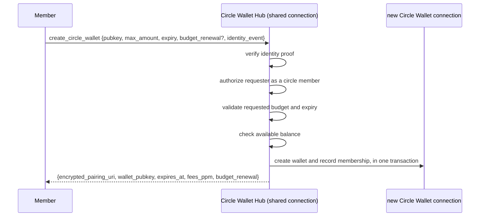
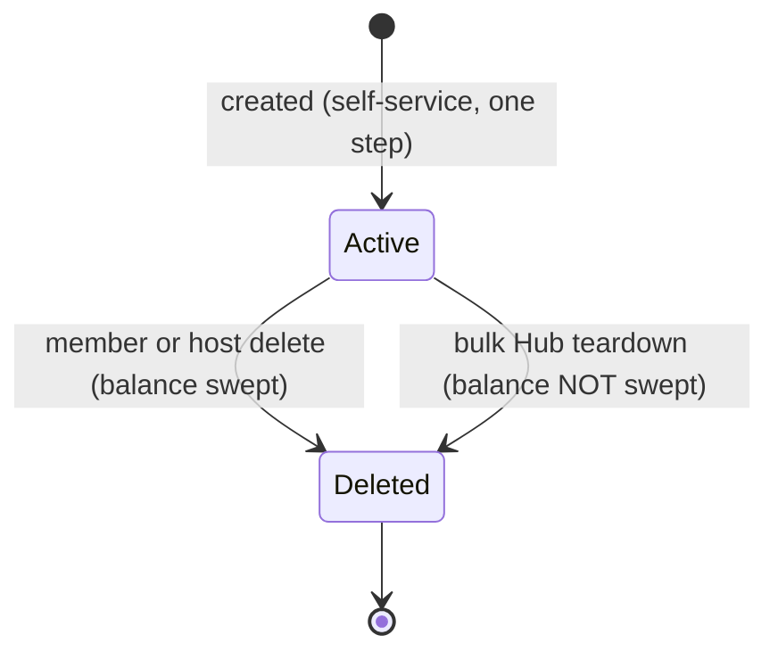

NIP-CW
======

Circle Wallet
-------------

`draft` `optional` `nwc`

**Depends on**: NIP-47 (Nostr Wallet Connect)

## Abstract

Not everyone who wants a Lightning wallet wants to run a node. Channels, liquidity, uptime, backups —
that's real work most people never want to take on.

A game studio wants a way around it too. Its players have never touched Lightning, and often move more
than sats: in-game currency, collectibles, any asset issued as a Taproot Asset. A social app wants the
same thing, so its users can zap each other without learning what a channel is. So does a family or a
friend group, sharing one member's infrastructure instead of everyone standing up their own.

A **circle** is a group of people who don't run their own node — a host extends their own node to all
of them instead. For a family, that's relatives and coworkers, each with a personal wallet. For a
business, it's every player or every user getting a real wallet the moment they need one: no onboarding
flow that dead-ends on "open a channel first," no LSP to negotiate with, no liquidity to wait on, no
need to hand it to whatever VC-funded LSP is pitching liquidity-as-a-service this month. The host keeps
ownership of the node, the liquidity, and the users on it.

This document defines the **Circle Wallet**, the personal wallet a member ends up with, and the
**Circle Wallet Hub**, the host's connection that issues one on request — self-service, on demand, no
manual setup per member.

Every member's wallet lives on the same node. A payment between two members never leaves it — it
settles as an instant, fee-free internal transfer, the same way moving money between sub-accounts of
one bank account carries no wire fee. A payment to anyone outside the circle still goes out over
ordinary Lightning.

Who counts as a member — an allowlist, "people the host follows," or every account a business creates —
is just a configuration choice, not what a Circle Wallet fundamentally is. This document specifies that
mechanism, the wallet's data model, and the one-active-wallet-per-member rule. The circle's real value
is the free wallet and free in-circle transfers, not the admission rule.

## Motivation

The obvious alternatives don't fit. Everyone running their own node just relocates the burden they were
trying to avoid. The host handing out one wallet per member manually works for a few people, then the
host becomes a bottleneck — no game studio or growing social app can wait on that. One wallet shared by
the whole group has no individual balance: one member's spending is everyone's spending.

A free custodial wallet looks easier still. It doesn't remove trust — it relocates it, to an operator
the member has never met, running on funding that may not survive the next round. A circle asks for
trust the member already has: in family, a coworker, a business relationship that predates any of this.
Backed by a person, not a balance sheet.

A pre-funded, one-time payout to a fixed, named list doesn't fit either: that pattern decides its
recipient set once, at funding time. A circle's membership isn't fixed — new players and new users show
up every day, each needing a wallet the moment they arrive. What a circle needs is standing,
self-service access: any current member can ask for their own wallet, whenever they show up.

Pooling helps the host too. One node's channels, liquidity, and routing reputation serve every member
at once, instead of splitting thin across as many nodes as there are members. A host who's already
built that capacity spends nothing new to extend it.

A Circle Wallet Hub closes that gap: a self-service request a member sends themselves, authorized
against membership the host already decided, granted in one step.

## Non-Goals

This document doesn't define pre-funded, owner-initiated payouts to named recipients — a one-time or
scheduled payout to a payee who isn't already a trusted member with standing access. That's a different
pattern entirely.

This document also doesn't define a "followers" policy — one that checks the *requester's own*
published contact list. That's deliberately excluded; see §Membership.

This document also doesn't define circles denominated in anything other than sats. A game economy
running Taproot Assets, or any other asset a host's node can carry, could extend the same shared-node,
self-service model — but that extension, and the data model it would need, is future work, not
something this document specifies.

## Terminology

This document uses MUST, MUST NOT, SHOULD, and MAY as defined in RFC 2119.

- **circle**: a group of people the host has decided to extend their own Lightning wallet
  infrastructure to. It has no protocol state of its own, existing only as the set of people who can
  successfully authenticate against a given Circle Wallet Hub.
- **Circle Wallet**: the personal, fully-functional wallet a circle member ends up with, one per
  member, starting at zero balance, able to send and receive like any other wallet in this system.
- **Circle Wallet Hub**: the host's own connection members send their `create_circle_wallet` request
  to. It issues Circle Wallets against its own balance.
- **Circle Identity**: a reusable record a Circle Wallet Hub references to decide who is currently a
  member, independent of any one Hub's lifetime and shareable across multiple Hubs. Its internal
  admission mechanism (§Membership) is an implementation detail of *how* the host manages the circle,
  not part of what a Circle Wallet offers a member once they're in it.

## Methods

| Method | Caller | Scope | Purpose |
|---|---|---|---|
| `create_circle_wallet` | a member, over the Circle Wallet Hub connection | `create_circle_wallet` | Self-service request for the caller's own Circle Wallet |

## Data Model

This section describes the information a Circle Wallet Hub MUST be able to represent. It's not a wire
format or a storage schema — how an implementation stores or names this state is outside this
document's scope.

A Circle Identity MUST record which admission mechanism it uses (§Membership), plus the data that
mechanism needs: the provider pubkey being followed, or the set of allowlisted pubkeys. A Circle
Identity MAY be referenced by more than one Circle Wallet Hub at once. It MUST NOT be tied to any one
Hub's lifetime.

A Circle Wallet Hub MUST maintain, for itself:

- the Circle Identity governing who may request a wallet from it;
- a ceiling on the amount a member may request for their own wallet;
- a floor on how tight a member's requested budget-renewal period may be (§Budget Renewal Floor);
- a ceiling on, and default value for, an issued wallet's lifetime;
- an optional ceiling on the combined `max_amount` committed across every currently-active wallet it
  has issued, separate from and in addition to its own real balance.

A member's `max_amount` is a spend cap, not a pre-funded transfer: a Circle Wallet starts at zero
balance and draws against the Hub's own underlying balance as it spends, up to that cap. Because of
that, a Circle Wallet Hub MUST verify, before creating a new wallet and atomically with creating it,
that the sum of `max_amount` across every currently-active wallet it has issued, plus the amount being
requested, does not exceed the Hub's own current balance. If the Hub has configured the optional
aggregate ceiling above, that same sum MUST also not exceed it. A wallet's expiry determines when it
stops counting toward this sum.

For each member who currently holds an active Circle Wallet under a given Hub, an implementation MUST
be able to determine that fact. §Membership's one-active-wallet-per-member rule is checked against it.
That fact MUST stop being true once the member's wallet connection is deleted, freeing them to request
a new one.

An implementation MUST also maintain a single-use record of every identity-proof event ID it has
already consumed for `create_circle_wallet` (§Identity Proof, §Security Considerations), since this
proof has no invoice to bind it to a single use.

### Budget Renewal Floor

This floor protects the Hub from a member resetting their spend cap too often, rather than bounding how
loose a cap the Hub itself may offer. With renewal periods ranked tightest-to-loosest (daily, weekly,
monthly, yearly, never), a
request MUST be rejected when its requested renewal is tighter than the Hub's floor. For example, a
`monthly` floor allows `monthly`/`yearly`/`never` and rejects `daily`/`weekly`.

## Creating a Circle Wallet



### Request

```jsonc
{
  "pubkey": "<hex requester pubkey>",
  "max_amount": 100000,
  "expiry": 2592000,
  "budget_renewal": "monthly",
  "identity_event": "{...kind 23199 JSON...}"
}
```

- `pubkey` — REQUIRED, MUST be a 64-character lowercase-hex Nostr pubkey.
- `max_amount` — REQUIRED, MUST NOT exceed the Hub's own per-wallet ceiling (§Data Model).
- `expiry` — OPTIONAL; if omitted or zero, it MUST default to the Hub's own expiry ceiling.
- `budget_renewal` — OPTIONAL; if omitted, it MUST default to `never`. Whether omitted or explicit, the
  resolved value MUST satisfy the Hub's own renewal floor (§Budget Renewal Floor).
- `identity_event` — REQUIRED, the JSON-encoded kind-23199 identity proof (§Identity Proof).

### Response

```jsonc
{
  "encrypted_pairing_uri": "<NIP-44, encrypted to the requester's own pubkey>",
  "wallet_pubkey": "<hex>",
  "expires_at": 1720000000,
  "fees_ppm": 0,
  "budget_renewal": "monthly"
}
```

`encrypted_pairing_uri` MUST be encrypted (NIP-44) to the requester's own pubkey, so no other holder of
the shared Hub connection, including the wallet owner, is able to decrypt a Circle Wallet's connection
string from the response alone.

## Identity Proof (kind 23199)

This document's own event kind, defined nowhere else — not NIP-CASH's `23198` (a structurally different
per-call proof, for a different NIP), and not NIP-IC's `35521` (a long-lived, reusable Identity Connection
claim, incompatible with this proof's single-use, per-request binding — see NIP-CASH.md's own Methods
section for the general reasoning, which applies identically here).

```
kind: 23199
pubkey: <requester pubkey — MUST equal `pubkey` in the request>
tags:
  d = <Circle Wallet Hub's own pubkey>   // binds proof to THIS Hub; no invoice to bind it to
created_at: now (± 5 minute freshness window)
```

There's only one identity mode here, since a Circle Wallet member is always a raw Nostr pubkey.
Verification MUST run before the allowlist/following
authorization check. This ordering is what closes an allowlist-membership oracle: an attacker who does
not hold the target's private key MUST NOT be able to reach the authorization check at all, so the
response cannot be used to probe list membership.

## Processing Algorithm

On receiving `create_circle_wallet`, the Hub MUST, in order:

1. Validate `pubkey` is a well-formed 64-character lowercase-hex string.
2. Verify the kind-23199 identity proof per §Identity Proof: signature, `d`-tag equal to the Hub's own
   pubkey, signer equal to the requested `pubkey`, and freshness.
3. Check the proof's event ID against the single-use replay guard. A previously-consumed event ID MUST
   be rejected, even if otherwise valid and still within its freshness window.
4. Authorize the requester against the Hub's Circle Identity: an `allowlist`-policy Hub performs a
   direct lookup, while a `following`-policy Hub checks the provider's live Nostr contact list.
5. Check the one-active-wallet-per-(Hub, identity) rule (§Membership), rejecting if the identity
   already holds an active Circle Wallet under this Hub.
6. Validate `max_amount` against the Hub's own per-wallet ceiling and the resolved `budget_renewal`
   against the Hub's own renewal floor.
7. Inside one transaction, verify that the sum of `max_amount` across every currently-active wallet the
   Hub has issued, plus this request's `max_amount`, does not exceed the Hub's own current balance (and
   its optional aggregate ceiling, if configured). Then create the Circle Wallet connection and insert
   its membership row. The membership row's uniqueness constraint is the authoritative guard for step
   5, so a conflict here, or a balance/ceiling check failing, MUST roll back the entire transaction,
   including the just-created connection and permission rows.
8. After the transaction commits, never before, publish the new connection's relay subscription.
9. Return the encrypted pairing URI and resolved wallet parameters.

## Membership

Membership itself — deciding who is currently "in" the circle — is a configuration detail the host
picks per Hub, not part of what a Circle Wallet offers once someone holds one. A Circle Identity
supports two admission mechanisms:

- **allowlist**: an explicit list of pubkeys the host maintains directly.
- **following**: whoever the host's own Nostr account currently follows (kind:3 contact list), checked
  live. Because the host alone controls their own contact list, this is a real authorization decision:
  membership simply tracks a relationship the host already maintains elsewhere on Nostr, so adding or
  removing someone from the circle requires no separate action against this protocol at all.

A "followers" mechanism — checking the *requester's own* published contact list to see whether they
claim to follow the host — MUST NOT be offered. Anyone can publish a contact list claiming to follow
anyone, for free. It asserts nothing a host can rely on.

Independent of which admission mechanism a Hub uses, a member MUST hold at most one active Circle
Wallet per Hub at a time. This is enforced twice: a pre-check immediately after authorization, which
short-circuits the common case before further work, and the membership table's unique constraint as the
authoritative guard inside the creation transaction. The membership row MUST cascade-delete when its
Circle Wallet's connection record is deleted, freeing the identity to request a new wallet.

## In-Circle Transfers

A payment is treated as an internal, fee-free transfer whenever the invoice being paid was created by
the *same underlying node* the payer's connection also runs on — regardless of which connection kind
issued either side. Every member of a circle holds a Circle Wallet on that same host node, so paying
another member, or paying the host directly, never actually leaves the node: no routing, no routing
fee, no dependency on either side's own inbound or outbound liquidity. A payment to anyone outside the
circle is an ordinary Lightning payment, subject to normal routing and fees, exactly like any other
wallet on this system.

This property isn't unique to Circle Wallet. It's a general property of any two connections sharing one
underlying node. But it's the concrete, everyday benefit a circle is built around: a trusted group
sharing one host gets free, instant payments among themselves, as a side effect of sharing the same
node.

## Pairing Connection

A Circle Wallet MUST keep a one-time-random pairing secret, never persisted after generation. The owner
MUST NOT be able to reconstruct a member's connection string after the fact. That's a deliberate
custody choice: no "reveal connection again" capability, even for the host. Offering one would require
switching to a deterministic, re-derivable pairing key instead — a custody trade-off, not an oversight.

## Lifecycle and Deletion



There's no claimed/unclaimed distinction here: a Circle Wallet is simply active until it's deleted.
Per-member deletion MUST sweep any remaining balance back to the Circle Wallet Hub before the connection
record is removed, and MUST be available regardless of the wallet's spend state. Deleting the whole Hub in
bulk-teardown mode MAY destroy members' balances with no sweep. That's a distinct, explicitly-chosen
deletion mode, not the per-member path's default.

## Security Considerations

**Shared bearer connection.** The Circle Wallet Hub's connection is meant to be shared among prospective
members. The requester `pubkey` in a `create_circle_wallet` call
MUST NOT be trusted bare. Without the identity-proof requirement, anyone holding the connection could
claim to be any pubkey they merely knew — enabling rate-limit denial-of-service against a real member,
an allowlist-membership oracle (probing who's on the list via the error-code difference), and
commitment/balance griefing (minting max-amount wallets "as" real members).

**Single-use replay guard is necessary.** A Circle Wallet identity proof has no invoice to bind it to.
Without an explicit single-use guard keyed on the proof's event ID, a captured proof could be
resubmitted repeatedly within its own freshness window.

**One active wallet per (Hub, identity)** MUST be enforced at both the pre-check and the transaction
layer. A pre-check alone is a race, not a guarantee — the unique-constraint insert is what makes it
authoritative.

**A `fees_ppm` value in a response is informational only.** An implementation MUST NOT advertise a
non-zero value unless it actually applies the corresponding forwarding-fee skim to payments made from
the wallet. Advertising a fee that's never charged is a correctness defect, not merely cosmetic —
callers integrating against this field will assume it's enforced.

**Publish-after-commit ordering.** A new member's relay subscription MUST be published only after its
creating transaction commits. Publishing from inside a still-open transaction risks the event consumer
looking up the new connection through a separate, non-transactional database connection before the row
is visible — making the wallet permanently unreachable over NWC.

## Privacy Considerations

Every Circle Wallet's payments settle through the same host node, so the host, by construction, can
observe every payment any member makes or receives, in-circle or not. A circle isn't a privacy tool
between its members and the host; it's only opaque to outsiders. Members who need transaction privacy
*from the host* shouldn't route that traffic through a circle.

A `following`-policy circle draws membership from the host's public kind:3 contact list. Anyone
watching that list, not just fellow members, can learn who's eligible to request a wallet, even before
they request one. Hosts who need membership itself to stay private SHOULD use the `allowlist` mechanism
instead.

`encrypted_pairing_uri` keeps a member's own connection string unreadable to anyone else holding the
shared Hub connection, including the host. But the *existence* of that member's wallet, and its
`wallet_pubkey`, are visible to whatever system stores or logs the Hub's request/response history.

