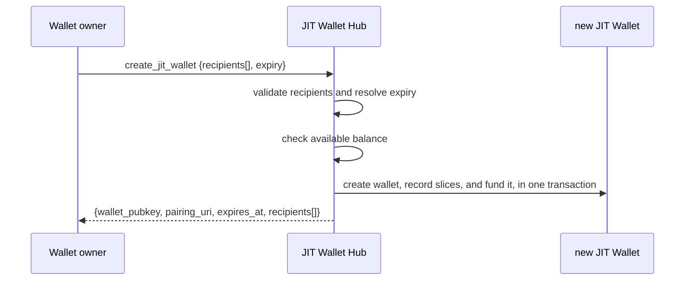
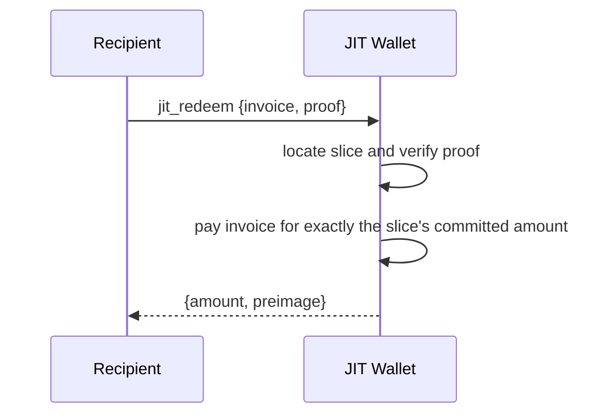
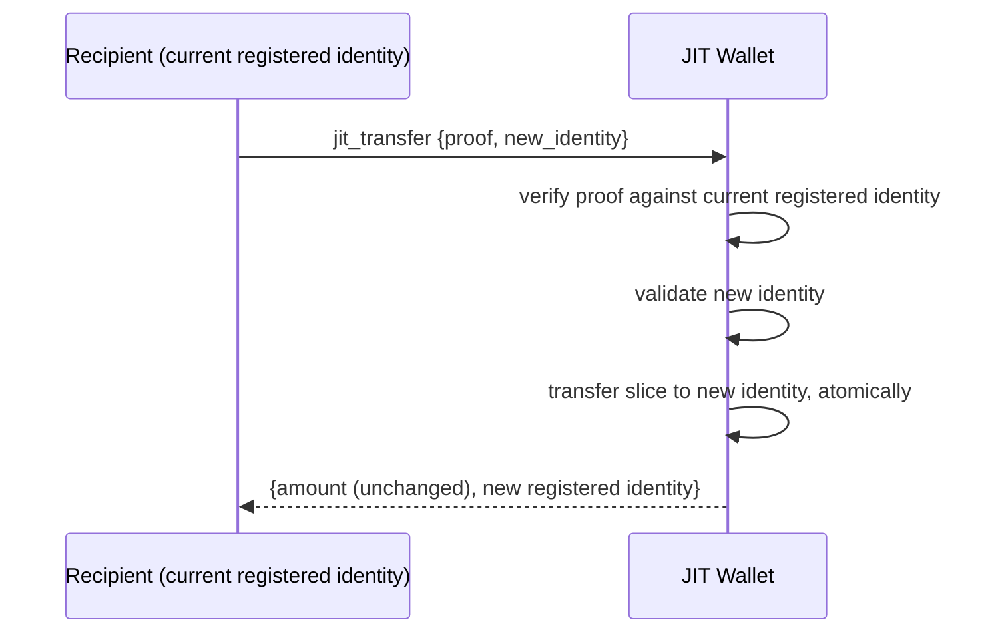
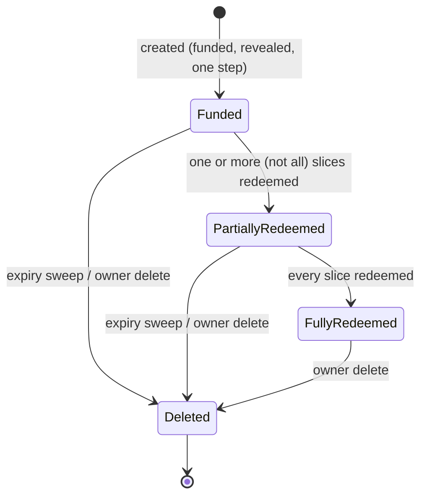

NIP-JW
======

JIT Wallet
----------

`draft` `optional` `nwc`

**Depends on**: NIP-47 (Nostr Wallet Connect)

## Abstract

Sometimes a payout has to go out before the recipient is ready to collect it. A referral reward. A zap
split across a group. A hackathon prize list. An airdrop to fifty people gathered off a sign-up sheet,
half of whom can't receive on Lightning right now — no wallet, no inbound liquidity, no LSP behind them,
node down. The money still has to move today.

This document defines the **JIT Wallet** (Just-In-Time Wallet). It's one wallet, pre-funded for a named
list of recipients. The wallet owner can hand it out however is convenient — privately, or posted
somewhere many people will see it. That's safe because just holding it is never enough, on its own, to
spend from it. Every recipient shares the same wallet. Each one is checked against the exact identity the
owner named for them, not against who happens to be holding it.

This document specifies the JIT Wallet Hub that issues these wallets, how a single payout is funded and
split across recipients, and the limits placed on what a recipient's own wallet can do. A share doesn't
have to be cashed out to be spent: it's a minted value in its own right. A recipient can use the funds
directly, cashing out to a Lightning wallet whenever that's possible, or pass ownership of the share
straight on to someone else, as payment, without ever touching a Lightning wallet in between.

In that respect a slice behaves like ecash: value is minted once, upfront, and can change hands before
redemption with no Lightning hop in between. It differs from traditional (Chaumian) ecash in a way that
matters for security. Ecash notes are bearer instruments — whoever holds one can redeem it. A slice is
not. It's redeemable only by whoever is currently its registered identity (§Data Model); holding the
`lokicash1...` token alone is never enough (§Security Considerations). `jit_transfer` reassigns that
registered identity explicitly; it doesn't hand over bearer rights.

A wallet owner MAY give up that identity binding for a given slice instead, trading the race-safety it
buys for redemption that works exactly like Chaumian ecash: whoever holds the secret owns the note. See
§Bearer Slices.

## Motivation

Picture a hackathon that owes prize money to fifty people, or a zap meant to be split across a group
chat. Half of them can't receive on Lightning right now — no wallet, no inbound liquidity, no LSP to open
a channel for them, node down. The organizer needs to commit the funds and send the wallet out today.
They can't wait on fifty people to get receive-ready first. And no single recipient should ever be able
to spend more than their own share, even though all fifty hold the same wallet.

The obvious alternatives don't fit. One wallet per recipient means creating and tracking fifty wallets
for a single payout event, before you even know who can receive on Lightning yet. A live process that
pushes payments out as people become reachable keeps a server on the hook indefinitely, and the payer
still never learns where the funds land.

A JIT Wallet commits the whole payout in one step, to one wallet, and lets that wallet travel however is
convenient. A recipient doesn't need a working receiving endpoint when the funds are set aside, only when
they choose to collect, since the invoice they present is generated fresh, by them, at redemption time. A
payer can commit funds even if a recipient's node is down, has no inbound liquidity, or doesn't exist
yet. The payer never learns which wallet or node ultimately receives the funds.

## Non-Goals

This document doesn't define membership or eligibility policy. A JIT Wallet has no concept of "who's
allowed to be a recipient." Every recipient is named explicitly, at creation time, by the wallet owner.

And `jit_transfer` isn't a general-purpose payment or exchange primitive. It transfers one
already-committed, unredeemed slice to a new identity, for the same amount it was funded with. It can't
merge slices, split them, or create value beyond what `create_jit_wallet` already committed.

## Terminology

- **JIT Wallet**: the connection recipients actually use. One connection string, shared by every
  recipient it was created for.
- **JIT Wallet Hub**: the wallet owner's own connection for setting up JIT Wallets. It spends from its
  own balance to fund each one.
- **recipient / slice**: one `(identity, amount)` pair inside a JIT Wallet. A wallet's total funding MUST
  equal the sum of its slices. A slice's identity is set at creation time. It MAY later be reassigned,
  before the slice is redeemed, via `jit_transfer` (see §Transferring a Slice) — including into or out of
  `bearer` mode, subject to the single-slice-wallet rule §Bearer Slices describes.
- **identity**: either a raw Nostr `pubkey`, or a `connection_key` — an opaque identifier vouched for by
  an Identity Authority (below). A `connection_key` can stand in for a Web Identity — a Discord handle,
  an email address, a domain, an X account — for a recipient who isn't on Nostr yet. A slice MAY instead
  opt out of identity binding entirely, in `bearer` mode (§Bearer Slices), redeemable by whoever holds its
  secret.
- **Identity Authority (IA)**: a third party the wallet owner explicitly trusts to attest that a given
  `connection_key` belongs to a given Nostr pubkey, or to the Web Identity behind it. Useful for
  recipients who aren't yet known by pubkey.
- **lokicash token**: a NIP-19-style bech32 identifier (`lokicash1...`) that packages a JIT Wallet's
  pairing data as one shareable string. The `lokicash` prefix flags what backs it — flokicoin, not
  bitcoin — the same distinction a bitcoin-backed equivalent would carry as, say, `satscash1...`. See
  §The Lokicash Token.

## Methods

| Method | Caller | Scope | Purpose |
|---|---|---|---|
| `create_jit_wallet` | wallet owner, over the JIT Wallet Hub connection | `create_jit_wallet` | Fund and issue a new JIT Wallet for one or more recipients |
| `jit_redeem` | a recipient, over the JIT Wallet connection | `jit_redeem` | Collect one recipient's exact slice — identity-bound or `bearer` (§Bearer Slices) |
| `jit_transfer` | a recipient, proof-gated against their current registered identity | `jit_transfer` | Transfer an unredeemed slice to a new identity, same amount |

## Data Model

This section describes what a JIT Wallet Hub and its issued wallets MUST be able to represent. It's not
a wire format or a storage schema — how an implementation stores or names this state is outside this
document's scope.

A JIT Wallet Hub MUST maintain, for itself:

- a ceiling on the total funding a single JIT Wallet issued from it may carry;
- a ceiling on, and default value for, how long an issued JIT Wallet may remain unredeemed.

For each JIT Wallet it issues, an implementation MUST be able to determine which Hub issued it —
§Lifecycle and Deletion needs this for its reclaim behavior.

For each recipient slice, an implementation MUST track:

- the identity type and value (§Terminology) currently registered for this slice;
- the attesting Identity Authority's pubkey, for `connection_key`-mode registered identities;
- the committed amount, fixed at creation and never altered by transfer;
- whether, and when, the slice has been redeemed;
- how many times the slice has been transferred via `jit_transfer`, checked against the wallet's
  `max_transfers` cap, if any;
- whether the slice's value was moved into a brand-new dedicated JIT Wallet via §Spinning a Slice Off
  Into a Dedicated Wallet, and if so, which one — purely informational (an implementation MAY surface
  this for an operator's own bookkeeping); it does not change how any other guard in this document
  treats the slice, which remains simply "redeemed" for every purpose other than that record.

An implementation MUST treat a slice's registered identity as mutable, pre-redemption, exactly as
§Transferring a Slice describes.

For a `bearer`-mode slice (§Bearer Slices), the above degenerates: there's no registered identity, only a
secret to verify a redemption against. An implementation MUST be able to verify a presented bearer secret
without persisting it in any form that discloses it — a one-way commitment, not the secret itself.

A JIT Wallet MUST be created, funded, and made usable in one step. Implementations MUST NOT introduce an
intermediate state where the wallet exists but isn't yet funded, or isn't yet reachable by its
recipients. Once created, a JIT Wallet's budget, expiry, and any system-assigned label MUST NOT be
alterable through whatever general-purpose connection-management interface the implementation offers for
other connection types. These values are fixed at issuance.

## Creating a JIT Wallet



### Request

```jsonc
{
  "recipients": [
    {"identity_type": "pubkey", "identity_value": "<hex pubkey>", "amount_mloki": 21000},
    {"identity_type": "connection_key", "identity_value": "abc123", "ia_pubkey": "<hex IA pubkey>", "amount_mloki": 5000},
    {"identity_type": "bearer", "amount_mloki": 3000}
  ],
  "expiry": 86400, // optional, seconds
  "max_transfers": 5 // optional
}
```

- `recipients` — MUST contain at least one entry. Each entry's `identity_type` MUST be `pubkey`,
  `connection_key`, or `bearer`. A `connection_key` entry MUST also carry `ia_pubkey`. A `bearer` entry
  MUST carry neither `identity_value` nor `ia_pubkey` — the Hub generates its secret (§Bearer Slices).
- `expiry` — OPTIONAL. If omitted or zero, it MUST default to the Hub's own expiry ceiling (§Data Model).
- `max_transfers` — OPTIONAL, set once by the wallet owner at creation. Caps how many times each slice
  MAY be transferred via `jit_transfer` before it can only be redeemed. Unlimited if omitted. Applies
  uniformly regardless of identity mode — including a transfer into or out of `bearer` status
  (§Transferring a Slice, §Bearer Slices).

### Response

```jsonc
{
  "wallet_pubkey": "<hex>",
  "pairing_uri": "nostr+walletconnect://...",
  "lokicash_token": "lokicash1...",
  "expires_at": 1720000000,
  "recipients": [
    {"identity_type": "pubkey", "identity_value": "...", "amount_mloki": 21000},
    {"identity_type": "bearer", "bearer_secret": "<opaque, high-entropy, shown once>", "amount_mloki": 3000}
  ]
}
```

`lokicash_token` (§The Lokicash Token) packages the same pairing data as `pairing_uri` — the two MUST
decode to an identical wallet pubkey, secret, and relay set. Either string alone is a fully sufficient
connection credential; a recipient only ever needs one of them, not both.

A `bearer` recipient's `bearer_secret` appears in this response and nowhere else, ever (§Bearer Slices).

## Processing Algorithm

On receiving `create_jit_wallet`, the Hub MUST, in order:

1. Serialize against any other concurrent `create_jit_wallet` attempt for this same Hub, however many
   interfaces the implementation exposes for issuing this request. Two concurrent requests must never
   both proceed past a stale balance read. A request that can't be serialized MUST be rejected, not
   queued.
2. Validate every recipient. `amount_mloki` MUST be strictly positive. The running sum of all recipients'
   amounts MUST be computed with an explicit overflow check, rejecting before an unsigned wraparound can
   occur, and MUST NOT exceed the Hub's own per-wallet funding ceiling (§Data Model).
3. For each `connection_key`-mode recipient, verify its `ia_pubkey` is on the wallet owner's trusted
   Identity Authority allowlist right now. An untrusted or unknown IA MUST reject the entire request, not
   just that recipient. For each `bearer`-mode recipient, generate its secret now, with enough entropy
   that guessing it is infeasible (§Bearer Slices). A caller-supplied `bearer_secret` at this step MUST be
   rejected — the Hub is the only party that can vouch for the entropy behind it.
4. Resolve `expiry`. If omitted or zero, set it to the Hub's own expiry ceiling. Otherwise it MUST NOT
   exceed that ceiling.
5. Verify the Hub's own available balance is at least the sum of all recipients' amounts.
6. Create the JIT Wallet connection, record one slice per recipient — a one-way commitment of the secret
   for `bearer`-mode slices, never the secret itself (§Data Model) — and perform a single internal
   transfer from the Hub to the new connection for the full sum. This MUST be atomic: a failure at any
   point after this step MUST leave no partial state.
7. Return the pairing connection string and the resolved recipient list, with each `bearer` slice's
   plaintext secret included this one time.

A request that fails any check above MUST be rejected before step 6. No partial wallet, slice, or
transfer is ever observable from a rejected request.

## Redeeming Funds (`jit_redeem`)

A recipient collects their exact slice by presenting a fresh Lightning invoice over the JIT Wallet
connection, together with proof binding them to the slice they're redeeming.



### Request

```jsonc
{
  "invoice": "lnbc...",
  "proof": { /* binds the caller to this specific slice and this specific invoice;
                the same scheme jit_transfer reuses. exact format out of scope for
                this document. bearer slices use bearer_secret instead — see §Bearer Slices */ }
}
```

- `invoice` — REQUIRED. A fresh Lightning invoice for exactly the slice's committed amount, generated by
  the recipient at redemption time. A slice pays exactly once, in full — there's no partial or repeated
  redemption.
- `proof` — REQUIRED for an identity-bound slice. MUST bind the caller to that slice's *current*
  registered identity and to this specific invoice, so a captured proof can't be replayed against a
  different one. For a `connection_key` identity, it MUST also carry, or reference, a currently-trusted
  Identity Authority's attestation (§Terminology). A `bearer` slice replaces `proof` with `bearer_secret`
  (§Bearer Slices).

### Processing Algorithm

On receiving `jit_redeem`, the wallet MUST, in order:

1. Locate the slice this request is redeeming. If none matches, or it's already redeemed, reject.
2. Verify the caller is authorized to redeem it: for an identity-bound slice, verify `proof` against the
   slice's current registered identity, and, for `connection_key` mode, that the attesting Identity
   Authority is still trusted right now — not just at wallet-creation time (§Security Considerations). For
   a `bearer` slice, verify the presented `bearer_secret` (§Bearer Slices).
3. Verify `invoice` is for exactly the slice's committed amount.
4. Pay `invoice` and mark the slice redeemed, atomically. A failure after payment begins MUST NOT leave the
   slice redeemable a second time.
5. Return the paid amount and payment preimage.

A request that fails step 1, 2, or 3 MUST be rejected before step 4.

## Transferring a Slice (`jit_transfer`)

A recipient who hasn't redeemed their slice, and has no Lightning wallet ready, MAY ask to transfer their
slice instead. They hand the unredeemed share on to an identity they do control, without ever touching an
LN wallet. No funds move, and no value is created. Only one thing changes: which identity is authorized
to redeem, or transfer again, that one slice, for the amount it was already funded with.

`new_identity` MAY be `bearer` (§Bearer Slices) as well as `pubkey`/`connection_key` — a slice can move
into or out of bearer status via transfer, not only at creation. Moving a slice *into* bearer status
takes one of two forms, chosen by the implementation based on whether this is the only recipient the
wallet has EVER had — not merely the only one *currently unclaimed*:

- **If so**, the slice's identity is reassigned in place, exactly like a `pubkey`↔`connection_key`
  transfer — same connection, same wallet, only the registered identity changes.
- **If not**, in-place reassignment is forbidden: a slice a former recipient already redeemed is no
  longer itself at risk, but that recipient still holds the wallet's one shared connection secret
  indefinitely (nothing rotates or revokes it per recipient), and a bearer redeem transmits its raw
  secret in the request body, which that former recipient can equally decrypt. A wallet that ever served
  more than one recipient MUST NOT pick up a bearer slice on its own connection, regardless of how many
  of the others have since been claimed. Instead, the slice's value is spun off into a brand-new,
  dedicated, single-recipient JIT Wallet — see §Spinning a Slice Off Into a Dedicated Wallet below.

Moving a slice *out of* bearer status carries no such restriction — that direction never introduces a
bearer slice onto a shared connection, so the ordinary in-place reassignment applies unconditionally.



### Request

```jsonc
{
  "proof": { /* binds the caller to the slice's *current* registered identity, AND to this
                specific new_identity — a proof captured for one target MUST NOT be usable
                against a different one. Omitted entirely when the current identity is
                bearer — see bearer_secret below. Exact format out of scope for this
                document, beyond that binding requirement. */ },
  "bearer_secret": "<opaque>", // in place of `proof`, iff the CURRENT identity is bearer
  "new_identity": {"identity_type": "pubkey", "identity_value": "<hex pubkey>"}
  // new_identity MAY instead be
  // {"identity_type": "bearer", "identity_value": "<hex sha256 commitment the caller generated>"}
  // — see §Bearer Slices for why identity_value is required, not server-issued, here.
}
```

- `proof` — REQUIRED unless the slice's current identity is `bearer`. MUST authenticate the caller as
  the slice's *current* registered identity, AND bind the proof to this specific `new_identity` — the
  same anti-redirection requirement `jit_redeem`'s proof has toward its invoice (§Redeeming Funds), just
  bound to a target identity instead of a target invoice. A proof captured for one `new_identity` MUST NOT
  be replayable against a different one. This requirement is load-bearing, not incidental. See
  §Security Considerations.
- `bearer_secret` — REQUIRED in place of `proof`, if and only if the slice's current identity is
  `bearer`. A bearer slice has no identity capable of signing a proof; presenting its secret is the
  entire proof, exactly as it is for `jit_redeem` (§Redeeming Funds → §Bearer Slices).
- `new_identity` — REQUIRED. `identity_type` of `pubkey`, `connection_key`, or `bearer`. For `pubkey`/
  `connection_key`, same shape as one `recipients[]` entry in `create_jit_wallet` (§Creating a JIT
  Wallet), with `ia_pubkey` required for `connection_key`. For `bearer`, `identity_value` is REQUIRED
  (a caller-generated `sha256` commitment — see §Bearer Slices) and `ia_pubkey` MUST NOT be present.
  This is the opposite of `create_jit_wallet`'s bearer recipient, where `identity_value` MUST NOT be
  present — the difference is deliberate, not an inconsistency; see §Bearer Slices and
  §Security Considerations for why.

### Response

```jsonc
{
  "amount_mloki": 21000,
  "identity_type": "pubkey",
  "identity_value": "..."
  // for a bearer target reassigned in place: "identity_type": "bearer",
  //   "identity_value": "<the caller's own commitment, echoed back>"
  // for a bearer target that was instead spun off (§Spinning a Slice Off Into a Dedicated Wallet):
  //   "identity_type": "bearer", "identity_value": "<the caller's own commitment, echoed back>",
  //   "new_wallet_pubkey": "<the new wallet's WalletPubkey, in the clear>",
  //   "new_wallet_token": "<lokicash1... token for the new wallet, NIP-44 encrypted — see below>"
}
```

This response MUST NOT ever carry a bearer secret, nor any OTHER secret capable of moving funds, in a
form decryptable by every holder of this connection — `identity_value` here is always either a public
identity or a one-way commitment the caller already supplied, never a value the wallet itself generated.
`new_wallet_token`, present only for a spin-off outcome, is the one exception that looks like it might
violate this, and doesn't: see §Spinning a Slice Off Into a Dedicated Wallet for why it's safe despite
traveling over this same shared connection. See also §Security Considerations.

### Processing Algorithm

On receiving `jit_transfer` for a given slice, the wallet MUST, in order:

1. Verify the caller is authorized to transfer the slice: for an identity-bound current identity, verify
   `proof` against it AND against this specific `new_identity`; for a `bearer` current identity, verify
   the presented `bearer_secret`. A redeemed slice has no registered identity left to transfer;
   `jit_transfer` on a redeemed slice MUST be rejected. If the slice has already reached the wallet's
   `max_transfers` cap, reject: the recipient must redeem instead. The cap applies equally to a spin-off
   (§Spinning a Slice Off Into a Dedicated Wallet) — it's conceptually a transfer of the slice's value,
   even though the mechanics differ, and MUST NOT bypass a cap the wallet's creator configured.
2. Validate `new_identity`: for `pubkey`/`connection_key`, the same rules `create_jit_wallet` applies to a
   recipient entry (§Processing Algorithm) — identity shape, and, for `connection_key` mode, that
   `ia_pubkey` is on the wallet owner's trusted Identity Authority allowlist right now. For `bearer`,
   verify `identity_value` is present and is a well-formed commitment — the implementation MUST NOT
   generate a secret on the wallet's behalf here (§Bearer Slices, §Security Considerations) — then
   determine whether this wallet has EVER had only one recipient (this one), counting every slice the
   wallet was ever created or has ever held, not only currently-unclaimed ones. If so, proceed as an
   in-place reassignment (step 3 below). If not, proceed as a spin-off instead
   (§Spinning a Slice Off Into a Dedicated Wallet) — this is no longer a rejection condition.
3. For an in-place reassignment: atomically transfer the slice. The old registered identity MUST stop
   authorizing `jit_redeem` or `jit_transfer` on this slice from the moment this step completes. The new
   identity becomes the slice's sole registered identity, for the same committed amount. For a spin-off:
   follow §Spinning a Slice Off Into a Dedicated Wallet's own algorithm instead.
4. Return the slice's unchanged amount together with its new registered identity (in-place), or the new
   wallet's connection (spin-off) — see the Response format above and
   §Spinning a Slice Off Into a Dedicated Wallet.

A request that fails step 1 or step 2 MUST be rejected before step 3. A rejected `jit_transfer` never
leaves a slice partially transferred.

## Spinning a Slice Off Into a Dedicated Wallet

When `jit_transfer`'s Processing Algorithm (step 2) determines that a bearer target must NOT be
reassigned in place — because the wallet has ever served more than one recipient — the slice's value is
instead moved into a brand-new, dedicated, single-recipient JIT Wallet, funded with exactly that slice's
committed amount, whose connection is delivered to the caller alone.

```mermaid
sequenceDiagram
    participant Caller as Recipient (current registered identity)
    participant Old as Old JIT Wallet (shared)
    participant New as New JIT Wallet (dedicated)

    Caller->>Old: jit_transfer {proof, new_identity: bearer}
    Old->>Old: verify proof; determine spin-off applies
    Old->>Old: atomically claim the slice (terminal — see below)
    Old->>New: create, funded via internal transfer of the slice's amount
    New-->>Old: lokicash1... token for the new wallet
    Old->>Old: NIP-44 encrypt the token to the caller's own pubkey,<br/>keyed to the NEW wallet's own keypair
    Old-->>Caller: {new_wallet_pubkey (clear), new_wallet_token (encrypted)}
```

**Why not just reassign in place, the way every other `jit_transfer` outcome does?** Because the slice's
current connection is shared with every other recipient the wallet has ever had (§Security
Considerations), and a bearer redemption transmits its raw secret in the request body. Reassigning in
place would hand every current and former co-recipient of that connection everything needed to steal the
note the moment its intended recipient tried to redeem it. The only way to give a multi-recipient
wallet's slice a genuinely bearer, cash-like existence is to move it off that connection entirely.

**Funding.** The new wallet MUST be created as a child of the SAME JIT Wallet Hub the old wallet is
already a child of — not a child of the old wallet — and funded via a single internal transfer of exactly
the old slice's committed amount, moved out of the OLD wallet's own balance (not the Hub's). This mirrors
`create_jit_wallet`'s own Hub→Wallet funding transfer (§Processing Algorithm), just with the old JIT
Wallet standing in as the funding source instead of the Hub.

**Atomicity.** The old slice MUST be claimed (its ordinary redeemed/terminal state) as a single atomic
step BEFORE the new wallet is created or funded — this is the operation's commit point: from this instant
the old identity can no longer redeem or transfer this slice, under any outcome. If wallet creation or
funding subsequently fails, the implementation MUST roll the claim back, restoring the slice to its
pre-spin-off unclaimed state so the caller can safely retry. Once the new wallet has been successfully
created and funded, the old slice's claimed status MUST NOT be rolled back — an implementation MAY record
which new wallet it moved to, for its own bookkeeping (§Data Model), but this is informational only; every
other guard in this document continues to treat the slice as simply redeemed.

**Delivery — nested encryption, not a new channel.** The new wallet's connection MUST NOT be placed in
this response in a form decryptable by every holder of the OLD wallet's shared connection — that would
simply relocate the leak this whole mechanism exists to close. Instead, the response carries two fields:

- `new_wallet_pubkey` — the new wallet's own `WalletPubkey`, in the CLEAR. A bare pubkey with no
  accompanying secret grants no spending capability by itself (§The Pairing Connection), so exposing it
  unencrypted is safe — it exists purely so the recipient has a pubkey to derive a decryption key against.
- `new_wallet_token` — the new wallet's `lokicash1...` connection token (§The Lokicash Token), NIP-44
  encrypted using a SECOND, INNER encryption layer keyed to (a) the pubkey that authenticated this
  `jit_transfer` call (the value bound by `proof`, i.e. the caller's own real identity — not the shared
  connection's client keypair) and (b) the new wallet's own keypair (the private counterpart of
  `new_wallet_pubkey`) — NOT a fresh one-off keypair generated only for this delivery, since the caller
  would have no way to independently learn such a key. This inner layer sits nested inside the response's
  own ordinary outer encryption (§Security Considerations), which every holder of the OLD wallet's shared
  connection can still decrypt as always — but decrypting the outer layer only reveals `new_wallet_pubkey`
  (harmless alone) and an opaque ciphertext neither the outer connection's shared key, nor any other
  co-recipient's own privkey, can open. Only the caller's own privkey, paired with `new_wallet_pubkey`,
  derives the correct inner conversation key.

An implementation MUST NOT use a bearer redemption's secret-in-body pattern, or any wallet-generated
one-off key, for this delivery step — see §Security Considerations for the general principle this
follows, and the ECDH argument for why it holds.

**Eligibility and limits.** A spin-off is subject to the same `max_transfers` cap check as any other
transfer (step 1 above). The new wallet's own `max_transfers` policy on its sole slice SHOULD be inherited
from the old slice's configuration, and its expiry SHOULD be inherited from the old wallet's own — a
spin-off relocates an existing entitlement; it does not grant a fresh one.

## Bearer Slices

Every slice described so far is identity-bound: redeeming it takes proof of a specific registered identity
(§Redeeming Funds), not just the connection. A wallet owner MAY instead issue a slice with
`identity_type: "bearer"`. A bearer slice has no registered identity at all. Whoever presents its
`bearer_secret` over the JIT Wallet connection first MAY redeem it — no Nostr pubkey, no `connection_key`,
no Identity Authority involved.

This is the one place this document's design fully converges with traditional (Chaumian) ecash: a bearer
slice's secret *is* the note. Knowing the secret is both necessary and sufficient to redeem it. Handing a
bearer slice to someone else is simply telling them its secret, out of band — that handoff isn't a
protocol operation at all; it's no different from the wallet owner choosing who to give the slice to in
the first place (§Non-Goals).

A slice MAY still move into or out of bearer status via `jit_transfer` (§Transferring a Slice) — that's a
distinct operation from the out-of-band secret handoff above, and the one place `jit_transfer` and a
bearer slice interact. Moving *out* of bearer status presents the current secret as `jit_transfer`'s
proof, the same way `jit_redeem` does. Moving *into* bearer status in place — reassigning the CURRENT
wallet's connection to serve a bearer slice — is restricted to a wallet that has EVER had only one
recipient, not merely one still-unclaimed one: a recipient who already redeemed and moved on still holds
the wallet's shared connection secret forever afterward (nothing about redeeming revokes it), so an
in-place reassignment could otherwise produce the one configuration this document forbids outright: a
bearer slice on a connection any other party has ever held, redeemed or not. This restriction never
strands a multi-recipient wallet's slice, though — see §Spinning a Slice Off Into a Dedicated Wallet for
where it goes instead.

Unlike `create_jit_wallet`'s bearer recipient, `jit_transfer`'s bearer target does NOT get a
wallet-generated secret. The caller supplies the commitment themselves — an implementation MUST NOT mint
one and return it in the `jit_transfer` response. This is a deliberate, load-bearing difference from
creation, not an oversight: see §Security Considerations for why.

### Creating a Bearer Slice

A `bearer`-mode entry in `create_jit_wallet`'s `recipients[]` (§Creating a JIT Wallet) carries no
`identity_value` and no `ia_pubkey` — only an amount. The Hub MUST generate the slice's `bearer_secret`
itself, with enough entropy that guessing it is infeasible; a caller-supplied secret MUST NOT be accepted,
since the caller has no way to prove its entropy. The response's matching entry MUST carry that
`bearer_secret` in plaintext, exactly once (§Creating a JIT Wallet, Response). There MUST be no way to
retrieve a bearer slice's secret again after that response. Losing it is equivalent to losing the funds —
same as losing any bearer ecash note.

### Redeeming a Bearer Slice

`jit_redeem` (§Redeeming Funds) on a bearer slice replaces `proof` with the secret itself:

```jsonc
{"invoice": "lnbc...", "bearer_secret": "<opaque>"}
```

No Identity Authority check, no signature to verify — presenting the correct secret is the entire proof.
The processing algorithm in §Redeeming Funds applies unchanged; step 2 becomes a direct secret comparison.

### Security Considerations for Bearer Slices

**The secret MUST NOT be stored in a form that discloses it.** An implementation MUST persist only
something a presented secret can be checked against — a one-way commitment, never the secret itself. A
slice's `identity_value` is public information for `pubkey` and `connection_key` modes; a bearer slice's
secret is the opposite. It *is* the entire security of that slice. Storing it in the clear turns any read
access to that storage into a theft of every unredeemed bearer slice on the Hub.

**A bearer redemption MUST still be atomic and race-safe**, exactly like an identity-bound one (§Redeeming
Funds, step 4). First-redeem-wins is intentional for a bearer slice — that's the whole point — but two
concurrent redemptions against the same secret MUST NOT both succeed.

**Guessing MUST be made infeasible, not just unlikely.** A bearer slice has no signature to forge, so an
attacker's only path is guessing the secret. Sufficient entropy at generation is necessary but not
sufficient on its own; an implementation SHOULD also rate-limit or back off repeated failed
`jit_redeem` attempts against the same wallet, the same way it would for any other credential-guessing
surface.

## The Lokicash Token (`lokicash1...`)

A JIT Wallet's `pairing_uri` is a plain NWC `nostr+walletconnect://` string. The lokicash token wraps
that same pairing data in a NIP-19-style bech32 identifier, `lokicash1...`. One recognizable string.
Hand it over in a chat message, embed it in a zap, read it out loud.

That convenience is the point, not a side effect. **The token doesn't need to be kept secret.**
`jit_redeem` and `jit_transfer` both check the caller against the slice's registered identity
(§Data Model). Neither trusts mere possession of the string. Two people holding the same `lokicash1...`
token don't have an equal claim on the funds. Only whoever is, or has become via `jit_transfer`, the
registered identity does. That's what lets a lokicash token sit somewhere many people can see it,
without turning it into a race for whoever acts first.

### Wire Format

A lokicash-family token is a NIP-19-style bech32 string: a human-readable prefix (`lokicash`, `satscash`,
...), the digit `1`, then TLV-encoded pairing data converted from 8-bit to 5-bit groups exactly as NIP-19
does for `nprofile`/`nevent`/`naddr`. Implementations MUST NOT enforce BIP-173's 90-character total-length
limit — the same practice existing `nprofile` encoders already follow, since a wallet pubkey, a secret,
and one or more relay hints routinely add up to more than that.

Each TLV entry is `<type: 1 byte><length: 1 byte><value: length bytes>`, length capped at 255 by the
one-byte length field. The entries:

| Type | Name | Value | Cardinality |
|---|---|---|---|
| `0` | wallet pubkey | 32 raw bytes | exactly one, REQUIRED |
| `1` | relay | a relay URL, ASCII | zero or more, order preserved |
| `2` | secret | 32 raw bytes — the NWC connection secret | exactly one, REQUIRED |
| `3` | identity required | 1 byte, `0` or `1` | zero or one, OPTIONAL |
| `4` | max transfers | 4 raw bytes, big-endian `uint32` | zero or one, OPTIONAL |

Type numbers `0` and `1` carry the same meaning NIP-19 already gives them for `nprofile`/`nevent`/`naddr`
(`0` is the token's primary identifier, `1` is a relay hint); types `2`–`4` are specific to this token
family. A decoder MUST ignore any TLV entry of an unrecognized type rather than rejecting the token, so a
future field can be added without breaking older decoders — again mirroring NIP-19. Types `3` and `4` are
themselves an example of this: a token minted before they existed simply omits them, and a decoder written
before they existed correctly ignores them if present.

A decoder MUST reject a token missing either required field (`0` or `2`), carrying a wrong-length value for
any of the four typed fields above, or repeating any of them. All are the same class of mistake: they'd
let a caller construct a token that decodes ambiguously, into a connection nobody actually holds, or into
metadata that could mislead a client about how to attempt a call. Truncated or malformed TLV data MUST
also be rejected rather than read out of bounds.

### Redemption Metadata

Types `3` (identity required) and `4` (max transfers) are OPTIONAL hints, not part of the connection
credential itself (§The Pairing Connection needs only types `0`–`2`) — they let a client decide HOW to
attempt a call without a relay round-trip first, purely as a convenience:

- **Identity required** (`0` = false, `1` = true) reports whether the wallet currently requires a proof at
  all: `false` means the wallet is a single bearer slice (`jit_redeem`/`jit_transfer` need only its
  secret — no Nostr identity, no signed proof); `true` means every slice the wallet serves is
  identity-bound (a signed proof is required). This is well-defined per wallet, not per slice, because a
  bearer slice's wallet is ALWAYS single-recipient (§Bearer Slices) — there's never a wallet mixing bearer
  and identity-bound slices for this flag to be ambiguous about.
- **Max transfers** mirrors the wallet's own `max_transfers` cap (§Creating a JIT Wallet): `0` means
  unlimited, `N` means each slice may be transferred at most `N` times before it can only be redeemed.
  Also uniform across the wallet's whole recipient set — the cap is a property of the wallet, set once at
  creation, not of any one slice.

**Both fields are best-effort hints, snapshotted at whatever moment the token was minted or last
re-derived — NOT a live guarantee.** A solo wallet's sole slice can move into or out of bearer status via
`jit_transfer` (§Transferring a Slice) after a token describing it was already handed out, making an
earlier token's `identity required` value stale. An implementation that re-derives a token on demand
(§The Pairing Connection) SHOULD recompute both fields from the wallet's current claim state each time,
rather than caching values from creation. Regardless: `jit_redeem` and `jit_transfer` remain
authoritatively checked server-side on every call, exactly as `jit_transfer`'s own proof requirement is
(§Security Considerations). A client MUST NOT treat either field as a substitute for a call actually
succeeding or failing — only as a hint for deciding how to construct the attempt in the first place.

This wire format is intentionally the same for every lokicash-family prefix. This design isn't specific to
flokicoin: the same identity-bound, transferable-before-redemption pattern, and the same TLV layout, apply
to a JIT Wallet issued over any energy-backed (proof-of-work) coin — only the bech32 prefix changes.
`lokicash1...` names flokicoin behind the wallet; a Bitcoin-backed JIT Wallet would carry its funds the
same way under `satscash1...`. A decoder MUST NOT assume a fixed prefix; it should accept whichever one a
token actually carries and use it to determine which base asset backs the wallet.

## The Pairing Connection

A JIT Wallet's pairing secret MUST be deterministically derived from its own connection identifier. That
lets an implementation expose an endpoint that re-derives and re-displays the connection string on
demand, without ever persisting it.

## Scope Surface

A JIT Wallet connection MUST be granted only:

- `jit_redeem` — the payout method, identity-bound or bearer (§Bearer Slices)
- `jit_transfer` — the proof-gated transfer method (§Transferring a Slice)
- `get_balance`
- `get_info` (an always-granted handshake method under NIP-47)

A JIT Wallet connection MUST NOT be granted `pay_invoice`, `lookup_invoice`, or `list_transactions`. Any
of these would let one recipient observe or interfere with another recipient on the same connection.
`get_budget` MUST be blocked by an explicit connection-type-specific guard, not just left off the
granted-scope list. Under NIP-47, `get_budget` has no scope of its own. A naive "not-in-scope-list" check
would grant it to any connection holding any permission row at all.

## Lifecycle and Deletion



Display state (Unredeemed / Active / Redeemed) MUST be computed from spend fraction
(`spent = total funded − current balance`), never from a separately-tracked flag. A JIT Wallet is
spend-only, so this is always well-defined. Transferring a slice via `jit_transfer` doesn't change its
redemption state — an unredeemed, transferred slice is still unredeemed. The wallet owner MAY delete a
JIT Wallet in any redemption state, and any remaining balance MUST be swept back to the JIT Wallet Hub
before the connection record is removed.

## Security Considerations

Unless otherwise noted, everything below assumes an identity-bound slice. A bearer slice's redemption is
gated by its secret, not by identity or proof — see §Bearer Slices → Security Considerations for Bearer
Slices for that case.

**Shared bearer connection, and why that's fine.** Every recipient can decrypt every request sent on the
same connection. So can anyone else who later sees the connection, or a lokicash token derived from it.
That's why neither payout (`jit_redeem`) nor transfer (`jit_transfer`) trusts the connection alone. Both
are gated against a slice's registered identity (§Redeeming Funds, §Transferring a Slice). Holding the
connection, or a `lokicash1...` token, is necessary to attempt a call. It's never sufficient to succeed
with one.

**Responses are exactly as shared as requests — a server-generated secret MUST NEVER be placed in one.**
The paragraph above is usually read as being about requests, but the shared connection's decryptability is
symmetric: every recipient who can decrypt a request on this connection can equally decrypt every
*response* the wallet ever sends on it, including responses to a different recipient's own call. This is
why a bearer slice's secret is always caller-generated, never wallet-generated-and-returned, at every
entry point that shares this connection: `create_jit_wallet`'s bearer recipient is issued over the Hub's
own separate, single-owner connection, so returning a fresh secret there is safe — but `jit_transfer`
(§Transferring a Slice) is called *over the shared jit_wallet connection itself*, so its bearer target's
`identity_value` MUST be a commitment the caller already generated and kept, never a secret the
implementation mints and hands back in that response. An implementation that generates a bearer secret at
`jit_transfer` time and returns it lets any other current or former holder of the shared connection —
including a recipient who already redeemed their own, unrelated slice — decrypt that response and redeem
the transferred slice before its intended holder ever sees the secret.

**Redeeming doesn't revoke a recipient's hold on the shared connection — "who can still decrypt this
connection's traffic" is a superset of "who still has an unredeemed slice."** This matters for
`jit_transfer`'s bearer-eligibility check specifically: it MUST be evaluated against every recipient the
wallet has EVER had, not just currently-unclaimed ones. A wallet that started with several recipients, all
but one of whom have since redeemed and moved on, still has every one of those former recipients holding
the same shared connection secret indefinitely — nothing about redeeming rotates or revokes it. A bearer
redeem's proof is its raw secret, transmitted in the request body, which any of those former recipients
can equally decrypt. Checking only currently-unclaimed slices would let the wallet's last remaining
recipient convert it to bearer while former co-recipients are still listening, handing them everything
needed to steal it the moment the note is redeemed.

**A nested inner encryption layer is safe precisely because ECDH is commutative, not because the outer
layer is trusted.** §Spinning a Slice Off Into a Dedicated Wallet's `new_wallet_token` field travels
inside a response every co-recipient of the OLD connection can already decrypt — the outer layer grants
NO additional secrecy by itself. Its security instead comes from a SECOND, independent application of the
same NIP-44 ECDH construction, keyed to a DIFFERENT pair of keys than the outer layer uses: the caller's
own real identity privkey (proven via `proof` earlier in the SAME call, not the shared connection's client
keypair) and the new wallet's own keypair. `ECDH(pubkey_A, privkey_B) == ECDH(pubkey_B, privkey_A)` for
any keypair — this is what lets the caller derive the correct conversation key from nothing but their own
already-held privkey plus `new_wallet_pubkey`, itself safe to expose in the clear (a bare pubkey grants no
spending capability). A co-recipient who is not the intended caller has neither the caller's privkey nor
the new wallet's own privkey, and cannot derive that same shared secret from the two public values alone
— knowing both `pubkey_A` and `pubkey_B` without either matching private key gives no way to compute
`ECDH(pubkey_A, privkey_B)`. An implementation MUST NOT key this inner layer to the shared connection's
own client keypair (that would just reproduce the exact leak this whole mechanism exists to close), nor
to a freshly generated one-off key with no way to reach the caller (that would make the delivery
undecryptable by anyone, including the intended recipient).

**`jit_transfer`'s proof requirement is load-bearing, not incidental.** An implementation that lets
`jit_transfer` succeed without authenticating the caller against the slice's *current* registered
identity reopens the exact race the rest of this document closes: anyone holding the shared connection,
or a lokicash token, could transfer — then redeem — a slice that was never meant for them.

**IA revocation MUST be checked live at redemption time, not only at wallet-creation time.** A compromised or
retired Identity Authority needs to be cut off immediately, for every wallet it ever attested for, not
just wallets created after revocation. The same applies to `jit_transfer`'s `new_identity` validation.

**Recipient-sum overflow MUST be guarded explicitly**, with a per-recipient upper bound plus an
overflow-safe running sum. Without this, two large recipient amounts could wrap the sum to a small value.
That would silently bypass the Hub's funding ceiling, while leaving each recipient's own stored slice at
its original, unpayable value.

**Metadata spoofing.** Any internal flag that exempts a JIT payout from the normal fee-reserve headroom
check MUST be stripped from caller-supplied metadata on ordinary payment methods, before the wallet
itself sets it. Otherwise, any connection holding a plain payment scope could spoof that flag and shave
fee-reserve headroom off its own balance and budget checks.

## Privacy Considerations

A JIT Wallet's `pairing_uri` or `lokicash1...` token doesn't reveal which recipient it's meant for, not
from its bytes alone. The wallet owner controls where and how it's shared, including sharing all
recipients' one connection through a single broadcast channel. But sharing a slice's identity through
`jit_transfer`'s `new_identity` parameter, or through a zap or chat message a token rides along with, MAY
correlate an identity to a payout amount for anyone watching that channel. Wallet owners who need
recipients to stay unlinkable from each other, not just from third parties, SHOULD distribute the
connection through channels that don't also reveal who else received it.

