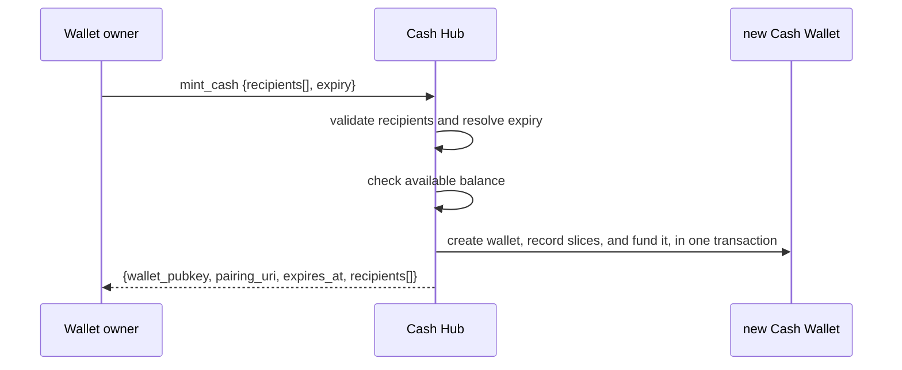
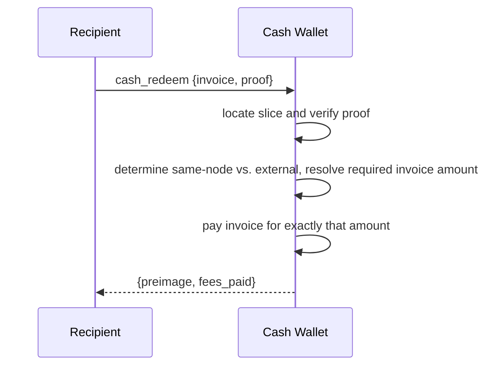
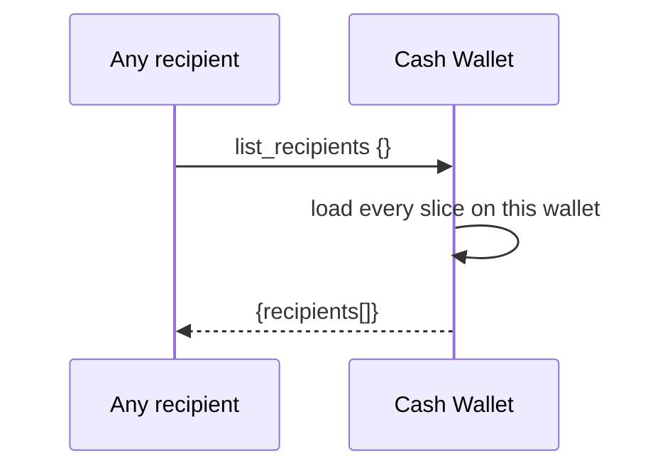
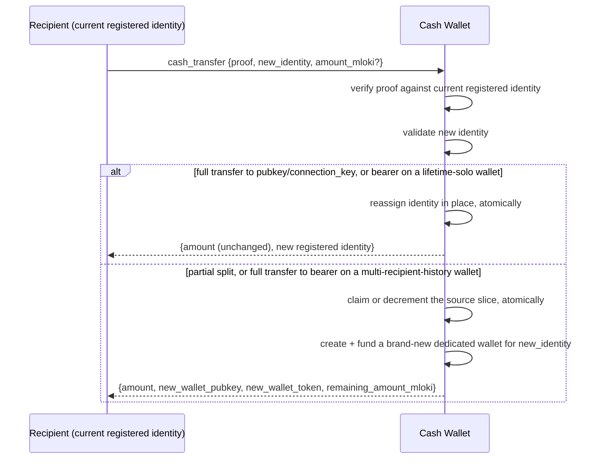
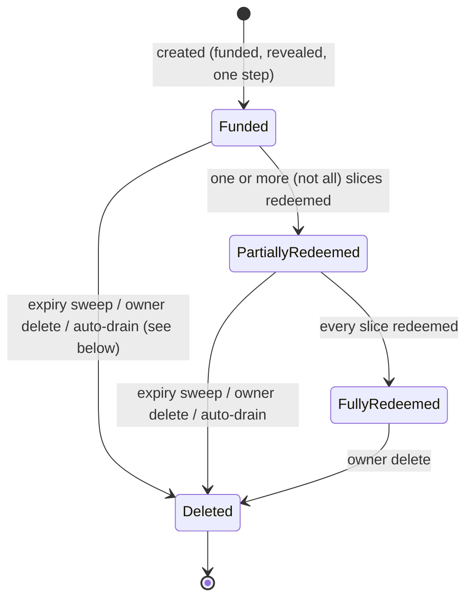
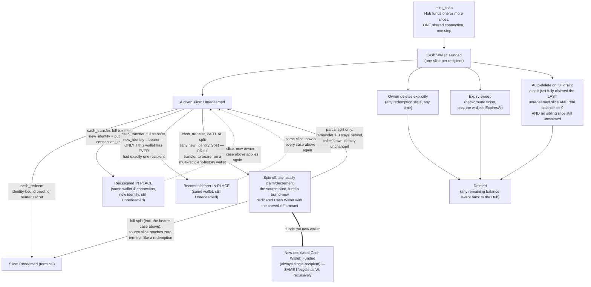

NIP-CASH
========

Cash Hub
--------

`draft` `optional` `nwc`

**Depends on**: NIP-47 (Nostr Wallet Connect)

**Supersedes**: NIP-JW (JIT Wallet). This document is a rename and extension of that earlier spec, not a
new protocol — every recipient-facing guarantee NIP-JW made still holds. What's new: the funding method is
renamed `create_jit_wallet` → `mint_cash` — "mint" names the one point in this protocol where new
collateral actually enters a Cash Hub's issued wallets; every other value-moving method (`cash_transfer`'s
transfer and split outcomes) only relocates value a `mint_cash` call already committed, never adds to it,
so it deliberately keeps a non-mint name. A slice can now also be **split**, carving a partial amount off
into a brand-new cash token while leaving change behind, bounded by a new configurable floor
(`min_transfer_mloki`, see §Splitting a Slice); and an external `cash_redeem` MAY now carry a Hub-configured,
per-slice, quoted-upfront **redeem fee** (`redeem_fee_ppm`), never charged on a transfer/split or a
same-node redemption — see §The Redeem Fee. `list_recipients` is also formally specified here for the
first time (§Listing Recipients); it existed as a granted method before this revision but had no spec
entry. This document is also explicitly multi-coin, where NIP-JW's `lokicash token` term named both the
wire format and its flokicoin instance at once: the generic term is now **cash token**, with `lokicash`
and `satscash` (and any future prefix) naming specific coin-backed instances of it — see §The Cash Token.

## Abstract

Sometimes a payout has to go out before the recipient is ready to collect it. A referral reward. A zap
split across a group. A hackathon prize list. An airdrop to fifty people gathered off a sign-up sheet,
half of whom can't receive on Lightning right now — no wallet, no inbound liquidity, no LSP behind them,
node down. The money still has to move today.

This document defines the **Cash Hub** and the cash tokens it issues — `lokicash` for a flokicoin-backed
one, `satscash` for a Bitcoin-backed one, and so on for any other coin this format is extended to (§The
Cash Token). A Cash Hub is one wallet,
pre-funded for a named list of recipients. The hub owner can hand each token out however is convenient —
privately, or posted somewhere many people will see it. That's safe because just holding a token is never
enough, on its own, to spend from it. Every recipient shares the same underlying wallet connection until
they redeem or transfer. Each one is checked against the exact identity the owner named for them, not
against who happens to be holding the token.

This document specifies the Cash Hub that issues these wallets, how a single payout is funded and split
across recipients, and the limits placed on what a recipient's own wallet can do. A share doesn't have to
be cashed out to be spent: it's a minted value in its own right — a **cash token**. A recipient can use the
funds directly, cashing out to a Lightning wallet whenever that's possible; pass ownership of the whole
cash token straight on to someone else, as payment, without ever touching a Lightning wallet in between; or
peel off part of it — like handing someone $5 out of a $20 bill — while keeping the rest.

In that respect a cash token behaves like ecash: value is minted once, upfront, and can change hands (whole
or in part) before redemption with no Lightning hop in between. It differs from traditional (Chaumian)
ecash in a way that matters for security. Ecash notes are bearer instruments — whoever holds one can
redeem it. A cash token is not, by default. It's redeemable only by whoever is currently its registered
identity (§Data Model); holding the `lokicash1...` token alone is never enough (§Security Considerations).
`cash_transfer` reassigns that registered identity explicitly, or carves a piece off into a new cash token;
it doesn't hand over bearer rights on the original.

A wallet owner MAY give up that identity binding for a given slice instead, trading the race-safety it
buys for redemption that works exactly like Chaumian ecash: whoever holds the secret owns the note. See
§Bearer Slices.

## Motivation

Picture a hackathon that owes prize money to fifty people, or a zap meant to be split across a group
chat. Half of them can't receive on Lightning right now — no wallet, no inbound liquidity, no LSP to open
a channel for them, node down. The organizer needs to commit the funds and send the wallet out today.
They can't wait on fifty people to get receive-ready first. And no single recipient should ever be able
to spend more than their own share, even though all fifty hold the same wallet.

The obvious alternatives don't fit. One wallet per recipient means creating and tracking fifty wallets
for a single payout event, before you even know who can receive on Lightning yet. A live process that
pushes payments out as people become reachable keeps a server on the hook indefinitely, and the payer
still never learns where the funds land.

A Cash Hub commits the whole payout in one step, to one wallet, and lets each recipient's share travel
however is convenient from there. A recipient doesn't need a working receiving endpoint when the funds
are set aside, only when they choose to collect, since the invoice they present is generated fresh, by
them, at redemption time. A payer can commit funds even if a recipient's node is down, has no inbound
liquidity, or doesn't exist yet. The payer never learns which wallet or node ultimately receives the
funds.

A cash bill in your physical wallet doesn't force you to hand over the whole thing, or nothing. You can
break a $20 into a $5 and change. §Splitting a Slice brings that same everyday flexibility to a cash token,
without ever requiring the recipient to run their own node or trust a third-party custodian for the
"change."

## Non-Goals

This document doesn't define membership or eligibility policy. A Cash Hub has no concept of "who's
allowed to be a recipient." Every recipient is named explicitly, at creation time, by the hub owner.

And `cash_transfer` isn't a general-purpose payment or exchange primitive. It moves value between
already-committed slices, never creating value beyond what `mint_cash` already committed, and never
merging two slices back into one.

## Terminology

- **Cash Wallet**: the NWC connection recipients actually use — one connection string, shared by every
  recipient it was created for (or, after a transfer/split, by exactly one recipient — see §Splitting a
  Slice).
- **Cash Hub**: the wallet owner's own connection for minting cash tokens. It spends from its own
  balance to fund each one.
- **cash token**: the NIP-19-style bech32 string that packages a Cash Wallet's pairing data as one
  shareable string, and, informally, the value it represents — "a cash token," the way you'd say "a bill."
  Its human-readable prefix names the specific coin backing it: `lokicash1...` for a flokicoin-backed Cash
  Wallet, `satscash1...` for a Bitcoin-backed one. `lokicash` and `satscash` name instances of this token
  family; they are not synonyms for the family itself. See §The Cash Token.
- **recipient / slice**: one `(identity, amount)` pair inside a Cash Wallet. A wallet's total funding MUST
  equal the sum of its slices. A slice's identity is set at creation time. It MAY later be reassigned, or
  have part of its value carved off, before the slice is redeemed, via `cash_transfer` (see §Transferring
  and Splitting a Slice) — including into or out of `bearer` mode, subject to the rules that section
  describes.
- **identity**: either a raw Nostr `pubkey`, or a `connection_key` — an opaque identifier vouched for by
  an Identity Authority (below). A `connection_key` can stand in for a Web Identity — a Discord handle,
  an email address, a domain, an X account — for a recipient who isn't on Nostr yet. A slice MAY instead
  opt out of identity binding entirely, in `bearer` mode (§Bearer Slices), redeemable by whoever holds its
  secret.
- **Identity Authority (IA)**: a third party the wallet owner explicitly trusts to attest that a given
  `connection_key` belongs to a given Nostr pubkey, or to the Web Identity behind it. Useful for
  recipients who aren't yet known by pubkey.
- **min_transfer_mloki**: a floor, in mloki, on how small a piece may be split off a slice, and on how
  small a remainder a split may leave behind. Zero means no floor. Set at the Cash Hub level as the
  default a freshly-minted slice inherits, and thereafter carried forward from parent slice to child slice
  across any number of splits — see §Splitting a Slice.
- **redeem_fee_ppm**: a parts-per-million rate, charged against a slice's own amount only when
  `cash_redeem` resolves to a genuine external Lightning payment — never on `cash_transfer`, and never on
  a redemption that resolves to a payment the Hub's own node is both sending and receiving (§Redeeming
  Funds, §The Redeem Fee). Zero means free. Set at the Cash Hub level as the default a freshly-minted
  slice inherits, and thereafter carried forward from parent slice to child slice across any number of
  splits, exactly like `min_transfer_mloki` above — a rate change to the Hub's own configuration never
  retroactively affects a slice already minted under the old rate.

## Methods

| Method | Caller | Scope | Purpose |
|---|---|---|---|
| `mint_cash` | wallet owner, over the Cash Hub connection | `cash_hub` | Fund and issue cash tokens for one or more recipients |
| `cash_redeem` | a recipient, over the Cash Wallet connection | `cash_redeem` | Collect one recipient's exact slice — identity-bound or `bearer` (§Bearer Slices) |
| `cash_transfer` | a recipient, proof-gated against their current registered identity | `cash_transfer` | Reassign an unredeemed slice's identity, or split part of its value off into a new cash token — see §Transferring and Splitting a Slice |
| `list_recipients` | any holder of the Cash Wallet connection | `cash_redeem` | Read-only roster of every recipient on this wallet, including each slice's redeem fee quote — see §Listing Recipients |

## Data Model

This section describes what a Cash Hub and its issued wallets MUST be able to represent. It's not a wire
format or a storage schema — how an implementation stores or names this state is outside this document's
scope.

A Cash Hub MUST maintain, for itself:

- a ceiling on the total funding a single Cash Wallet issued from it may carry;
- a ceiling on, and default value for, how long an issued Cash Wallet may remain unredeemed;
- a default value for `min_transfer_mloki` (§Splitting a Slice), applied to every slice a freshly-minted
  wallet carries. Zero (no floor) is a valid default;
- a default value for `redeem_fee_ppm` (§The Redeem Fee), applied to every slice a freshly-minted wallet
  carries. Zero (free) is a valid default;

For each Cash Wallet it issues, an implementation MUST be able to determine which Hub issued it —
§Lifecycle and Deletion needs this for its reclaim behavior.

For each recipient slice, an implementation MUST track:

- the identity type and value (§Terminology) currently registered for this slice;
- the attesting Identity Authority's pubkey, for `connection_key`-mode registered identities;
- the committed amount, mutable only by a partial split (§Splitting a Slice) — never by redemption
  (which consumes the slice entirely) or by an in-place identity reassignment;
- whether, and when, the slice has been redeemed;
- this slice's own `min_transfer_mloki` floor, fixed at the moment the slice was created — either from
  the Hub's own default (a freshly-minted wallet) or inherited from the source slice it was split from
  (§Splitting a Slice);
- this slice's own `redeem_fee_ppm` rate, fixed at the moment the slice was created — either from the
  Hub's own default (a freshly-minted wallet) or inherited unchanged from the source slice it was split
  from, exactly like `min_transfer_mloki` above (§The Redeem Fee);
- whether the slice's value was moved into a brand-new dedicated Cash Wallet, either in full or as part
  of a split, and if so, which one — purely informational (an implementation MAY surface this for an
  operator's own bookkeeping); it does not change how any other guard in this document treats the slice.
  A wallet created this way SHOULD, symmetrically, record which slice it was split from, for the same
  informational purpose, in the reverse direction.

An implementation MUST treat a slice's registered identity, and its committed amount, as mutable,
pre-redemption, exactly as §Transferring and Splitting a Slice describes.

For a `bearer`-mode slice (§Bearer Slices), the above degenerates: there's no registered identity, only a
secret to verify a redemption against. An implementation MUST be able to verify a presented bearer secret
without persisting it in any form that discloses it — a one-way commitment, not the secret itself.

A Cash Wallet MUST be created, funded, and made usable in one step. Implementations MUST NOT introduce an
intermediate state where the wallet exists but isn't yet funded, or isn't yet reachable by its
recipients. Once created, a Cash Wallet's budget, expiry, and any system-assigned label MUST NOT be
alterable through whatever general-purpose connection-management interface the implementation offers for
other connection types. These values are fixed at issuance.

## Minting a Cash Wallet



### Request

```jsonc
{
  "recipients": [
    {"identity_type": "pubkey", "identity_value": "<hex pubkey>", "amount_mloki": 21000},
    {"identity_type": "connection_key", "identity_value": "abc123", "ia_pubkey": "<hex IA pubkey>", "amount_mloki": 5000}
  ],
  "expiry": 86400 // optional, seconds
}
```

A `bearer` recipient MUST instead be the request's ONLY recipient — a bearer slice's wallet is always
single-recipient, never mixed with a `pubkey`/`connection_key` entry or a second `bearer` entry
(§Bearer Slices, §Redemption Metadata):

```jsonc
{
  "recipients": [
    {"identity_type": "bearer", "amount_mloki": 3000}
  ]
}
```

- `recipients` — MUST contain at least one entry. Each entry's `identity_type` MUST be `pubkey`,
  `connection_key`, or `bearer`. A `connection_key` entry MUST also carry `ia_pubkey`. A `bearer` entry
  MUST carry neither `identity_value` nor `ia_pubkey` — the Hub generates its secret (§Bearer Slices). A
  `bearer` entry MUST be the request's only entry; a request mixing a `bearer` entry with any other entry
  MUST be rejected in its entirety, not just that one recipient.
- `expiry` — OPTIONAL. If omitted or zero, it MUST default to the Hub's own expiry ceiling (§Data Model).

`min_transfer_mloki` is deliberately NOT a request field here — it's a Hub-level setting (§Data Model),
applied uniformly to every recipient of a freshly-minted wallet from the Hub's own current configuration,
not supplied per call. A wallet owner who wants a different floor for one specific payout configures a
separate Cash Hub with its own settings, rather than overriding it per call.

### Response

```jsonc
{
  "wallet_pubkey": "<hex>",
  "pairing_uri": "nostr+walletconnect://...",
  "cash_token": "lokicash1...",
  "expires_at": 1720000000,
  "recipients": [
    {"identity_type": "pubkey", "identity_value": "...", "amount_mloki": 21000},
    {"identity_type": "connection_key", "identity_value": "abc123", "amount_mloki": 5000}
  ]
}
```

`cash_token` (§The Cash Token) packages the same pairing data as `pairing_uri` — the two MUST
decode to an identical wallet pubkey, secret, and relay set. Either string alone is a fully sufficient
connection credential; a recipient only ever needs one of them, not both.

For the single-`bearer`-recipient request shape above, the response's `recipients` entry instead carries
the generated secret:

```jsonc
{"identity_type": "bearer", "bearer_secret": "<opaque, high-entropy, shown once>", "amount_mloki": 3000}
```

A `bearer` recipient's `bearer_secret` appears in this response and nowhere else, ever (§Bearer Slices).

### Processing Algorithm

On receiving `mint_cash`, the Hub MUST, in order:

1. Serialize against any other concurrent `mint_cash` attempt for this same Hub, however many
   interfaces the implementation exposes for issuing this request. Two concurrent requests must never
   both proceed past a stale balance read. A request that can't be serialized MUST be rejected, not
   queued.
2. Validate every recipient. `amount_mloki` MUST be strictly positive. The running sum of all recipients'
   amounts MUST be computed with an explicit overflow check, rejecting before an unsigned wraparound can
   occur, and MUST NOT exceed the Hub's own per-wallet funding ceiling (§Data Model). If any recipient is
   `bearer`-mode, `recipients` MUST contain exactly that one entry and no other — reject the entire
   request otherwise (§Bearer Slices, §Redemption Metadata).
3. For each `connection_key`-mode recipient, verify its `ia_pubkey` is on the wallet owner's trusted
   Identity Authority allowlist right now. An untrusted or unknown IA MUST reject the entire request, not
   just that recipient. For each `bearer`-mode recipient, generate its secret now, with enough entropy
   that guessing it is infeasible (§Bearer Slices). A caller-supplied `bearer_secret` at this step MUST be
   rejected — the Hub is the only party that can vouch for the entropy behind it.
4. Resolve `expiry`. If omitted or zero, set it to the Hub's own expiry ceiling. Otherwise it MUST NOT
   exceed that ceiling.
5. Verify the Hub's own available balance is at least the sum of all recipients' amounts.
6. Create the Cash Wallet connection, record one slice per recipient — stamping each with the Hub's
   current `min_transfer_mloki` and `redeem_fee_ppm` defaults (§Data Model) and a one-way commitment of
   the secret for `bearer`-mode slices, never the secret itself — and perform a single internal transfer
   from the Hub to the new connection for the full sum. This MUST be atomic: a failure at any point after
   this step MUST leave no partial state.
7. Return the pairing connection string and the resolved recipient list, with each `bearer` slice's
   plaintext secret included this one time.

A request that fails any check above MUST be rejected before step 6. No partial wallet, slice, or
transfer is ever observable from a rejected request.

## Redeeming Funds (`cash_redeem`)

A recipient collects their exact slice by presenting a fresh Lightning invoice over the Cash Wallet
connection, together with proof binding them to the slice they're redeeming.



### Request

```jsonc
{
  "invoice": "lnbc...",
  "proof": { /* binds the caller to this specific slice and this specific invoice;
                the same scheme cash_transfer reuses. exact format out of scope for
                this document. bearer slices use bearer_secret instead — see §Bearer Slices */ }
}
```

- `invoice` — REQUIRED. A fresh Lightning invoice, generated by the recipient at redemption time, for
  exactly the slice's committed amount minus its own `redeem_fee_ppm` cut (§The Redeem Fee) — or for the
  full committed amount, fee-free, whenever the payment resolves to one the Hub's own node is both sending
  and receiving. A slice pays exactly once, in full — there's no partial or repeated redemption. (To
  receive only part of a slice's value without redeeming, see §Splitting a Slice instead — that's a
  different operation from `cash_redeem`, which always resolves the slice's entire current amount in one
  shot.)
- `proof` — REQUIRED for an identity-bound slice. MUST bind the caller to that slice's *current*
  registered identity and to this specific invoice, so a captured proof can't be replayed against a
  different one. For a `connection_key` identity, it MUST also carry, or reference, a currently-trusted
  Identity Authority's attestation (§Terminology). A `bearer` slice replaces `proof` with `bearer_secret`
  (§Bearer Slices).

### Processing Algorithm

On receiving `cash_redeem`, the wallet MUST, in order:

1. Locate the slice this request is redeeming. If none matches, or it's already redeemed, reject.
2. Verify the caller is authorized to redeem it: for an identity-bound slice, verify `proof` against the
   slice's current registered identity, and, for `connection_key` mode, that the attesting Identity
   Authority is still trusted right now — not just at wallet-creation time (§Security Considerations). For
   a `bearer` slice, verify the presented `bearer_secret` (§Bearer Slices).
3. Determine whether this redemption will resolve to a payment the Hub's own node is both sending and
   receiving (§The Redeem Fee) — this determination MUST use the same predicate the wallet's own payment
   path uses internally, not a separate, potentially-divergent check. If so, the required invoice amount
   is the slice's full committed amount and the fee is zero; otherwise it's the slice's committed amount
   minus its own `redeem_fee_ppm` cut. Verify `invoice` is for exactly that amount, read at this same
   moment — not a value cached from an earlier lookup, since a concurrent `cash_transfer` split may have
   changed the slice's committed amount (§Security Considerations).
4. Pay `invoice` and mark the slice redeemed, atomically, re-checking every value step 3 just verified as
   part of the same atomic commit — not only the slice's identity. A failure after payment begins MUST
   NOT leave the slice redeemable a second time. If a nonzero fee applies, settle it against the Hub
   (§The Redeem Fee) as part of the same payout's settlement — not as a separate, later operation the
   caller could observe as a distinct step.
5. Return `{preimage, fees_paid}` — `fees_paid` is the recipient's own borne redeem fee (zero for a
   same-node redemption, per §The Redeem Fee), not the real Lightning routing cost, which is never charged
   to the recipient.

A request that fails step 1, 2, or 3 MUST be rejected before step 4.

## The Redeem Fee

Every `cash_redeem` payout draws on the Cash Hub's own node's Lightning liquidity — real inbound and
outbound capacity the operator (the "minter") provisioned and pays to maintain. `cash_transfer`
(§Transferring and Splitting a Slice) never does: it only ever moves value between slices that were
already committed at `mint_cash` time, with no Lightning hop involved. This document's fee model
follows directly from that asymmetry: a redeem fee MAY apply; a transfer or split fee MUST NOT exist.

**Same-node redemptions are always fee-free.** A redemption whose invoice resolves to a payment the Hub's
own node is both sending and receiving — paid to a Circle Wallet, an isolated/"Simple Subwallet", a
standard connection, or another cash_wallet, all hosted on the same node instance as the Cash Hub itself —
never touches real Lightning routing capacity at all. Charging a fee on it would price a purely internal
bookkeeping move as if it consumed the scarce resource this fee exists to price. An implementation MUST
determine same-node-ness using the exact same predicate its own payment path already uses to decide
whether to skip real Lightning routing — not a second, independently-maintained check that could drift
from the first and either overcharge a same-node redemption or undercharge (and thus fail to price) a
genuinely external one.

**An external redemption's fee is `redeem_fee_ppm` applied to the slice's own committed amount**, computed
in parts-per-million exactly like `CircleHubConfig`'s existing per-payment fee (a Circle Hub concept this
document's fee reuses the same arithmetic convention from, though not the same funds-flow — see below). The
fee is deducted from the RECIPIENT'S OWN payout, never charged against the shared wallet's other,
not-yet-redeemed slices. `list_recipients` (§Listing Recipients) reports the exact fee and net amount for
every slice, so a recipient always knows precisely what `cash_redeem` will pay out before they call it —
there is no way to be surprised by this fee at redemption time, only at read time, and read time is always
available first.

**Why the recipient, not the Hub, bears it.** The fee's purpose is to price the minter's own Lightning
liquidity honestly, and to do so in a way that can never let one recipient's redemption cost come out of a
DIFFERENT recipient's own, already-committed slice — the flaw a shared, exactly-funded multi-recipient
wallet has without this mechanism (§Security Considerations). Charging the fee against the redeeming
recipient's own payout, quoted upfront, keeps every slice's cost to the shared pool equal to exactly that
slice's own amount, always — see the invariant below.

**The fairness invariant.** Let `claimed` be the slice's full committed amount, `fee` the quoted
`redeem_fee_ppm` cut of it (zero for a same-node redemption), `net = claimed − fee` the amount actually
paid out, and `real` the real Lightning routing cost the payment turns out to incur (also zero, same-node).
The payout itself debits the shared wallet by `net + real`. A settlement-time reconciliation then moves
`delta = fee − real` between the wallet and the Hub — from the wallet to the Hub if `fee` exceeds the real
cost, from the Hub back to the wallet if it falls short — so the wallet's TOTAL debit for this one
redemption is always:

```
(net + real) + delta = (claimed − fee + real) + (fee − real) = claimed
```

— exactly the slice being redeemed, never more, regardless of how the quoted fee compares to the real
routing cost. Every other recipient's own, not-yet-redeemed slice is completely unaffected by what this
one redemption's real routing cost happened to be. The Hub nets `fee − real` on every external redemption:
real revenue when the rate covers cost, an absorbed loss (never hidden — the same reconciliation records it
either way) when it doesn't, but never at any recipient's expense, current or future.

**Immutability.** A slice's `redeem_fee_ppm` is fixed at the moment it's created — from the Hub's current
default (§Data Model) for a freshly-minted wallet, or inherited unchanged from its source slice for one
produced by a split (§Splitting a Slice) — and does not change afterward, even if the Hub's own default
rate later changes, or the slice changes hands via `cash_transfer`. This is the same guarantee
`min_transfer_mloki` already makes, for the same reason: a recipient's — or a future recipient's, after a
transfer — economics shouldn't shift underneath them because the operator adjusted a setting after the
value was already committed.

## Listing Recipients (`list_recipients`)

Any holder of a Cash Wallet connection MAY call `list_recipients` to see the full roster of recipients it
was created for — a read-only, shared view, matching the transparency model `get_balance` already has on
this same connection type (§Scope Surface), not a caller-scoped one.



### Request

`list_recipients` takes no parameters.

### Response

```jsonc
{
  "recipients": [
    {
      "identity_type": "pubkey",
      "identity_value": "<hex pubkey>",
      "amount_mloki": 21000,
      "claimed": false,
      "redeem_fee_mloki": 210,
      "net_redeemable_mloki": 20790
    },
    {
      "identity_type": "connection_key",
      "identity_value": "abc123",
      "amount_mloki": 5000,
      "claimed": true,
      "claimed_at": 1720000000,
      "redeem_fee_mloki": 50,
      "net_redeemable_mloki": 4950
    }
  ]
}
```

- `recipients` — every slice this wallet was ever created or split into, in no particular guaranteed
  order, including already-claimed ones (`claimed_at` distinguishes them).
- `redeem_fee_mloki` / `net_redeemable_mloki` — this slice's own `redeem_fee_ppm` (§The Redeem Fee) applied
  to `amount_mloki`, and what's left after it. This is necessarily the WORST-CASE quote: `list_recipients`
  has no invoice in hand to know in advance whether a given future `cash_redeem` call will resolve to a
  same-node payment, which stays fee-free regardless of the configured rate. A slice's eventual `cash_redeem`
  MAY pay out more than `net_redeemable_mloki` here (the full `amount_mloki`, if same-node); it will never
  pay out less. `redeem_fee_mloki` is `0` for a slice whose `redeem_fee_ppm` is `0`, for every recipient,
  same-node or not.

### Processing Algorithm

On receiving `list_recipients`, the wallet MUST, in order:

1. Load every slice ever recorded for this wallet, claimed or not.
2. For each, compute `redeem_fee_mloki` from that slice's own `redeem_fee_ppm` (never the Hub's current
   default — a slice's rate is fixed at creation, §The Redeem Fee) and `amount_mloki`, and
   `net_redeemable_mloki` as the difference.
3. Return the full roster. This method MUST NOT be scoped to only the caller's own slice — every recipient
   sees every other recipient's row, identity and amount included (§Privacy Considerations).

## Transferring and Splitting a Slice (`cash_transfer`)

A recipient who hasn't redeemed their slice MAY ask to move some or all of its value on, without ever
touching a Lightning wallet themselves. Two shapes of this exist, unified under one method:

- **Transfer it all** — hand the whole slice to an identity the caller does control (which MAY be
  themselves under a different mode, e.g. converting into `bearer`). No funds move in the Lightning
  sense, and no value is created. Only one thing changes: which identity is authorized to redeem, or
  transfer/split again, that one slice, for the amount it was already funded with.
- **Split off a piece** — like breaking a bill: carve `amount_mloki` (less than the slice's current
  total) off into a brand-new, dedicated Cash Wallet for a target identity, while the remainder stays
  right where it is, still registered to the caller's own, unchanged identity. Unlike a full transfer,
  this one genuinely moves value: the carved-off amount is paid, via an internal transfer, into a new
  wallet with its own connection — it is never reachable through the slice it came from again.

`new_identity` MAY be `bearer` (§Bearer Slices) as well as `pubkey`/`connection_key`, for either shape.

### Which outcome a request produces

An implementation MUST determine the outcome as follows, in this order:

1. **`amount_mloki` is present and less than the slice's current committed amount** → this is a **split**.
   The result ALWAYS lands in a brand-new, dedicated wallet (§Spinning a Slice Off Into a Dedicated
   Wallet), regardless of `new_identity`'s type or this wallet's recipient history. There is no in-place
   outcome for a split: the remainder stays behind under the CALLER's own current identity, unchanged; a
   split never reassigns the identity of the slice it's cut from.
2. **`amount_mloki` is omitted, or equals the slice's current committed amount** → this is a **full
   transfer**. Its outcome depends on `new_identity`'s type:
   - `pubkey` or `connection_key` → reassigned **in place**: same wallet, same connection, only the
     registered identity changes. This is unconditional on the wallet's recipient history — redeeming or
     transferring an identity-bound slice always requires a real signed proof, never just presenting a
     shared secret, so reusing the connection is safe regardless of who else has ever held it.
   - `bearer` → reassigned in place ONLY IF this wallet has, and has always had, exactly one recipient
     — counting every slice the wallet was ever created or has ever held, not only currently-unclaimed
     ones. Otherwise, this outcome ALSO lands in a brand-new dedicated wallet (§Spinning a Slice Off Into
     a Dedicated Wallet) — the reasoning is unchanged from NIP-JW: a bearer redemption's entire proof is
     its raw secret, transmitted in the request body, decryptable by anyone who has ever held this
     connection, claimed or not; handing a bearer note that same connection would hand any former
     co-recipient everything needed to steal it.



### Request

```jsonc
{
  "proof": { /* binds the caller to the slice's *current* registered identity, AND to this
                specific new_identity — a proof captured for one target MUST NOT be usable
                against a different one. Omitted entirely when the current identity is
                bearer — see bearer_secret below. Exact format out of scope for this
                document, beyond that binding requirement. */ },
  "bearer_secret": "<opaque>", // in place of `proof`, iff the CURRENT identity is bearer
  "new_identity": {"identity_type": "pubkey", "identity_value": "<hex pubkey>"},
  // new_identity MAY instead be
  // {"identity_type": "bearer", "identity_value": "<hex sha256 commitment the caller generated>"}
  // — see §Bearer Slices for why identity_value is required, not server-issued, here.
  "amount_mloki": 5000 // OPTIONAL — omit, or equal the slice's current amount, to transfer it
                        // all; a smaller value splits off exactly that much (§Splitting a
                        // Slice above), leaving the remainder behind on this slice
}
```

- `proof` — REQUIRED unless the slice's current identity is `bearer`. A kind-35521 event, MUST authenticate
  the caller as the slice's *current* registered identity, AND bind the proof to this specific
  `new_identity` AND this specific `amount_mloki` — the same anti-redirection requirement `cash_redeem`'s
  proof has toward its invoice (§Redeeming Funds). A proof captured for one `new_identity` MUST NOT be
  replayable against a different one, and (new in this revision) a proof MUST NOT be replayable to
  authorize a DIFFERENT `amount_mloki` than the one it was signed for, NOR reused a second time for the
  identical `new_identity`/`amount_mloki` — see §Security Considerations for why this matters more once
  splitting exists. Concretely, the event MUST carry:
  - a `d` tag whose value is the wallet's `WalletPubkey` (same as a claim proof);
  - a `new_identity_hash` tag:
    `sha256(new_identity.identity_type + ":" + new_identity.identity_value + ":" + new_identity.ia_pubkey)`,
    hex-encoded (`identity_value` is `""` for a `bearer` target, since the caller doesn't choose one ahead
    of generating it; `ia_pubkey` is `""` for every target type except `connection_key`). `ia_pubkey` MUST be
    folded into the hash, not just `identity_type`/`identity_value` — omitting it would let a captured proof
    for one `connection_key` target be replayed against the same `identity_value` under a DIFFERENT,
    still-trusted Identity Authority, redirecting who is authoritative to redeem the transferred slice even
    though the connection_key string itself never changed (§Security Considerations);
  - an `amount_mloki` tag: the decimal string of the exact amount this request resolves to — an omitted
    request `amount_mloki` (a full transfer) MUST still be bound to a concrete number: the slice's live
    full amount at signing time, never a wildcard/unbound value;
  - for `connection_key` mode only, a `connection_key` tag and an `e` tag referencing the accompanying
    `attestation_event`, same as elsewhere.
  The wallet consumes every successfully-verified proof exactly once (tracked by event ID, independent of
  `new_identity`/`amount_mloki`) — a proof that failed verification, or whose subsequent operation failed
  and rolled back, is never consumed, so a legitimate caller can always retry with the identical proof.
- `bearer_secret` — REQUIRED in place of `proof`, if and only if the slice's current identity is
  `bearer`. A bearer slice has no identity capable of signing a proof; presenting its secret is the
  entire proof, exactly as it is for `cash_redeem` (§Redeeming Funds → §Bearer Slices).
- `new_identity` — REQUIRED. `identity_type` of `pubkey`, `connection_key`, or `bearer`. For `pubkey`/
  `connection_key`, same shape as one `recipients[]` entry in `mint_cash` (§Minting a Cash Wallet), with
  `ia_pubkey` required for `connection_key`. For `bearer`, `identity_value` is REQUIRED
  (a caller-generated `sha256` commitment — see §Bearer Slices) and `ia_pubkey` MUST NOT be present.
- `amount_mloki` — OPTIONAL, as described above. When present, MUST be strictly positive and MUST NOT
  exceed the slice's current committed amount.

### Response

```jsonc
{
  "amount_mloki": 5000,
  "identity_type": "pubkey",
  "identity_value": "..."
  // for an in-place outcome: nothing further — the response above is complete.
  // for a split outcome (full or partial), additionally:
  //   "remaining_amount_mloki": 0,  // 0 for a full split, >0 for a partial one
  //   "new_wallet_pubkey": "<the new wallet's WalletPubkey, in the clear>",
  //   "new_wallet_token": "<lokicash1... token for the new wallet, NIP-44 encrypted — see below>"
}
```

This response MUST NOT ever carry a bearer secret, nor any OTHER secret capable of moving funds, in a
form decryptable by every holder of this connection — `identity_value` here is always either a public
identity or a one-way commitment the caller already supplied, never a value the wallet itself generated.
`new_wallet_token`, present only for a split outcome, is the one exception that looks like it might
violate this, and doesn't: see §Spinning a Slice Off Into a Dedicated Wallet for why it's safe despite
traveling over this same shared connection. See also §Security Considerations.

### Processing Algorithm

On receiving `cash_transfer` for a given slice, the wallet MUST, in order:

1. Verify the caller is authorized to act on the slice: for an identity-bound current identity, verify
   `proof` against it AND against this specific `new_identity` AND this specific `amount_mloki` (treating
   an omitted `amount_mloki` as bound to "the slice's full current amount," not as unbound); for a
   `bearer` current identity, verify the presented `bearer_secret`. A redeemed slice has no registered
   identity left to act on; `cash_transfer` on a redeemed slice MUST be rejected.
2. Validate `new_identity`: for `pubkey`/`connection_key`, the same rules `mint_cash` applies to
   a recipient entry (§Processing Algorithm) — identity shape, and, for `connection_key` mode, that
   `ia_pubkey` is on the wallet owner's trusted Identity Authority allowlist right now. For `bearer`,
   verify `identity_value` is present and is a well-formed commitment — the implementation MUST NOT
   generate a secret on the wallet's behalf here (§Bearer Slices, §Security Considerations).
3. Resolve `amount_mloki` against the slice's CURRENT committed amount (read fresh, not from an earlier
   lookup) and determine the outcome per §Which outcome a request produces above. If `amount_mloki` is
   present and exceeds the slice's current amount, reject.
4. If the outcome is a partial split, additionally verify `amount_mloki` is at least the slice's own
   `min_transfer_mloki` (0 = no floor), AND that the remainder it would leave behind (current amount
   minus `amount_mloki`) is either exactly zero or itself at least `min_transfer_mloki` — a split that
   would leave unmovable dust behind MUST be rejected rather than silently allowed (§Splitting a Slice).
5. For an in-place reassignment: atomically transfer the slice. The old registered identity MUST stop
   authorizing `cash_redeem` or `cash_transfer` on this slice from the moment this step completes. The new
   identity becomes the slice's sole registered identity, for the same committed amount, unchanged.
6. For a split: follow §Spinning a Slice Off Into a Dedicated Wallet's own algorithm instead. The source
   slice's committed amount is reduced by exactly `amount_mloki` (to zero, for a full split — at which
   point the slice is claimed/terminal exactly like a redemption — or to a nonzero remainder, for a
   partial one, which stays unclaimed under the caller's own unchanged identity).
7. Return the slice's resulting amount together with its new registered identity (in-place), or the new
   wallet's connection plus the remaining amount left on the source (split) — see the Response format
   above and §Spinning a Slice Off Into a Dedicated Wallet.

A request that fails step 1, 2, 3, or 4 MUST be rejected before step 5 or 6. A rejected `cash_transfer`
never leaves a slice partially transferred or partially split.

## Spinning a Slice Off Into a Dedicated Wallet

Whenever §Transferring and Splitting a Slice's Processing Algorithm (step 3) determines the outcome is a
split — because a nonzero-but-partial `amount_mloki` was requested, or because a full transfer targets
`bearer` on a wallet whose recipient history rules out an in-place reassignment — the relevant value is
moved into a brand-new, dedicated, single-recipient Cash Wallet, funded with exactly `amount_mloki`,
whose connection is delivered to the caller alone.

```mermaid
sequenceDiagram
    participant Caller as Recipient (current registered identity)
    participant Old as Old Cash Wallet (source)
    participant New as New Cash Wallet (dedicated)

    Caller->>Old: cash_transfer {proof, new_identity, amount_mloki?}
    Old->>Old: verify proof; determine split applies
    Old->>Old: atomically claim (full) or decrement (partial) the source slice
    Old->>New: create, funded via internal transfer of amount_mloki
    New-->>Old: lokicash1... token for the new wallet
    Old->>Old: NIP-44 encrypt the token to the caller's own pubkey,<br/>keyed to the NEW wallet's own keypair
    Old-->>Caller: {new_wallet_pubkey (clear), new_wallet_token (encrypted), remaining_amount_mloki}
```

**Why not just reassign in place, for a bearer target on a shared wallet?** Because the slice's current
connection is shared with every other recipient the wallet has ever had (§Security Considerations), and a
bearer redemption transmits its raw secret in the request body. Reassigning in place would hand every
current and former co-recipient of that connection everything needed to steal the note the moment its
intended recipient tried to redeem it. The only way to give such a slice a genuinely bearer, cash-like
existence is to move it off that connection entirely.

**Why every partial split, regardless of target type or history?** Because the giver's own remainder
stays on the ORIGINAL connection, under the giver's OWN identity — nothing about that connection's
sharing changes for the piece that's leaving. The piece being carved off, though, is going to someone
else entirely; giving it a stale, possibly-shared connection instead of a fresh one would be a strictly
worse outcome for no benefit, and would reintroduce exactly the bearer-mixing risk above for bearer
targets specifically. A dedicated wallet, minted fresh every time, sidesteps the question of "has this
connection ever been shared" entirely — it never has been.

**Funding.** The new wallet MUST be created as a child of the SAME Cash Hub the old wallet is already a
child of — not a child of the old wallet — and funded via a single internal transfer of exactly
`amount_mloki`, moved out of the OLD wallet's own balance (not the Hub's). This mirrors
`mint_cash`'s own Hub→Wallet funding transfer (§Processing Algorithm), just with the old Cash
Wallet standing in as the funding source instead of the Hub.

**Atomicity.** The source slice's claim (full) or decrement (partial) MUST happen as a single atomic step
BEFORE the new wallet is created or funded — this is the operation's commit point. From this instant, for
a full split, the old identity can no longer redeem or transfer this slice; for a partial split, the
`amount_mloki` being carved off is no longer part of what the caller's own remaining slice represents,
even though that slice itself remains alive and unclaimed. If wallet creation or funding subsequently
fails, the implementation MUST roll the claim or decrement back, restoring the slice to its pre-split
state so the caller can safely retry. Once the new wallet has been successfully created and funded, this
MUST NOT be rolled back — an implementation MAY record which new wallet the value moved to, for its own
bookkeeping (§Data Model), but this is informational only.

**Delivery — nested encryption, not a new channel.** The new wallet's connection MUST NOT be placed in
this response in a form decryptable by every holder of the OLD wallet's shared connection — that would
simply relocate the leak this whole mechanism exists to close. Instead, the response carries two fields:

- `new_wallet_pubkey` — the new wallet's own `WalletPubkey`, in the CLEAR. A bare pubkey with no
  accompanying secret grants no spending capability by itself (§The Pairing Connection), so exposing it
  unencrypted is safe — it exists purely so the recipient has a pubkey to derive a decryption key against.
- `new_wallet_token` — the new wallet's cash token (`lokicash1...`, §The Cash Token), NIP-44
  encrypted using a SECOND, INNER encryption layer keyed to (a) the pubkey that authenticated this
  `cash_transfer` call (the value bound by `proof`, i.e. the caller's own real identity — not the shared
  connection's client keypair) and (b) the new wallet's own keypair (the private counterpart of
  `new_wallet_pubkey`) — NOT a fresh one-off keypair generated only for this delivery, since the caller
  would have no way to independently learn such a key. This inner layer sits nested inside the response's
  own ordinary outer encryption (§Security Considerations), which every holder of the OLD wallet's shared
  connection can still decrypt as always — but decrypting the outer layer only reveals `new_wallet_pubkey`
  (harmless alone) and an opaque ciphertext neither the outer connection's shared key, nor any other
  co-recipient's own privkey, can open. Only the caller's own privkey, paired with `new_wallet_pubkey`,
  derives the correct inner conversation key.

For a `bearer`-current caller (a bearer slice being split, whether into another bearer target or an
identity-bound one), there is no signed `identity_event` to draw a delivery pubkey from — the caller's
"proof" is the bearer secret itself, which carries no pubkey. An implementation MUST NOT deliver
`new_wallet_token` over the shared connection in this case using any key derivable by another co-holder
of that connection; in practice this case only arises for a `bearer`-current caller acting on a wallet
that structurally can only ever have had one recipient (§Bearer Slices), so the "shared with others" risk
this delivery mechanism defends against does not apply, and the token MAY be delivered in the clear the
same way a freshly-`mint_cash`-issued token is.

An implementation MUST NOT use a bearer redemption's secret-in-body pattern, or any wallet-generated
one-off key, for this delivery step — see §Security Considerations for the general principle this
follows, and the ECDH argument for why it holds.

**Eligibility and limits.** The new wallet's own `min_transfer_mloki` MUST be inherited from the SOURCE
slice's own configuration (not freshly derived from the Hub's current config — the Hub's config only
supplies the default for a wallet minted directly by `mint_cash`), and its expiry SHOULD be
inherited from the old wallet's own — a split relocates an existing entitlement; it does not grant a fresh
one. This inheritance chain holds across any number of splits: a cash token split from a cash token that was
itself split from an original Hub-minted slice carries the SAME `min_transfer_mloki` its immediate parent
had, however many hops back that traces to the original hub-set default.

## Bearer Slices

Every slice described so far is identity-bound: redeeming it takes proof of a specific registered identity
(§Redeeming Funds), not just the connection. A wallet owner MAY instead issue a slice with
`identity_type: "bearer"`. A bearer slice has no registered identity at all. Whoever presents its
`bearer_secret` over the Cash Wallet connection first MAY redeem it — no Nostr pubkey, no `connection_key`,
no Identity Authority involved.

This is the one place this document's design fully converges with traditional (Chaumian) ecash: a bearer
slice's secret *is* the note. Knowing the secret is both necessary and sufficient to redeem it. Handing a
bearer slice to someone else is simply telling them its secret, out of band — that handoff isn't a
protocol operation at all; it's no different from the wallet owner choosing who to give the slice to in
the first place (§Non-Goals).

A slice MAY still move into or out of bearer status via `cash_transfer` (§Transferring and Splitting a
Slice) — either wholly (a full transfer) or partially (a split carves a new bearer note off, while the
remainder, if any, stays under the giver's own unchanged identity — that remainder is never itself
bearer). Moving *out* of bearer status presents the current secret as `cash_transfer`'s proof, the same
way `cash_redeem` does. Moving *into* bearer status in place — reassigning the CURRENT wallet's connection
to serve a bearer slice — is restricted to a full transfer on a wallet that has EVER had only one
recipient, not merely one still-unclaimed one, for the reasons §Transferring and Splitting a Slice and
§Spinning a Slice Off Into a Dedicated Wallet both explain. This restriction never strands a
multi-recipient wallet's slice, though: it always has the split path available instead, whether it wants
to move all of its value into a bearer note or just part of it.

Unlike `mint_cash`'s bearer recipient, `cash_transfer`'s bearer target does NOT get a
wallet-generated secret. The caller supplies the commitment themselves — an implementation MUST NOT mint
one and return it in the `cash_transfer` response. This is a deliberate, load-bearing difference from
creation, not an oversight: see §Security Considerations for why.

### Creating a Bearer Slice

A `bearer`-mode entry in `mint_cash`'s `recipients[]` (§Minting a Cash Wallet) carries no
`identity_value` and no `ia_pubkey` — only an amount. It MUST also be the request's only entry: a bearer
slice's wallet is always single-recipient, never mixed with an identity-bound slice or a second bearer
slice (§Data Model, §Redemption Metadata) — mixing them would let a co-recipient on the same shared
connection decrypt and steal a bearer secret the moment it's used (§Security Considerations). The Hub MUST
generate the slice's `bearer_secret` itself, with enough entropy that guessing it is infeasible; a
caller-supplied secret MUST NOT be accepted, since the caller has no way to prove its entropy. The
response's matching entry MUST carry that `bearer_secret` in plaintext, exactly once (§Minting a Cash
Wallet, Response). There MUST be no way to retrieve a bearer slice's secret again after that response.
Losing it is equivalent to losing the funds — same as losing any bearer ecash note.

### Redeeming a Bearer Slice

`cash_redeem` (§Redeeming Funds) on a bearer slice replaces `proof` with the secret itself:

```jsonc
{"invoice": "lnbc...", "bearer_secret": "<opaque>"}
```

No Identity Authority check, no signature to verify — presenting the correct secret is the entire proof.
The processing algorithm in §Redeeming Funds applies unchanged; step 2 becomes a direct secret comparison.

### Security Considerations for Bearer Slices

**The secret MUST NOT be stored in a form that discloses it.** An implementation MUST persist only
something a presented secret can be checked against — a one-way commitment, never the secret itself. A
slice's `identity_value` is public information for `pubkey` and `connection_key` modes; a bearer slice's
secret is the opposite. It *is* the entire security of that slice. Storing it in the clear turns any read
access to that storage into a theft of every unredeemed bearer slice on the Hub.

**A bearer redemption MUST still be atomic and race-safe**, exactly like an identity-bound one (§Redeeming
Funds, step 4). First-redeem-wins is intentional for a bearer slice — that's the whole point — but two
concurrent redemptions against the same secret MUST NOT both succeed.

**Guessing MUST be made infeasible, not just unlikely.** A bearer slice has no signature to forge, so an
attacker's only path is guessing the secret. Sufficient entropy at generation is necessary but not
sufficient on its own; an implementation SHOULD also rate-limit or back off repeated failed
`cash_redeem` attempts against the same wallet, the same way it would for any other credential-guessing
surface.

## The Cash Token (`lokicash1...`, `satscash1...`, ...)

A Cash Wallet's `pairing_uri` is a plain NWC `nostr+walletconnect://` string. The cash token wraps that
same pairing data in a NIP-19-style bech32 identifier — `lokicash1...` for a flokicoin-backed Cash Wallet,
`satscash1...` for a Bitcoin-backed one, and so on for any other coin this format is extended to. One
recognizable string. Hand it over in a chat message, embed it in a zap, read it out loud.

That convenience is the point, not a side effect. **The token doesn't need to be kept secret.**
`cash_redeem` and `cash_transfer` both check the caller against the slice's registered identity
(§Data Model). Neither trusts mere possession of the string. Two people holding the same cash token
don't have an equal claim on the funds. Only whoever is, or has become via `cash_transfer`, the
registered identity does. That's what lets a cash token sit somewhere many people can see it,
without turning it into a race for whoever acts first.

### Wire Format

A cash-token-family string is a NIP-19-style bech32 string: a human-readable prefix (`lokicash`, `satscash`,
...), the digit `1`, then TLV-encoded pairing data converted from 8-bit to 5-bit groups exactly as NIP-19
does for `nprofile`/`nevent`/`naddr`. Implementations MUST NOT enforce BIP-173's 90-character total-length
limit — the same practice existing `nprofile` encoders already follow, since a wallet pubkey, a secret,
and one or more relay hints routinely add up to more than that.

Each TLV entry is `<type: 1 byte><length: 1 byte><value: length bytes>`, length capped at 255 by the
one-byte length field. The entries:

| Type | Name | Value | Cardinality |
|---|---|---|---|
| `0` | wallet pubkey | 32 raw bytes | exactly one, REQUIRED |
| `1` | relay | a relay URL, ASCII | zero or more, order preserved |
| `2` | secret | 32 raw bytes — the NWC connection secret | exactly one, REQUIRED |
| `3` | identity required | 1 byte, `0` or `1` | zero or one, OPTIONAL |

Type numbers `0` and `1` carry the same meaning NIP-19 already gives them for `nprofile`/`nevent`/`naddr`
(`0` is the token's primary identifier, `1` is a relay hint); types `2`–`3` are specific to this token
family. A decoder MUST ignore any TLV entry of an unrecognized type rather than rejecting the token, so a
future field can be added without breaking older decoders — again mirroring NIP-19. Type `3` is itself an
example of this: a token minted before it existed simply omits it, and a decoder written before it existed
correctly ignores it if present. Type `4` (formerly a `max_transfers` hint) is retired and MUST NOT be
reused for a new meaning — a decoder still ignores it as an unrecognized type on any older token that
carries it. (A future revision MAY add a `min_transfer_mloki` hint type following the same convention; this
document doesn't define one, since it's a best-effort hint an implementation MAY choose to surface via
`list_recipients` instead.)

A decoder MUST reject a token missing either required field (`0` or `2`), carrying a wrong-length value for
any of the typed fields above, or repeating any of them. All are the same class of mistake: they'd
let a caller construct a token that decodes ambiguously, into a connection nobody actually holds, or into
metadata that could mislead a client about how to attempt a call. Truncated or malformed TLV data MUST
also be rejected rather than read out of bounds.

### Redemption Metadata

Type `3` (identity required) is an OPTIONAL hint, not part of the connection credential itself (§The
Pairing Connection needs only types `0`–`2`) — it lets a client decide HOW to attempt a call without a
relay round-trip first, purely as a convenience:

- **Identity required** (`0` = false, `1` = true) reports whether the wallet currently requires a proof at
  all: `false` means the wallet is a single bearer slice (`cash_redeem`/`cash_transfer` need only its
  secret — no Nostr identity, no signed proof); `true` means every slice the wallet serves is
  identity-bound (a signed proof is required). This is well-defined per wallet, not per slice, because a
  bearer slice's wallet is ALWAYS single-recipient (§Bearer Slices) — there's never a wallet mixing bearer
  and identity-bound slices for this flag to be ambiguous about.

**This field is a best-effort hint, snapshotted at whatever moment the token was minted or last
re-derived — NOT a live guarantee.** A solo wallet's sole slice can move into or out of bearer status via
`cash_transfer` (§Transferring and Splitting a Slice) after a token describing it was already handed out,
making an earlier token's `identity required` value stale. An implementation that re-derives a token on
demand (§The Pairing Connection) SHOULD recompute it from the wallet's current claim state each time,
rather than caching the value from creation. Regardless: `cash_redeem` and `cash_transfer` remain
authoritatively checked server-side on every call, exactly as `cash_transfer`'s own proof requirement is
(§Security Considerations). A client MUST NOT treat this field as a substitute for a call actually
succeeding or failing — only as a hint for deciding how to construct the attempt in the first place.

This wire format is intentionally the same for every prefix in this cash-token family. This design isn't specific to
flokicoin: the same identity-bound, transferable-and-splittable-before-redemption pattern, and the same
TLV layout, apply to a Cash Wallet issued over any energy-backed (proof-of-work) coin — only the bech32
prefix changes. `lokicash1...` names flokicoin behind the wallet; a Bitcoin-backed Cash Wallet would carry
its funds the same way under `satscash1...`. A decoder MUST NOT assume a fixed prefix; it should accept
whichever one a token actually carries and use it to determine which base asset backs the wallet.

## The Pairing Connection

A Cash Wallet's pairing secret MUST be deterministically derived from its own connection identifier. That
lets an implementation expose an endpoint that re-derives and re-displays the connection string on
demand, without ever persisting it.

## Scope Surface

A Cash Wallet connection MUST be granted only:

- `cash_redeem` — the payout method, identity-bound or bearer (§Bearer Slices)
- `cash_transfer` — the proof-gated transfer/split method (§Transferring and Splitting a Slice)
- `list_recipients` — the shared, read-only roster (§Listing Recipients), granted alongside `cash_redeem`
- `get_balance`
- `get_info` (an always-granted handshake method under NIP-47)

A Cash Wallet connection MUST NOT be granted `pay_invoice`, `lookup_invoice`, or `list_transactions`. Any
of these would let one recipient observe or interfere with another recipient on the same connection.
`get_budget` MUST be blocked by an explicit connection-type-specific guard, not just left off the
granted-scope list. Under NIP-47, `get_budget` has no scope of its own. A naive "not-in-scope-list" check
would grant it to any connection holding any permission row at all.

## Lifecycle and Deletion



Display state (Unredeemed / Active / Redeemed) MUST be computed from spend fraction
(`spent = total funded − current balance`), never from a separately-tracked flag. A Cash Wallet is
spend-only, so this is always well-defined. Reassigning a slice's identity in place via `cash_transfer`
doesn't change its redemption state — an unredeemed, reassigned slice is still unredeemed. The wallet
owner MAY delete a Cash Wallet in any redemption state, and any remaining balance MUST be swept back to
the Cash Hub before the connection record is removed.

**Auto-delete on full drain.** Unlike NIP-JW, an implementation SHOULD delete a Cash Wallet immediately,
without waiting for the expiry sweep, the moment ALL of the following hold: a `cash_transfer` split has
just fully claimed one of its slices (§Splitting a Slice — the source slice's committed amount reached
zero), no other slice on that same wallet remains unredeemed, and the wallet's own real balance is exactly
zero. This is purely a housekeeping optimization — a wallet left in this state and NOT auto-deleted is
still fully correct, just stale until its natural expiry — so an implementation MAY instead rely solely on
the expiry sweep if it prefers. The three-way check MUST be conservative: a wallet MUST NOT be deleted
while any sibling slice is still unclaimed, even if the balance momentarily appears to allow it, since that
sibling's own future redemption still needs the real funds sitting there.

### Full Lifecycle — All Cases

The state diagram above is the wallet-level summary. The diagram below is the complete picture: every
outcome a single slice can reach, how a split spawns an entirely new Cash Wallet that goes on to have this
same lifecycle recursively, and all three ways a wallet ultimately gets deleted.



Reading this against the sections above: the dotted edges are the two in-place `cash_transfer` outcomes
(§Which outcome a request produces, item 2's `pubkey`/`connection_key` and lifetime-solo-`bearer` cases) —
the slice never leaves its wallet, so the same set of
next actions applies again immediately, however many times a recipient chooses to reassign or convert
before eventually redeeming or splitting. The double-lined edge is the one place this diagram crosses from
one Cash Wallet to another — every split, partial or full, hands off to §Spinning a Slice Off Into a
Dedicated Wallet's own algorithm, and the wallet it creates re-enters this exact diagram at `Funded`,
independently, with its own future expiry, deletion, and (if it has more than one recipient) further
splits ahead of it. A wallet can reach `Deleted` from any point in this diagram — including immediately
after `Funded`, if every recipient's slice is still sitting unclaimed when its expiry sweep runs or the
owner deletes it directly.

## Security Considerations

Unless otherwise noted, everything below assumes an identity-bound slice. A bearer slice's redemption is
gated by its secret, not by identity or proof — see §Bearer Slices → Security Considerations for Bearer
Slices for that case.

**Shared bearer connection, and why that's fine.** Every recipient can decrypt every request sent on the
same connection. So can anyone else who later sees the connection, or a cash token derived from it.
That's why neither payout (`cash_redeem`) nor transfer/split (`cash_transfer`) trusts the connection alone.
Both are gated against a slice's registered identity (§Redeeming Funds, §Transferring and Splitting a
Slice). Holding the connection, or a `lokicash1...` token, is necessary to attempt a call. It's never
sufficient to succeed with one.

**Responses are exactly as shared as requests — a server-generated secret MUST NEVER be placed in one.**
The paragraph above is usually read as being about requests, but the shared connection's decryptability is
symmetric: every recipient who can decrypt a request on this connection can equally decrypt every
*response* the wallet ever sends on it, including responses to a different recipient's own call. This is
why a bearer slice's secret is always caller-generated, never wallet-generated-and-returned, at every
entry point that shares this connection: `mint_cash`'s bearer recipient is issued over the Hub's
own separate, single-owner connection, so returning a fresh secret there is safe — but `cash_transfer`
(§Transferring and Splitting a Slice) is called *over the shared cash_wallet connection itself*, so its
bearer target's `identity_value` MUST be a commitment the caller already generated and kept, never a
secret the implementation mints and hands back in that response. An implementation that generates a
bearer secret at `cash_transfer` time and returns it lets any other current or former holder of the shared
connection — including a recipient who already redeemed their own, unrelated slice — decrypt that response
and redeem the transferred slice before its intended holder ever sees the secret.

**Redeeming doesn't revoke a recipient's hold on the shared connection — "who can still decrypt this
connection's traffic" is a superset of "who still has an unredeemed slice."** This matters for
`cash_transfer`'s bearer-eligibility check specifically: it MUST be evaluated against every recipient the
wallet has EVER had, not just currently-unclaimed ones. A wallet that started with several recipients, all
but one of whom have since redeemed and moved on, still has every one of those former recipients holding
the same shared connection secret indefinitely — nothing about redeeming rotates or revokes it. A bearer
redeem's proof is its raw secret, transmitted in the request body, which any of those former recipients
can equally decrypt. Checking only currently-unclaimed slices would let the wallet's last remaining
recipient convert it to bearer while former co-recipients are still listening, handing them everything
needed to steal it the moment the note is redeemed.

**A nested inner encryption layer is safe precisely because ECDH is commutative, not because the outer
layer is trusted.** §Spinning a Slice Off Into a Dedicated Wallet's `new_wallet_token` field travels
inside a response every co-recipient of the OLD connection can already decrypt — the outer layer grants
NO additional secrecy by itself. Its security instead comes from a SECOND, independent application of the
same NIP-44 ECDH construction, keyed to a DIFFERENT pair of keys than the outer layer uses: the caller's
own real identity privkey (proven via `proof` earlier in the SAME call, not the shared connection's client
keypair) and the new wallet's own keypair. `ECDH(pubkey_A, privkey_B) == ECDH(pubkey_B, privkey_A)` for
any keypair — this is what lets the caller derive the correct conversation key from nothing but their own
already-held privkey plus `new_wallet_pubkey`, itself safe to expose in the clear (a bare pubkey grants no
spending capability). A co-recipient who is not the intended caller has neither the caller's privkey nor
the new wallet's own privkey, and cannot derive that same shared secret from the two public values alone
— knowing both `pubkey_A` and `pubkey_B` without either matching private key gives no way to compute
`ECDH(pubkey_A, privkey_B)`. An implementation MUST NOT key this inner layer to the shared connection's
own client keypair (that would just reproduce the exact leak this whole mechanism exists to close), nor
to a freshly generated one-off key with no way to reach the caller (that would make the delivery
undecryptable by anyone, including the intended recipient).

**`cash_transfer`'s proof requirement is load-bearing, not incidental.** An implementation that lets
`cash_transfer` succeed without authenticating the caller against the slice's *current* registered
identity, and against the SPECIFIC `amount_mloki` requested, reopens the exact race the rest of this
document closes: anyone holding the shared connection, or a cash token, could transfer or split a
slice that was never meant for them, or replay a captured proof against a different amount than it was
signed for.

**A partial split's amount check MUST be re-evaluated against the slice's live state, not a value read
earlier in the request's own processing.** This is the direct extension of the phantom-transfer lesson
NIP-JW already learned for identity: the same TOCTOU class of bug that once let a racing `cash_redeem`
commit against a stale, pre-transfer identity applies equally to a stale, pre-split AMOUNT. A `cash_redeem`
whose exact-amount check (§Redeeming Funds, step 3) reads the slice's committed amount at one moment, but
whose payout commits at another, MUST re-verify that amount as part of the same atomic commit — not trust
an earlier read — or a concurrent partial split could shrink the slice in between, letting the redeem pay
out an amount larger than what the slice actually still represents, silently drawing on funds that were
supposed to already belong to a different, newly-split-off wallet.

**IA revocation MUST be checked live at redemption time, not only at wallet-creation time.** A compromised or
retired Identity Authority needs to be cut off immediately, for every wallet it ever attested for, not
just wallets created after revocation. The same applies to `cash_transfer`'s `new_identity` validation.

**Recipient-sum overflow MUST be guarded explicitly**, with a per-recipient upper bound plus an
overflow-safe running sum. Without this, two large recipient amounts could wrap the sum to a small value.
That would silently bypass the Hub's funding ceiling, while leaving each recipient's own stored slice at
its original, unpayable value.

**Metadata spoofing.** Any internal flag that exempts a Cash payout, or a Cash-internal funding transfer,
from the normal fee-reserve headroom check MUST be stripped from caller-supplied metadata on ordinary
payment methods, before the wallet itself sets it. Otherwise, any connection holding a plain payment scope
could spoof that flag and shave fee-reserve headroom off its own balance and budget checks.

**A split's own internal funding transfer is not exempt from ordinary balance sufficiency, only from the
full-drain rule.** The "spend fully or not at all" rule real Lightning payouts follow (§Redeeming Funds)
doesn't apply to the internal transfer that funds a spun-off wallet — a split, by definition, often moves
less than the source wallet's whole balance. It MUST still be rejected if the source wallet's real balance
can't actually cover the requested `amount_mloki`, exactly like any other payment; only the "must drain
completely" constraint is waived, not ordinary solvency.

**The redeem fee reconciliation MUST run atomically with payout settlement, not as a later, separate
step.** §The Redeem Fee's invariant — a shared wallet's balance decreases by exactly the redeemed slice's
amount, never more — depends on the `delta = fee − real` adjustment landing in the SAME atomic commit as
the payment being marked settled, for both a synchronous and an asynchronously-settled payment. An
implementation that instead performs this adjustment from the calling redemption handler, after its own
payment call has already returned, reopens a real crash window: a failure between the payment settling and
that second, separate transfer would leave the wallet's balance short by `real` alone, with no fee ever
recovered and no accounting trail explaining the gap — precisely the stranding failure mode this mechanism
exists to close, just moved one step later. The reconciliation belongs at whatever single choke point
already marks a payment settled, covering every path a payment can settle through, not duplicated per
caller.

**A caller MUST NOT be able to influence which fee rate, or how much fee, applies to their own
redemption**, beyond the immutable `redeem_fee_ppm` already fixed on the slice they're redeeming
(§The Redeem Fee). The fee charged is always derived server-side from that stored rate and the slice's own
committed amount at redemption time — never from a caller-supplied field in the `cash_redeem` request
itself. An implementation MUST NOT accept, in any form, a caller-provided override of the fee amount, the
applicable rate, or the same-node determination (§The Redeem Fee) that decides whether a fee applies at
all.

## Privacy Considerations

A Cash Wallet's `pairing_uri` or `lokicash1...` token doesn't reveal which recipient it's meant for, not
from its bytes alone. The wallet owner controls where and how it's shared, including sharing all
recipients' one connection through a single broadcast channel. But sharing a slice's identity through
`cash_transfer`'s `new_identity` parameter, or through a zap or chat message a token rides along with, MAY
correlate an identity to a payout amount for anyone watching that channel. Wallet owners who need
recipients to stay unlinkable from each other, not just from third parties, SHOULD distribute the
connection through channels that don't also reveal who else received it.

A split's brand-new dedicated wallet is, by construction, never shared with anyone the source wallet's
former recipients could observe — but the amount it was funded with, and the timing of its creation, are
still visible to the Cash Hub operator (who processes the internal funding transfer) and to anyone who can
observe the source wallet's balance change. A recipient splitting off part of a slice for privacy reasons
from the ORIGINAL co-recipients gains real isolation from them; they do not gain isolation from the
operator running the Hub itself, which is true of every operation this document defines, not something
splitting changes.
